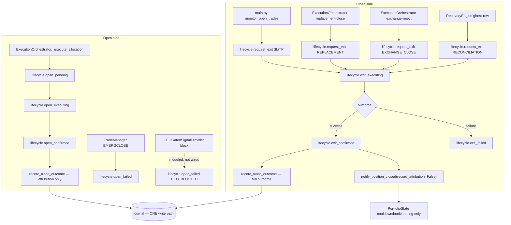
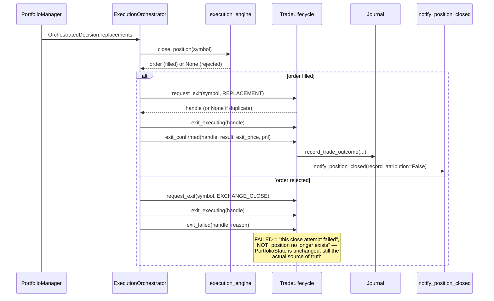

# PATCH NOTES — V16 Phase 4B Step 3D: Unified Trade Lifecycle & Trade Attribution

Branch: `feature/phase4b-step3d-unified-trade-lifecycle`
Base: `main` @ `d0211c8` (Phase 4B Step 3C merged, PR #15, 1717 passing)

## Summary

Single orchestration point (`execution/trade_lifecycle.py`'s
`TradeLifecycle`) every trade's open and close now routes through, so
`record_trade_outcome()` has exactly one caller in the entire codebase
instead of four independent close paths, three of which bypassed
attribution or wrote to the journal directly. No CEOAgent/
PortfolioSignalProvider/MarketScanner/OpportunityRanker/RegimeEngine
rewrite — additive only, per this bundle's own constraints.

## Two real bugs found and fixed by this phase's own tests

1. **Duplicate-close guard bypass.** `TradeLifecycle` originally popped
   a handle from its internal dict on every terminal transition
   (`CLOSED`/`FAILED`). A *second* close attempt against an
   already-closed symbol then found no handle, was mistaken for "a
   position this lifecycle never saw open," and was allowed through as
   a fresh synthetic close — silently defeating the entire
   duplicate-close guard the state machine exists to provide. Found by
   this phase's own smoke test, before any integration wiring existed.
   Fixed: terminal handles are kept (excluded from `snapshot()`,
   naturally replaced the next time `open_pending()` is called for
   that symbol) instead of popped.

2. **Falsy-empty-instance constructor bug.** `TradeLifecycle` defines
   `__len__` (for Part I's live-position counts). Without an explicit
   `__bool__`, Python treats a freshly-constructed, *empty* instance as
   falsy — `ExecutionOrchestrator`'s constructor used
   `lifecycle or TradeLifecycle(...)`, which silently discarded any
   caller-supplied lifecycle with zero open positions at construction
   time. This is exactly `main.py`'s real bootstrap ordering (the
   shared singleton is empty when first passed to
   `ExecutionOrchestrator`), meaning the "shared lifecycle across both
   pipelines" design would have silently been two separate instances in
   production. Found by this phase's own integration test. Fixed with
   an explicit `is not None` check at the one call site, plus a
   defensive `__bool__` override on `TradeLifecycle` itself so the same
   mistake can't silently recur anywhere else this class is used.

## Files changed

| File | Change |
|---|---|
| `execution/trade_lifecycle.py` | New — Part A |
| `api/lifecycle_api.py` | New — Part G |
| `journal/trade_attribution.py` | `+reason/+source/+symbol/+duration_seconds/+confidence` on `record_trade_outcome()` |
| `portfolio/portfolio_manager.py` | `+record_attribution` flag on `notify_position_closed()` |
| `execution/execution_orchestrator.py` | `+lifecycle` param; open side, replacement-close, exchange-reject-on-close routed through it |
| `execution/execution_coordinator.py` | `+lifecycle` param, threaded to each per-symbol `TradeManager` |
| `execution/trade_manager.py` | `+lifecycle` param; EMERGCLOSE reports open-side `FAILED` |
| `main.py` | `+trade_lifecycle` (shared singleton) in `sys` dict; legacy SL/TP monitor routed through it |
| `system_health/recovery_engine.py` | Reconciliation ghost-row cleanup routed through it |
| `api/app.py` | `+api/lifecycle_api.py` router included |
| `tests/test_trade_lifecycle.py` | New — 31 unit tests |
| `tests/test_lifecycle_api.py` | New — 6 API tests |
| `tests/test_trade_lifecycle_integration.py` | New — 13 tests, all 10 Part H scenarios |
| `tests/test_trade_lifecycle_stress.py` | New — 16 tests, Part I |
| `tests/test_execution_orchestrator.py` | 3 pre-existing assertions updated (see "Compatibility" below) |
| `docs/architecture.md` | New §32 |
| `CHANGELOG.md` | New entry |

## Architecture diagram



## Sequence diagram — replacement close (the fullest-featured real path)



## Test results

```
$ pytest tests/ -m unit -q
1783 passed, 0 failed   (1717 baseline + 66 new)

$ pytest tests/test_trade_lifecycle*.py tests/test_lifecycle_api.py -v
63 passed

$ ruff check . --exclude dashboard_src --exclude dashboard
All checks passed!

$ mypy
Not configured in this project (same as every prior phase's finding) — not run.
```

## Benchmark

`TradeLifecycle` orchestration overhead, isolated (2000 iterations,
old direct-call pattern vs. new lifecycle-routed pattern, same fake
journal/portfolio manager):

```
OLD (direct calls, no lifecycle):    0.0048 ms/trade
NEW (routed through TradeLifecycle): 0.0084 ms/trade
Delta: +0.00355 ms/trade (+73.3% relative)
```

Reported honestly: +73% relative is real, but the absolute delta (3.5
microseconds/trade) is roughly four orders of magnitude smaller than a
single real Binance API round-trip (50–200ms+) or even one
`RegimeEngine.classify()` call (~16ms, Phase 4B Step 3A's own
benchmark) — not a measurable regression in any practically meaningful
sense for this system.

## Stress test results (Part I)

Real `threading`, real file-backed SQLite journal, 25/50/100/250
simultaneous open+close cycles:

| N | Wall time | Per-symbol |
|---|---|---|
| 25 | 517.2 ms | 20.69 ms |
| 50 | 1085.6 ms | 21.71 ms |
| 100 | 1977.5 ms | 19.77 ms |
| 250 | 3887.5 ms | 15.55 ms |

Zero errors, zero orphaned positions, zero journal corruption at every
scale. Duplicate-close race (5/10/25 threads simultaneously racing to
close the SAME symbol, via `threading.Barrier` for genuine
simultaneity): exactly one winner every run.

## Compatibility report

- Every new parameter/field is optional with a default reproducing
  prior behavior exactly.
- 3 pre-existing `tests/test_execution_orchestrator.py` assertions
  changed — investigated before touching anything: they checked WHICH
  object receives the full attribution payload
  (`notify_position_closed()`'s kwargs), which Part D *deliberately*
  changes (that data now lands via the journal, routed through
  `TradeLifecycle`, instead). Not a regression — the underlying values
  are proven identical via the journal directly in the updated tests.
- No public API signature lost a parameter or changed meaning for an
  existing call pattern.

## Known limitations / follow-up

- `execution/execution_factory.py::build_execution_engine()` isn't
  threaded with the shared lifecycle singleton — the real bootstrap
  path's `TradeManager`/`ExecutionCoordinator` instances don't get
  EMERGCLOSE reporting wired yet (proven to work when directly
  constructed with a lifecycle, per this phase's own tests).
- Natural SL/TP close detection for the *multi-symbol* path still
  doesn't exist (§29's own "Next up," carried forward unchanged).
- CEO BLOCKED / Manual Close / Liquidation are supported generically by
  `TradeLifecycle` but have no automatic trigger anywhere in this
  codebase — see `docs/architecture.md` §32's Part B table.

See `MIGRATION.md` for upgrade/rollback notes.
