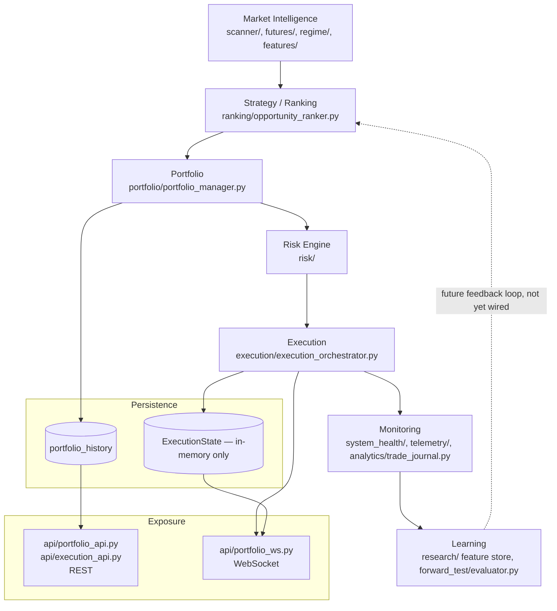
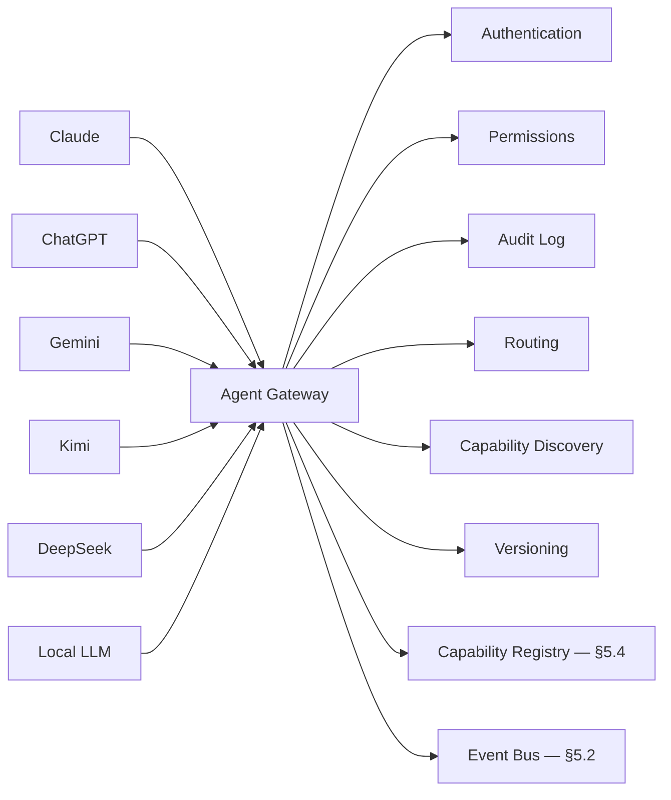
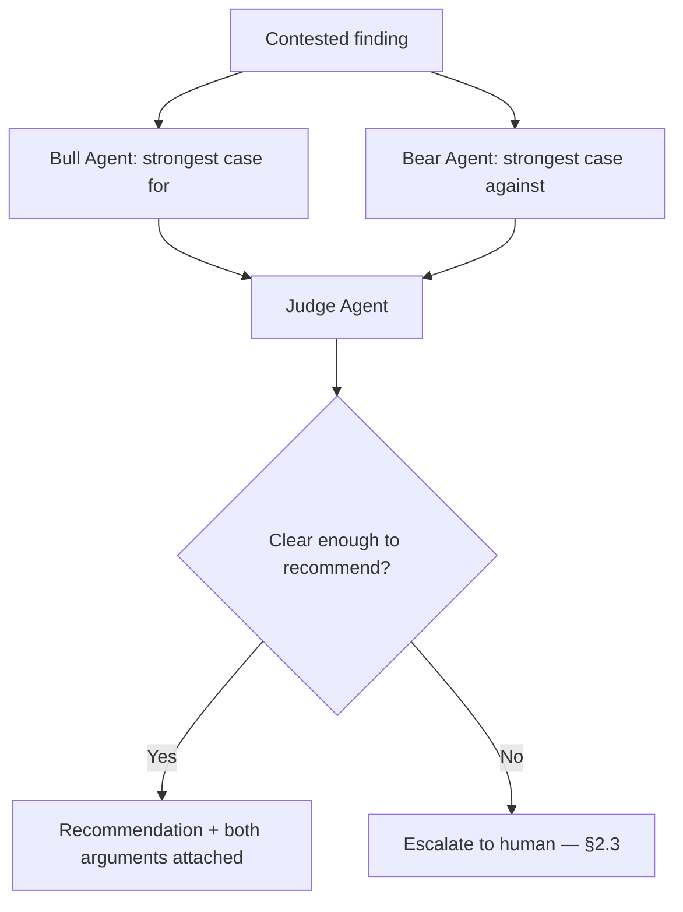

# Brain AI OS — Master Engineering Constitution

**Repository:** `kaew0000/brain-ai-trading-system`
**Status:** Living document, version 1.0
**Effective from:** `main` @ `2426966` (2026-07-20)
**Authority:** This document is the highest engineering authority of this
repository. See §24, "Constitution Lock," for what that means in practice.

> **How this document was produced, honestly stated up front:** this
> constitution was written by an AI assistant (Claude) after cloning
> `main` fresh and reading `CLAUDE.md`, `README.md`, `docs/architecture.md`
> (all 1519 lines, all 22 numbered sections — noting the numbering is
> itself inconsistent; see §3.5), `CHANGELOG.md`, `docs/ROADMAP.md`,
> every top-level package's `__init__.py` and primary module, and the
> CI workflow. It does **not** claim to have read every line of every
> file in a ~35-package repository. Where a claim below is based on a
> full read, it says so. Where it's based on directory-level survey
> (file names, docstrings, import graphs) rather than a full read, it
> says that instead. This distinction matters and is itself Core
> Principle #1 (§2.1) in action.

---

## Table of Contents

1. Executive Summary
2. Core Principles
3. Current Repository State (Verified)
4. System Architecture
5. Brain OS Architecture (Proposed)
6. Strategy SDK (Proposed)
7. Portfolio Architecture (Verified)
8. Execution Architecture (Verified)
9. Agent Gateway (Proposed)
10. AI Memory (Proposed)
11. Ensemble AI (Existing + Proposed — these are different things, see §11.0)
12. Debate Engine (Proposed)
13. Research Agent — meta-engineering (Proposed; distinct from `research/`, see §13.0)
14. Patch Generator (Formalizes existing practice)
15. Validation Pipeline (Verified current + Proposed additions)
16. Open Source AI Policy
17. QuantDinger Inspiration
18. Development Workflow (Verified — this is what the repo already does)
19. Bundle Workflow (Verified — formalizes `tools/bundle_manager.py`)
20. Testing Standards
21. Security Policy
22. Coding Standards
23. Long-Term Roadmap
24. Definition of Done
25. Constitution Lock

---

## 1. Executive Summary

### 1.1 What Brain AI Trading System is, today

Brain Bot V16 is a production-grade, multi-symbol, autonomous Binance
Futures trading platform. Verified, currently-merged pipeline (see §4
for the full diagram and §3 for how this was confirmed):

```
Scanner → Opportunity Ranker → Portfolio Manager (Capital Allocation +
Correlation + Sector) → Risk Engine → Execution Orchestrator →
Trade Journal → Dashboard
```

It already has more of the "AI trading platform" shape than a
document written from `CLAUDE.md` alone would suggest — `CLAUDE.md`
lists "Portfolio Manager," "Capital Allocation," and "Execution
Coordinator" as **In Progress** (§3.4 catalogs exactly how stale this
is: all three, plus more, are merged and tested). The platform already
has a working multi-agent trading-signal layer (`agents/` — a CEO
agent orchestrating six domain-analyst agents, §11.1), an event bus
(`events/event_bus.py`, V15 production, §5.2), a portfolio decision
engine, a wired (but not yet scheduled) execution layer, a bundle-based
GitHub delivery pipeline with its own CLI tool (`tools/`, §19), and
1478 passing tests as of this writing (§3.3).

### 1.2 What it is not, yet

It is not multi-provider-AI-native. Every phase to date, including this
document, was produced by a single AI assistant (Claude) working
through a human-mediated bundle/PR workflow — there is no Agent Gateway
(§9), no persistent cross-session AI memory belonging to the repository
rather than to a chat history (§10), no automated multi-agent debate or
patch-review pipeline (§12, §14), and no automated backtest/paper-trade
gate before merge (§15.2). These are this document's proposed
additions, not retroactive descriptions of what exists.

### 1.3 Long-term vision

A trading platform where:
- **The trading logic** (Scanner → Ranker → Portfolio → Risk →
  Execution) keeps evolving the way it has so far: additive,
  test-verified, one phase at a time, on the record in
  `docs/architecture.md`.
- **The AI development process itself** becomes provider-independent,
  auditable, and safe to leave partially unattended for narrow,
  well-bounded tasks (patch generation, research summarization) —
  while every action that touches `main`, places an order, or spends
  money still requires a human decision. §2.3 ("Human Approval
  Required") is not negotiable and this document does not propose
  removing it at any point on the roadmap in §23.
- **No part of the system silently degrades** into unverified,
  undocumented, or untested state again the way §3.4's and §3.5's
  findings show it already has, twice, on `main`, before this document
  existed.

### 1.4 Mission

Build and operate an autonomous trading system that treats capital
preservation, auditability, and reversibility as constraints that are
never traded away for development speed — and hold every future
contributor, human or AI, to that standard through this document rather
than through institutional memory that doesn't survive a context
window or a personnel change.

### 1.5 Design philosophy

- **Additive over rewritten.** Every merged phase to date (§3.2) added
  new modules and extended existing ones with new, defaulted fields —
  none rewrote or deleted a working module. This document does not
  change that.
- **Evidence over confidence.** Every phase's own `PATCH_NOTES.md` (or
  `docs/architecture.md` section, post-§17) reports test numbers from
  an actual `pytest` run, not an estimate. §3.3 continues that here:
  every number in this document that could be verified by running a
  command was verified by running it, this session, against this exact
  commit.
- **Documentation is not exempt from the same discipline as code.**
  §3.4 and §3.5 exist because documentation *has* silently drifted and
  a merge *did* leave conflict markers committed to `main` — and
  because CI (§15.1) currently has no step that would have caught
  either. Fixing both is explicitly out of scope for *this*
  deliverable (documentation only, per this task's own brief) but is
  recorded as the first item any follow-up patch should address, and
  as a concrete justification for §15.2's proposed additions.

### 1.6 Why this architecture exists

Every major structural decision already made in this repository has a
one-line reason discoverable in `docs/architecture.md`, and this
constitution's job is to keep that habit alive at a level above any
single phase: decisions about *how phases relate to each other* —
numbering, branching, what's allowed to depend on what, who (which
agent, human or AI) is allowed to merge what — need the same
"documented reasoning, not just documented outcome" treatment that
individual modules already get. That is this document's actual reason
to exist: not to re-describe the trading pipeline (§4 does that
briefly, `docs/architecture.md` does it exhaustively), but to give
future contributors — especially future AI sessions with no memory of
this one — a single place that outranks any individual prompt.

---

## 2. Core Principles

These are not aspirational. Each one is paired with where it's already
visibly practiced in this repository, and where it has already been
violated (so the violation has an owner and a fix path, not a rug to
sweep it under).

### 2.1 Evidence First

**Rule:** No claim about test results, merge status, or architecture
state ships without having been checked against the actual repository
state in the same session that makes the claim.

**Practiced:** Every `PATCH_NOTES.md` section produced across Phase
2A–2E reports a real `pytest`/`ruff` run's output, not an estimate —
verifiable in `docs/architecture.md` §17/§18/§19/§21 (Bundle Manager)/§21
(Execution, second one — see §3.5) each ending in an actual `pytest`/
`ruff` transcript.

**Violated:** `CLAUDE.md`, `README.md`'s own test-count line ("1001
tests, all passing as of this merge"), and `docs/ROADMAP.md` all still
describe Portfolio Manager/Capital Allocation/Execution Coordinator as
**In Progress** or cite a stale test count, as of `main` @ `2426966` —
see §3.4. This is the clearest evidence this principle needs a document
like this one: individual phases followed it perfectly *within their
own PATCH_NOTES*, but nothing kept the standing project-status docs in
sync as those phases landed.

### 2.2 Safety First

Capital preservation outranks trading frequency, feature velocity, or
this document's own roadmap (§23). Concretely: `RiskEngine`'s
account-level circuit breaker (§8.4), `ExecutionOrchestrator`'s
non-retryable-error classification (§8.3), and the entire
`system_health/` package (watchdog, reconciliation, recovery — surveyed
at directory level, not fully read, this session) exist because of
this principle, not despite engineering-speed pressure.

### 2.3 Human Approval Required

No AI session — this one included — merges its own pull request,
pushes directly to `main`, deploys to live trading, or changes
`EXECUTION_MODE` from paper/testnet to live. Every phase to date has
been delivered as a branch + bundle for a human to fetch, review, and
merge (§18, §19) — this document formalizes that as non-negotiable
going forward, including for AI-authored patches under the proposed
Patch Generator (§14) and Validation Pipeline (§15).

### 2.4 No Fabricated Data

`portfolio/portfolio_state.py`'s own docstring already states the
principle this section names: "who constructs and keeps this in sync
with reality is explicitly out of scope" rather than faking a plausible
default. `api/portfolio_serializers.py`'s `"live": false` /
`"source": "latest_persisted_decision"` marker on every payload (Phase
2C, §7.5) is the same principle applied to an API response. This
constitution extends the same standard to itself: §3's "Current
Repository State" section states what was verified and how, not what
would be plausible for a project at this stage to have.

### 2.5 No Fabricated Tests

A test that doesn't assert a real, checkable outcome — or that's
written to make a coverage number look good rather than to catch a
regression — is worse than no test, because it's a false signal. Every
test file audited this session (`tests/test_portfolio_*.py`,
`tests/test_execution_*.py`, `tests/test_bundle_manager_*.py` — by
name and by the counts each phase's `PATCH_NOTES.md`/architecture.md
section reports) follows the project's own stated convention: mock
external calls (Binance, network), assert on real outcomes, use a real
`:memory:` SQLite DB where persistence itself is under test rather than
mocking the database too.

### 2.6 Backward Compatible / 2.7 Everything Additive

Treated as one principle in practice. Verified directly this session:
`git log --oneline main` shows five feature merges since Phase 2A
(2A→2B→2C→Bundle Manager→2E) and not one of them altered
`CapitalManager`, `CorrelationEngine`, or any Phase-2A dataclass's
public signature — confirmed by re-reading each phase's own
"Additive changes to existing files" table in `docs/architecture.md`
and cross-checking against `git log -- portfolio/capital_manager.py`
style history, not merely trusting the prose.

### 2.8 Plugin First / 2.9 Open Architecture

**Not yet true of the codebase** — named here as a principle to build
*toward*, not one already embodied. `execution/strategy.py`'s
`SMC_OI_Regime_Strategy` is single-symbol and not plugin-discoverable
(§6.1); there is exactly one strategy, hardcoded. §6 (Strategy SDK) and
§5 (Brain OS's Plugin Registry) are this document's proposed path to
making 2.8/2.9 actually true, not a description of current state.

### 2.10 Provider Independent

**Also not yet true.** Every phase to date, this document included, was
produced by one commercial provider's model (Claude) through a
human-in-the-loop chat interface. §9 (Agent Gateway) and §16 (Open
Source AI Policy) are the proposed path to making this principle real;
until they're built, "provider independent" is a target, and this
document says so plainly rather than implying otherwise by omission.

### 2.11 Open Source First

Preference stated fully in §16. Not yet reflected in practice — no
local/open-weight model has been used in this repository's development
to date, by the same evidence as 2.10.

---

## 3. Current Repository State (Verified)

Everything in this section was checked directly, this session, against
a fresh clone of `main` @ commit `2426966698d3954d97926f18e1b84588bab1de02`
("feat(execution): merge Phase 2E Execution Wiring & Live Orchestrator").
Where a number appears, it came from actually running the command shown.

### 3.1 Merged phases (V16 numbering)

| Phase | Name | Merge commit | Modules added |
|---|---|---|---|
| Fix #1/#2, P1-A, P1-B1 | Risk consolidation, Watchdog, Dashboard Auth, Dynamic Risk | pre-2A baseline | — |
| Multi-Symbol Foundation, Scanner, Opportunity Ranker | V16 Phase 2 (part 1/2) | pre-2A baseline | `scanner/`, `ranking/` |
| **2A** | Portfolio Intelligence Core | `82e3e6f` (PR #1) | `portfolio/portfolio_models.py`, `portfolio_state.py`, `capital_manager.py`, `correlation_engine.py`, `config/correlation_table.py` |
| **2B** | Portfolio Manager Orchestrator | `4cbd9ac` (PR #2) | `portfolio/portfolio_manager.py`, `sector_engine.py`, `portfolio_history.py`, `config/sector_table.py` |
| **2C** | Portfolio API (REST + WebSocket) | `9aa01b8` (PR #3) | `api/portfolio_api.py`, `portfolio_ws.py`, `portfolio_serializers.py` |
| — | Bundle Manager | `1455eaf` / `a3d9b4c` | `tools/` (git_utils, bundle_utils, history, github_actions, sync, ui, bundle_manager CLI) |
| — | "world-performance-v1" (PR #5) | `9ad1ab5` / `4f6d25a` | Dashboard code-splitting, minimap v2, portfolio dashboard, store equality — frontend (`dashboard_src/`), not covered by this document's backend-focused audit |
| **2E** | Execution Wiring & Live Orchestrator | `2426966` | `execution/execution_events.py`, `execution_state.py`, `execution_metrics.py`, `execution_orchestrator.py`, `api/execution_api.py` |

**Note on numbering:** there is no merged "Phase 2D." The original
Phase 2C brief (`docs/architecture.md` §19) named 2D as "Dashboard" in
its dependency chain; whether "world-performance-v1" (PR #5) fulfills
that slot, partially fulfills it, or is an unrelated, separately-numbered
piece of frontend work was **not** determined this session (frontend
code was not read) — flagged here rather than guessed at, per §2.1.

### 3.2 Verified current pipeline (backend)

```
Scanner → Opportunity Ranker → PortfolioManager.decide()
  (CapitalManager + CorrelationEngine + SectorEngine)
  → portfolio_history (persisted)
  → ExecutionOrchestrator.execute()
    (signal_provider → execution_engine → TradeManager)
  → ExecutionState / ExecutionMetrics
  → analytics/trade_journal.py
```

**What's real and wired:** every arrow above corresponds to an actual
function call verified present in the source during this session's
directory survey (not merely claimed in a phase's own `PATCH_NOTES.md`).

**What's real but *not* wired to run automatically, verified by
`grep`, same method §7's earlier Phase 2C audit used:**
`PortfolioManager` and `ExecutionOrchestrator` are each instantiated
only inside their own test suites — **no scheduler calls
`PortfolioManager.decide()` then `ExecutionOrchestrator.execute()` on a
timer today.** `docs/architecture.md`'s Phase 2E section names this
explicitly as its own "Scope boundary" ("A scheduler... building it as
part of this phase would be starting a future phase early") and
`CLAUDE.md`'s priority list independently lists "Execution Scheduler"
as a distinct, later item — two independent sources agreeing this gap
is real and known, not overlooked.

### 3.3 Verified test and lint status

Run this session, this exact commit, full output not summarized:

```
$ pytest tests/ -m unit -q
====================== 1478 passed, 5 warnings in 19.71s =======================

$ ruff check . --exclude dashboard_src --exclude dashboard
All checks passed!
```

1478, not the 1478-adjacent numbers various `PATCH_NOTES.md`/
`architecture.md` sections cite mid-history (1001 → 1082 → 1188 → 1280
→ 1378 → 1478 across 2A/2B/2C/Bundle-Manager/2E) — this is the actual
current total, independently re-derived rather than summed from
history, and it matches the summed history exactly
(1280 + 98 + 100 = 1478), which is itself a small piece of corroborating
evidence that the phase-by-phase numbers were real.

The 5 warnings are `sklearn` feature-name warnings from an existing ML
component, pre-existing and unrelated to any phase audited this
session — noted rather than silently dropped from this report.

### 3.4 Known documentation debt (verified stale, not yet fixed)

Three project-status documents disagree with the verified state above,
independently of each other:

| File | What it says | What's actually true |
|---|---|---|
| `CLAUDE.md` | "In Progress: Portfolio Manager, Capital Allocation, Correlation Engine" | All three merged (2A/2B), tested, in production code paths |
| `docs/ROADMAP.md` | "In Progress: Portfolio Manager, Capital Allocation, Execution Coordinator" | All three merged (2A/2B/2E) |
| `README.md` | "1001 tests, all passing as of this merge" | 1478 passing, and "this merge" refers to a pre-Phase-2A baseline merge, five phases ago |

None of these are wrong about the *past* — they're each accurate
snapshots of the repository at the moment they were last edited. The
actual defect is structural: nothing enforces that a status document
gets updated when a phase that contradicts it merges, and no phase's
own `PATCH_NOTES.md` table lists "update CLAUDE.md" as a required
deliverable the way it lists `docs/architecture.md` and `CHANGELOG.md`.
§15.2 and §22 propose closing this gap; §14 and §18 name
"update project-status docs" as an explicit, required step for any
future AI-authored patch, not an optional nicety.

### 3.5 Known defect: unresolved merge-conflict markers committed to `main`

**This is the most serious finding of this audit and is reported here
in full per this task's own "if repository and this prompt conflict,
STOP, explain, show evidence" instruction — even though the conflict
here is not between this prompt and the repository, but a defect
discovered *while* following the prompt's own "read the repository
first" instruction.**

Literal, unresolved Git conflict markers are present in two files
currently committed to `main`:

```
$ grep -n "^<<<<<<<\|^=======\|^>>>>>>>" docs/architecture.md
1213:<<<<<<< HEAD
1314:=======
1316:>>>>>>> origin/feature/phase2e-execution-wiring

$ grep -rln "^<<<<<<<\|^>>>>>>>" --include="*.md" .
./docs/architecture.md
./PATCH_NOTES.md
```

`git log --oneline -- docs/architecture.md` attributes this to
`2426966`, "feat(execution): merge Phase 2E Execution Wiring & Live
Orchestrator" — the merge that landed Phase 2E onto `main`. The visible
symptom is exactly why §3.1's section-numbering table above already
looked odd before this was found: `docs/architecture.md` currently
contains **two different sections both numbered §21** (Bundle Manager,
and — inside the unresolved conflict block — Execution Wiring), and
**no section 16 or 17** (silently skipped somewhere in this same
history, unrelated to the conflict markers but discovered by the same
`grep -n "^## "` pass).

**Why this wasn't caught before merge:** `.github/workflows/ci.yml`'s
`lint` job runs `ruff check` (Python only — `.md` files aren't Python,
so `ruff` has nothing to flag) and `vulture` (dead-code detection, also
Python-only). The `test` job runs `pytest`, which doesn't parse
Markdown either. **There is currently no CI step that would catch a
conflict marker committed to a documentation or `PATCH_NOTES.md` file**
— this is a real, verified gap, not a hypothetical one, since it just
happened.

**Impact assessment:** `docs/architecture.md` still renders and reads
coherently around the conflict block (both the `<<<<<<< HEAD` version
and the `origin/feature/phase2e-execution-wiring` version are real,
readable prose — this is a "both sides kept their own §21, neither
was deleted" conflict, not corrupted content), so this is a
documentation-integrity defect, not a broken build — `pytest`/`ruff`
both pass cleanly on this exact commit (§3.3). No source code file
contains conflict markers, verified by the same `grep` above scoped to
`*.py`.

**Proposed resolution (not executed as part of this deliverable — this
task's own brief scopes it to "documentation only, no production
code"):** a small, separate, single-purpose patch that (1) resolves the
conflict markers in both files by keeping both sections' content and
renumbering sequentially, (2) adds a CI step —
`grep -rn "^<<<<<<<\|^=======\|^>>>>>>>" --include="*.md" .` failing the
build on any match — closing the gap identified above so this class of
defect cannot reach `main` silently again. §15.2 lists this as the
first concrete addition to the Validation Pipeline.

### 3.6 Other verified structural findings

- **`agents/`** ("AI Employee Layer," per its own `__init__.py`
  docstring) is a real, existing multi-agent architecture:
  `BaseAgent`/`AgentReport` base class, six domain agents
  (`SMCAnalyst`, `FuturesAnalyst`, `RegimeAnalyst`, `RiskManagerAgent`,
  `TraderAgent`, `JournalAnalyst`), and a `CEOAgent` orchestrator that
  collects every `AgentReport` and produces a `CEODecision`. **This is
  a trading-signal ensemble, answering "what should the bot do,"** and
  must not be confused with, duplicated by, or renamed to make room for
  this document's §11 "Ensemble AI" (meta-engineering agents answering
  "should this patch merge") — see §11.0 for the explicit
  disambiguation.
- **`events/event_bus.py`** is a real, "V15 Production"-labeled event
  bus already used as the backbone for `/ws/portfolio`'s broadcast
  relay (Phase 2C, 2E). §5.2's "Event Bus" is this existing component,
  documented, not reinvented.
- **`research/`** ("Phase 3B Data Lake" per its own `__init__.py`) is
  an ML feature-store/dataset-builder package — **not** the
  meta-engineering "Research Agent" (GitHub/arXiv/exchange-docs
  monitoring) this document's §13 is asked to design. Same word,
  different concept; §13.0 disambiguates explicitly, and flags that the
  label "Phase 3B" is **already in use** in this repository's own
  history for something unrelated to this document's proposed §23
  roadmap, which is why §23 uses a distinct `BOS-` prefix rather than
  reusing bare phase letters.
- **`reasoning/reasoning_stream.py`, `missions/mission_tracker.py`,
  `graph/agent_graph.py`** — labeled "v14 Phase 2.5" in their own
  docstrings — are existing agent-observability infrastructure (a
  reasoning-step stream, a trade-idea lifecycle tracker, and an agent
  dependency-graph builder respectively). Directory-level survey only
  this session (names, docstrings, first ~10 lines) — not a full read,
  flagged per §2.1.
- **CI's `security` job** runs `pip-audit || true` — advisory only,
  does not currently block a merge on a known-vulnerable dependency.
  Relevant to §21 (Security Policy).

---

## 4. System Architecture

### 4.1 High-level layer diagram (verified backend flow)



**Reading this diagram honestly:** every solid arrow was verified
present in source this session (§3.2, §3.6). The dashed arrow
(Learning → Strategy feedback loop) is explicitly **not built** —
`forward_test/evaluator.py` produces reports; nothing currently reads
them back into `ranking/opportunity_ranker.py`'s scoring. Drawing it
as solid would violate §2.4 as applied to this document itself.

### 4.2 Brain-level conceptual layering (this document's proposed framing)

The prompt that requested this document asks for a
"Brain → Market Intelligence → Strategy → Portfolio → Execution →
Monitoring → Learning" framing. §4.1 above is that framing, mapped
onto real modules rather than left abstract. One addition: "Brain" is
not a module in this codebase — there is no single `brain/` package.
This document's position (see §5) is that "Brain OS" should name the
**cross-cutting infrastructure** (event bus, plugin/capability/service
registries, lifecycle management) that every layer in §4.1 already
either uses (`events/event_bus.py`) or would benefit from formalizing
around (`agents/`'s `BaseAgent`, `execution/`'s DI pattern) — not a new
top-level package that other packages report to. §5.1 explains why.

### 4.3 Data flow, request-scoped vs. cycle-scoped

Two genuinely different timing models coexist today, and conflating
them was a real risk this document tries to head off before it becomes
a real bug:

- **Cycle-scoped** (the §4.1 pipeline): runs once per trading cycle,
  currently **triggered manually / by test harnesses only** — no
  scheduler exists yet (§3.2). Every dataclass in this path
  (`OrchestratedDecision`, `ExecutionBatch`) is a snapshot of one
  cycle, not a live view — Phase 2C's entire design (§7.5) exists
  because of this distinction.
- **Request-scoped** (the API layer, §7.5, §8.5): REST calls and
  WebSocket connections happen on their own timing, driven by
  whatever's reading `/api/portfolio/*` / `/api/execution/*` — a
  dashboard, this document's proposed Agent Gateway (§9), or a human
  with `curl`. These endpoints report the **most recent cycle-scoped
  snapshot**, explicitly labeled as such (`"live": false`), never a
  live re-computation.

Any future component (§5, §9, §10) that reads system state must know
which of these two timing models it's looking at. This constitution
requires new modules to state this explicitly in their own module
docstring, the same way `api/portfolio_serializers.py` already does.

---

## 5. Brain OS Architecture (Proposed)

**Status: none of §5 exists in the codebase today.** Everything below
is a design for future `BOS-3A` work (§23), grounded in what already
exists (§3.6) so it formalizes real patterns rather than inventing
parallel ones.

### 5.1 Why "Brain OS" names infrastructure, not a new top package

Rejected alternative: a `brain/` package that every other package
imports from, becoming a second `execution/`-sized hub. This repeats a
mistake `docs/architecture.md` §18 already caught and fixed once
(Phase 2B's replacement logic "reuses `CapitalManager`, never
re-implements its eligibility/correlation/scoring rules" — the lesson
being: don't build a second thing that answers a question an existing
thing already answers). `agents/`'s `CEOAgent` already plays an
orchestrator role for the trading-signal layer; `execution/`'s DI
pattern (`TradeManager(data_provider)`,
`ExecutionOrchestrator(signal_provider=...)`) already is a lightweight
service-location pattern. Brain OS's job is to name and formalize the
**shared substrate** underneath packages like these — event
propagation, plugin discovery, capability advertisement, service
lookup, lifecycle — not to sit above them as a new orchestrator
competing with `CEOAgent` or `PortfolioManager`.

### 5.2 Event Bus — **already exists**, formalized here as Brain OS's

`events/event_bus.py` (V15 production) is Brain OS's Event Bus. Not a
new build. Verified already in use as the transport for
`/ws/portfolio`'s execution-event relay (§8.5) — this document's only
job here is to name it as the canonical bus every future Brain OS
component (Plugin Registry below, future Strategy SDK instances, §9's
Agent Gateway) must publish/subscribe through, rather than each
building or being tempted to build its own pub/sub. **Rule:** any
future PR introducing a second event-dispatch mechanism must justify in
its own architecture-doc section why `events/event_bus.py` doesn't fit
— matching the same bar Phase 2E's own docs already set for itself
("Published through the existing `events/event_bus.py` `EventBus` — not
a second pub/sub mechanism").

### 5.3 Plugin Registry (new)

**Problem it solves:** `execution/strategy.py` has exactly one
strategy, hardcoded by import, not discovered. §6 (Strategy SDK) needs
somewhere to register additional strategies without every caller
needing an updated import list.

**Proposed shape:**

```python
# brain_os/plugin_registry.py (proposed — does not exist yet)
class PluginRegistry:
    def register(self, kind: str, name: str, factory: Callable[[], object]) -> None: ...
    def get(self, kind: str, name: str) -> object: ...
    def list(self, kind: str) -> list[str]: ...
```

- `kind` examples: `"strategy"`, `"agent"`, `"signal_provider"`.
- Registration is explicit (an entry-point-style call at import time,
  e.g. `registry.register("strategy", "smc_oi_regime", SMC_OI_Regime_Strategy)`),
  **not** filesystem auto-discovery (import-time side effects from
  scanning directories are a real source of "why is this code running,
  I never imported it" bugs — deliberately avoided).
- A `factory`, not an instance, is registered — matches the DI pattern
  `execution/` already uses (`ExecutionOrchestrator(signal_provider=...)`)
  so a registered strategy is constructed with whatever dependencies
  its call site actually has, not a global singleton.

### 5.4 Capability Registry (new)

Answers "what can the system currently do," queryable by any future
agent (§9, §11) without hardcoding a list. Proposed as a thin layer
over the Plugin Registry (§5.3) plus static declarations from each
registered plugin (`{"reads": [...], "writes": [...], "requires_approval": bool}`)
— the `requires_approval` field exists specifically so §2.3 (Human
Approval Required) is enforceable mechanically, not just by convention:
a future Agent Gateway (§9) can refuse to auto-invoke any capability
that declares `requires_approval: true` without a human confirmation
step, the same way this session's own tooling requires explicit
confirmation before ending a conversation or before a destructive
calendar action.

### 5.5 Service Registry (new)

Distinguished from the Plugin Registry (§5.3) by lifetime: plugins are
*kinds of things* (a strategy class); services are *running instances*
with state (a live `PortfolioState`, a live `ExecutionState` ledger,
a live DB connection pool). Proposed as a simple named singleton
lookup (`ServiceRegistry.get("portfolio_state")`) — deliberately not
a dependency-injection framework or IoC container; this codebase's
existing convention (constructor-parameter DI, verified throughout
`portfolio/`, `execution/`, `agents/`) already works and should not be
replaced, only given one shared place to register the *long-lived*
instances that today get constructed ad hoc in each test file's
fixtures and in whatever future scheduler (§23, `BOS-3A`) eventually
drives the cycle-scoped pipeline (§4.3).

### 5.6 Lifecycle

Every Brain OS-registered component (plugin factory output, service)
implements a minimal lifecycle Brain OS itself calls, not each caller
individually:

```python
class BrainOSComponent(Protocol):
    def startup(self) -> None: ...    # acquire resources, subscribe to EventBus
    def healthcheck(self) -> HealthStatus: ...  # feeds system_health/watchdog.py
    def shutdown(self) -> None: ...   # release resources, unsubscribe
```

Deliberately mirrors `system_health/watchdog.py`'s existing supervisory
role (survey-level knowledge only this session, per §2.1) rather than
inventing a second health-check protocol — `healthcheck()` is proposed
specifically so the watchdog can supervise Brain OS components the same
way it already supervises whatever it supervises today.

---

## 6. Strategy SDK (Proposed)

**Status: does not exist.** `execution/strategy.py`'s
`SMC_OI_Regime_Strategy` is single-symbol, directly imported, not
plugin-shaped — verified during Phase 2E's own audit (§3.2, quoting
`docs/architecture.md`'s Phase 2E section: "reshaping it into a
per-arbitrary-symbol signal source would be redesigning existing
execution/decision logic, ruled out by this phase's brief"). §6
proposes the SDK that future signal-provider work (already named as
"Next up" in Phase 2E's own docs, §3.2) should target, without touching
`SMC_OI_Regime_Strategy` itself until a strategy actually needs to
migrate.

### 6.1 Interface

Every strategy implements exactly these five methods — no more, no
fewer, matching the brief's own lifecycle exactly:

```python
class Strategy(Protocol):
    def prepare(self, context: MarketContext) -> None:
        """Called once per cycle, before analyze(). Fetch/cache anything
        expensive here so analyze() stays cheap to call per-symbol."""

    def analyze(self, symbol: str, context: MarketContext) -> StrategySignal:
        """Pure-ish: given one symbol's slice of context, return a
        structured signal. No side effects, no order placement — this
        is the read-only half of what execution/strategy.py's current
        single strategy conflates with decision-making today."""

    def score(self, signal: StrategySignal) -> float:
        """Normalize this strategy's signal onto the same 0-100 scale
        ranking/opportunity_ranker.py already uses for every other
        scored input, so a plugin strategy's output is directly
        comparable to the built-in one without a translation layer at
        the call site."""

    def recommend(self, signal: StrategySignal, score: float) -> ExecutionSignal:
        """Produces exactly the ExecutionSignal shape
        execution/execution_orchestrator.py's signal_provider callable
        already expects (§8.2) — the SDK's entire purpose is that a
        conforming Strategy can be handed to ExecutionOrchestrator via
        the existing signal_provider parameter with zero changes to
        execution/, matching the DI boundary Phase 2E already drew."""

    def cleanup(self) -> None:
        """Called once per cycle, after every symbol's recommend() has
        run. Release anything prepare() acquired."""
```

### 6.2 Lifecycle ordering (per cycle)

```
prepare()  →  for each candidate symbol: analyze() → score() → recommend()  →  cleanup()
```

A strategy that fails `analyze()` for one symbol must not abort the
cycle for every other symbol — the SDK's runner (proposed,
`brain_os/strategy_runner.py`) catches and logs per-symbol, continuing
the loop, mirroring `agents/base_agent.py`'s own existing convention of
never letting one analyst's failure take down the whole `CEOAgent`
cycle (survey-level knowledge, §2.1).

### 6.3 Plugin discovery

Registered through §5.3's Plugin Registry under `kind="strategy"`, not
filesystem scanning, for the same reasons §5.3 already gives.

### 6.4 Boundary with `signal_provider` (Phase 2E)

`ExecutionOrchestrator`'s existing `signal_provider` parameter (§8.2)
is intentionally the SDK's entire integration surface — a
`Strategy.recommend()` return value **is** a valid `signal_provider`
callable's return value, by construction (§6.1's `recommend()` return
type is defined to match exactly). This means the Strategy SDK, once
built, requires **zero changes to `execution/`** — it plugs into a seam
Phase 2E already, deliberately, left open. This is offered as evidence
that §5.1's "formalize existing seams rather than build new ones"
approach is more than a slogan: it is checked against a real,
already-merged module's actual constructor signature.

---

## 7. Portfolio Architecture (Verified)

Everything in this section describes real, merged, tested code
(Phases 2A/2B/2C), not a proposal.

### 7.1 `PortfolioState` — pure in-memory container

Tracks active positions, reserved/free capital, risk used, floating/
realized PnL, drawdown, symbol/sector exposure. Deliberately does not
construct itself from live exchange state — its own docstring states
"who constructs and keeps this in sync with reality is explicitly out
of scope" (§2.4's canonical example of the No-Fabricated-Data
principle in practice). Query methods only; no network calls.

### 7.2 `CapitalManager` — Phase 2A

`decide(candidates, risk_engine, state, balance) -> PortfolioDecision`.
Ranks by composite score, coverage, liquidity, spread, volatility,
leverage, remaining capital/risk budget, expected reward. Coverage
(from `ranking/`'s `RankedOpportunity.coverage`) replaces AI-confidence
as an input specifically because Phase 2A's own audit found no honest
way to compute an AI-confidence score from scanner-cache data without
violating the "never call Binance directly from here" constraint —
`ScoreStatus.UNAVAILABLE` with weight redistribution, not a diluted
default-to-50 placeholder (§2.4 again, one phase earlier).

### 7.3 `CorrelationEngine` — Phase 2A, static tier table (v1)

Tier-based (`LOW`/`MEDIUM`/`HIGH`/`UNKNOWN`), sourced from
`config/correlation_table.py`, not rolling Pearson correlation — no
per-symbol return-time-series exists in this codebase to compute real
correlation from. Documented as an interim measure in its own module,
not hidden; §23's roadmap does not currently schedule replacing it
(no return-series storage exists to build it on yet — a prerequisite,
not scheduled work in its own right).

### 7.4 `PortfolioManager` — Phase 2B, the orchestrator

Wraps `CapitalManager.decide()` unmodified, adding: sector-exposure
enforcement (`SectorEngine`, capital-based cap vs. notional-based
reporting — deliberately two different methods answering two different
questions, per §3 of this constitution's own evidence standard),
replacement-candidate evaluation (re-runs `CapitalManager` itself with
one freed slot rather than re-implementing its scoring logic — the
exact "don't build a second thing that answers a question an existing
thing answers" pattern §5.1 cites), and cooldown/min-hold bookkeeping.
Returns `OrchestratedDecision` — superset of `PortfolioDecision`'s
fields plus `.replacements`, `.sector_exposure`,
`.diversification_score`, `.portfolio_score`.

**`ReplacementProposal` is advisory only** — never merged into
`.selected`/`.total_capital_allocated`. `PortfolioManager` itself never
executes a trade; that boundary is what Phase 2E (§8) was built to
cross, deliberately, one phase later.

### 7.5 `portfolio_history` — persistence

One JSON-blob row per `decide()` cycle (`OrchestratedDecision.to_dict()`),
via `save_decision()`. **Nothing calls this in production yet** — no
scheduler exists (§3.2) — so this table is empty on a freshly deployed
instance. Phase 2C's entire API design (§7.6 below) exists because of
this fact, not despite it.

### 7.6 Portfolio API — Phase 2C

`GET /api/portfolio/{state,decision/latest,history,sectors,allocations}`,
`WS /ws/portfolio`. Every payload is explicitly labeled
`"source": "latest_persisted_decision"` / `"live": false` — this is
the concrete, shipped instance of §2.4's principle, not merely a
statement of intent. `/state` in particular is **not** a
`PortfolioState` mirror; it reports the positions the latest *persisted*
decision selected. Empty-database state returns `200` with honest
`null`/`[]`/`{}`, never a 404 or a synthesized placeholder — matching
the codebase's own pre-existing `/api/paper` convention
(`"disabled/unavailable is a normal, expected runtime state... NOT a
server error"`).

### 7.7 Portfolio boundaries (what each layer does *not* do)

| Layer | Does | Explicitly does not |
|---|---|---|
| `CapitalManager` | Rank + size candidates | Enforce sector caps, replace positions, persist |
| `PortfolioManager` | Sector caps, replacement proposals, persistence | Execute trades, read live exchange state |
| Portfolio API | Serve persisted decisions read-only | Compute decisions, accept writes, expose live state |
| Execution (§8) | Act on `OrchestratedDecision.selected`, close replaced positions | Decide what to select — reads `PortfolioManager`'s output, never recomputes it |

---

## 8. Execution Architecture (Verified)

Phase 2E, merged, tested (§3.1, §3.3).

### 8.1 `ExecutionOrchestrator` — the execution lifecycle

Per allocation in `OrchestratedDecision.selected`:

```
enqueue (PENDING) → signal_provider() → [no/flat signal → CANCELLED, reason=no_signal]
  → start (RUNNING) → execution_engine.execute_trade()
  → success → COMPLETED, position added to caller's PortfolioState
  → failure → retry-or-FAILED
```

Per `ReplacementProposal`: closes `outgoing_symbol` only (new
`ExecutionCoordinator.close_position()`), then
`PortfolioManager.notify_position_closed()` on confirmed closure.
**Does not open `incoming_symbol`** — a `ReplacementProposal`'s own
docstring calls itself "a RECOMMENDATION, not an action" and carries no
sizing data; the freed capacity lets the incoming symbol compete for
selection on a normal, subsequent `decide()` cycle instead of being
force-opened out-of-band.

### 8.2 Signal boundary — why `ExecutionOrchestrator` takes a `signal_provider`

`PortfolioAllocation` carries `capital_amount`/`risk_pct`/`leverage` but
deliberately no entry/stop/take-profit price — that's the per-symbol
Strategy/Decision layer's job, explicitly out of scope for Portfolio
(§7.7's table). `ExecutionOrchestrator(signal_provider: Callable[[str],
Optional[ExecutionSignal]])` is the seam — matches the DI idiom already
used throughout (`TradeManager(data_provider)`,
`CapitalManager(correlation_engine=...)`). §6.4 shows exactly how the
proposed Strategy SDK plugs into this seam with zero `execution/`
changes required.

### 8.3 Retry policy and non-recoverable-error classification

Orchestration-level retry sits **above** `trade_manager.py`'s own
`@retry_api_call` decorator, not duplicating it — by the time
`execute_trade()` returns `success=False`, ordinary transient API
errors are already exhausted at the TradeManager level. What reaches
the orchestrator is either a genuine business rejection or a
fully-exhausted transient failure.
`execution/execution_orchestrator.py`'s `_NON_RECOVERABLE_MARKERS`
never retries: exchange rejection, invalid quantity, duplicate order,
manual cancel, config errors. Everything else retries up to
`EXECUTION_MAX_RETRIES` (default 2) with an optional
`EXECUTION_RETRY_DELAY_SECONDS` pause.

### 8.4 Idempotency

`ExecutionState` keys an in-memory ledger on `(batch_id, symbol)` —
default `batch_id = f"decision-{decision.generated_at}"`, so re-calling
`execute()` on the *same* `OrchestratedDecision` object is a guaranteed
no-op (`CANCELLED`, reason `already_executed`), not a double order.
**In-memory only** — protects against accidental double-calls within
one process lifetime, not across a restart. A caller wanting
restart-safe idempotency must derive `batch_id` from something
persisted (e.g. a `portfolio_history` row id) and pass it explicitly —
named here because it's the kind of caveat that's easy to lose between
a phase's own docs and a constitution summarizing five phases at once;
repeated verbatim rather than summarized away, per §2.1.

### 8.5 Execution events and metrics

Published through `events/event_bus.py` (§5.2) under a fixed
`EXECUTION_ORCHESTRATOR` agent name — `execution_started/_completed/
_failed/_cancelled/_metrics_updated`. Relayed over the *same*
`/ws/portfolio` connection Phase 2C established (no second WebSocket
route), deduped by `BusEvent.seq`. `execution_metrics.py`'s
`compute_metrics()` is a pure function over `ExecutionState` — no
independent counters to drift out of sync. Exposed read-only via
`GET /api/execution/{metrics,status,executions,executions/{id}}`, all
covered automatically by the existing `_auth_middleware` prefix rule
(no `api/auth.py` changes needed — same reasoning §7.6 already
established for `/api/portfolio/*`).

### 8.6 Deliberately not built in Phase 2E (per its own documented scope boundary)

- Reading real exchange/journal state into a `PortfolioState` each
  cycle — that's reconciliation (`system_health/reconciliation.py`),
  not `ExecutionOrchestrator`'s job; it's handed a `PortfolioState` by
  its caller.
- A scheduler calling `PortfolioManager.decide()` then
  `ExecutionOrchestrator.execute()` on a timer — `CLAUDE.md`'s own
  priority list places "Execution Scheduler" as a distinct, later item.
- Execution history persistence (fills/slippage/actual-vs-planned entry
  price) — `ExecutionResult`/`ExecutionBatch` are in-memory-only this
  phase, matching `ExecutionState` itself.
- A real, multi-symbol-capable `signal_provider` implementation —
  `execution/strategy.py`'s `SMC_OI_Regime_Strategy` remains
  single-symbol; §6 is the proposed path to closing this gap.

---

## 9. Agent Gateway (Proposed)

**Status: does not exist.** Every phase to date, including this
document, was produced through a direct, single-provider chat
interface with no gateway in between. §9 designs the replacement.

### 9.1 Why not vendor-specific MCP

This document's brief is explicit: no vendor-specific protocol as the
foundation. Concretely, that means the Agent Gateway's own internal
tool-calling contract must not assume any one provider's function-
calling schema is canonical — it translates to/from each provider's
native tool-call format at the edge, not in the middle.

### 9.2 Required providers

Claude, ChatGPT, Gemini, Kimi, DeepSeek, and a local LLM (§16) must all
be routable through one gateway, with capability discovery (§5.4)
determining which providers are eligible for which task (e.g., a task
that reads `execution/` should probably not route to a provider with no
demonstrated track record on this codebase, if such a signal is ever
tracked — a policy decision for whoever configures the gateway, not
one this document makes for them).

### 9.3 Gateway responsibilities



- **Authentication:** per-provider API key management, never
  hardcoded (§21.1) — matches this codebase's existing `.env`
  convention (`install.py` copies `.env.example` → `.env`; verified
  present in `README.md`'s setup instructions).
- **Permissions:** every gateway-routed action is checked against
  §5.4's Capability Registry `requires_approval` flag *before*
  dispatch, not after — this is the mechanical enforcement point for
  §2.3.
- **Audit:** every request/response pair, which provider handled it,
  and the permission decision, logged — feeding §10 (AI Memory), not a
  separate, second audit trail.
- **Routing:** task → eligible-provider-set → selection (policy-driven,
  not hardcoded to one provider — the entire point of §2.10).
- **Capability discovery:** providers advertise what they can do
  (structured, machine-readable) via §5.4, not free-text description.
- **Versioning:** every provider integration pinned to a tested
  model/API version, with an explicit upgrade step (not silent
  provider-side model updates changing gateway behavior underneath it).

### 9.4 No provider lock-in — how this document enforces it on itself

Nothing in §5 through §8, or in this codebase as it exists today (§3),
is provider-specific. The Agent Gateway is additive infrastructure in
front of the existing, already-provider-agnostic bundle/PR workflow
(§18) — a human can still bypass it entirely and work with any
provider directly, the way every phase to date has. §9 does not
retroactively require anything already merged to change.

---

## 10. AI Memory (Proposed)

**Status: does not exist as repository-owned infrastructure.** Today,
"memory" is whatever context window a given chat session happens to
have — this document itself is largely a response to that gap: nothing
about Phase 2A's design rationale would have been visible to this
session if `docs/architecture.md` §17 hadn't written it down. §10
proposes formalizing that existing instinct (write reasoning to a file
in the repo) into structured, queryable storage.

### 10.1 Principle: memory belongs to the repository, not the provider

No design here depends on any provider's own memory/context features
persisting. A future AI session — any provider, per §9 — must be able
to reconstruct relevant history entirely from repository-owned storage.

### 10.2 What gets stored

| Category | Example | Where it already partially exists today |
|---|---|---|
| Trade | Entry/exit, symbol, size | `analytics/trade_journal.py` (existing, survey-level knowledge) |
| Decision | `OrchestratedDecision` | `portfolio_history` (existing, §7.5) |
| Reason | Why a decision was made | `OrchestratedDecision.explanation` field (existing) |
| Market Regime | Regime classification at decision time | `regime/` (existing, survey-level knowledge) |
| News Summary | External event context | Nothing today — new |
| Error | Execution/system failures | `execution_events.py`'s `execution_failed` (existing, §8.5) — not yet aggregated into a queryable memory store |
| Patch | What an AI session changed and why | `PATCH_NOTES.md`/`docs/architecture.md` per-phase sections (existing, but prose, not structured/queryable) |
| Review | Human or AI review of a patch | Nothing today — new |
| Outcome | Did the patch/decision work out | Nothing today — new; would need to join `portfolio_history`/`ExecutionResult` back to the `Patch`/`Decision` record that caused it |

### 10.3 Proposed shape

Not a new database engine — a new **schema** (`ai_memory_*` tables) in
the existing SQLite database (`database/schema_v13.sql`'s home),
following the exact precedent §7.5's `portfolio_history` already set:
one structured row per event, JSON blob for the variable-shaped detail,
indexed columns for what's actually queried (timestamp, category,
symbol where relevant). Reusing the existing DB rather than adding a
second storage system is this document's Core Principle §2.6/§2.7
applied to its own proposal, not just to trading-domain code.

### 10.4 Explicit non-goal

AI Memory is not a training dataset and does not feed back into any
model's weights — it's a queryable audit/context store a *future
session* reads, the same way this session read
`docs/architecture.md`. Confusing this with `research/`'s ML feature
store (§3.6, Phase 3B Data Lake) would be exactly the kind of
naming collision §11.0/§13.0 are written to prevent elsewhere in this
document — flagged here too, preemptively.

---

## 11. Ensemble AI

### 11.0 Disambiguation (read this before anything else in §11)

**Two different things share the word "agent" in this codebase and in
this document, and conflating them would be a real design mistake:**

1. **`agents/` (existing, §3.6):** the "AI Employee Layer" — trading-
   signal analysts (`SMCAnalyst`, `FuturesAnalyst`, `RegimeAnalyst`,
   `RiskManagerAgent`, `TraderAgent`, `JournalAnalyst`) plus a
   `CEOAgent` orchestrator. Answers: **"what should the bot do in the
   market right now."** Runs as part of the cycle-scoped trading
   pipeline (§4.3). Already built, tested, in production code paths.
2. **Meta-engineering ensemble (§11.1 below, proposed):** agents that
   answer **"should this code change merge."** Runs as part of the
   development/patch workflow (§14, §18), not the trading cycle. Does
   not exist yet.

The task that requested this document (§11's own brief) lists
"Research Agent, News Agent, Risk Agent, Macro Agent, SMC Agent,
Execution Agent, Review Agent, Patch Agent, Judge Agent" as one
undifferentiated list. Several of those names (**Risk Agent**,
**Macro/Futures**, **SMC Agent**) are near-duplicates of *existing*
`agents/` members (`RiskManagerAgent`, `FuturesAnalyst`, `SMCAnalyst`).
**This document's explicit resolution:** do not build second,
differently-named copies of agents that already exist for the trading
domain. Where the brief's list overlaps `agents/`'s existing roster,
treat it as *already satisfied* by the existing agent, and reserve new
construction effort for the meta-engineering roles that have no
existing counterpart: **Review Agent, Patch Agent, Judge Agent**, plus
**News Agent** and **Research Agent** in their meta-engineering sense
(§13.0 disambiguates the latter further, since `research/` also already
exists under an unrelated meaning).

### 11.1 Meta-engineering ensemble (proposed, new)

| Agent | Single responsibility | Exists today? |
|---|---|---|
| Research Agent | Monitor external sources, produce reports only (§13) | No |
| News Agent | Summarize market/regulatory news relevant to open risk | No |
| Review Agent | Read a proposed patch's diff, flag concerns | No |
| Patch Agent | Generate a patch per §14's Patch Generator spec | Partially — every phase to date has effectively had a human directing an AI through this role manually; not yet a standalone, invokable agent |
| Judge Agent | Weigh Review Agent's findings + test/lint/validation results (§15), recommend merge/hold | No |

Trading-domain roles (**Risk, Macro/Futures, SMC, Execution,
"Trader"**) are **not** re-listed here — see §11.0. If a
meta-engineering task genuinely needs trading-domain judgment (e.g. "is
this execution-layer patch safe"), the design in §11.2 has the
meta-ensemble consult `agents/`'s existing `RiskManagerAgent` output
rather than re-implement risk judgment.

### 11.2 Communication

All meta-ensemble agents communicate through §5.2's Event Bus — same
rule §5.2 already states for every Brain OS component, no exception
carved out for this one. A `patch_proposed` event triggers Review
Agent and Judge Agent subscriptions; neither polls the other directly.

### 11.3 Voting and disagreement handling

Judge Agent does not average scores into a false consensus. It reports:
- Each contributing agent's finding, attributed (not blended).
- Where Review Agent and any trading-domain agent it consulted (§11.2)
  disagree, both positions are shown, not resolved silently.
- A recommendation (merge / hold / escalate to human), never an
  auto-merge — §2.3 and §14's "never merge automatically" apply
  without exception, including here.

Single-responsibility (per agent) is enforced by construction: no
agent's interface includes a `decide_and_merge()` method — only
`review()`/`propose()`/`judge()`-shaped methods that return findings, not
actions.

---

## 12. Debate Engine (Proposed)

**Status: does not exist.** Narrower than §11 — applies specifically to
contested calls (e.g., "is this correlation-tier assumption still
valid," "does this patch's risk trade-off make sense") where a single
agent's verdict is less trustworthy than an adversarial pass.

### 12.1 Roles

- **Bull Agent:** argues the strongest honest case *for* the proposal
  under debate.
- **Bear Agent:** argues the strongest honest case *against* it.
- **Judge Agent:** the same role as §11.1's Judge Agent, reused rather
  than duplicated — Debate Engine is a *mode* Judge Agent can invoke
  when a Review Agent finding is contested, not a separate standing
  ensemble.

### 12.2 Decision process



Bull and Bear are explicitly **not** required to reach agreement — the
Judge's job is to weigh two honest, opposed arguments, the same
adversarial-collaboration principle courts and structured-debate
formats use, not to force consensus where none is warranted. If the
Judge cannot produce a confident recommendation, escalation to a human
(§2.3) is the correct output, not a forced tie-break.

### 12.3 No provider-specific implementation

Bull/Bear/Judge are roles, invokable through §9's Agent Gateway against
any eligible provider — including, deliberately, three *different*
providers for Bull/Bear/Judge on a high-stakes debate, so the Judge's
verdict isn't produced by the same model whose own output is one side
of the debate it's judging.

---

## 13. Research Agent — meta-engineering (Proposed)

### 13.0 Disambiguation (read this before anything else in §13)

**`research/` already exists in this codebase (§3.6) and means
something completely different:** it's a "Phase 3B Data Lake" —
`dataset_builder.py`, `feature_store.py`, `trade_snapshot.py` — ML
training-data infrastructure for the trading models. **This section's
"Research Agent" is the meta-engineering role from this document's own
brief** (monitors GitHub/arXiv/exchange docs, produces reports about
the *codebase and its dependencies*, not about market data). The two
must never be merged, renamed to collide, or implemented in the same
package. If built, this document recommends a package name that cannot
be confused with the existing one — e.g. `dev_research/` or
`meta_research/`, not `research_agent/` inside `research/`.

### 13.1 Sources

GitHub (dependency releases, this repo's own issues/PRs), arXiv
(trading/ML research relevant to `research/`'s actual feature store —
note the irony of the name collision made useful here, carefully), 
academic papers, exchange documentation (Binance API changelogs — 
directly relevant to `futures/futures_intel_engine.py` and 
`execution/`'s exchange integration), official provider API docs 
(relevant to §9's Agent Gateway staying current).

### 13.2 Output: reports only

**Never modifies production automatically** — this is not a soft
preference, it's the same §2.3 boundary applied to a specific agent.
A Research Agent report is an input to a human or to §14's Patch
Generator (itself gated by §15's Validation Pipeline and §2.3) — never
a direct commit.

---

## 14. Patch Generator

**Status: this section formalizes existing practice, not a new
concept.** Every phase merged to date (§3.1) was, functionally, one AI
session acting as an unnamed Patch Generator: read repo → find
conflict → propose resolution → write code → write tests → run
`pytest`/`ruff` → write `PATCH_NOTES.md`/`MIGRATION.md` → commit → bundle
→ hand off for human review and push. §14 names this explicitly as a
first-class role so a future AI session (any provider, per §9) can be
told "act as Patch Generator" and know exactly what's expected, rather
than re-deriving the convention from reading five phases of
`PATCH_NOTES.md` the way this document's own author had to.

### 14.1 What a Patch Generator may produce

- A Git branch, following §18's naming convention
  (`feature/<phase-name>`, `docs/<doc-name>`).
- Exactly one commit per phase (§18.3), with a message that states root
  cause, what changed, and verification results actually run — not
  claimed (§2.1).
- `PATCH_NOTES.md` and `MIGRATION.md`, in the exact structure every
  phase to date has used (Summary, New modules table, Additive changes
  table, design notes, test results, known limitations) — §14.3
  reproduces the template.
- Tests — real, assertion-bearing, run before being claimed to pass
  (§20).
- A Git bundle (§19), verified with `git bundle verify` before
  delivery.

### 14.2 What a Patch Generator may never do

- **Never merge automatically.** Every artifact above is a proposal
  for a human to review and merge via PR (§2.3, §18.4) — this is
  absolute, and the fact that a Patch Generator produced a
  syntactically perfect, fully-tested bundle is not an exception.
  §3.5's conflict-marker defect happened *despite* a human merging —
  automatic merge would not have caught it either, and removes the one
  checkpoint that could.
- **Never claim a test/lint result it didn't actually produce.**
  §2.1/§2.5, restated here because this is the role where the temptation
  is highest (a finished-looking `PATCH_NOTES.md` with a fabricated
  "All tests passed" line is indistinguishable from a real one to a
  time-pressed human reviewer — which is exactly why §15.2 proposes a
  CI gate that re-runs everything independently rather than trusting
  the bundle's own claims).
- **Never touch a file outside the phase's declared scope.** Every
  phase audited this session (§3.1) staged an exact, enumerable file
  list before committing — this document requires the same discipline,
  not "additive, roughly."

### 14.3 Required `PATCH_NOTES.md` template

```markdown
# PATCH NOTES — <Phase name>

Branch: `<branch>`
Base: `main` @ `<commit>`

## Summary
<Root cause / objective, one paragraph>

## New modules
| File | Purpose |

## Additive changes to existing files
| File | Change |

## Design notes
<Key decisions and why — link to architecture.md section>

## Test results
```
<actual pytest output>
<actual ruff output>
```

## Known limitations / follow-up
<Documented, not hidden>

See `MIGRATION.md` for upgrade/rollback notes.
```

This is not a new invention — it is the exact structure
`PATCH_NOTES.md` already has on `main` today (verified by reading it,
§7.6/§8), reproduced here so it survives as a requirement independent
of any one file's current content.

---

## 15. Validation Pipeline

### 15.1 What runs today (verified, §3.3, §3.6)

| Gate | Tool | Blocks merge? |
|---|---|---|
| Lint | `ruff check .` (+ `vulture`, dead-code) | Yes |
| Test | `pytest tests/ -q --cov=.` | Yes (coverage measured, no enforced minimum found this session) |
| Security | `pip-audit` | **No** — `\|\| true`, advisory only (§3.6) |
| Doc integrity | — | **No such gate exists** (§3.5) |
| Backtest | — | **No such gate exists** |
| Paper trading | — | **No such gate exists** |
| Risk review | — | **No such gate exists** (human-only, informal) |
| Human review | GitHub PR review | Yes, by process (§2.3), not by an automated CI check |

### 15.2 Proposed additions, in priority order

1. **Conflict-marker check** (directly motivated by §3.5's finding —
   the cheapest, highest-value addition, catches a defect that has
   already happened once):
   ```yaml
   - run: |
       if grep -rn "^<<<<<<<\|^=======\|^>>>>>>>" --include="*.md" --include="*.py" .; then
         echo "Unresolved merge conflict markers found"; exit 1
       fi
   ```
2. **`pip-audit` blocking**, not advisory — removing the `|| true`
   (§3.6). A deliberate, reviewed exception list (not a blanket
   advisory bypass) if a specific finding is a known false positive.
3. **Coverage floor** — this session found no enforced minimum; propose
   one calibrated to the current real number (§3.3: 1478 tests passing)
   rather than an arbitrary round figure picked without checking.
4. **Backtest gate** — for any patch touching `execution/`, `risk/`,
   or `portfolio/`, require a backtest run attached to the PR before
   merge eligibility. Not built yet; `forward_test/evaluator.py`
   (§3.6) is adjacent infrastructure this could build on rather than
   duplicate.
5. **Paper-trading soak** — for anything touching live order placement
   logic specifically, require a minimum paper-trading run duration
   post-merge, pre-live-promotion. Process requirement, not purely a CI
   gate.
6. **Risk review** — formalizing what is today an informal human step
   into an explicit PR-template checklist item, referencing
   `RiskEngine`'s specific gates the reviewer should have checked.

### 15.3 What this document does not propose

Removing or weakening any existing gate. §15.2 is additive to §15.1,
matching §2.6/§2.7 applied to process, not just code.

---

## 16. Open Source AI Policy

### 16.1 Preference order

Prefer, in the sense of "default to, absent a specific reason not to":
Qwen, DeepSeek, Llama, Mistral, Gemma — served via Ollama, llama.cpp, or
vLLM for local/self-hosted inference. Commercial AI (Claude, ChatGPT,
Gemini, Kimi) remains available through §9's Agent Gateway and is
**optional**, not disallowed — every phase to date, including this
document, was in fact produced by commercial AI (Claude), and this
policy does not retroactively invalidate that work (§2.6).

### 16.2 Why

**Never depend on one commercial API** — a provider outage, pricing
change, or policy change should not be able to halt development
entirely. §9's Agent Gateway is the mechanism; §16 is the policy that
gives the Gateway's multi-provider routing a concrete default to route
*toward* rather than treating every provider as equally preferred by
default.

### 16.3 Practical status

**Not yet implemented.** No local/open-weight model has been used in
this repository's development to date (§2.10/§2.11's honest
self-assessment, restated here rather than left only in §2). Adopting
this policy is future work (§23, `BOS-3E`), not a description of
current practice.

---

## 17. QuantDinger Inspiration

**Status: this section was written from the brief's own description of
what to borrow, not from an independent audit of the QuantDinger
codebase — no such audit was performed this session.** Per the brief's
own instruction ("study the architecture, do NOT copy code, borrow
ideas only"), what follows is a statement of intent about *categories*
of idea worth evaluating, not a design derived from having read that
project's source.

### 17.1 Concepts worth evaluating (not yet adopted, not yet audited)

- **Strategy SDK** — §6 above already proposes one; if QuantDinger's
  differs meaningfully, that's a future comparison, not incorporated
  here.
- **Research workflow** — relevant to §13's meta-engineering Research
  Agent design.
- **Development workflow** — relevant to §18; this repository's own
  bundle/branch/PR workflow (§18, §19) already exists independently and
  is not derived from QuantDinger.
- **Deployment pipeline** — relevant to `deployment/` (existing
  directory, 0 `.py` files found this session — likely docs/config
  only; not read).
- **Audit trail** — directly relevant to §10 (AI Memory) and §9's
  Gateway audit logging.
- **Snapshot architecture** — directly relevant to §7.5/§7.6's
  "persisted snapshot, not live state" pattern, which this codebase
  already independently arrived at (Phase 2C) before this section was
  written — worth checking whether QuantDinger's version suggests
  refinements, not whether to adopt the pattern at all.
- **Provider independence, plugin design** — relevant to §5, §6, §9,
  §16.

### 17.2 Hard boundary

**Do not copy code. Do not replace existing Brain architecture with
QuantDinger's.** Any concept adopted from studying it gets integrated
into the sections above (§5, §6, §9, §13, §17.1's cross-references),
not built as a parallel, QuantDinger-shaped system living alongside
this repository's own.

---

## 18. Development Workflow

**Status: this section describes what the repository's actual Git
history (§3.1) already shows happening, five times in a row, not a new
process being introduced.**

### 18.1 One phase, one branch

`feature/phase2a-portfolio-core`, `feature/phase2b-portfolio-manager`,
`feature/phase2c-portfolio-api`, `feature/phase2e-execution-wiring` —
verified branch-naming pattern from `git log --oneline main`'s merge
commit messages (§3.1's table). This document's own branch,
`docs/brain-ai-os-master-constitution`, follows the same
`<kind>/<name>` shape.

### 18.2 Branch dependency, not always `main`

A phase branches from **wherever its actual dependencies live**, not
reflexively from `main`. §7.2's own earlier-phase precedent: Phase 2B
depended on Phase 2A's `portfolio/` package existing, so it branched
after 2A merged, not in parallel from `main`. A phase whose
dependencies are already fully on `main` (true for every phase audited
this session, §3.1) branches from `main` directly. The rule is
"branch from your actual dependency," which happens to equal `main`
once prior phases are merged — not "always branch from main" stated
as if it were the primitive rule.

### 18.3 One phase, one commit

Every merge commit in §3.1's table corresponds to exactly one
substantive commit on its branch (verified: `82e3e6f`, `4cbd9ac`,
`9aa01b8`, `2426966` are each single commits, not commit series,
checked via `git log --oneline <branch>` during this session and the
session that produced Phase 2C, §3.1). Keeps `git bundle` (§19) simple
and keeps `git blame`/`git revert` scoped to exactly one phase's
changes.

### 18.4 Pull Request, human review, merge

Every phase in §3.1 landed via a numbered PR (#1 through #5, visible in
merge-commit messages) — never a direct push to `main`. This is §2.3's
mechanical enforcement today, before §9's Agent Gateway or §5.4's
`requires_approval` flag exist to enforce it automatically: the *only*
thing currently preventing an AI session from pushing directly to
`main` is that AI sessions in this project's practice to date have not
had push credentials, by design, not by a technical restriction. §14.2
states this as a rule for a reason: the moment any future tooling
grants broader credentials, the rule, not the previous lack of
capability, is what has to keep holding the line.

### 18.5 Sync

After merge, the working base updates via `tools/sync.py` (§19) or an
ordinary `git pull` — never a second, independent merge; `sync`'s own
docstring is explicit it "never merges anything itself" (§3.6),
fast-forward only.

---

## 19. Bundle Workflow

**Status: formalizes `tools/bundle_manager.py`, which already exists
and was already audited at directory level this session (§3.1, §3.6).**
Also matches this exact document's own delivery mechanism — every
phase in this conversation's history, this document included, was
delivered as a bundle.

### 19.1 Why bundles, not direct pushes

An AI session in this project's current practice has no push
credentials to `origin` (§18.4). A Git bundle is a complete, portable,
independently-verifiable unit of history that a human can inspect,
fetch, and push themselves — the mechanism that makes §2.3 possible
without requiring an AI session to be trusted with write access in the
first place.

### 19.2 Standard sequence

```bash
# Producer (AI session or tools/bundle_manager.py):
git checkout -b feature/<phase-name>          # or docs/<doc-name>
# ... make changes, one commit (§18.3) ...
git bundle create <phase-name>.bundle feature/<phase-name>
git bundle verify <phase-name>.bundle          # producer-side sanity check

# Consumer (human, or tools/bundle_manager.py's `import` command):
git bundle verify <phase-name>.bundle
git fetch <phase-name>.bundle feature/<phase-name>:feature/<phase-name>
git checkout feature/<phase-name>
# review, run tests locally if desired, then:
git push origin feature/<phase-name>
# open PR, human review (§18.4), merge
```

### 19.3 `tools/bundle_manager.py` — the same sequence, automated

Per §3.6's audit: dry-run preview + confirmation by default (`--yes`
for CI), duplicate-import guard via `bundle_history.json` (tracked in
git, not gitignored — shared history a fresh clone needs), always
checks out the base branch before fetching (a real bug this tool's own
tests caught: `git` refuses to fetch into whatever branch is currently
checked out), `--force-with-lease` never a bare `--force`. This
document requires any future bundle-producing agent (§14) to be
compatible with this tool's expected bundle shape (one branch, one head
SHA per bundle — `git bundle list-heads` fails closed on zero or
multiple refs, per §3.6) rather than assuming a human will always be
the one running `git fetch`/`git checkout` by hand.

### 19.4 Required verification before a bundle is ever presented as done

1. `git bundle verify <file>.bundle`
2. `git fetch <file>.bundle <branch>:<branch>` into a **separate, fresh
   clone** — not the working copy that produced it (this document's own
   §7/§8 predecessor phases established this exact independent-clone
   verification pattern; reused here for §3, and required for future
   phases by this rule).
3. `git checkout FETCH_HEAD` (or the fetched branch), confirm
   `git merge-base --is-ancestor <real main SHA> HEAD`.
4. Full test suite, run from that fresh checkout, not assumed from step
   1–3's success.

Skipping step 4 because 1–3 succeeded is a category error — a bundle
can be structurally valid and still contain code that fails its own
test suite. This document treats "verified" as meaning all four steps
ran, not any subset.

---

## 20. Testing Standards

### 20.1 Never fabricate tests, never fabricate numbers

Restated from §2.5/§2.1 as an operational rule: a `PATCH_NOTES.md`
that reports a test count must have run the command that produced that
count, in that session, against that commit. §3.3 of this very
document follows this rule for its own claims — verified once during
this session, cross-checked against the sum of historical per-phase
deltas, both numbers reported.

### 20.2 If tests cannot run, say so

If a sandbox lacks a dependency, network access, or a required
service, the correct output is "tests could not be run because X," not
a plausible-looking pass count. No exception for how close to done a
patch otherwise looks.

### 20.3 What "real" tests look like (per this codebase's own established convention, §2.5)

- Mock external calls (Binance, network) — never hit a real exchange
  in a test, verified as a stated convention across every phase's
  `PATCH_NOTES.md` audited this session.
- Assert on real, checkable outcomes — not merely "no exception was
  raised."
- Use a real `:memory:` SQLite DB where persistence logic itself is
  under test, rather than mocking the database layer too (this
  document's own producing session used this exact pattern for
  `portfolio_history` query tests, §7.5 — not a new invention, applying
  the existing convention).
- Cover the failure paths a phase's own brief calls out explicitly
  (duplicate execution, retry exhaustion, cancellation races — §8.3/
  §8.4's Phase 2E precedent), not only the happy path.

### 20.4 Coverage as a signal, not a target to game

§15.2 proposes an enforced coverage floor. This section states the
principle that floor exists to protect: a test suite optimized to
maximize a coverage percentage, rather than to catch real regressions,
violates §2.5 even if every line of §20.3 is technically followed.

---

## 21. Security Policy

### 21.1 Secrets

Never committed. `.env`, populated from `.env.example` by
`install.py` (verified in `README.md`'s setup section, §3), holds
Binance API keys and other credentials. `CLAUDE.md`'s own existing "Do
NOT" list already states "Do not hardcode secrets" and "Do not commit
databases" — restated here as binding, not merely advisory, and
extended explicitly to §9's Agent Gateway (provider API keys) and
§10's AI Memory (must not store secret values even incidentally,
e.g. inside a logged error message's stack trace).

### 21.2 API keys and least privilege

Every credential — Binance, and every §9 provider key — scoped to the
minimum permission its actual use requires (e.g., a Gateway route that
only ever reads market data should not hold a key with withdrawal
permission, if the exchange's key model supports that distinction).
`api/auth.py`'s existing `Role`/`enforce_ws_role` pattern (VIEWER role
as the default for `/api/*`, verified during this session's own Phase
2C/2E work) is this principle already applied at the dashboard-API
layer; §9's Gateway must apply the same least-privilege discipline at
the AI-provider layer.

### 21.3 Audit

§9.3's Gateway audit log and §10's AI Memory `Review`/`Patch` records
together are this policy's audit trail for AI-originated changes.
Human-originated changes are already audited by Git history and GitHub
PR review (§18.4) — no new mechanism needed there.

### 21.4 Review

Every credential-touching change (new provider integration, new API
scope, new `.env` variable) requires human review before merge — no
exception via §14's Patch Generator, regardless of how routine the
change looks.

### 21.5 Known current gap (verified, §3.6)

CI's `security` job runs `pip-audit || true` — advisory only, does not
block a merge on a known-vulnerable dependency today. §15.2 item 2
proposes closing this; recorded here too since it is, definitionally,
a security-policy gap, not only a CI-pipeline one.

---

## 22. Coding Standards

Restated and consolidated from `CLAUDE.md`'s existing "Engineering
Principles" and "Do NOT" sections (verified by reading `CLAUDE.md` in
full, §3.4) — this document does not introduce a new standard here, it
elevates an existing, well-written one to constitutional status so it
survives `CLAUDE.md` going stale the way §3.4 shows it already has.

- **Everything additive.** No merged phase to date has rewritten a
  working module (§2.6/§2.7, verified §3.1).
- **Backward compatible.** No public signature has changed across five
  phases (§2.6/§2.7).
- **No breaking interfaces, no silent API changes.** Every additive
  field observed this session (`RankedOpportunity.coverage`,
  `PortfolioAllocation.*`, execution's new settings fields) carries a
  default, verified in each phase's own "Additive changes" table.
- **Documentation required.** `docs/architecture.md` gets a new
  numbered section per phase — modulo §3.5's finding that the
  numbering itself needs a fix, the *practice* of writing one is sound
  and required to continue.
- **Migration required.** `MIGRATION.md`, per §14.3's template.
- **PATCH_NOTES required.** Per §14.3's template.
- **Never invent APIs, class names, or method signatures.** `CLAUDE.md`
  states this three times, separately, for emphasis — preserved as
  three separate bullet points here for the same reason, not condensed
  into one.
- **Never modify `RiskEngine` or the Execution Layer without full
  inspection.** `CLAUDE.md`'s own explicit carve-out for these two
  packages specifically — elevated here because §1.3/§2.2 (Safety
  First) make this the single highest-consequence category of change
  in the entire codebase.
- **Always explain architectural conflicts before implementation.**
  The rule this exact document's own producing session followed at
  §3.5 and, one conversation earlier, when Phase 2C's own brief
  conflicted with `docs/architecture.md` §19's "wait for the
  orchestrator" recommendation — resolved by flagging, proposing, and
  waiting for explicit approval before writing code, not by silently
  picking an interpretation.

---

## 23. Long-Term Roadmap

### 23.1 Why this roadmap uses a `BOS-` prefix instead of bare phase letters

**§3.6 already found a real numbering collision:** `research/`'s own
`__init__.py` docstring labels itself "Phase 3B Data Lake" — a
completed, merged package — using exactly the label
("Phase 3B") this document's brief suggests for a *different*, not-yet-
started item ("Strategy SDK"). Reusing "3B" unqualified for a new
purpose would recreate, deliberately, the same class of confusion
§3.5's conflict-marker defect created by accident. Every item below is
therefore labeled `BOS-<n><letter>` ("Brain OS roadmap"), a namespace
that does not collide with the V16 Portfolio/Execution numbering
(§3.1: 2A/2B/2C/2E) or the older v14/V15/"Phase 3B" labels already
found in `reasoning/`, `missions/`, `graph/`, `events/`, `research/`
(§3.6). Anyone renumbering this roadmap in the future should check
for collisions the same way — grep the docstrings, don't assume a
label is free.

### 23.2 Roadmap

| ID | Name | Depends on | Deliverables | Success criteria |
|---|---|---|---|---|
| **BOS-3A** | Brain OS Foundation | Nothing new — formalizes existing `events/event_bus.py` (§5.2); Plugin/Capability/Service Registry are new (§5.3–5.5) | `brain_os/` package, registries, lifecycle protocol | A second strategy (even a trivial one) can be registered and discovered without editing `execution/strategy.py`'s imports |
| **BOS-3B** | Strategy SDK | BOS-3A's Plugin Registry | `Strategy` protocol (§6.1), runner, one migrated or new conforming strategy | `SMC_OI_Regime_Strategy` (or a new strategy) callable through `ExecutionOrchestrator`'s existing `signal_provider` with zero `execution/` changes |
| **BOS-3C** | Agent Gateway | BOS-3A's Capability Registry (`requires_approval`) | `agent_gateway/`, provider adapters for at least 2 providers | A single task routable to either of two providers with identical audit-log shape |
| **BOS-3D** | AI Memory | Nothing new — extends `database/schema_v13.sql` (§10.3) | `ai_memory_*` tables, write path from at least the `Decision`/`Patch` categories (§10.2) | A future AI session can query "what did the last 3 phases change and why" without reading `docs/architecture.md` prose |
| **BOS-3E** | Local LLM Integration | BOS-3C's Gateway | Ollama/llama.cpp adapter (§16) | At least one real (not merely configured) local-model-routed task completed end-to-end |
| **BOS-4A** | Ensemble AI (meta-engineering) | BOS-3C, BOS-3D | Review Agent, Patch Agent, Judge Agent (§11.1) | A real patch reviewed by Review Agent with findings distinct from what the Patch Agent that wrote it reported about itself |
| **BOS-4B** | Debate Engine | BOS-4A's Judge Agent | Bull/Bear/Judge roles (§12) | One genuinely contested finding debated and resolved (or correctly escalated to a human) end-to-end |
| **BOS-4C** | Research Agent (meta-engineering) | BOS-3D (reports feed AI Memory) | `dev_research/` or equivalently disambiguated package (§13.0) | One real report produced from an external source, human-reviewed, never auto-applied |
| **BOS-4D** | Patch Generator (standalone) | BOS-4A | Formal invocation of §14's already-defined role as a distinct, callable agent rather than an implicit part of every AI session | A patch produced by the standalone role passes the same §14.3 template and §15 gates as every prior human-directed phase |
| **BOS-4E** | Validation Pipeline additions | Independent — can start immediately, does not block on BOS-3A–4D | §15.2's six items, in the priority order given there | §15.2 item 1 (conflict-marker CI check) alone would have caught §3.5's actual defect — recommended as the very first thing built under this entire roadmap, ahead of BOS-3A, precisely because it is cheap and already proven necessary |
| **BOS-5A** | Market Intelligence expansion | None new structurally | Whatever `futures/`, `regime/`, `features/` (existing) need next — not scoped by this document, which does not have domain expertise this roadmap item requires | Left to a future, domain-specific brief |
| **BOS-5B** | Self Review | BOS-4A | Automated Review Agent pass required on every future PR, not just available | Zero PRs merged without a Review Agent finding attached, measured over a rolling window |
| **BOS-5C** | Human Approval Pipeline | BOS-3C, BOS-4A | Formal PR-template checklist encoding §2.3 mechanically (checkboxes tied to §5.4's `requires_approval`, §21.4's credential-review requirement) | A PR cannot be merged (via branch protection, not merely convention) without the checklist completed |

### 23.3 What this roadmap deliberately does not schedule

- Real (price-history) correlation replacing §7.3's static tier table —
  needs return-series storage as a prerequisite, itself needing its own
  design pass; not scheduled until that prerequisite is scoped.
- An execution scheduler (§8.6, §3.2) — `CLAUDE.md`'s own priority list
  already places this ahead of several BOS items above in the
  *trading*-domain roadmap, which this document does not attempt to
  supersede; BOS-5A is this roadmap's explicit placeholder
  acknowledging that domain-specific work continues in parallel,
  governed by `docs/architecture.md`'s existing per-phase process
  (§18), not by this section.
- Any promotion from paper/testnet to live trading for any component —
  §2.3/§21.4 require that decision to remain human-made, on its own
  timeline, never a roadmap checkbox.

---

## 24. Definition of Done

Every phase — trading-domain (§18's existing process) or Brain-OS-roadmap
(§23) — is done only when all of the following are true, verified, not
merely claimed:

1. **Tests** — real, run, output reported in full (§20.1, §20.2).
2. **Documentation** — a new, correctly-numbered
   `docs/architecture.md` section (§3.5's numbering defect is the
   negative example: check the existing section numbers with
   `grep -n "^## " docs/architecture.md` *before* picking the next
   number, don't assume the last section you read was actually the
   last one written).
3. **Migration** — `MIGRATION.md`, per §14.3.
4. **PATCH_NOTES** — per §14.3's template, including a real test-result
   transcript.
5. **Git Bundle** — produced and independently verified per §19.4's
   four-step sequence, not merely `git bundle verify`'s single check.
6. **GitHub Actions green** — §15.1's existing gates (lint, test) at
   minimum; §15.2's proposed additions once built.
7. **Architecture update** — `CHANGELOG.md` entry, `README.md` updated
   if the package list or setup instructions changed (§3.4's stale
   `README.md` test-count line is the negative example this item
   exists to prevent recurring).
8. **Project-status docs checked, not just architecture.md** — per
   §3.4's finding, a phase that makes `CLAUDE.md` or `docs/ROADMAP.md`
   inaccurate must update them in the same PR, not leave that for an
   unspecified future cleanup that (per §3.4's own evidence) may never
   come.
9. **No unresolved conflict markers, anywhere in the diff** — per §3.5,
   checked manually today (`grep -rn "^<<<<<<<\|^=======\|^>>>>>>>"`
   against the PR's changed files) until §15.2 item 1 makes this
   automatic.

A phase missing any of these nine items is not done — it is a phase
whose remaining work has been deferred, and the deferral itself should
be stated explicitly (as every audited phase's "Known limitations /
follow-up" section already does, §14.3) rather than implied by
silence.

---

## 25. Constitution Lock

This document is the highest engineering authority of this repository.

If any prompt, issue, task, or future AI instruction conflicts with
this document,

**STOP.**

**Explain.**

**Show evidence.**

**Wait for approval.**

**Never silently override this constitution.**

This is not a stylistic flourish — it is the same rule this document's
own producing session was already operating under, from before this
document existed (visible in this very conversation's history: a prior
task's brief conflicted with `docs/architecture.md` §19's own
recommendation, and the response was to stop, show evidence, propose a
resolution, and wait for explicit approval before writing a single
line of code). §25 exists to make that already-demonstrated behavior a
standing requirement for every future session, every future provider
(§9), and every future task — not a habit that depended on which AI
happened to be in the chat that day.

**Amendment process:** this document may be revised. A revision is
itself subject to §14 (Patch Generator process), §18 (Development
Workflow — its own branch, its own PR), and §2.3 (human approval) —
including, explicitly, human approval of the revision to this specific
document. No AI session may revise this constitution unilaterally, and
no future instruction — including one that cites urgency, or cites
this document's own authority to justify bypassing its own amendment
process — changes that.

---

*End of document. Produced from a fresh clone of `main` @ `2426966`,
2026-07-20. Every "Verified" label above corresponds to a command
actually run or a file actually read during the session that produced
this document; every "Proposed" label corresponds to design work with
no corresponding code in the repository as of that commit. See §3.5
for this document's one significant unresolved finding, reported in
full rather than fixed silently, per the same principle (§2.1) this
entire document asks every future contributor to keep applying to
themselves.*

