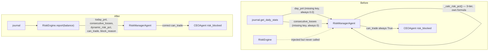
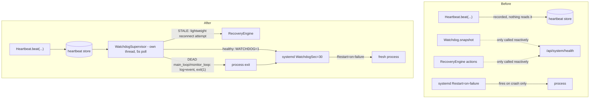

# Brain Bot V16 — Architecture & Dependency Graph

Living document. Updated after every structural fix landed as part of the
V16.5 pre-Phase-13 stabilization pass. Every entry below is grounded in
either `grep`/`ast`-based static analysis of the real source tree or an
actual `pytest` run — nothing here is estimated.

---

## 1. Package dependency graph (production code, tests excluded)

```mermaid
flowchart LR
    main --> agents & api & data & decision & execution & journal
    main --> risk & system_health & commander & intelligence & regime

    agents --> config & events & reasoning & telemetry & utils
    agents -. "risk_engine injected, not imported" .-> risk

    api --> commander & journal & intelligence & system_health & telemetry & graph & ml & research

    execution --> paper & config & utils
    decision  --> features & regime & config
    intelligence --> features & futures & regime & trend
    journal   --> database & analytics
    system_health --> events & utils
    utils     -. "deferred import inside retry.py to avoid a load-order cycle" .-> system_health
    system_health -->|"new: WatchdogSupervisor"| utils
```

`utils/systemd_notify.py` (new, Fix #2) is a dependency-free leaf — stdlib
`os`/`socket` only, no project imports. `system_health/watchdog.py`'s new
`WatchdogSupervisor` imports it lazily (inside `_run`/`_handle_dead`), same
deferred-import style already used for the `utils`↔`system_health` edge
below, for the same reason (keep import-time load order simple).

**No true circular imports found.** One potential package-level cycle
(`utils` ↔ `system_health`) exists only because `utils/retry.py` needs
`CircuitBreakerOpen` from `system_health/circuit_breaker.py`; it's already
resolved correctly with a deferred (in-function) import rather than a
module-level one. No change needed.

`RiskManagerAgent` deliberately does **not** `import risk` — it receives a
`RiskEngine` instance via constructor injection from `main.py`. This is the
correct pattern and is why static import-graph tools don't show a `risk`
dependency for `agents/` even though it uses `RiskEngine` at runtime.

---

## 2. Structural audit — 2026-07-15 pass

Scope: the 15 consolidation/cleanup objectives requested for the
pre-Phase-13 stabilization pass. Method: `grep`-based class inventory,
`vulture` (dead-code, 80% confidence), a custom `ast`-based import-graph
script, and manual verification of every automated finding before it's
listed here (the import-graph script had a real bug on `__init__.py`
relative-import resolution — its raw "orphan module" output was **not**
trusted as-is; every candidate was confirmed or refuted by grep/read).

| # | Objective | Finding | Evidence |
|---|---|---|---|
| 1–2 | Close P0 / P1 issues | 6 items open from the Phase 1 audit (`docs/V16_AUDIT_REPORT.md` §5) — being worked through incrementally. #1 below is closed this pass. | — |
| 3 | Remove duplicated services | Only **one** real duplication found: risk-pct/daily-loss logic (see #4). No duplicate Position Manager, Execution Pipeline, or WebSocket Manager exist to consolidate. | `grep` for `class .*(Manager\|Pipeline\|Engine\|Service)` — exactly one hit per name |
| 4 | Consolidate Risk Manager | **Confirmed & fixed this pass.** `agents/risk_manager.py` recomputed risk from journal fields (`day_pnl`, `consecutive_losses`) that don't exist on the real journal — see §3 below. | `journal/journal_v2.py:203-229` vs `agents/risk_manager.py` (pre-fix) |
| 5 | Consolidate Position Manager | Not found. Only `paper/paper_position.py` exists — a single position dataclass for the paper-trading engine, not a duplicated manager service. | `grep -rln "class.*Position"` |
| 6 | Consolidate Execution Pipeline | Not found. `execution/execution_factory.py` is a single-responsibility factory (`build_execution_engine()`) already correctly choosing between `PaperExecutionEngine`/`TradeManager` by mode — nothing to merge. `pipeline/brain_pipeline_v13.py` is unrelated (decision pipeline) and is itself dead code — see #9. | read `execution/execution_factory.py` in full |
| 7 | Consolidate WebSocket Manager | Not found. Exactly one `ConnectionManager` class exists (`api/app.py:100`), no backend duplicate. | `find -iname "*websocket*"` → no backend hits |
| 8 | Remove dead code | `vulture` @ 80% confidence found 6 items total, 4 of which are `exc_tb`/`tb` unused-by-design `__exit__`/context-manager parameters (not removable). 2 real, trivial: unused import in `api/app.py:65`, unused variable in `decision/causal_explainer.py:204`. Tracked for a follow-up cleanup pass — not bundled into this fix to keep the diff reviewable. Also removed `RiskManagerAgent._calc_risk_pct()`, dead as of this pass's fix. | `vulture . --min-confidence 80` |
| 9 | Remove unused modules | **One confirmed orphan:** `pipeline/brain_pipeline_v13.py` — zero references anywhere in the tree, including tests. `execution/strategy.py` (`SMC_OI_Regime_Strategy`) is referenced only from `tests/test_execution.py`, never from production code — flagged as **wired-but-unused**, not dead, pending confirmation of intent before removal. | manual grep verification of every import-graph "orphan" candidate |
| 10 | Remove obsolete APIs | Not found. 48 routes in `api/app.py`; the one "legacy" reference is an intentional fallback (serve Vite `dist/` if present, else legacy static `index.html`) — working backward-compat, not cruft. | `grep -i "deprecated\|obsolete\|legacy"` |
| 11 | Remove duplicated configuration | Not found. Single `config/settings.py` (105 lines); no hardcoded risk/config constants duplicated outside it. | `find *.yml/.env`, `grep` for constant literals outside `config/` |
| 12–13 | Fix circular imports / dependency graph | No problematic cycles. See §1. | `ast`-based cycle detection, manually verified |
| 14–15 | Single responsibility / production-ready | Addressed per-module as each item above is worked; not a one-shot check. | ongoing |

**Net effect:** most of the "consolidation" objectives don't apply to this
codebase as written — it's structurally cleaner than the brief assumed.
The real, evidence-backed backlog is small: the risk-manager fix (closed
this pass), the two P0 items from the Phase 1 audit (scheduler watchdog,
systemd `WatchdogSec=`), the P1 items (dashboard auth, Risk Engine V2 caps,
circuit breaker on order placement), and two low-risk cleanup items (§2,
row 9).

---

## 3. Fix #1 — Risk Manager consolidation (2026-07-15)

**Root cause.** `agents/risk_manager.py::RiskManagerAgent.analyse()` read
`journal.get_daily_stats().get("day_pnl", ...)` and
`.get("consecutive_losses", ...)`. `TradeJournalV2.get_daily_stats()`
(`journal/journal_v2.py:203`) returns a dict keyed `total_pnl` — never
`day_pnl` — and has no `consecutive_losses` key at all (that's the
separate `get_consecutive_losses()` method). Both `.get()` calls therefore
silently fell back to their defaults on every single call: `today_pnl`
was always `0.0`, `consec_loss` was always `0`, regardless of real trading
state. `RiskManagerAgent` also duplicated the risk-per-trade formula
(`_calc_risk_pct`) with a **3-tier** curve (MAX / avg(MAX,MIN) / MIN) that
disagreed with `RiskEngine.get_risk_pct()`'s **2-tier** curve and ignored
daily-loss utilization entirely — this half was already flagged in the
Phase 1 audit (finding #3); the key-mismatch half was not previously
documented and was found during this pass.

**Blast radius, verified by tracing the call graph:** real order execution
was never affected — `main.py:597` calls `RiskEngine.can_trade()` directly
and independently before every entry, and that path doesn't go through the
agent layer at all. What *was* silently broken: this agent's HALT /
ELEVATED / CAUTION classification, its `DAILY_LIMIT_HIT` /
`DAILY_LIMIT_NEAR` / `CONSECUTIVE_LOSS` event publishing, its `answer()`
Q&A (drawdown/streak questions always answered "0"), and
`ceo_agent.py`'s own risk veto (`risk_blocked`, `ceo_agent.py:151-153`) —
which reads this agent's `can_trade` and would never trip, even though the
real gate downstream in `main.py` still would.

**Fix.** `analyse()` now calls `self._risk_engine.report(balance)` — the
same `RiskEngine` instance `main.py` already constructs and checks
directly — instead of recomputing anything from the journal. Event
publishing, factor/summary narrative, and the `NEUTRAL`-signal fix
(existing, correct, documented in-file) are preserved as-is, just fed from
correct numbers. `risk_level` classification was also changed from two
independent `if/elif` blocks (where a later consecutive-loss check could
silently downgrade `risk_level` from `HALT` to `CAUTION` when both
conditions were true) to explicit priority logic. `_calc_risk_pct()` was
removed — dead code now that risk % comes from `RiskEngine`. A defensive
fallback (logged) handles the case of the agent being constructed without
a wired `RiskEngine`, which `main.py` never does but ad-hoc scripts/tests
might.

**Before / after (data flow for one `analyse()` call):**



**Files changed:**
- `agents/risk_manager.py` — `analyse()` rewritten, `_calc_risk_pct()` removed
- `tests/test_agents.py` — `TestRiskManagerAgent` tests rewired to mock the
  journal's real contract instead of the old wrong-key shape (those tests
  were validating the bug, not catching it); added a regression test and a
  no-engine-fallback test; `test_ceo_risk_veto` rewired to force the veto
  through a real `RiskEngine` instead of monkey-patching `._journal` with
  the old shape

**Test result:** `pytest tests/ -q` → **769 passed, 0 failed** (763
pre-existing/idempotency-suite + 2 new risk-manager regression tests +
existing suite; note `test_ceo_risk_veto` and 3 `TestRiskManagerAgent`
tests were rewritten, not just left passing).

**Compatibility:** `AgentReport.raw` keeps the exact same key names
(`can_trade`, `today_pnl`, `drawdown_pct`, `consec_loss`, `risk_pct`,
`risk_level`, `blocks`, `balance`) — `answer()` and any other consumer of
`.raw` needed no changes.

---

## 4. Fix #2 — WatchdogSupervisor + systemd integration (2026-07-16)

Closes audit P0 items 2 and 3, and the corresponding parts of the user's
P0-A / P0-D request.

**Root cause (already diagnosed in the Phase 1 audit, §5, finding #5, and
confirmed again here by reading every file involved):** `system_health/`
already had real, working pieces — `Watchdog` (classifies subsystems
ALIVE/STALE/DEAD from heartbeat age), `Heartbeat` (subsystems already
beaten: `main_loop`, `monitor_loop`, `mission_tracker`, `telemetry`,
`trade_manager`, and `dashboard_api` once at bootstrap), and
`RecoveryEngine` (`attempt_reconnect_data_provider`,
`attempt_reconciliation_recovery`, `cleanup_stale_state` are all real).
None of it was autonomous — every one of those was only ever invoked
reactively, from `api/app.py`'s `/api/system/health` and
`/api/system/reconciliation` routes. Nothing polled them in the
background, and nothing bridged them to systemd's own watchdog layer.
Separately: `main.py` runs all 5 scheduled jobs
(`run_trading_cycle`/`monitor_open_trades`/`run_position_reconciliation`/
`daily_report`/nightly retrain) on ONE thread via the `schedule` library —
a hang inside any one of them blocks every other job, including position
monitoring (audit finding #4).

**What mapping the user's P0-A worker list onto the real codebase found:**
"Scanner" and "Execution Queue" don't exist as separate components (single
trading-cycle architecture, no standalone scanner, no execution queue yet
— that's unbuilt Phase 16 work). The real, already-tracked subsystems are
`main_loop`, `monitor_loop`, `trade_manager`, `mission_tracker`,
`telemetry`, `dashboard_api`, and a `websocket` entry that's defined but
never fed — see below.

**Why "restart worker in place" isn't the design used here:** Python has
no safe way to force a genuinely stuck synchronous call to abandon
mid-execution — there's no thread-kill primitive that doesn't risk
corrupted state or leaked locks/connections. For a single-threaded
scheduler like this one, the production-safe pattern (and the one the
Phase 1 audit already prescribed) is: detect the hang, exit the whole
process cleanly, let systemd's `Restart=on-failure` bring up a fresh one.
That's what's implemented.

**Built:**
- `system_health/watchdog.py::WatchdogSupervisor` — new background thread
  (independent of the single-threaded scheduler, so it keeps polling even
  if that thread is completely stuck). Every 5s: reads `Watchdog.snapshot()`;
  for `main_loop`/`trade_manager` STALE (not yet DEAD), makes one lightweight
  `RecoveryEngine.attempt_reconnect_data_provider()` attempt (cheap,
  already rate-limited by RecoveryEngine's own 30s cooldown — this is the
  autonomous trigger P0-B's "reconnect backoff / API timeout recovery" was
  actually missing, since the REST retry/circuit-breaker itself already
  existed in `data/binance_provider.py`); if `main_loop` or `monitor_loop`
  is DEAD, logs critical, publishes a journalled+telemetried
  `WATCHDOG_FORCED_EXIT` event, and exits the process. Pets systemd's
  watchdog (`sd_notify WATCHDOG=1`) only when it did *not* just decide to
  exit — so systemd's own `WatchdogSec=` stays a true independent backstop.
  A 120s startup grace period prevents a cold boot (no heartbeats yet)
  from ever being misread as a hang; `main.py` also only starts the
  supervisor *after* the first synchronous job pass completes, as a second
  layer of the same protection.
  - **Deliberately excluded from the exit-trigger set:** `dashboard_api`
    (beaten exactly once, at bootstrap, never again — would show DEAD on
    every single run regardless of real health) and `websocket` (nothing
    in this codebase calls `Heartbeat.beat("websocket", ...)` — there is
    no exchange websocket; Binance access here is REST-only). Using either
    as a trigger today would force-restart a perfectly healthy process.
    Tracked as a small follow-up (add a periodic `dashboard_api` beat;
    decide whether to repurpose or remove the `websocket` entry) — not
    fixed in this pass to keep this diff reviewable.
- `utils/systemd_notify.py` — new, ~50-line, dependency-free `sd_notify()`
  client (raw `NOTIFY_SOCKET` unix-datagram protocol — no new pip
  dependency). `READY=1`, `WATCHDOG=1`, `STOPPING=1`, `STATUS=...`. Safe
  no-op when `NOTIFY_SOCKET` isn't set (dev machine, tests, paper mode).
- `main.py` — starts `WatchdogSupervisor` right before the main loop,
  calls `notify_ready()` once startup finishes, and `notify_stopping()` in
  the existing signal handler.
- `deployment/systemd/brain_bot.service` — `Type=simple` → `Type=notify`,
  added `WatchdogSec=30` (6x the supervisor's 5s poll interval, consistent
  with the `STALE_MUL=5` convention already used in `watchdog.py`).
  `Restart=on-failure`/`RestartSec=10` unchanged.

**Before / after:**



**Tests:** `tests/test_v15_production.py::TestWatchdogSupervisor` (9 tests
— pets-when-healthy, grace-period suppression, exit on
main_loop/monitor_loop DEAD, non-trigger subsystems never exit, recovery
attempt on STALE, empty-components safety, real thread start/stop) and
`::TestSystemdNotify` (4 tests, real unix-socket round-trip).

---

## 5. Fix #3 — Circuit breaker wired into order placement (2026-07-16)

Closes audit P1 item 6, and the corresponding part of the user's P0-B
request ("REST retry", "API timeout recovery", "exchange reconnect").

**Root cause:** `data/binance_provider.py` already wraps its trade/account
calls (`get_account_balance`, `get_position_info`) in
`get_breaker("binance_trade")`. `execution/trade_manager.py`'s actual
order-placement calls (`place_market_order`, `place_stop_loss`,
`place_take_profit` — all three already have `@retry_api_call`, itself
already supporting an optional `breaker=` parameter per its own
docstring) never passed one in. So the single highest-stakes API surface
in the whole system — actually submitting orders — was the one surface
*not* protected by the circuit breaker, meaning a degraded exchange could
be hammered with retries from the execution path even while the breaker
had already opened for every other caller.

**Fix:** `breaker=_TRADE_BREAKER` added to all three decorators, where
`_TRADE_BREAKER = get_breaker("binance_trade", ...)` — the *same* named
singleton `binance_provider.py` already uses (`get_breaker()` is a
thread-safe registry keyed by name), not a new breaker. Order placement
and trade-account reads share Binance's trade API surface/rate-limit
family, so pooling their failure tracking means every caller on that
surface fast-fails together once it's unhealthy, rather than each
hammering it independently.

**Tests:** `tests/test_execution.py::TestTradeManagerCircuitBreaker` (4
tests) — confirms it's the same shared instance as `binance_provider.py`;
an OPEN breaker makes `place_market_order` raise `CircuitBreakerOpen`
*without ever calling the exchange client*; a CLOSED breaker doesn't
change existing behavior; and — the one that actually matters most here —
`place_stop_loss`'s internal tier-1→tier-2 fallback (e.g. a Binance -4120
"unsupported" response, handled internally) is correctly *not* recorded
as a breaker failure, since it's normal multi-tier negotiation, not a
real API failure.

---

## 6. P0-C (Position Reconciliation) — assessed, not rebuilt

`system_health/reconciliation.py::ReconciliationEngine`, wired into
`main.py`'s `run_position_reconciliation` job (runs every 60s), already:
compares exchange vs. bot vs. journal position state; detects
`SIDE_MISMATCH`/`QUANTITY_MISMATCH`/`PRESENCE_MISMATCH`/duplicate-journal-
row patterns; publishes a journalled+telemetried `RECONCILIATION_MISMATCH`
event via the event bus (event-bus `publish()` persists to the journal
whenever `persist=True`, which is the default); de-dupes identical
repeated mismatches; and already calls
`RecoveryEngine.attempt_reconciliation_recovery()` automatically. This is
essentially what P0-C asked for, already running.

**Real gap found:** auto-repair is only implemented for exactly one
pattern — a "ghost" journal row (exchange and bot both say flat, journal
says open). Every other mismatch type, *including the exchange having a
real open position the bot doesn't know about* (arguably the most
dangerous direction — live, un-managed, no-SL/TP capital exposure),
explicitly returns `"no_safe_auto_action"` and only logs a warning. That's
plausibly the right conservative default — auto-closing a real exchange
position without a human in the loop is its own risk — but it should
escalate louder than a warning-level log entry today. **Not changed in
this pass** (separate, smaller, reviewable fix) — flagged here as the
next concrete follow-up.

---

## 7. Test-infrastructure finding: two files silently excluded from every
regression run (2026-07-16)

Found while re-verifying test coverage for this pass. `pytest.ini` sets
`addopts = -m "unit"`, meaning any test without the `unit` marker is
silently deselected from the default `pytest tests/` run used as this
project's regression bar. Every test file has `pytestmark =
pytest.mark.unit` (or per-class `@pytest.mark.unit`) — except
`tests/test_v15_production.py` (61 tests, despite its own docstring
calling itself the "Brain Bot V15 Production Regression Suite") and
`tests/test_execution_factory.py` (37 tests). Both are pure mock/in-memory
unit tests with no live network calls — they were never *wrong*, they
simply never ran. **This means every "N passed, 0 failed" figure reported
earlier in this engagement (Fix #1's 769, and the Phase 1 audit's 767)
did not include these 98 tests.**

**Fix:** added `pytestmark = pytest.mark.unit` to both files. Re-running
the full suite afterward: **871 passed, 0 failed** — all 98
previously-unrun tests passed on their own merit; nothing was silently
broken. `tests/test_phase4c.py` was checked too and is fine (89 tests, all
individually `@pytest.mark.unit`-decorated per class, already running).

---

## 9. Integration merge — Fix #1 + Fix #2 + P1-A + P1-B1 (2026-07-16)

P1-A (dashboard auth) and P1-B1 (dynamic risk) were built in separate
sessions, both branching from the original `brain_bot_v16_phase1_patch.zip`
— neither had Fix #1 or Fix #2 applied (confirmed via their diff headers:
both diffed against the pristine 2026-07-07 tree). Both sessions'
READMEs were explicit and correct about this base-state gap.

Checked every file touched by more than one of the four patches for
actual line-region overlap before merging any of them:

| File | Patches touching it | Overlap? |
|---|---|---|
| `config/settings.py` | P1-A (lines ~74-90), P1-B1 (lines ~31-35) | No — different insertion points |
| `execution/trade_manager.py` | Fix #2 (imports + 3 decorator lines), P1-B1 (`calculate_position_size`, `execute_trade` bodies) | No — different methods entirely |
| `main.py` | Fix #2 (imports, signal handler, startup/shutdown tail), P1-B1 (inside `run_trading_cycle`, lines ~594-690) | No — different regions |
| `tests/test_execution.py` | Fix #2 (new `TestTradeManagerCircuitBreaker` class), P1-B1 (one mock-stub fix inside `TestRiskEngine`) | No — different classes |

All four merged cleanly with no manual conflict resolution beyond
locating the equivalent code in the already-patched files (line numbers
had shifted from each patch's own diff, so patches were re-applied by
content match, not raw `patch`/`git apply`). `agents/risk_manager.py`
had no conflict by design — P1-B1's own README explicitly chose not to
touch it, correctly anticipating Fix #1 would replace it wholesale.

**Verified:** `pytest tests/ -q` → **907 passed, 0 failed** — exactly
871 (Fix #1 + Fix #2 baseline) + 18 (P1-A's `test_api_auth.py`) + 18
(P1-B1's `test_p1b1_dynamic_risk.py`), confirming nothing was lost or
double-counted in the merge. `py_compile` clean on every touched file;
a live import of every touched module together (`config.settings`,
`risk.risk_engine`, `execution.trade_manager`, `execution.execution_factory`,
`system_health.watchdog`, `utils.systemd_notify`, `api.auth`) succeeds.

---

## 10. P1-A — Dashboard Authentication (2026-07-16, merged from a
separate session)

`api/app.py` had no authentication at all — CORS wide open, all 28
routes reachable by anyone who could reach the host. Of the endpoints
named in the original brief, only `/api/config` and `/api/command`
actually exist (`/api/trader`, `/api/recovery`, `/api/risk`,
`/api/profile` don't exist — nothing was added for routes that aren't
real, per this project's own "never invent APIs" rule). `/ws/command`
was found to be bidirectional (executes commands, not just broadcasts)
and needs the same protection as `POST /api/command`.

**Built:** `api/auth.py` (new) — VIEWER < OPERATOR < ADMIN roles,
API-key (`X-API-Key`, `hmac.compare_digest`) + bearer-JWT
(`POST /api/auth/token`, HS256, default 60min) validation, token
rotation, a WS auth helper called from all 7 WebSocket handlers (HTTP
middleware doesn't run for the websocket ASGI scope, so each handler
guards itself). `config/settings.py` gained `API_AUTH_ENABLED` (default
`False`), `API_KEYS`, `JWT_SECRET`, `JWT_EXPIRY_MINUTES`.

**Explicit design call, flagged for sign-off:** auth is off by default —
turning it on by default would have broken ~30 existing `TestClient(app)`
call sites with no auth headers across 10 test files, and been a real
backward-compat break for the currently-running deployment. Whenever
it's off, `api/app.py` logs a startup `WARNING` naming exactly what's
exposed, so the gap is loud, not silent. **You need to set
`API_AUTH_ENABLED=true` + configure `API_KEYS`/`JWT_SECRET` before this
dashboard is reachable from anywhere but localhost** — nothing in this
patch flips that on for you.

**Tests:** `tests/test_api_auth.py`, 18 tests, all passing post-merge.

---

## 11. P1-B1 — Dynamic Risk Engine, single-symbol (2026-07-16, merged
from a separate session)

`RiskEngine.get_risk_pct()` was a 2-tier curve keyed only on losing-streak
and today's drawdown — no market-volatility input at all.
`config.LEVERAGE` was a single static value.

**Two real bugs found and fixed as part of wiring this through** (not
scope creep — leaving either would have made the new feature actively
wrong):
- `TradeManager.execute_trade()` never passed an override to
  `self.set_leverage()` even though `set_leverage(leverage=None)` already
  accepted one — the override path was dead code.
- `TradeManager.calculate_position_size()` computed its margin cap
  against `settings.LEVERAGE` directly rather than a parameter — so
  wiring dynamic leverage through `execute_trade()` alone, without also
  fixing this, would have left the margin cap computed against the
  *wrong* (static) leverage while the exchange runs at the *actual*
  (dynamic) one.

**Built:** `RiskEngine.get_risk_pct(atr_pct=...)` / new `get_leverage(atr_pct=...)`
/ new `_volatility_factor()` — `factor = clamp(threshold / atr_pct,
VOLATILITY_RISK_FLOOR, 1.0)` when `atr_pct > threshold`, else `1.0`;
continuous, not a binary cutoff, floored so risk-per-trade/leverage never
collapse toward an unfillable qty. Reuses `RegimeEngine`'s
`atr_normalized` (already computed every cycle) rather than computing ATR
a second time — `main.py` passes `regime.atr_normalized` straight through
via a defensive `getattr` (falls back to pre-P1-B1 behavior if `regime`
is ever `None`). New settings `VOLATILITY_RISK_THRESHOLD` (default
`0.015`, matches `RegimeEngine.ATR_VOLATILE_THRESHOLD` by default, kept
independently tunable) and `VOLATILITY_RISK_FLOOR` (default `0.5`).

**Deliberately not done:** paper mode doesn't simulate dynamic leverage
(`PaperAccount` fixes leverage at construction — real per-trade margin
simulation would be a separate task, `_PaperAdapter.execute_trade()`
accepts `leverage` for interface parity but drops it, documented inline).
`daily_report()`'s `report(balance)` call still runs without `atr_pct`
since `regime` isn't in scope in that nightly-summary job — falls back to
pre-P1-B1 values, correct for a summary, not a bug. `agents/risk_manager.py`
intentionally untouched (see §9).

**Tests:** `tests/test_p1b1_dynamic_risk.py`, 18 tests, all passing
post-merge. Stub fixes (one line each, commented inline) added to 4
existing test files whose `RiskEngine`/`settings` mocks had no coverage
for the two new call sites.

---

## 12. Next up

- Escalate the untracked-exchange-position reconciliation case (§6) to a
  louder alert channel.
- `dashboard_api` / `websocket` heartbeat gaps (§4).
- Two low-risk cleanup items from §2 row 9.
- Portfolio Manager, Scanner, Correlation Risk, Exposure Risk, Capital
  Allocation — all explicitly deferred, see §13.

---

## 13. Multi Symbol Foundation — architecture only (2026-07-17)

**Scope note:** this section is architecture, not features. Portfolio
Manager, Scanner, Ranking Engine, Capital Allocation, Correlation Matrix,
and Exposure Risk are explicitly NOT built here — see "Deliberately not
done" below. The goal was narrower: stop `TradeManager` from being the
reason multi-symbol support requires touching money-moving code later.

### Root cause

`TradeManager.__init__` read `settings.SYMBOL` directly rather than
accepting it as a parameter, so `self.symbol` was fixed to whatever the
global settings singleton held for the process's entire lifetime. Every
order-placing method (`place_market_order`, `place_stop_loss`,
`place_take_profit`, `cancel_all_orders`, `set_leverage`,
`set_margin_type`, `close_position`) reads `self.symbol` — none of them
took a symbol argument. `execution_factory.py` constructed exactly one
`TradeManager` per process. There was no path to a second symbol without
either (a) mutating `settings.SYMBOL` at runtime — dangerous, since
`RiskEngine`, journal, and dashboard code also read it and would silently
start reporting/gating the wrong symbol — or (b) rewriting
`TradeManager`'s internals.

### What's built

```
BrainBot
   |
ExecutionCoordinator        execution/execution_coordinator.py (new)
   |                        Routing + lifecycle ONLY. No strategy logic.
   +-- TradeManager(BTCUSDT)
   +-- TradeManager(ETHUSDT)
   +-- TradeManager(SOLUSDT)
   ...
```

- **`TradeManager.__init__(data_provider, symbol=None)`** — one new
  optional parameter, defaults to `settings.SYMBOL`. This is the entire
  change to `trade_manager.py` for this phase; every other method in that
  file already used `self.symbol` correctly and needed no change. Existing
  call sites (`TradeManager(data_provider)`, no second arg) are
  byte-for-byte unaffected.
- **`ExecutionCoordinator`** (new file) — owns a `{symbol: TradeManager}`
  cache behind an `RLock` (main.py's trading-loop thread and api/app.py's
  dashboard thread can both reach a coordinator). `get_manager(symbol)` is
  an O(1) dict lookup on the cache-hit path; construction happens at most
  once per symbol (singleton-per-symbol, verified by test — no duplicate
  managers). `execute_trade(...)` mirrors `TradeManager.execute_trade`'s
  exact signature plus one trailing optional `symbol=` kwarg, so with a
  single configured symbol it's a pure passthrough. `initialize()` pre-warms
  leverage/margin for every configured symbol at boot (best-effort, logs
  per-symbol success). `health_check()` reports which symbols have a
  manager created yet, with no network calls. `shutdown()` releases the
  manager cache — deliberately does NOT cancel orders or close positions
  (that's a trading decision, out of scope for a routing class). A guarded
  `__getattr__` delegates anything else to the default symbol's
  `TradeManager` as a backward-compat safety net (grep-verified: nothing
  in the current codebase actually needs this today — main.py's only
  touchpoint on this object is `.execute_trade()`).
- **`execution_factory.py`** — testnet/live now construct an
  `ExecutionCoordinator(data_provider, symbols=settings.symbol_list)`
  instead of a bare `TradeManager`. Paper mode untouched.
  `_PaperAdapter.execute_trade()` gained an accepted-but-ignored `symbol=`
  kwarg for interface parity (same treatment P1-B1 already gave
  `leverage=` — see §11), so a future caller can pass `symbol=` uniformly
  regardless of execution mode without a `TypeError`.
- **`config/settings.py`** — new optional `SYMBOLS: list | None` field
  (unset by default) plus a `symbol_list` property that returns `SYMBOLS`
  if set, else `[SYMBOL]`. This property is the ONLY place that fallback
  rule is applied — `ExecutionCoordinator` and `execution_factory` read
  `settings.symbol_list`, never `SYMBOL`/`SYMBOLS` directly, so the
  single-source-of-truth rule from §3 (risk consolidation) is followed
  here too.
- **`main.py`** — exactly one addition: a guarded, best-effort
  `trade_manager.initialize()` call right after
  `build_execution_engine()`, wrapped in `hasattr(...)` + `try/except` so
  paper mode (no `initialize()` method) and any failure are both
  non-fatal. The trading loop itself, and every other line that touches
  `trade_manager`, is unchanged — confirmed by grep that
  `tm.execute_trade(...)` (main.py, inside the scheduled trading cycle) is
  the only call site in the entire codebase that touches this object
  besides the factory and the coordinator's own passthrough.

### Why `data_provider` was NOT touched

`BinanceDataProvider` is also coupled to `settings.SYMBOL` (`data/binance_provider.py`),
but `TradeManager` only ever reads `data_provider.client` — the shared,
symbol-agnostic authenticated `UMFutures` HTTP client — never any of
`data_provider`'s symbol-specific market-data methods. That means every
`TradeManager` an `ExecutionCoordinator` creates can safely share the
SAME `data_provider` instance today. Making market-data fetching itself
multi-symbol (parallel OHLCV/WS streams per symbol) is a real, separate
piece of work — that's Scanner/multi-coin-data territory.

### Why the circuit breaker needed no change

`_TRADE_BREAKER = get_breaker("binance_trade", ...)` in `trade_manager.py`
(§5) is a module-level singleton, shared by every `TradeManager` instance
regardless of symbol. That's correct as-is: all symbols hit the same
Binance account / trade-endpoint rate-limit family, so pooling failure
tracking across symbols is the right behavior, not a bug — if Binance's
trade endpoints go unhealthy, every symbol should fast-fail together
rather than each independently hammering a failing endpoint.

### Deliberately not done

- **No Portfolio Manager, Scanner, Ranking Engine, Capital Allocation,
  Correlation Matrix, or Exposure Risk.** `RiskEngine` (§3) still
  evaluates one account-level daily-loss/consecutive-loss gate — it has
  no concept of per-symbol or aggregate cross-symbol exposure yet.
  Running multiple symbols today means `RiskEngine`'s gate is shared
  across all of them without knowing that; that's the first thing
  Portfolio Manager needs to fix, and is called out here so it isn't
  forgotten, not because it was fixed.
- **No multi-symbol paper trading.** `PaperAccount` simulates one balance/
  leverage for the whole session; `_PaperAdapter.execute_trade()` accepts
  `symbol=` but drops it, same pattern as the existing `leverage=` handling.
- **No dashboard/UI changes.** `/api/system/health` etc. still report the
  single legacy `trade_manager` heartbeat name; wiring per-symbol health
  from `ExecutionCoordinator.health_check()` into the dashboard is future
  work.
- **`main.py`'s trading loop is unchanged.** It still decides, sizes, and
  executes for exactly one symbol per cycle — multi-symbol *decisioning*
  (which symbol, how much capital each) is Portfolio Manager's job, not
  this phase's.

### Tests

`tests/test_execution_coordinator.py`, 22 tests, all passing (mocked
exchange client, no network): explicit-symbol `TradeManager` construction
and independence between instances, `settings.symbol_list` fallback rules,
manager creation/caching/no-duplicates, cross-symbol routing (including
verifying only the requested symbol's manager gets created), backward
compatibility (single-symbol `execute_trade()` call produces identical
exchange calls to a bare `TradeManager`), health check, `initialize()`,
and shutdown (including idempotency and post-shutdown blocking).

Full suite after this change: **929 passed, 0 failed** (907 baseline + 22
new).

---

## 14. Next up (superseded by §16 below)

- Decide on P1-C (multi-symbol Portfolio Manager) vs. remaining
  single-symbol P1 items — not resolved here, still an open decision.
- Wire per-symbol `ExecutionCoordinator.health_check()` into the
  dashboard once a Portfolio Manager or multi-symbol decisioning layer
  actually exists to make use of it — no UI changes were made this phase.
- Everything listed under §13 "Deliberately not done."
- Carried over from the old §12: escalate the untracked-exchange-position
  reconciliation case (§6), `dashboard_api`/`websocket` heartbeat gaps
  (§4), two low-risk cleanup items from §2 row 9.

---

## 15. Opportunity Ranking Engine — V16 Phase 2 Part 2 (2026-07-17)

Builds on Market Scanner (Phase 2 Part 1, `scanner/market_scanner.py` —
see that file's own module docstring for its two-tier fetch design; it
predates this architecture doc entry and wasn't backfilled here).

```
MarketScanner.get_snapshots()   READ ONLY — no Binance calls made by this phase
       |
OpportunityRanker  (ranking/opportunity_ranker.py)
       |  score_breakdown.py    — 11-factor scoring per symbol
       |  confidence_fusion.py  — weighted composite + coverage
       v
Top-N RankedOpportunity list  (ranking_history table)
```

### Architectural conflict found and resolved (flagged before building,
### per this phase's own STOP-and-explain rule)

The brief asks for an 11-factor score including Trend, Market Structure,
AI Confidence, and Historical Performance, while requiring the Ranker to
"never request Binance data directly, reuse scanner cache only."
`SymbolSnapshot` (scanner cache) carries: price, price_change_pct_24h,
quote_volume_24h, funding_rate, spread_pct, open_interest, atr_pct — eight
of eleven factors are real, honestly-computed proxies from those fields
(`ranking/score_breakdown.py` documents exactly which field backs which
factor, and flags where a name is a proxy for something deeper — e.g.
"trend" is 24h move magnitude, not a structural swing-high/low read).

Three factors are not derivable from the scanner cache at all:
Market Structure needs `SMCEngine` against an OHLCV series; AI Confidence
needs `MarketContextBuilder`/`ConfidenceEngine`, which need their own
multi-timeframe kline fetch; Historical Performance needs per-symbol
trade outcomes that don't exist yet (this bot has only ever traded one
configured symbol). Computing the first two for real across all ~300
scanned symbols would mean re-introducing the exact per-symbol Binance
call volume the scanner's two-tier design exists to avoid.

**Resolution (chosen over faking a number):** these three factors return
an explicit `UNAVAILABLE` `FactorScore` (`ScoreStatus.UNAVAILABLE`) rather
than a plausible-looking placeholder, and `confidence_fusion.py` EXCLUDES
unavailable factors from the weighted composite (redistributing their
weight across computed factors) rather than diluting every score toward
50. A `coverage` value (0-1) travels alongside every composite score so a
caller can tell "genuinely strong signal" apart from "strong signal, but
only 65% of the intended factors were real data." This was surfaced to
the user before building, per the brief's own "if architectural conflicts
are discovered, STOP, explain, propose alternatives, wait for
confirmation" rule — full reasoning in the response accompanying this
doc update.

**Documented follow-up, not built here:** run the real SMC/Confidence
pipeline for only the Ranker's own current top-K candidates (cheap — tens
of symbols, not hundreds) as a second-pass refinement. That reintroduces
a small, bounded Binance call volume and needs its own review before
building.

### What's built

- `ranking/ranking_models.py` — `FactorScore`, `ScoreBreakdown`,
  `RankedOpportunity`, `ScoreStatus` (COMPUTED / UNAVAILABLE).
- `ranking/score_breakdown.py` — one pure function per factor, plus
  `UniverseStats` (percentile lookups built once per cycle — O(n log n) —
  so per-symbol scoring stays O(log n), not O(n), for the volume/spread/
  OI-relative factors).
- `ranking/confidence_fusion.py` — weighted composite + coverage, per the
  exclusion policy above.
- `ranking/opportunity_ranker.py` — `OpportunityRanker(scanner, top_n)`:
  `.rank()` reads `scanner.get_snapshots()`, scores, fuses, sorts, keeps
  top N, persists (in its own try/except on top of `ranking_history`'s
  own — a persistence bug can never block returning the freshly computed
  ranking, same philosophy as `MarketScanner.run_cycle()`), returns.
  `.get_latest()` / `.status()` for cheap reads without recomputing.
- `ranking/ranking_history.py` — persistence, following
  `MarketScanner._persist`/`_prune_old_snapshots`'s exact pattern (same
  `ManagedConn` usage, same one-row-per-cycle JSON-blob shape, same
  retention-based pruning) — no new persistence layer introduced.
- `database/schema_v13.sql` — new `ranking_history` table, same
  one-row-per-cycle convention as `scanner_snapshots`, plus
  `avg_coverage` so a low-data-quality ranking cycle is visible without
  parsing the JSON blob.
- `config/settings.py` — `RANKER_TOP_N` (default 20),
  `RANKER_FACTOR_WEIGHTS` (dict, sums to 100 by convention — placeholder
  defaults, meant to be tuned), `RANKER_HISTORY_RETENTION_HOURS`.

### Performance (measured, not estimated)

300 synthetic symbols (40 with full detail-pass data, matching
`SCANNER_DETAIL_TOP_N` default), full `rank()` cycle including SQLite
`:memory:` persistence, 10 runs after warmup, this sandbox: **~10ms
average, ~11ms max** — well under the brief's 200ms/300-symbols target.
Caveat: this is sandboxed hardware with an in-memory DB and mocked scanner
data, not a production measurement under real load — reported honestly as
a sandbox benchmark, not a production SLA.

### Deliberately not done (out of scope for this slice)

Portfolio Manager, Allocation Engine, Correlation Engine, Opportunity
Lifecycle persistence, REST API, WebSocket, Dashboard pages — none of
these were touched. Portfolio Manager explicitly depends on the Ranker's
output ("Portfolio Manager consumes only Top Opportunities from
Opportunity Ranker" per the brief), so this was the correct dependency-
root slice to build first; the rest needs its own sequenced passes — see
§16.

### Tests

`tests/test_opportunity_ranker.py`, 37 tests, all passing: every factor
function (computed and UNAVAILABLE paths), `UniverseStats` percentile
edge cases (empty/single-symbol universe), fusion (full coverage, partial
coverage + exclusion, all-unavailable fallback, explanation content),
`OpportunityRanker` (empty cache, ranking order, top-N limiting, staleness
tracking, persistence, persistence-failure resilience), and
`ranking_history` (save/roundtrip, newest-first ordering, coverage
computation). Mirrors `tests/test_market_scanner.py`'s `:memory:`
database-isolation pattern exactly.

Full suite after this change: **1001 passed, 0 failed** (964 baseline,
independently re-verified before this work started, + 37 new).

---

## 17. Portfolio Intelligence Core — V16 Phase 2A (2026-07-18)

Addresses §16's first three open items (Portfolio Manager's decision
layer, Correlation Engine, Capital Allocation Engine) — but as a pure
decision engine only. Nothing here executes a trade, calls Binance, or
runs on a schedule; `CapitalManager.decide()` takes a ranked candidate
list + `RiskEngine` + `PortfolioState` + balance and returns a
`PortfolioDecision`. Wiring that decision into actual execution is
explicitly out of scope for this phase (see "Why execution is
intentionally excluded" below).

New: `portfolio/portfolio_models.py`, `portfolio_state.py`,
`correlation_engine.py`, `capital_manager.py`; `config/correlation_table.py`.
Additive: `ranking/ranking_models.py` (`RankedOpportunity.coverage`,
default `1.0`), `config/settings.py` (`PORTFOLIO_*` fields).

### Why "AI Confidence" isn't an allocation input, and coverage is

The original brief for this phase asked for capital allocation weighted
by AI Confidence and Historical Win Rate. Both map directly to
`ranking/score_breakdown.py` factors that are **always**
`ScoreStatus.UNAVAILABLE` — a constant `50.0` placeholder, deliberately
excluded from the Ranker's own composite score (§15) specifically to
avoid the per-symbol Binance calls the two-tier scanner design (§13)
exists to avoid. Using that constant as a real allocation input would be
identical for every candidate — not neutral, actively misleading, since
it would present the allocation as AI-informed when it structurally
isn't.

`RankedOpportunity.coverage` (computed all along by
`confidence_fusion.fuse()`, previously only used inside its own log
string and discarded — now stored) is used instead. It's real,
per-symbol-varying data: it's the fraction of the composite's intended
weight that was backed by a `COMPUTED` factor this cycle, which varies
with e.g. whether a symbol got a detail pass for OI/ATR data this cycle
(§15's "top-N by volume" detail-pass limit). It answers an honest,
related question — "how much of this composite_score can we actually
trust" — rather than fabricating a confidence signal that doesn't exist.
Historical Win Rate can become real once multi-symbol trading produces
enough per-symbol trade history to compute it from; not fabricated now.

### Why correlation is tier-based, not Pearson

No historical price series exists anywhere in this codebase — the
scanner (`scanner/market_scanner.py`) only ever retains the latest
snapshot per symbol, confirmed by inspection before writing
`correlation_engine.py` (this was §16's flagged open question). Real
rolling/Pearson correlation is not computable today, full stop — not a
scope choice.

`config/correlation_table.py` is a hand-curated, two-level lookup
(symbol → cluster → super-group) covering ~100 major/mid-cap symbols,
not a per-pair matrix (infeasible to hand-write at ~300 symbols — 44,850
pairs). Same cluster → HIGH, same super-group different cluster →
MEDIUM, different super-group → LOW, either symbol unlisted → UNKNOWN.
UNKNOWN is deliberately the *worst* penalty (0.25, worse than HIGH's
0.5) — an unverified correlation should be treated more cautiously than
a verified high one for a live-money portfolio, not less.

**This is Version 1 and is meant to be replaced.** When real
price-history correlation becomes computable (needs the scanner to
retain a rolling window per symbol — not built), only
`config/correlation_table.py` and `CorrelationEngine.get_tier()`'s
implementation should need to change; `capital_manager.py` only ever
consumes `(tier, penalty)`, never the table directly.

### Why liquidity/spread are eligibility gates, not extra score weights

`composite_score` already includes "liquidity" and "spread" as 2 of its
8 computed factors (§15). Multiplying `final_score` by them again would
double-count exactly those two factors relative to trend/momentum/
funding/risk/volume/OI. Instead, `PortfolioLimits.min_liquidity_score`/
`min_spread_score` reject a candidate outright below a threshold,
regardless of composite score — honors "liquidity/spread should matter"
without re-weighting them twice.

### Why execution is intentionally excluded

`CapitalManager.decide()` returns a `PortfolioDecision` — capital
amounts and risk-%, not exchange order quantities, since Capital Manager
has no entry/stop-loss price (those come from the per-symbol Strategy/
Decision layer at execution time). Nothing in `portfolio/` imports from
`execution/` or `data/`, calls `set_leverage`, or places an order. Two
concrete reasons this phase stops at a decision:

1. **`RiskEngine`'s daily-loss/consecutive-loss gate is a single
   account-level circuit breaker** (§11), with no per-symbol or
   aggregate multi-position awareness. `CapitalManager.decide()` reads
   `RiskEngine.can_trade()`/`get_risk_pct()`/`get_leverage()` as-is
   without modifying them — wiring real multi-symbol execution on top of
   a still-single-account-level risk gate is exactly the ordering
   mistake §16 already flagged avoiding.
2. **No orchestrator exists yet** to read real exchange/journal state
   into a `PortfolioState` each cycle, hold the position-state machine
   (`WAITING→ALLOCATED→OPEN→...→ARCHIVED`, already defined in
   `portfolio_models.py` for this reason) through its transitions, or
   call `ExecutionCoordinator`'s per-symbol `TradeManager` (§13) with a
   `PortfolioDecision`'s allocations. That orchestrator is
   `portfolio/portfolio_manager.py`, deliberately not built this phase.

### Known simplification (documented, not a bug)

When `max_symbol_pct` caps a dominant candidate's allocation, the
capital freed by the cap is **not** redistributed to the other selected
candidates in this version — total deployed capital can end up below
the full deployable amount even with room and eligible candidates
remaining. An iterative water-filling redistribution would close this
gap; not built here to keep the v1 allocation formula easy to reason
about and test. Flagged as a candidate follow-up, not urgent.

### Tests

`tests/test_portfolio_models.py` (11), `test_portfolio_state.py` (18),
`test_correlation_engine.py` (21, including the three tier examples
given verbatim in the brief), `test_capital_manager.py` (31, covering
the risk-gate, capacity, correlation hard-reject, eligibility gates,
coverage weighting, volatility/leverage, capital scenarios, and
allocation-ordering cases) — **81 new tests**, all mocking
`RiskEngine`'s journal dependency only (never `RiskEngine` itself, to
exercise its real `can_trade`/`get_risk_pct`/`get_leverage` contract) and
never touching a network/exchange call.

**Verified: `pytest tests/ -m unit -q` → 1082 passed, 0 failed** (1001
baseline + 81). `ruff check` clean (4 unused-import findings, all
auto-fixed, no logic changes).

---

## 18. Portfolio Manager Orchestrator — V16 Phase 2B (2026-07-19)

The orchestration layer §17 deliberately left out: `portfolio/portfolio_manager.py`
wraps `CapitalManager.decide()` (called unmodified) with the three things
it structurally has no way to do itself — sector exposure enforcement,
replacement logic, and cooldown/min-hold bookkeeping — plus a new
`portfolio/sector_engine.py` and `config/sector_table.py` to give it
sector data to work with. `PortfolioManager` still does not execute
trades, place orders, or read real exchange/journal state — same
decision-only boundary §17 already drew for `CapitalManager`, one layer
up.

### Orchestration flow

`PortfolioManager.decide(candidates, risk_engine, state, balance)`:

1. **Cooldown filter.** Any non-held candidate currently in cooldown
   (see below) is pulled out before `CapitalManager` ever sees it —
   rejected with `"in_cooldown"`, not counted against `available_slots`.
2. **`CapitalManager.decide()`**, unmodified, on what's left. If it's
   blocked (RiskEngine circuit breaker), that propagates straight
   through and nothing else runs this cycle.
3. **Sector exposure enforcement.** Walks `CapitalManager`'s already
   priority-sorted `selected` list, tracking cumulative **capital**
   (margin, not leveraged notional — see "Why capital, not notional"
   below) per sector, moving anything that would push its sector over
   `PortfolioLimits.max_sector_pct * balance` into `rejected` instead
   (`"sector_exposure_exceeded"`). This is the enforcement §17's own
   `max_sector_pct` comment flagged as missing.
4. **Replacement evaluation** (only when the portfolio was full this
   cycle) — see below.
5. **Persistence** via `portfolio/portfolio_history.py`, non-fatal on
   failure (same double-try/except belt-and-suspenders pattern as
   `ranking_history.save_ranking`).

Returns an `OrchestratedDecision` — `selected`/`total_capital_allocated`/
`total_risk_allocated` describe only what's allocatable within capacity
*this* cycle; `replacements` is a separate, informational list nothing
in the totals reflects (see below).

### Why capital, not notional, for sector-cap enforcement

The first implementation compared each sector's **notional** exposure
(leveraged) against `max_sector_pct * balance` (unleveraged) — and
immediately failed its own tests: at 5x leverage, one ordinary
single-symbol allocation already produces notional several times
account balance, so even a generous 50% sector cap rejected a lone
starter position. `max_symbol_pct` next to it in `PortfolioLimits` was
already capital-based (a cap on `allocation_pct`, §17); `max_sector_pct`
now matches that same definition — `SectorEngine.capital_by_sector()`
sums `margin_used`, not `notional`. `SectorEngine.exposure_by_sector()`
(notional-based) is kept as a *separate* method, deliberately: it feeds
`diversification_score()` and the `sector_exposure` field reported back
in the decision, where "how much price-correlated market exposure am I
carrying" is the right question — a different question from "how much
of my capital is committed", which is what the cap enforces. Two
methods, two intentionally different answers, same class.

### Replacement strategy

When the portfolio is at `max_positions` and a strong new candidate got
rejected purely for lack of capacity (never even eligibility-checked in
that case), re-implementing `CapitalManager`'s eligibility/correlation/
scoring rules a second time here to evaluate it would be a maintenance
hazard — two copies of the same logic, free to drift apart. Instead,
`_evaluate_replacements()` re-runs `CapitalManager` itself with room for
exactly one more slot (`max_positions + 1`) against the same held state
and candidate list. Anything that probe decision selects beyond what the
real decision already selected is, by construction, the single best
candidate the real eligibility rules would actually allow in. That
challenger is compared against the weakest held position's *current-cycle*
score (0.0 if it's fallen out of the ranked universe entirely — the
strongest possible signal) and proposed as a swap only if it clears
`PORTFOLIO_REPLACEMENT_THRESHOLD_PCT` above it. At most one replacement
per cycle, deliberately, to avoid several simultaneous swaps
destabilizing the book in one pass. `ReplacementProposal` is a
recommendation only — `PortfolioManager` never closes or opens anything;
there's no entry/stop-loss price at this decision layer to size a
not-yet-open replacement with anyway (same reasoning §17 already gives
for why `CapitalManager` returns capital amounts, not order quantities).

### Cooldown / minimum-hold

A replacement's outgoing symbol enters cooldown
(`PORTFOLIO_COOLDOWN_SECONDS`, default 1h) — ineligible as a *new*
candidate until it expires; its incoming symbol is protected from being
proposed as an outgoing side again for `PORTFOLIO_MIN_HOLD_SECONDS`
(default 30m). Together these stop a single volatile ranking cycle from
oscillating a symbol in and out repeatedly. `notify_position_closed()`
is the hook a future execution-wiring phase should call for *real*
closures (stop-loss, take-profit, manual) — cooldown/protection are
currently registered at proposal time, not confirmed-execution time,
since no feedback loop exists yet telling `PortfolioManager` whether a
proposal was actually acted on. Flagged as a known V1 limitation, not
hidden.

### Sector Engine (`portfolio/sector_engine.py`, `config/sector_table.py`)

Symbol → sector classification, same "hand-curated table, not a
computed classification" precedent as §17's correlation table — no
on-chain/business-category data source exists anywhere in this codebase.
13 fixed sectors (Layer1, Layer2, DeFi, Meme, AI, Infrastructure,
Exchange, Stablecoin, Privacy, Oracle, Gaming, RWA, Unknown), ~110
symbols curated, `Unknown` a first-class bucket for anything not yet
added rather than an error state. **Explicitly Version 1** — meant to be
extended incrementally, not replaced wholesale; the diversification-score
math assumes a roughly-stable sector universe cycle to cycle.
`diversification_score()` (0-100, higher = more spread) is
`100 * (1 - HHI)` over sector-weight shares, a standard concentration
measure, computed fresh from symbols on every call rather than trusting
`PortfolioPosition.sector` — that field stays structurally `None` until
whatever phase eventually constructs real `PortfolioPosition` objects
populates it (see "Why execution is intentionally excluded" below);
trusting it today would make sector accounting a silent no-op.

### Why execution is intentionally excluded (still)

Same two reasons §17 gave, still both true one phase later:

1. `RiskEngine`'s circuit breaker is still account-level, not
   per-position — `PortfolioManager` adds sector-level and replacement
   awareness on top of `CapitalManager`, neither of which changes that.
2. **Still no orchestrator** reads real exchange/journal state into a
   `PortfolioState` each cycle or calls `ExecutionCoordinator`'s
   per-symbol `TradeManager` (§13) with an `OrchestratedDecision`'s
   allocations or a `ReplacementProposal`. `PortfolioManager` is written
   so that future phase (§19 below) only has to call `decide()` and act
   on its output — nothing in this module needs to change when it's
   built.

### Known simplifications (documented, not bugs)

- Sector-cap rejections don't redistribute freed capital to remaining
  candidates — same "known simplification" §17 already accepted for
  `max_symbol_pct`, same reasoning (keep the v1 formula easy to reason
  about and test).
- At most one replacement proposed per `decide()` call, even if several
  held positions are individually weak enough to justify one.
- Cooldown/min-hold are proposal-time, not confirmed-execution-time (see
  "Cooldown / minimum-hold" above).

### Tests

`tests/test_sector_engine.py` (60, including a 19-case parametrized
sweep over the full sector table), `test_portfolio_manager.py` (36,
covering sector-cap enforcement, replacement logic, cooldown/min-hold,
`decide()` end-to-end, and persistence), `test_portfolio_history.py`
(10) — **106 new tests**, all mocking only `RiskEngine`'s journal
dependency (never `RiskEngine`/`CapitalManager`/`CorrelationEngine`
themselves) and never touching a network/exchange call, matching §17's
own testing convention exactly.

**Verified: `pytest tests/ -q` → 1188 passed, 0 failed** (1082 baseline
+ 106). `ruff check . --exclude dashboard_src --exclude dashboard` →
clean.

---

## 19. Portfolio API — V16 Phase 2C (2026-07-19)

**Architecture conflict found and resolved (flagged before building, per
this phase's own STOP-and-explain rule):** §18's own "Next up" section
(now §20 below) said REST/WebSocket should wait for real orchestrator
wiring, on the reasoning that there'd be "nothing to expose" without it.
Verified that's still true in the literal sense — `PortfolioManager` is
never instantiated outside tests, so nothing populates `portfolio_history`
in production yet — but "nothing to expose" doesn't have to mean "nothing
worth building yet": the persistence layer (`portfolio_history` table,
`OrchestratedDecision.to_dict()`) already exists and is already real, it's
just currently unpopulated. Resolution: build the API as a genuine read
layer over that real (if currently empty) storage, with every response
honestly labeled as a snapshot of the latest *persisted* decision rather
than a live view, so nothing here has to change or be revisited once a
future orchestrator phase starts calling `PortfolioManager.decide()` on a
schedule — that phase only has to start calling `portfolio_history.save_decision()`
regularly, and every endpoint here starts reflecting real, current data
with no code change.

### What's built

`api/portfolio_api.py` (REST, `APIRouter` included into the existing
`api/app.py` singleton — not a second FastAPI app), `api/portfolio_ws.py`
(`/ws/portfolio`), `api/portfolio_serializers.py` (pure row-dict → JSON
shaping, no DB/exchange access). Two small additive extensions to
`portfolio/portfolio_history.py`: `query_decisions()` (paginated,
optional symbol/sector filter) and `count_decisions()` —
`get_latest_decisions()` itself is untouched, same signature, same one
existing caller (its own tests).

REST: `GET /api/portfolio/state`, `/decision/latest`, `/history`
(limit/offset/symbol/sector), `/sectors`, `/allocations`. WebSocket:
`/ws/portfolio` — `decision`/`state`/`sectors`/`allocations`/
`replacement_proposal` events, only when a new row appears in
`portfolio_history` (deduped by row id — a given id can only newly
appear once, so this is the entire duplicate-prevention mechanism, no
separate already-sent set needed), plus a heartbeat every 5s regardless.
Every connection gets a full `init` frame immediately on connect
(current latest-persisted snapshot, explicit nulls if nothing's ever
been persisted) so a reconnecting client is never left waiting on the
next new decision to resync.

### Why every payload carries an explicit `source`/`live` marker

Per the phase's own rules: never fabricate runtime state, never invent a
live `PortfolioState`. Every serializer output
(`api/portfolio_serializers.py`) includes `"source":
"latest_persisted_decision"` and `"live": false` so a client — or a
human reading a raw response — cannot mistake this for a continuously-
updated live view even without reading this doc. `GET
/api/portfolio/state` in particular is deliberately NOT shaped to look
like `portfolio/portfolio_state.py`'s `PortfolioState` class; it reports
the *positions the latest persisted decision selected*, which is real
data, just presented as exactly what it is — a decision-cycle snapshot,
not a live account view.

### No decision ever persisted → real empty state, not a 404

Matches this codebase's existing convention (`/api/paper`,
`/api/paper/trades`: "disabled/unavailable is a normal, expected runtime
state... NOT a server error"). Every endpoint returns 200 with an
honestly empty/null payload (`"decision": null`, `"positions": []`,
`"sector_exposure": {}`) rather than a 404 or a synthesized placeholder.
The WebSocket does the equivalent by sending its `init` frame with the
same nulls and then staying idle apart from its heartbeat — "the stream
simply remains idle" per the phase's own rule 4.

### Why symbol/sector history filtering is Python-side, not SQL WHERE

`portfolio_history` stores one JSON blob per decision cycle (same "wide,
dynamic shape" reasoning `schema_v13.sql` already gives for this table —
see §18) — there's no indexed column for either symbol or sector to
filter on in SQL. `query_decisions()` decodes a generously-sized page
and filters in Python instead. Fine at this table's expected scale (one
row per decision cycle, pruned by `PORTFOLIO_HISTORY_RETENTION_HOURS`);
flagged here as a known limitation rather than hidden, same convention
every other "known simplification" in this codebase follows. One
consequence: `GET /api/portfolio/history`'s `pagination.total` is `null`
whenever a symbol/sector filter is active (an exact filtered count isn't
cheap without decoding the whole table) — `has_more` falls back to an
honest best-effort (`true` only when a full page was returned) rather
than a fabricated total.

### Why /ws/portfolio has no polling loop of its own

`check_and_broadcast()` is called once per tick from `api/app.py`'s
existing, already-supervised `_broadcast_loop()` — the same single loop
every other WS channel in this codebase already rides on
(`/ws/decision`, `/ws/agents`, `/ws/missions`). A second independent
poll loop here would be exactly the duplicate-scheduler infrastructure
this phase's rules rule out ("No Scheduler"); hooking into the existing
one is the additive option.

### Deliberately not done (out of scope for this slice)

No dashboard page — the brief scoped this to "no dashboard changes
beyond what is required to consume the new API", and nothing yet
consumes it. No scheduler/orchestrator calling `PortfolioManager.decide()`
on a cadence — still §20's own next item below, unchanged by this phase.
No new auth role — `/api/portfolio/*` already falls under
`_auth_middleware`'s default VIEWER-role path (any `/api/*` route not in
`_AUTH_PUBLIC_PATHS`), and `/ws/portfolio` calls `enforce_ws_role()`
exactly like every other `/ws/*` handler; `api/auth.py` needed no changes.

### Tests

`tests/test_portfolio_serializers.py` (33, pure functions — no DB, no
FastAPI), `tests/test_portfolio_history_query.py` (14, `query_decisions`/
`count_decisions` against a real `:memory:` DB, same pattern as §18's
`test_portfolio_history.py`), `tests/test_portfolio_api.py` (27, REST
endpoints against the real `api.app` singleton via `TestClient`,
`portfolio_history` monkeypatched for isolation), `tests/test_portfolio_ws.py`
(18, init-frame/dedup/heartbeat/reconnect/dead-client-drop, calling
`check_and_broadcast()` directly rather than depending on
`_broadcast_loop`'s real 1s cadence) — **92 new tests**, none touching a
network/exchange call, matching §17/§18's own testing convention.

**Verified: `pytest tests/ -m unit -q` → 1280 passed, 0 failed** (1188
baseline + 92). `ruff check . --exclude dashboard_src --exclude dashboard`
→ clean.

---

## 20. Next up (superseded, see section 21 below)

- **Real orchestrator wiring** (provisionally "Phase 2E") — the piece
  §17, §18, and now §19 have all deliberately left out: reading real
  exchange/journal state into a `PortfolioState` each cycle, driving the
  position state machine, calling `ExecutionCoordinator`'s per-symbol
  `TradeManager` with an `OrchestratedDecision`'s allocations, and
  actually acting on (or discarding) a `ReplacementProposal` — including
  feeding real closures back through
  `PortfolioManager.notify_position_closed()` instead of §18's
  proposal-time-only cooldown registration. The moment this phase starts
  calling `portfolio_history.save_decision()` on a schedule, every §19
  endpoint starts reflecting real, current data with no code change on
  the API side.
- **`RiskEngine` per-symbol/aggregate exposure** — still §11's
  single account-level gate; §17 and §18 have both now built on top of
  it unchanged rather than fixing it.
- **Real (price-history) correlation** — needs the scanner to retain a
  rolling window per symbol; §17's static tier table is still the
  interim, and §18's sector table is a separate, deliberately
  non-identical taxonomy (see §18's Sector Engine note) rather than a
  substitute for this.
- **Sector-cap capital redistribution** — §18's own "Known
  simplification": a rejected sector-capped candidate's freed capital
  currently isn't redistributed to remaining candidates.
- **Dashboard Portfolio page** — §19 built the API to consume; no UI
  consumes it yet.
- Everything still carried over from §16/§14/§13 that Portfolio work
  doesn't touch: reconciliation alert escalation (§6),
  `dashboard_api`/`websocket` heartbeat gaps (§4).

---

## 21. Bundle Manager — tools/ (2026-07-20)

New `tools/` package: `git_utils.py`, `bundle_utils.py`, `history.py`,
`github_actions.py`, `sync.py`, `ui.py`, `bundle_manager.py` (CLI entry
point). Automates the workflow this repo had been doing by hand up to
this point — a human copying patch-bundle files in and applying them —
without changing anything about how bundles themselves get produced.

### What it does
`python -m tools.bundle_manager import` scans `update/incoming/` for
`*.bundle`/`*.bundle.txt` files and, per bundle: verifies it
(`git bundle verify`), extracts exactly one feature branch + head SHA
(`git bundle list-heads` — fails closed, not guessed, if a bundle has
zero or more than one `refs/heads/*` ref), skips it if that SHA is
already in `bundle_history.json` (duplicate-import guard), fetches +
checks out + pushes the branch, then files the bundle into
`update/applied/` or `update/failed/`. `sync` fast-forwards the local
base branch after a merge (never merges anything itself — see
`tools/sync.py`'s docstring). `history` shows what's been imported.

### Design decisions
- **Dry-run preview + confirmation by default.** Every `import` run does
  a full verify/extract/dedupe pass with zero repository mutation first,
  shows the results, and asks before doing anything real — `--yes` skips
  this for CI. Never force-pushes/force-fetches unless `--force` is
  passed explicitly (uses `--force-with-lease`, not a bare `--force`).
- **One module owns all git subprocess calls** (`git_utils.py`) — list-
  form args only, no `shell=True` anywhere in the package, `git`
  resolved via `shutil.which` rather than a fixed path (Windows/Linux/
  Termux compatibility). Every other module goes through it rather than
  shelling out itself.
- **`bundle_history.json` is tracked in git**, not gitignored — it's
  shared history (a fresh clone needs to know what's already been
  imported), not local cache. Writes are atomic (temp file + `os.replace`)
  so a crash mid-write can't corrupt it.
- **A prior `failed` record doesn't block retrying** the same SHA — only
  a successful `applied` one does. A transient push failure shouldn't
  permanently lock out a bundle once whatever broke it is fixed.
- **A real bug caught during manual end-to-end testing** (not by unit
  tests — this only shows up against a real repo): git refuses to fetch
  into whatever branch is currently checked out. `import_bundle()`
  always checks out `base_branch` first for this reason; there's a
  regression test (`test_full_success_path_checks_out_base_branch_first`)
  asserting the exact call order.

### Cross-platform status
Designed for Windows/Linux/Termux (stdlib `argparse`/`pathlib`/
`subprocess` only, no `shell=True`, no OS-specific path handling) and
**verified end-to-end against real (throwaway) git repositories on
Linux** — a bare "origin," a working clone, and a separate authoring
clone, covering the full import→push→duplicate-skip→sync path plus a
genuinely corrupt bundle routing to `update/failed/`. **Not been run on
Windows or Termux** — no such environment was available to test
against; flagging the distinction between "designed for" and "verified
on" rather than claiming both.

### Tests
98 new tests across 6 files (`test_bundle_manager_{git_utils,bundle_utils,
history,github_actions,sync,cli}.py`), all mocking `subprocess`/git calls
— zero real git processes spawned, matching this project's "mock
everything, no network" convention. `history.py`'s tests use real
`tmp_path` file I/O (no network involved, nothing to mock).
**Verified: 1001 → 1099 passed, 0 failed.** `ruff check` clean.

### Deliberately not built
- No `.github/workflows/*.yml` — `github_actions.py` is named for the
  remote-touching *actions* (fetch/push), not GitHub's CI product; see
  its module docstring for this naming decision. Wiring this tool into
  CI is a reasonable follow-up, not built here (a real workflow needs
  its own secrets/permissions design this tool shouldn't assume).
- No REST/WebSocket surface for this tool — it's a local CLI, out of
  `docs/API.md`'s scope (REST/WS endpoints only).

---

## 22. Next up (superseded, see section 23 below)

- CI wiring for the Bundle Manager, if wanted (see above).
- Windows/Termux empirical verification — designed for both, only
  actually run on Linux so far.
- **Confirm the resolution in §15** before Portfolio Manager gets built
  on top of it — specifically whether excluding UNAVAILABLE factors from
  the composite (vs. some other treatment) and the proxy definitions for
  Trend/Momentum/Liquidity/Risk are acceptable as the interim signal.
- **Portfolio Manager** (`portfolio/`) — consumes `OpportunityRanker`'s
  top-N output; needs its own design pass for max concurrent positions,
  capital allocation, risk budget, exposure control, cooldown, position
  priority/replacement. Not started.
- **Correlation Engine** — needs a decision on data source (price-history
  correlation needs a return series per symbol pair; scanner cache is
  single-point, same category of gap as §15's conflict). Not started.
- **Capital Allocation Engine** — depends on Portfolio Manager's risk
  budget model existing first. Not started.
- **REST API / WebSocket / Dashboard pages** — deferred until there's a
  Portfolio Manager to expose; building API surface for a ranking-only
  system risks needing breaking changes once Portfolio Manager lands.
- Everything carried over from the old §14: P1-C decision, per-symbol
  health-check dashboard wiring, §13's "Deliberately not done" list,
  reconciliation alert escalation (§6), `dashboard_api`/`websocket`
  heartbeat gaps (§4).

**Note (2026-07-20): this list predates Bundle Manager's own merge and
was never updated afterward** — by the time it was written, Portfolio
Manager/Capital Allocation/REST API/WebSocket/Dashboard above were
already built (§18/§19) and Correlation Engine's data-source question
was already resolved (§17's static tier table, per §20's own "Real
(price-history) correlation" note above). Left as-is rather than
silently rewritten — this is exactly the kind of stale cross-branch
"Next up" list §23 below was written to properly supersede.

---

## 23. Execution Wiring & Live Orchestrator — V16 Phase 2E (2026-07-20)

§20 above named this piece before it existed: "calling
ExecutionCoordinator's per-symbol TradeManager with an
OrchestratedDecision's allocations, and actually acting on (or
discarding) a ReplacementProposal — including feeding real closures back
through PortfolioManager.notify_position_closed()". This phase builds
that connection. It deliberately does NOT build the other two things
§20 listed in the same sentence — see "Scope boundary" below.

**New modules** (`execution/`): `execution_events.py`,
`execution_state.py`, `execution_metrics.py`, `execution_orchestrator.py`.
**Modified** (additive only): `execution/execution_coordinator.py` (+1
method), `config/settings.py` (+2 fields), `api/portfolio_ws.py` (+1
function, wired into the existing `check_and_broadcast()` tick),
`api/app.py` (+1 router include). **New API**: `api/execution_api.py`.

### Signal boundary (why ExecutionOrchestrator takes a signal_provider)

`portfolio/portfolio_models.py`'s `PortfolioAllocation` carries
`capital_amount`/`risk_pct`/`leverage` but explicitly no entry/stop-loss/
take-profit price — that module's own docstring says those "come from
the per-symbol Strategy/Decision layer at execution time, which is out
of scope here". `execution/strategy.py`'s `SMC_OI_Regime_Strategy` is
that layer today, but it is single-symbol-shaped (reads one global
`data_provider`, no symbol parameter) — reshaping it into a
per-arbitrary-symbol signal source would be redesigning existing
execution/decision logic, ruled out by this phase's brief.
`ExecutionOrchestrator` instead takes a
`signal_provider: Callable[[str], Optional[ExecutionSignal]]` as a
constructor dependency, matching the DI idiom already used throughout
this codebase (`TradeManager(data_provider)`,
`CapitalManager(correlation_engine=...)`,
`SMC_OI_Regime_Strategy(decision_engine, ...)`). Whatever future phase
adapts per-symbol signal generation for the portfolio plugs in as this
callable; the orchestrator does not know or care how it's implemented.

### Execution lifecycle

Per allocation in `OrchestratedDecision.selected`:
`enqueue (PENDING)` → `signal_provider()` → (no/flat signal → `CANCELLED`,
reason `no_signal`) → `start (RUNNING)` → `execution_engine.execute_trade()`
→ success → `COMPLETED`, position added to the caller's `PortfolioState`;
failure → retry-or-`FAILED` (see Retry policy). `execution_engine` is
whatever `execution.execution_factory.build_execution_engine()` returned
(paper/testnet/live) — the orchestrator is engine-mode-agnostic by
construction, same as `main.py` already is.

Per `ReplacementProposal` in `OrchestratedDecision.replacements`: closes
`outgoing_symbol` only (via the new `ExecutionCoordinator.close_position()`
— see below), then calls `PortfolioManager.notify_position_closed()` on
confirmed closure. Does **not** open `incoming_symbol` — that
proposal's own docstring is explicit it's "a RECOMMENDATION, not an
action" and deliberately carries no sizing data; the freed capacity lets
`incoming_symbol` (or whatever ranks highest) get selected as an
ordinary, fully-specified allocation on a subsequent `decide()` cycle
instead.

`execute()` returns an `ExecutionBatch` (one per call) containing
`ExecutionResult`s; `ExecutionBatch.summary()` gives a batch-scoped
`ExecutionSummary`. `ExecutionOrchestrator.metrics()` gives the
separate, process-wide, cumulative `ExecutionMetricsSnapshot` — the two
are intentionally different views (this decision's execution vs.
execution health overall), not redundant.

### Retry strategy

Orchestration-level retry is layered **above** `trade_manager.py`'s own
`@retry_api_call` decorator, not a duplicate of it — by the time
`execute_trade()` returns `success=False`, TradeManager has already
exhausted its own retries for ordinary transient API errors, so what
reaches the orchestrator is either a genuine business rejection or a
fully-exhausted transient failure. `execution/execution_orchestrator.py`'s
`_NON_RECOVERABLE_MARKERS` classifies `result["error"]` text; anything
matching (`"rejected by exchange"`, `"invalid qty"`, `"duplicate"`,
`"manual_cancel"`, config errors) is never retried — matches the phase
brief's explicit "never retry: risk rejection, insufficient capital,
duplicate order, manual cancel". Everything else is retried up to
`settings.EXECUTION_MAX_RETRIES` (default 2), with an optional
`EXECUTION_RETRY_DELAY_SECONDS` pause between attempts.

### Idempotency

`execution/execution_state.py`'s `ExecutionState` keys an in-memory
ledger on `(batch_id, symbol)` — the default `batch_id` is
`f"decision-{decision.generated_at}"`, so re-calling `execute()` on the
*same* `OrchestratedDecision` object is a guaranteed no-op (results come
back `CANCELLED`, reason `already_executed`) rather than placing orders
twice. This is in-memory only (matches every other state container in
this package — `PortfolioState`, `EventBus` — being pure in-memory
containers too): it protects against accidental double-calls within one
process's lifetime, not across a restart. A caller wanting
restart-safe idempotency must derive `batch_id` from something
persisted (e.g. the `portfolio_history` row id once a decision is
saved) and pass it explicitly.

A record already `enqueue()`'d and separately `request_cancel()`'d
(e.g. a concurrent caller cancelling allocation N+1 while allocation N
is still executing — a real window, since `execute()`'s loop processes
allocations one at a time) is respected rather than silently
re-armed — `_execute_allocation`/`_execute_replacement_close` check for
an existing `CANCELLED` record before calling `enqueue()` again.

### Execution events

Published through the existing `events/event_bus.py` `EventBus` — not a
second pub/sub mechanism. `execution/execution_events.py` defines the
closed vocabulary (`execution_started`/`_completed`/`_failed`/
`_cancelled`/`_metrics_updated`) under a fixed `EXECUTION_ORCHESTRATOR`
agent name. `api/portfolio_ws.py`'s `check_and_broadcast()` relays new
events (dedup by `BusEvent.seq`, same shape as its existing
dedup-by-row-id decision relay) over the *same* `/ws/portfolio`
connection Phase 2C already established — no protocol redesign, no
second WebSocket route. This relay call had to be placed independently
of the decision-broadcast's own early-returns: nesting it inside
"only runs when the decision row changed" (an earlier draft's mistake,
caught by `tests/test_portfolio_ws.py::TestExecutionEventRelay::
test_execution_event_relayed_when_decision_row_unchanged`) would mean
execution events almost never actually reach clients, since a decision
changes far less often than a batch executes.

### Execution metrics

`execution/execution_metrics.py`'s `compute_metrics()` is a pure
function over whatever `ExecutionState` already holds — no independent
counters. Exposed read-only via `GET /api/execution/metrics`
(cumulative) and `GET /api/execution/status` (current pending/running/
finished counts), plus `GET /api/execution/executions[?status=]` and
`GET /api/execution/executions/{id}` for the underlying records — all
four additive, under `/api/execution/*`, covered automatically by the
existing prefix-generic `_auth_middleware` (no auth changes needed,
same reasoning as §19's own `/api/portfolio/*`).

### History updates

Deliberately **not** touched in this phase. `portfolio_history.py`'s
`save_decision()` already runs once per `decide()` call (§18); adding a
second, execution-outcome-shaped persistence path (fills, slippage,
actual vs. planned entry price) is real, valuable, and explicitly out
of scope here — `ExecutionResult`/`ExecutionBatch` are in-memory-only
for this phase (mirrors `ExecutionState` itself), not persisted to
`portfolio_history` or any other table. Recorded as new "Next up" work
below rather than folded in as an afterthought.

### Scope boundary

Two things §20 mentioned in the same breath as this phase, NOT built
here:
- **"Reading real exchange/journal state into a PortfolioState each
  cycle"** — that's reconciliation (`system_health/reconciliation.py`
  already exists for this concern). `ExecutionOrchestrator` is handed a
  `PortfolioState` by its caller and updates it as executions complete;
  it does not construct one from scratch.
- **A scheduler** calling `PortfolioManager.decide()` then
  `ExecutionOrchestrator.execute()` on a timer. `CLAUDE.md`'s own
  priority list has "Execution Scheduler" as a distinct, later priority
  after Portfolio Manager/Capital Allocation/Correlation/Sector Engine —
  building it as part of this phase would be starting a future phase
  early. `execute()` is a plain method any scheduler can call once one
  exists; nothing here assumes or builds the calling loop.

### Testing

100 new tests (`tests/test_execution_state.py`,
`test_execution_metrics.py`, `test_execution_events.py`,
`test_execution_orchestrator.py`, `test_execution_api.py`, +2 in the
existing `test_execution_coordinator.py`, +7 in the existing
`test_portfolio_ws.py`) — no Binance, no network, no real event loop
(WS relay tests call `check_and_broadcast()` directly, same convention
§19 already established). Every scenario the phase brief listed is
covered with a real assertion, not a placeholder: duplicate execution,
retry (including capped-at-max and zero-retries), cancel (both
"predicted execution_id cancelled in advance" and "cancelled while a
sibling allocation in the same batch is still processing"), latency,
metrics, execution failure, risk rejection (`decision.blocked`),
duplicate symbols within one batch, partial execution (mixed
success/failure in one batch), and successful execution.

**Verified: `pytest tests/ -q` → 1380 passed, 0 failed** (1280 baseline
+ 100). `ruff check .` → clean (one `F401` unused-import finding during
development, fixed before this count).

### Next up

- **Execution history persistence** — fills/slippage/actual-vs-planned
  entry price, keyed off `ExecutionResult`, in a new
  `portfolio_history`-adjacent table (see "History updates" above).
- **Execution Scheduler** — the timer loop that actually calls
  `PortfolioManager.decide()` then `ExecutionOrchestrator.execute()` in
  production (see "Scope boundary" above); `CLAUDE.md`'s own next
  priority after this phase.
- **Per-symbol signal generation for the portfolio** — the
  `signal_provider` this phase depends on as an injected dependency
  still needs a real, multi-symbol-capable implementation (see "Signal
  boundary" above); `execution/strategy.py`'s `SMC_OI_Regime_Strategy`
  remains single-symbol-only.
- **Dashboard execution panel** — `/api/execution/*` and the
  `/ws/portfolio` execution-event relay are both built; no UI consumes
  them yet (same gap §19 already noted for the Portfolio page).
- Everything §20 already carried forward and this phase didn't touch:
  RiskEngine's single account-level gate, real correlation tracking,
  sector-cap capital redistribution, Dashboard Portfolio page,
  reconciliation alert escalation, `dashboard_api`/`websocket`
  heartbeat gaps.

---

## 24. Execution Scheduler + Multi-Symbol Signals — V16 Phase 2F (2026-07-22)

§23's own "Next up" named this piece: "Execution Scheduler — the timer
loop that actually calls `PortfolioManager.decide()` then
`ExecutionOrchestrator.execute()` in production" and "Per-symbol signal
generation for the portfolio — the `signal_provider` this phase depends
on as an injected dependency still needs a real, multi-symbol-capable
implementation." Both are built here. `CLAUDE.md`'s own priority list
independently names the same next step ("Execution Scheduler", directly
after Portfolio Manager/Capital Allocation/Correlation/Sector Engine,
all already done) — two independent sources agreeing on what's next.

### The pipeline-choice correction (the actual hard part of this phase)

Before writing any code, this phase's design assumed
`execution/strategy.py`'s `SMC_OI_Regime_Strategy` (wrapping
`decision/brain_decision_engine.py`'s `BrainDecisionEngine`) was the
decision logic to make multi-symbol — it's the only existing
per-symbol-shaped signal adapter in the codebase, and the design
started there. Reading `main.py`'s actual `run_trading_cycle()` before
writing anything else showed this was wrong: the live single-symbol
loop never instantiates `SMC_OI_Regime_Strategy` or
`BrainDecisionEngine` anywhere. It uses a different pipeline —
`RegimeEngine` -> `SMCEngine` -> `VolumeEngine` ->
`MarketContextBuilder` (which internally also runs `TrendEngine` and
`FuturesIntelEngine`) -> `ConfidenceEngine` — confirmed by reading the
actual call sequence in `main.py`, not by inference.
`BrainDecisionEngine` exists in this codebase for compatibility with an
external conor19w-style bot framework (per that module's own
docstring) and is otherwise unused in production. Building this
phase's multi-symbol signal provider on the wrong pipeline would have
produced signals that don't match what the live bot actually does —
caught before any of that code was written, not after.

### Why this pipeline could be reused unmodified

Every one of the 6 classes in the real pipeline is stateless — a pure
function of the data passed to each call, confirmed by reading each
one's `__init__` and call signature rather than assumed:
- `RegimeEngine.classify(df)`, `SMCEngine.analyze_mtf(ohlcv)`,
  `VolumeEngine.analyze(df)`, `TrendEngine.analyse(df, ...)`,
  `FuturesIntelEngine.analyse(market_data)`: no symbol reference
  anywhere in any of them.
- `ConfidenceEngine.score(...)`: pure function of a `market_context`
  dict.
- `MarketContextBuilder.build(...)` was the ONE place a symbol leaked
  in — it hardcoded `settings.SYMBOL` into its output dict. Fixed
  additively: `build()` now takes an optional `symbol` parameter,
  defaulting to `settings.SYMBOL` when omitted, so the existing
  single-symbol caller (`main.py`) is completely unaffected.

Because none of them hold per-symbol state, this phase reuses ONE
shared instance of each — the SAME instances `main.py`'s own
`build_system()` already constructs — rather than building
per-symbol duplicates. This is a different shape from
`ExecutionCoordinator`'s per-symbol `TradeManager` cache (§Phase 1),
which exists specifically because `TradeManager` DOES hold per-symbol
state (open orders, position tracking); there's no equivalent state
to isolate here.

### New modules

| File | Purpose |
|---|---|
| `execution/portfolio_signal_provider.py` | `PortfolioSignalProvider` — the real `signal_provider` `ExecutionOrchestrator` (§23) was designed to accept as an injected dependency. Runs the pipeline above for an arbitrary symbol; never raises (one bad symbol must not poison a multi-symbol batch). |
| `execution/execution_scheduler.py` | `ExecutionScheduler` — the timer loop. One cycle: rank -> limit -> fetch balance -> `decide()` -> `execute()`. Threading model mirrors `scanner/market_scanner.py`'s `MarketScanner` exactly (daemon thread + `threading.Event`, same `start()`/`stop()`/`is_running()` shape) — not a new idiom. |

### Changes to existing modules

| File | Change |
|---|---|
| `data/binance_provider.py` | `+symbol: Optional[str] = None` on 7 methods (`get_ohlcv`, `get_mark_price`, `get_current_open_interest`, `get_oi_history`, `get_funding_rate`, `get_long_short_ratio`, `get_taker_ratio`), defaulting to `self.symbol` — every existing call site is unaffected. `+get_market_data_for(symbol)`, mirroring `get_all_market_data()` exactly for an explicit symbol, reusing the same shared `market_client`/circuit breaker rather than a second `BinanceDataProvider` instance (which would also stand up a redundant `trade_client`/testnet connection per symbol for no reason). |
| `intelligence/market_context_builder.py` | `+symbol: Optional[str] = None` on `build()` — see "pipeline reuse" above. |
| `config/settings.py` | `+SCHEDULER_ENABLED` (default `False`, same posture as `SCANNER_ENABLED`), `+SCHEDULER_INTERVAL_SECONDS` (default 60), `+SCHEDULER_CANDIDATE_LIMIT` (default 20). |
| `main.py` | New guarded bootstrap block, same shape as the existing `MarketScanner` block right above it: `if settings.SCHEDULER_ENABLED: try: ... except Exception: log, don't crash`. Requires `SCANNER_ENABLED` (logged, not a hard error, if missing). Reuses `trade_manager` (already built) as the execution engine rather than calling `build_execution_engine()` a second time — see "A real bug caught before merge" below for why that distinction mattered. `+execution_scheduler` key in the returned bootstrap dict, alongside the existing `market_scanner` key. |

**Nothing was removed or had its public signature changed.** Every
existing single-symbol call site in `main.py` — `run_trading_cycle()`,
`monitor_open_trades()`, every `dp.get_ohlcv()`/`get_mark_price()`/etc.
call, `context_builder.build()` — is byte-for-byte unchanged in
behavior (same defaults produce the same results as before this
phase).

### Two real bugs caught before merge, not written around

1. **A Python scoping bug that would have broken the EXISTING
   single-symbol execution path.** The first draft added
   `from execution.execution_factory import build_execution_engine`
   as a local import inside the new scheduler block — but
   `build_execution_engine` is already imported at module level in
   `main.py` and used earlier in the *same function*
   (`trade_manager = build_execution_engine(data_provider)`, pre-dating
   this phase). Python treats a name assigned anywhere in a function
   body as local to the *entire* function — so that earlier, unrelated,
   already-working call would have started reading an unassigned local
   variable instead of the module-level import, at runtime, only when
   `SCHEDULER_ENABLED=true`. `ruff check .` caught this
   (`F823 local variable referenced before assignment`) before it ever
   ran. Fixed by removing the redundant local import — the name was
   already in scope.
2. **A design bug in the same block**: the first draft called
   `build_execution_engine()` again to get an execution engine for the
   new `ExecutionOrchestrator`, rather than reusing `trade_manager`
   (already built, a few lines above, by that same function). In paper
   mode this would have created a second, independent
   `PaperExecutionEngine` with its own separate balance; in
   testnet/live mode, a second `ExecutionCoordinator` with its own
   separate per-symbol `TradeManager` cache — silently splitting
   execution state into two disconnected halves. Fixed by passing the
   existing `trade_manager` through instead.

### Scope boundary

This does NOT solve reading real exchange/journal state into the
`PortfolioState` `ExecutionScheduler` owns. Reading
`system_health/reconciliation.py`'s actual code (not assuming) confirms
it is a mismatch-*detection* engine (exchange vs. bot vs. journal
views) — not a "construct a `PortfolioState` from real positions"
utility — so this genuinely isn't solved elsewhere either. The
`PortfolioState` this phase's `ExecutionScheduler` owns starts empty
each time the process starts and is built up ONLY from that
scheduler's own executions. A position opened before the scheduler
started, by the legacy single-symbol loop, or manually on the
exchange, will NOT be reflected until reconciliation-fed
`PortfolioState` construction is built (listed below, not silently
assumed solved).

### Testing

34 new tests (`test_portfolio_signal_provider.py` 12,
`test_execution_scheduler.py` 22) — no Binance, no network, no real
threading beyond `ExecutionScheduler`'s own `start()`/`stop()` lifecycle
tests (which use short real sleeps against a fake ranker/data
provider, same convention `scanner/market_scanner.py`'s own tests
already established). `main.py`'s new bootstrap block itself is
deliberately NOT directly unit-tested — matching the existing,
already-accepted precedent that `MarketScanner`'s identical bootstrap
block isn't either (`tests/test_market_scanner.py` only verifies
`SCANNER_ENABLED` defaults `False`; the wiring itself needs real
Binance clients to exercise meaningfully). This phase's own
`SCHEDULER_ENABLED`/`SCHEDULER_INTERVAL_SECONDS`/
`SCHEDULER_CANDIDATE_LIMIT` defaults get the same level of coverage.

**Verified: `pytest tests/ -q` → 1512 passed, 0 failed** (1478 baseline
+ 34). `ruff check .` → clean (one real `F823` and one design bug — see
above — plus two unused-import findings, all fixed before this count).

### Next up

- **Reconciliation-fed `PortfolioState`** — `ExecutionScheduler`'s
  `PortfolioState` needs to be seeded from real exchange/journal state
  at startup and kept in sync, not just built up from its own
  executions. `system_health/reconciliation.py` detects mismatches
  today but doesn't construct state; this is genuinely new work, not a
  simple wire-up.
- **Execution-outcome persistence** — carried forward from §23,
  unchanged: no fills/slippage/actual-vs-planned entry price is
  recorded anywhere durable yet.
- **Dashboard execution + scheduler panel** — `/api/execution/*` (§23)
  and this phase's `ExecutionScheduler.to_dict()` have no REST exposure
  or UI yet.
- Everything §23 already carried forward and this phase didn't touch:
  RiskEngine's single account-level gate, real correlation tracking,
  sector-cap capital redistribution, reconciliation alert escalation,
  `dashboard_api`/`websocket` heartbeat gaps.

---

## 25. Strategy Plugin System — V16 Phase 3A (2026-07-23)

Formalises the plug point `execution/execution_orchestrator.py` (§23)
already documented but never made selectable: `ExecutionOrchestrator`
takes a `signal_provider: Callable[[str], Optional[ExecutionSignal]]`
constructor dependency and "does not know or care how it is
implemented" — but `main.py`'s bootstrap hardcoded exactly one
implementation (`PortfolioSignalProvider`) at that call site. This
phase adds a registry so that choice is config-driven instead.

**Before writing any code**, a broader "6 new frameworks" redesign was
scoped against the actual codebase rather than built from the pillar
names alone. Reading `agents/`, `graph/agent_graph.py`, `commander/`,
`decision/`, `ranking/confidence_fusion.py`, `research/`, and
`ml/learning_mode.py` showed 4 of the 6 requested pillars (Ensemble
Decision Engine, Multi-Agent Framework, Quant Research Pipeline, AI
Self-Improvement) already have substantial, production-wired
implementations under different names — building new ones from scratch
would have created duplicate modules. Only Strategy Plugin System had
no existing formal interface (`execution/strategy.py`'s
`SMC_OI_Regime_Strategy` is a single hardcoded class, not a
registry/interface), so it was chosen as the lowest-risk first phase of
a re-scoped, one-phase-at-a-time roadmap. The other 5 pillars are
follow-up phases, each to be scoped the same way against their specific
existing module before any code is written.

### New module

| File | Purpose |
|---|---|
| `execution/strategy_registry.py` | `StrategyRegistry` — name → factory lookup for `signal_provider` implementations, plus `SMCOIRegimeStrategyAdapter` (wraps `SMC_OI_Regime_Strategy`'s tuple return in an `ExecutionSignal`, reading `entry_price` off its `.last_decision`). Two strategies pre-registered: `"portfolio_signal_provider"` (default) and `"smc_oi_regime"` (legacy). |

### Changes to existing modules

| File | Change |
|---|---|
| `config/settings.py` | `+STRATEGY_NAME` (default `"portfolio_signal_provider"` — identical to the class Phase 2F hardcoded). |
| `main.py` | The one `signal_provider = PortfolioSignalProvider(...)` construction (§2F's addition) now reads `signal_provider = build_strategy(settings.STRATEGY_NAME, ...)` with the same kwargs. No other line in `main.py` changed. |

Neither `execution/strategy.py`, `execution/portfolio_signal_provider.py`,
nor `execution/execution_orchestrator.py` were modified — this phase is
a selection layer in front of them, not a rewrite of either.

### Scope boundary — `smc_oi_regime` is registered but not symbol-aware

`SMC_OI_Regime_Strategy.generate_signal()` reads one global
`data_provider` with no `symbol` parameter (confirmed by reading
`execution/strategy.py` directly — this is the same limitation
§24/`portfolio_signal_provider.py`'s own docstring already noted when
explaining why that phase was built on a different pipeline instead).
`SMCOIRegimeStrategyAdapter` therefore always reflects the single
globally-configured symbol regardless of what `symbol` string
`ExecutionScheduler` passes it. Documented on the class and in
`execution/strategy_registry.py`'s module docstring rather than
silently papered over: selecting `STRATEGY_NAME=smc_oi_regime` for the
multi-symbol scheduler path would silently make every symbol resolve
to the same one signal. It's registered for plugin-system completeness
and any future single-symbol standalone use, not as an interchangeable
drop-in today.

### Testing

21 new tests (`test_strategy_registry.py`) — registry mechanics
(register/get/build/list, duplicate-registration and unknown-name error
paths) against fresh `StrategyRegistry()` instances so they can't bleed
state into each other, plus the two built-in factories, plus
`SMCOIRegimeStrategyAdapter`'s tuple→`ExecutionSignal` conversion tested
against a fake underlying strategy (no `BrainDecisionEngine` construction
needed).

**Verified: `pytest tests/ -q` → 1533 passed, 0 failed** (1512 baseline
+ 21 new). `ruff check .` → clean.

### Next up

- **Ensemble Decision Engine** — extend `agents/ceo_agent.py` /
  `decision/confidence_engine.py` / `ranking/confidence_fusion.py`
  (already the closest thing to an ensemble this codebase has); not a
  new module.
- **Multi-Agent Framework enhancements** — extend `agents/` +
  `graph/agent_graph.py` + `commander/`; confirm with the project owner
  whether "MCP" means the Anthropic Model Context Protocol specifically
  before any interface changes.
- **Quant Research Pipeline / Research-Optimization Framework** —
  extend `research/` + `ml/trainer.py` + `ml/model_registry.py`; needs
  its own scoping pass to draw a clean boundary between these two
  overlapping pillar names before coding either.
- **AI Self-Improvement (human-approved only)** — `ml/learning_mode.py`
  already does nightly retrain + safe promotion, but promotion is
  automatic (gated on win-rate/profit-factor/drawdown, not a human
  approval step). Adding a human-approval gate on top of the existing
  promotion logic is additive; replacing it is not needed.
- Everything §24 already carried forward and this phase didn't touch:
  reconciliation-fed `PortfolioState`, execution-outcome persistence,
  dashboard execution + scheduler panel, RiskEngine's single
  account-level gate, real correlation tracking, sector-cap capital
  redistribution, reconciliation alert escalation, `dashboard_api`/
  `websocket` heartbeat gaps.

## 26. Ensemble Decision Engine — Phase 4A: ConfidenceEngine Fusion (2026-07-23)

Extends `agents/ceo_agent.py` (§25 "Next up" identified this as the
closest thing to an ensemble already in the codebase — not a new
module). Scoped into two sub-phases before writing code: 4A (this phase)
fuses `ConfidenceEngine`'s opinion into the existing agent vote and adds
agreement/disagreement scoring; 4B (dynamic per-agent weighting from real
win-rate) is deferred — see "Next up" below for why.

### Problem

`CEOAgent.decide()` previously took two entirely separate code paths:
when `confidence_result` was provided, it **overrode** the action/
direction/confidence outright — the agent layer's own votes (`smc`,
`futures`, `regime`, `risk`, `journal`) only ever showed up in the
`reasons` text, never influencing the actual decision. `execution/
strategy_registry.py`'s `PortfolioSignalProvider` and `main.py`'s live
pipeline both always pass a `confidence_result`, so in production the
"ensemble" vote was dead code outside the risk veto.

### Change

`agents/ceo_agent.py`:
- `WEIGHTS` gains a `confidence_engine` key (0.15) and is rebalanced from
  `{smc:.30 futures:.25 regime:.20 risk:.15 journal:.10}` to
  `{smc:.25 futures:.20 regime:.15 risk:.15 journal:.10
  confidence_engine:.15}` (still sums to 1.0).
- `confidence_result` (if provided) is wrapped as one more `AgentReport`
  under the `confidence_engine` key and folded into the same weighted
  long/short vote loop as every other agent — no separate override
  branch.
- Exception: a genuine ConfidenceEngine **hard block**
  (`blocked=True` / `action=="BLOCKED"`) still short-circuits straight to
  `BLOCKED`, same precedence as the risk manager's circuit breaker —
  that's a business-rule veto, not an opinion to be outvoted.
- New `agreement_score` (0-1) on `CEODecision`: the weighted fraction of
  directional (LONG/SHORT) votes agreeing with the winning action. 1.0 =
  unanimous. When < 1.0, `confidence` is damped by
  `0.5 + 0.5*agreement_score` (floor of 0.5x at zero agreement — a
  winning vote that barely cleared the 40-point action threshold isn't
  double-punished to 0). A `reasons` entry lists the dissenting agents.

`execution/strategy.py`, `execution/portfolio_signal_provider.py`,
`decision/confidence_engine.py`, and `ranking/confidence_fusion.py` were
not modified — this phase only changes how `CEOAgent` consumes their
output, not the outputs themselves.

### Testing

6 new tests (`tests/test_ceo_ensemble_fusion.py`), using hand-built
`FakeAgent` stubs (not `build_agent_layer`'s real engines) for
deterministic weighted-vote arithmetic: agent layer outvoting
ConfidenceEngine, agreement with no votes present, agreement/damping math
checked to 2 decimal places, hard-block passthrough, and risk veto still
winning over a directional fused result.

**Verified: `pytest tests/ -q` → 1539 passed, 0 failed** (1533 baseline +
6 new). `ruff check .` → clean.

### Next up

- **Phase 4B — dynamic per-agent weighting from real win-rate.** Scoped
  but deliberately not started this phase: `journal/journal_v2.py` /
  `analytics/trade_journal.py` currently only persist aggregate
  performance (`get_performance_summary()`), not which agent voted which
  way on each closed trade. Building weight-adjustment on top of that gap
  would just be a static placeholder with no real data behind it. 4B's
  actual first step is adding per-agent outcome attribution at trade
  close (`execution/execution_orchestrator.py` closing path +
  `journal_v2.py` schema), then a follow-up phase can weight on it once
  enough trades have accumulated per agent (with a static-weight fallback
  below some minimum sample size).
- Multi-Agent Framework enhancements, Quant Research Pipeline /
  Research-Optimization Framework, AI Self-Improvement (human-approved
  gate) — unchanged from §25 "Next up", still open.

## 27. Ensemble Decision Engine — Phase 4B Step 1: Per-Agent Outcome Attribution (2026-07-23)

§26 "Next up" scoped 4B's first actual step as "adding per-agent outcome
attribution at trade close (`execution/execution_orchestrator.py` closing
path + `journal_v2.py` schema)". Inspecting both files before writing any
code changed the shape of the work in two ways described below — this
section documents what was actually built and why it differs from that
original phrasing.

### Discovery — the assumed schema gap didn't exist; a bigger one did

`journal/journal_v2.py`'s `agent_decisions` table already carried a
`signal_id` column (FK to `signals.id`), and `save_trade()` already
accepted an optional `signal_id` parameter — the V13 schema was already
shaped for exactly this join. Neither side was ever populated by the live
pipeline: `save_agent_decision()` had zero call sites outside one test,
and `main.py`'s `save_signal()` return value was discarded rather than
threaded through to `save_trade()`. So no schema change was needed at
all — the "gap" was a wiring gap, not a schema gap.

Separately, and not assumed by §26: `execution/execution_orchestrator.py`
(the V16 multi-symbol path) does not call `save_trade()` or
`update_trade_result()` anywhere — opening a position only calls
`PortfolioState.add_position()`, closing only calls
`PortfolioState.remove_position()` + `PortfolioManager.
notify_position_closed()`. Grepping `execution/` and `portfolio/` for any
journal usage returns nothing. Only `main.py`'s legacy single-symbol
pipeline actually persists trades to the journal today. This phase
therefore only wires the pipeline that has something to attribute to;
see "Next up" below.

### Change

`journal/journal_v2.py`:
- New `get_agent_performance(limit=500)` — joins `agent_decisions` to
  `trades` on `signal_id`, counting a vote toward its agent's win/loss
  record only when `agent_decisions.decision` matches the direction that
  was actually traded (`trades.direction`). A dissenting agent (voted the
  opposite side of what was traded) is attributed neither the win nor the
  loss — it didn't get the trade it voted for. Returns raw
  `{agent, total_trades, wins, losses, win_rate, total_pnl}` rows, not a
  weight recommendation — deciding how (and above what minimum sample
  size) to let this influence `CEOAgent.WEIGHTS` is Phase 4B proper, not
  this step.

`main.py` (single-symbol pipeline only — see "Next up"):
- `ceo_decision` initialised to `None` before the agent-layer block so
  it's always safely checkable later, even on a cycle where the agent
  layer didn't run.
- `save_signal()`'s return value is now captured (`sig_id`, previously
  discarded).
- Each entry in `ceo_decision.agent_reports` is now persisted via
  `save_agent_decision(agent, decision=signal, score=confidence,
  weight=CEOAgent.WEIGHTS[key], details=raw, signal_id=sig_id)`,
  wrapped in its own try/except per agent so one malformed report can't
  drop the rest.
- `save_trade(rec, signal_id=sig_id)` — previously called with no
  `signal_id`, silently leaving `trades.signal_id` null for every trade.

No changes to `execution/execution_orchestrator.py`, `agents/ceo_agent.py`,
`decision/confidence_engine.py`, or the schema file — purely additive
wiring plus one new read method.

### Testing

7 new tests (`tests/test_agent_outcome_attribution.py`), covering: an
agreeing agent credited with a win, a dissenting agent attributed
nothing either way, win-rate aggregation across multiple closed trades,
open (unclosed) trades excluded, agent_decisions rows with no
`signal_id` safely ignored (not a crash), and the `limit` parameter.
Uses a `tmp_path`-backed temp-file DB per test rather than
`db_path=":memory:"` — `database/db.py` caches one shared connection per
the literal path `":memory:"` for the whole process, so every
`":memory:"` journal in the suite is actually the same database; this
method's cross-table join needed real per-test isolation, matching the
existing `tmp_journal` pattern in `tests/test_execution.py`.

**Verified: `pytest tests/ -q` → 1546 passed, 0 failed** (1539 baseline +
7 new). `ruff check .` → clean.

### Next up

- **Phase 4B proper — actually using `get_agent_performance()` to adjust
  `CEOAgent.WEIGHTS`.** This step only exposes the data; a follow-up
  phase decides the update rule (e.g. blend toward measured win-rate
  once an agent has N closed, direction-matching trades, static weight
  below that floor) and where it's applied (`CEOAgent.__init__` reading a
  refreshed weight table, vs. a periodic recompute job).
- **Wire `execution/execution_orchestrator.py` to the journal at all.**
  Until it calls something equivalent to `save_trade`/
  `update_trade_result`, every trade taken through the V16 multi-symbol
  path is invisible to `get_agent_performance()` — Phase 4B proper would
  only ever see legacy single-symbol history. This is Execution-Layer
  work (open + close paths, idempotency under retries, interaction with
  `ReplacementProposal` closes) and needs its own scoping pass rather
  than folding into a journal/reporting phase; not started here per the
  "never modify Execution Layer blindly" rule.
- Multi-Agent Framework enhancements, Quant Research Pipeline /
  Research-Optimization Framework, AI Self-Improvement (human-approved
  gate) — unchanged from §26 "Next up", still open.
