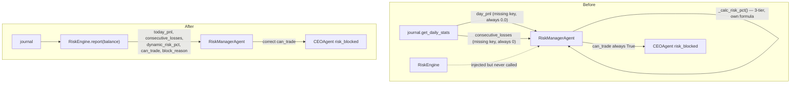
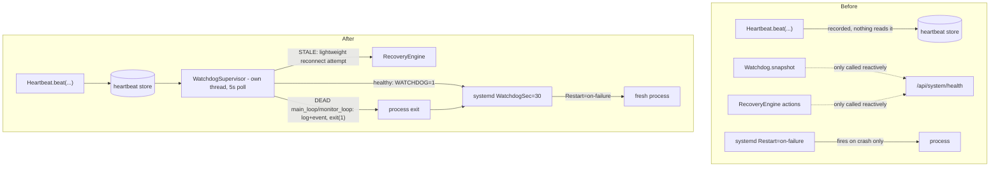

# Brain Bot V16 — Architecture & Dependency Graph

Living document. Updated after every structural fix landed as part of the
V16.5 pre-Phase-13 stabilization pass. Every entry below is grounded in
either `grep`/`ast`-based static analysis of the real source tree or an
actual `pytest` run — nothing here is estimated.

---

## 1. Package dependency graph (production code, tests excluded)

```mermaid
flowchart LR
    main --> agents & api & data & decision & execution & journal
    main --> risk & system_health & commander & intelligence & regime

    agents --> config & events & reasoning & telemetry & utils
    agents -. "risk_engine injected, not imported" .-> risk

    api --> commander & journal & intelligence & system_health & telemetry & graph & ml & research

    execution --> paper & config & utils
    decision  --> features & regime & config
    intelligence --> features & futures & regime & trend
    journal   --> database & analytics
    system_health --> events & utils
    utils     -. "deferred import inside retry.py to avoid a load-order cycle" .-> system_health
    system_health -->|"new: WatchdogSupervisor"| utils
```

`utils/systemd_notify.py` (new, Fix #2) is a dependency-free leaf — stdlib
`os`/`socket` only, no project imports. `system_health/watchdog.py`'s new
`WatchdogSupervisor` imports it lazily (inside `_run`/`_handle_dead`), same
deferred-import style already used for the `utils`↔`system_health` edge
below, for the same reason (keep import-time load order simple).

**No true circular imports found.** One potential package-level cycle
(`utils` ↔ `system_health`) exists only because `utils/retry.py` needs
`CircuitBreakerOpen` from `system_health/circuit_breaker.py`; it's already
resolved correctly with a deferred (in-function) import rather than a
module-level one. No change needed.

`RiskManagerAgent` deliberately does **not** `import risk` — it receives a
`RiskEngine` instance via constructor injection from `main.py`. This is the
correct pattern and is why static import-graph tools don't show a `risk`
dependency for `agents/` even though it uses `RiskEngine` at runtime.

---

## 2. Structural audit — 2026-07-15 pass

Scope: the 15 consolidation/cleanup objectives requested for the
pre-Phase-13 stabilization pass. Method: `grep`-based class inventory,
`vulture` (dead-code, 80% confidence), a custom `ast`-based import-graph
script, and manual verification of every automated finding before it's
listed here (the import-graph script had a real bug on `__init__.py`
relative-import resolution — its raw "orphan module" output was **not**
trusted as-is; every candidate was confirmed or refuted by grep/read).

| # | Objective | Finding | Evidence |
|---|---|---|---|
| 1–2 | Close P0 / P1 issues | 6 items open from the Phase 1 audit (`docs/V16_AUDIT_REPORT.md` §5) — being worked through incrementally. #1 below is closed this pass. | — |
| 3 | Remove duplicated services | Only **one** real duplication found: risk-pct/daily-loss logic (see #4). No duplicate Position Manager, Execution Pipeline, or WebSocket Manager exist to consolidate. | `grep` for `class .*(Manager\|Pipeline\|Engine\|Service)` — exactly one hit per name |
| 4 | Consolidate Risk Manager | **Confirmed & fixed this pass.** `agents/risk_manager.py` recomputed risk from journal fields (`day_pnl`, `consecutive_losses`) that don't exist on the real journal — see §3 below. | `journal/journal_v2.py:203-229` vs `agents/risk_manager.py` (pre-fix) |
| 5 | Consolidate Position Manager | Not found. Only `paper/paper_position.py` exists — a single position dataclass for the paper-trading engine, not a duplicated manager service. | `grep -rln "class.*Position"` |
| 6 | Consolidate Execution Pipeline | Not found. `execution/execution_factory.py` is a single-responsibility factory (`build_execution_engine()`) already correctly choosing between `PaperExecutionEngine`/`TradeManager` by mode — nothing to merge. `pipeline/brain_pipeline_v13.py` is unrelated (decision pipeline) and is itself dead code — see #9. | read `execution/execution_factory.py` in full |
| 7 | Consolidate WebSocket Manager | Not found. Exactly one `ConnectionManager` class exists (`api/app.py:100`), no backend duplicate. | `find -iname "*websocket*"` → no backend hits |
| 8 | Remove dead code | `vulture` @ 80% confidence found 6 items total, 4 of which are `exc_tb`/`tb` unused-by-design `__exit__`/context-manager parameters (not removable). 2 real, trivial: unused import in `api/app.py:65`, unused variable in `decision/causal_explainer.py:204`. Tracked for a follow-up cleanup pass — not bundled into this fix to keep the diff reviewable. Also removed `RiskManagerAgent._calc_risk_pct()`, dead as of this pass's fix. | `vulture . --min-confidence 80` |
| 9 | Remove unused modules | **One confirmed orphan:** `pipeline/brain_pipeline_v13.py` — zero references anywhere in the tree, including tests. `execution/strategy.py` (`SMC_OI_Regime_Strategy`) is referenced only from `tests/test_execution.py`, never from production code — flagged as **wired-but-unused**, not dead, pending confirmation of intent before removal. | manual grep verification of every import-graph "orphan" candidate |
| 10 | Remove obsolete APIs | Not found. 48 routes in `api/app.py`; the one "legacy" reference is an intentional fallback (serve Vite `dist/` if present, else legacy static `index.html`) — working backward-compat, not cruft. | `grep -i "deprecated\|obsolete\|legacy"` |
| 11 | Remove duplicated configuration | Not found. Single `config/settings.py` (105 lines); no hardcoded risk/config constants duplicated outside it. | `find *.yml/.env`, `grep` for constant literals outside `config/` |
| 12–13 | Fix circular imports / dependency graph | No problematic cycles. See §1. | `ast`-based cycle detection, manually verified |
| 14–15 | Single responsibility / production-ready | Addressed per-module as each item above is worked; not a one-shot check. | ongoing |

**Net effect:** most of the "consolidation" objectives don't apply to this
codebase as written — it's structurally cleaner than the brief assumed.
The real, evidence-backed backlog is small: the risk-manager fix (closed
this pass), the two P0 items from the Phase 1 audit (scheduler watchdog,
systemd `WatchdogSec=`), the P1 items (dashboard auth, Risk Engine V2 caps,
circuit breaker on order placement), and two low-risk cleanup items (§2,
row 9).

---

## 3. Fix #1 — Risk Manager consolidation (2026-07-15)

**Root cause.** `agents/risk_manager.py::RiskManagerAgent.analyse()` read
`journal.get_daily_stats().get("day_pnl", ...)` and
`.get("consecutive_losses", ...)`. `TradeJournalV2.get_daily_stats()`
(`journal/journal_v2.py:203`) returns a dict keyed `total_pnl` — never
`day_pnl` — and has no `consecutive_losses` key at all (that's the
separate `get_consecutive_losses()` method). Both `.get()` calls therefore
silently fell back to their defaults on every single call: `today_pnl`
was always `0.0`, `consec_loss` was always `0`, regardless of real trading
state. `RiskManagerAgent` also duplicated the risk-per-trade formula
(`_calc_risk_pct`) with a **3-tier** curve (MAX / avg(MAX,MIN) / MIN) that
disagreed with `RiskEngine.get_risk_pct()`'s **2-tier** curve and ignored
daily-loss utilization entirely — this half was already flagged in the
Phase 1 audit (finding #3); the key-mismatch half was not previously
documented and was found during this pass.

**Blast radius, verified by tracing the call graph:** real order execution
was never affected — `main.py:597` calls `RiskEngine.can_trade()` directly
and independently before every entry, and that path doesn't go through the
agent layer at all. What *was* silently broken: this agent's HALT /
ELEVATED / CAUTION classification, its `DAILY_LIMIT_HIT` /
`DAILY_LIMIT_NEAR` / `CONSECUTIVE_LOSS` event publishing, its `answer()`
Q&A (drawdown/streak questions always answered "0"), and
`ceo_agent.py`'s own risk veto (`risk_blocked`, `ceo_agent.py:151-153`) —
which reads this agent's `can_trade` and would never trip, even though the
real gate downstream in `main.py` still would.

**Fix.** `analyse()` now calls `self._risk_engine.report(balance)` — the
same `RiskEngine` instance `main.py` already constructs and checks
directly — instead of recomputing anything from the journal. Event
publishing, factor/summary narrative, and the `NEUTRAL`-signal fix
(existing, correct, documented in-file) are preserved as-is, just fed from
correct numbers. `risk_level` classification was also changed from two
independent `if/elif` blocks (where a later consecutive-loss check could
silently downgrade `risk_level` from `HALT` to `CAUTION` when both
conditions were true) to explicit priority logic. `_calc_risk_pct()` was
removed — dead code now that risk % comes from `RiskEngine`. A defensive
fallback (logged) handles the case of the agent being constructed without
a wired `RiskEngine`, which `main.py` never does but ad-hoc scripts/tests
might.

**Before / after (data flow for one `analyse()` call):**



**Files changed:**
- `agents/risk_manager.py` — `analyse()` rewritten, `_calc_risk_pct()` removed
- `tests/test_agents.py` — `TestRiskManagerAgent` tests rewired to mock the
  journal's real contract instead of the old wrong-key shape (those tests
  were validating the bug, not catching it); added a regression test and a
  no-engine-fallback test; `test_ceo_risk_veto` rewired to force the veto
  through a real `RiskEngine` instead of monkey-patching `._journal` with
  the old shape

**Test result:** `pytest tests/ -q` → **769 passed, 0 failed** (763
pre-existing/idempotency-suite + 2 new risk-manager regression tests +
existing suite; note `test_ceo_risk_veto` and 3 `TestRiskManagerAgent`
tests were rewritten, not just left passing).

**Compatibility:** `AgentReport.raw` keeps the exact same key names
(`can_trade`, `today_pnl`, `drawdown_pct`, `consec_loss`, `risk_pct`,
`risk_level`, `blocks`, `balance`) — `answer()` and any other consumer of
`.raw` needed no changes.

---

## 4. Fix #2 — WatchdogSupervisor + systemd integration (2026-07-16)

Closes audit P0 items 2 and 3, and the corresponding parts of the user's
P0-A / P0-D request.

**Root cause (already diagnosed in the Phase 1 audit, §5, finding #5, and
confirmed again here by reading every file involved):** `system_health/`
already had real, working pieces — `Watchdog` (classifies subsystems
ALIVE/STALE/DEAD from heartbeat age), `Heartbeat` (subsystems already
beaten: `main_loop`, `monitor_loop`, `mission_tracker`, `telemetry`,
`trade_manager`, and `dashboard_api` once at bootstrap), and
`RecoveryEngine` (`attempt_reconnect_data_provider`,
`attempt_reconciliation_recovery`, `cleanup_stale_state` are all real).
None of it was autonomous — every one of those was only ever invoked
reactively, from `api/app.py`'s `/api/system/health` and
`/api/system/reconciliation` routes. Nothing polled them in the
background, and nothing bridged them to systemd's own watchdog layer.
Separately: `main.py` runs all 5 scheduled jobs
(`run_trading_cycle`/`monitor_open_trades`/`run_position_reconciliation`/
`daily_report`/nightly retrain) on ONE thread via the `schedule` library —
a hang inside any one of them blocks every other job, including position
monitoring (audit finding #4).

**What mapping the user's P0-A worker list onto the real codebase found:**
"Scanner" and "Execution Queue" don't exist as separate components (single
trading-cycle architecture, no standalone scanner, no execution queue yet
— that's unbuilt Phase 16 work). The real, already-tracked subsystems are
`main_loop`, `monitor_loop`, `trade_manager`, `mission_tracker`,
`telemetry`, `dashboard_api`, and a `websocket` entry that's defined but
never fed — see below.

**Why "restart worker in place" isn't the design used here:** Python has
no safe way to force a genuinely stuck synchronous call to abandon
mid-execution — there's no thread-kill primitive that doesn't risk
corrupted state or leaked locks/connections. For a single-threaded
scheduler like this one, the production-safe pattern (and the one the
Phase 1 audit already prescribed) is: detect the hang, exit the whole
process cleanly, let systemd's `Restart=on-failure` bring up a fresh one.
That's what's implemented.

**Built:**
- `system_health/watchdog.py::WatchdogSupervisor` — new background thread
  (independent of the single-threaded scheduler, so it keeps polling even
  if that thread is completely stuck). Every 5s: reads `Watchdog.snapshot()`;
  for `main_loop`/`trade_manager` STALE (not yet DEAD), makes one lightweight
  `RecoveryEngine.attempt_reconnect_data_provider()` attempt (cheap,
  already rate-limited by RecoveryEngine's own 30s cooldown — this is the
  autonomous trigger P0-B's "reconnect backoff / API timeout recovery" was
  actually missing, since the REST retry/circuit-breaker itself already
  existed in `data/binance_provider.py`); if `main_loop` or `monitor_loop`
  is DEAD, logs critical, publishes a journalled+telemetried
  `WATCHDOG_FORCED_EXIT` event, and exits the process. Pets systemd's
  watchdog (`sd_notify WATCHDOG=1`) only when it did *not* just decide to
  exit — so systemd's own `WatchdogSec=` stays a true independent backstop.
  A 120s startup grace period prevents a cold boot (no heartbeats yet)
  from ever being misread as a hang; `main.py` also only starts the
  supervisor *after* the first synchronous job pass completes, as a second
  layer of the same protection.
  - **Deliberately excluded from the exit-trigger set:** `dashboard_api`
    (beaten exactly once, at bootstrap, never again — would show DEAD on
    every single run regardless of real health) and `websocket` (nothing
    in this codebase calls `Heartbeat.beat("websocket", ...)` — there is
    no exchange websocket; Binance access here is REST-only). Using either
    as a trigger today would force-restart a perfectly healthy process.
    Tracked as a small follow-up (add a periodic `dashboard_api` beat;
    decide whether to repurpose or remove the `websocket` entry) — not
    fixed in this pass to keep this diff reviewable.
- `utils/systemd_notify.py` — new, ~50-line, dependency-free `sd_notify()`
  client (raw `NOTIFY_SOCKET` unix-datagram protocol — no new pip
  dependency). `READY=1`, `WATCHDOG=1`, `STOPPING=1`, `STATUS=...`. Safe
  no-op when `NOTIFY_SOCKET` isn't set (dev machine, tests, paper mode).
- `main.py` — starts `WatchdogSupervisor` right before the main loop,
  calls `notify_ready()` once startup finishes, and `notify_stopping()` in
  the existing signal handler.
- `deployment/systemd/brain_bot.service` — `Type=simple` → `Type=notify`,
  added `WatchdogSec=30` (6x the supervisor's 5s poll interval, consistent
  with the `STALE_MUL=5` convention already used in `watchdog.py`).
  `Restart=on-failure`/`RestartSec=10` unchanged.

**Before / after:**



**Tests:** `tests/test_v15_production.py::TestWatchdogSupervisor` (9 tests
— pets-when-healthy, grace-period suppression, exit on
main_loop/monitor_loop DEAD, non-trigger subsystems never exit, recovery
attempt on STALE, empty-components safety, real thread start/stop) and
`::TestSystemdNotify` (4 tests, real unix-socket round-trip).

---

## 5. Fix #3 — Circuit breaker wired into order placement (2026-07-16)

Closes audit P1 item 6, and the corresponding part of the user's P0-B
request ("REST retry", "API timeout recovery", "exchange reconnect").

**Root cause:** `data/binance_provider.py` already wraps its trade/account
calls (`get_account_balance`, `get_position_info`) in
`get_breaker("binance_trade")`. `execution/trade_manager.py`'s actual
order-placement calls (`place_market_order`, `place_stop_loss`,
`place_take_profit` — all three already have `@retry_api_call`, itself
already supporting an optional `breaker=` parameter per its own
docstring) never passed one in. So the single highest-stakes API surface
in the whole system — actually submitting orders — was the one surface
*not* protected by the circuit breaker, meaning a degraded exchange could
be hammered with retries from the execution path even while the breaker
had already opened for every other caller.

**Fix:** `breaker=_TRADE_BREAKER` added to all three decorators, where
`_TRADE_BREAKER = get_breaker("binance_trade", ...)` — the *same* named
singleton `binance_provider.py` already uses (`get_breaker()` is a
thread-safe registry keyed by name), not a new breaker. Order placement
and trade-account reads share Binance's trade API surface/rate-limit
family, so pooling their failure tracking means every caller on that
surface fast-fails together once it's unhealthy, rather than each
hammering it independently.

**Tests:** `tests/test_execution.py::TestTradeManagerCircuitBreaker` (4
tests) — confirms it's the same shared instance as `binance_provider.py`;
an OPEN breaker makes `place_market_order` raise `CircuitBreakerOpen`
*without ever calling the exchange client*; a CLOSED breaker doesn't
change existing behavior; and — the one that actually matters most here —
`place_stop_loss`'s internal tier-1→tier-2 fallback (e.g. a Binance -4120
"unsupported" response, handled internally) is correctly *not* recorded
as a breaker failure, since it's normal multi-tier negotiation, not a
real API failure.

---

## 6. P0-C (Position Reconciliation) — assessed, not rebuilt

`system_health/reconciliation.py::ReconciliationEngine`, wired into
`main.py`'s `run_position_reconciliation` job (runs every 60s), already:
compares exchange vs. bot vs. journal position state; detects
`SIDE_MISMATCH`/`QUANTITY_MISMATCH`/`PRESENCE_MISMATCH`/duplicate-journal-
row patterns; publishes a journalled+telemetried `RECONCILIATION_MISMATCH`
event via the event bus (event-bus `publish()` persists to the journal
whenever `persist=True`, which is the default); de-dupes identical
repeated mismatches; and already calls
`RecoveryEngine.attempt_reconciliation_recovery()` automatically. This is
essentially what P0-C asked for, already running.

**Real gap found:** auto-repair is only implemented for exactly one
pattern — a "ghost" journal row (exchange and bot both say flat, journal
says open). Every other mismatch type, *including the exchange having a
real open position the bot doesn't know about* (arguably the most
dangerous direction — live, un-managed, no-SL/TP capital exposure),
explicitly returns `"no_safe_auto_action"` and only logs a warning. That's
plausibly the right conservative default — auto-closing a real exchange
position without a human in the loop is its own risk — but it should
escalate louder than a warning-level log entry today. **Not changed in
this pass** (separate, smaller, reviewable fix) — flagged here as the
next concrete follow-up.

---

## 7. Test-infrastructure finding: two files silently excluded from every
regression run (2026-07-16)

Found while re-verifying test coverage for this pass. `pytest.ini` sets
`addopts = -m "unit"`, meaning any test without the `unit` marker is
silently deselected from the default `pytest tests/` run used as this
project's regression bar. Every test file has `pytestmark =
pytest.mark.unit` (or per-class `@pytest.mark.unit`) — except
`tests/test_v15_production.py` (61 tests, despite its own docstring
calling itself the "Brain Bot V15 Production Regression Suite") and
`tests/test_execution_factory.py` (37 tests). Both are pure mock/in-memory
unit tests with no live network calls — they were never *wrong*, they
simply never ran. **This means every "N passed, 0 failed" figure reported
earlier in this engagement (Fix #1's 769, and the Phase 1 audit's 767)
did not include these 98 tests.**

**Fix:** added `pytestmark = pytest.mark.unit` to both files. Re-running
the full suite afterward: **871 passed, 0 failed** — all 98
previously-unrun tests passed on their own merit; nothing was silently
broken. `tests/test_phase4c.py` was checked too and is fine (89 tests, all
individually `@pytest.mark.unit`-decorated per class, already running).

---

## 9. Integration merge — Fix #1 + Fix #2 + P1-A + P1-B1 (2026-07-16)

P1-A (dashboard auth) and P1-B1 (dynamic risk) were built in separate
sessions, both branching from the original `brain_bot_v16_phase1_patch.zip`
— neither had Fix #1 or Fix #2 applied (confirmed via their diff headers:
both diffed against the pristine 2026-07-07 tree). Both sessions'
READMEs were explicit and correct about this base-state gap.

Checked every file touched by more than one of the four patches for
actual line-region overlap before merging any of them:

| File | Patches touching it | Overlap? |
|---|---|---|
| `config/settings.py` | P1-A (lines ~74-90), P1-B1 (lines ~31-35) | No — different insertion points |
| `execution/trade_manager.py` | Fix #2 (imports + 3 decorator lines), P1-B1 (`calculate_position_size`, `execute_trade` bodies) | No — different methods entirely |
| `main.py` | Fix #2 (imports, signal handler, startup/shutdown tail), P1-B1 (inside `run_trading_cycle`, lines ~594-690) | No — different regions |
| `tests/test_execution.py` | Fix #2 (new `TestTradeManagerCircuitBreaker` class), P1-B1 (one mock-stub fix inside `TestRiskEngine`) | No — different classes |

All four merged cleanly with no manual conflict resolution beyond
locating the equivalent code in the already-patched files (line numbers
had shifted from each patch's own diff, so patches were re-applied by
content match, not raw `patch`/`git apply`). `agents/risk_manager.py`
had no conflict by design — P1-B1's own README explicitly chose not to
touch it, correctly anticipating Fix #1 would replace it wholesale.

**Verified:** `pytest tests/ -q` → **907 passed, 0 failed** — exactly
871 (Fix #1 + Fix #2 baseline) + 18 (P1-A's `test_api_auth.py`) + 18
(P1-B1's `test_p1b1_dynamic_risk.py`), confirming nothing was lost or
double-counted in the merge. `py_compile` clean on every touched file;
a live import of every touched module together (`config.settings`,
`risk.risk_engine`, `execution.trade_manager`, `execution.execution_factory`,
`system_health.watchdog`, `utils.systemd_notify`, `api.auth`) succeeds.

---

## 10. P1-A — Dashboard Authentication (2026-07-16, merged from a
separate session)

`api/app.py` had no authentication at all — CORS wide open, all 28
routes reachable by anyone who could reach the host. Of the endpoints
named in the original brief, only `/api/config` and `/api/command`
actually exist (`/api/trader`, `/api/recovery`, `/api/risk`,
`/api/profile` don't exist — nothing was added for routes that aren't
real, per this project's own "never invent APIs" rule). `/ws/command`
was found to be bidirectional (executes commands, not just broadcasts)
and needs the same protection as `POST /api/command`.

**Built:** `api/auth.py` (new) — VIEWER < OPERATOR < ADMIN roles,
API-key (`X-API-Key`, `hmac.compare_digest`) + bearer-JWT
(`POST /api/auth/token`, HS256, default 60min) validation, token
rotation, a WS auth helper called from all 7 WebSocket handlers (HTTP
middleware doesn't run for the websocket ASGI scope, so each handler
guards itself). `config/settings.py` gained `API_AUTH_ENABLED` (default
`False`), `API_KEYS`, `JWT_SECRET`, `JWT_EXPIRY_MINUTES`.

**Explicit design call, flagged for sign-off:** auth is off by default —
turning it on by default would have broken ~30 existing `TestClient(app)`
call sites with no auth headers across 10 test files, and been a real
backward-compat break for the currently-running deployment. Whenever
it's off, `api/app.py` logs a startup `WARNING` naming exactly what's
exposed, so the gap is loud, not silent. **You need to set
`API_AUTH_ENABLED=true` + configure `API_KEYS`/`JWT_SECRET` before this
dashboard is reachable from anywhere but localhost** — nothing in this
patch flips that on for you.

**Tests:** `tests/test_api_auth.py`, 18 tests, all passing post-merge.

---

## 11. P1-B1 — Dynamic Risk Engine, single-symbol (2026-07-16, merged
from a separate session)

`RiskEngine.get_risk_pct()` was a 2-tier curve keyed only on losing-streak
and today's drawdown — no market-volatility input at all.
`config.LEVERAGE` was a single static value.

**Two real bugs found and fixed as part of wiring this through** (not
scope creep — leaving either would have made the new feature actively
wrong):
- `TradeManager.execute_trade()` never passed an override to
  `self.set_leverage()` even though `set_leverage(leverage=None)` already
  accepted one — the override path was dead code.
- `TradeManager.calculate_position_size()` computed its margin cap
  against `settings.LEVERAGE` directly rather than a parameter — so
  wiring dynamic leverage through `execute_trade()` alone, without also
  fixing this, would have left the margin cap computed against the
  *wrong* (static) leverage while the exchange runs at the *actual*
  (dynamic) one.

**Built:** `RiskEngine.get_risk_pct(atr_pct=...)` / new `get_leverage(atr_pct=...)`
/ new `_volatility_factor()` — `factor = clamp(threshold / atr_pct,
VOLATILITY_RISK_FLOOR, 1.0)` when `atr_pct > threshold`, else `1.0`;
continuous, not a binary cutoff, floored so risk-per-trade/leverage never
collapse toward an unfillable qty. Reuses `RegimeEngine`'s
`atr_normalized` (already computed every cycle) rather than computing ATR
a second time — `main.py` passes `regime.atr_normalized` straight through
via a defensive `getattr` (falls back to pre-P1-B1 behavior if `regime`
is ever `None`). New settings `VOLATILITY_RISK_THRESHOLD` (default
`0.015`, matches `RegimeEngine.ATR_VOLATILE_THRESHOLD` by default, kept
independently tunable) and `VOLATILITY_RISK_FLOOR` (default `0.5`).

**Deliberately not done:** paper mode doesn't simulate dynamic leverage
(`PaperAccount` fixes leverage at construction — real per-trade margin
simulation would be a separate task, `_PaperAdapter.execute_trade()`
accepts `leverage` for interface parity but drops it, documented inline).
`daily_report()`'s `report(balance)` call still runs without `atr_pct`
since `regime` isn't in scope in that nightly-summary job — falls back to
pre-P1-B1 values, correct for a summary, not a bug. `agents/risk_manager.py`
intentionally untouched (see §9).

**Tests:** `tests/test_p1b1_dynamic_risk.py`, 18 tests, all passing
post-merge. Stub fixes (one line each, commented inline) added to 4
existing test files whose `RiskEngine`/`settings` mocks had no coverage
for the two new call sites.

---

## 12. Next up

- Escalate the untracked-exchange-position reconciliation case (§6) to a
  louder alert channel.
- `dashboard_api` / `websocket` heartbeat gaps (§4).
- Two low-risk cleanup items from §2 row 9.
- Portfolio Manager, Scanner, Correlation Risk, Exposure Risk, Capital
  Allocation — all explicitly deferred, see §13.

---

## 13. Multi Symbol Foundation — architecture only (2026-07-17)

**Scope note:** this section is architecture, not features. Portfolio
Manager, Scanner, Ranking Engine, Capital Allocation, Correlation Matrix,
and Exposure Risk are explicitly NOT built here — see "Deliberately not
done" below. The goal was narrower: stop `TradeManager` from being the
reason multi-symbol support requires touching money-moving code later.

### Root cause

`TradeManager.__init__` read `settings.SYMBOL` directly rather than
accepting it as a parameter, so `self.symbol` was fixed to whatever the
global settings singleton held for the process's entire lifetime. Every
order-placing method (`place_market_order`, `place_stop_loss`,
`place_take_profit`, `cancel_all_orders`, `set_leverage`,
`set_margin_type`, `close_position`) reads `self.symbol` — none of them
took a symbol argument. `execution_factory.py` constructed exactly one
`TradeManager` per process. There was no path to a second symbol without
either (a) mutating `settings.SYMBOL` at runtime — dangerous, since
`RiskEngine`, journal, and dashboard code also read it and would silently
start reporting/gating the wrong symbol — or (b) rewriting
`TradeManager`'s internals.

### What's built

```
BrainBot
   |
ExecutionCoordinator        execution/execution_coordinator.py (new)
   |                        Routing + lifecycle ONLY. No strategy logic.
   +-- TradeManager(BTCUSDT)
   +-- TradeManager(ETHUSDT)
   +-- TradeManager(SOLUSDT)
   ...
```

- **`TradeManager.__init__(data_provider, symbol=None)`** — one new
  optional parameter, defaults to `settings.SYMBOL`. This is the entire
  change to `trade_manager.py` for this phase; every other method in that
  file already used `self.symbol` correctly and needed no change. Existing
  call sites (`TradeManager(data_provider)`, no second arg) are
  byte-for-byte unaffected.
- **`ExecutionCoordinator`** (new file) — owns a `{symbol: TradeManager}`
  cache behind an `RLock` (main.py's trading-loop thread and api/app.py's
  dashboard thread can both reach a coordinator). `get_manager(symbol)` is
  an O(1) dict lookup on the cache-hit path; construction happens at most
  once per symbol (singleton-per-symbol, verified by test — no duplicate
  managers). `execute_trade(...)` mirrors `TradeManager.execute_trade`'s
  exact signature plus one trailing optional `symbol=` kwarg, so with a
  single configured symbol it's a pure passthrough. `initialize()` pre-warms
  leverage/margin for every configured symbol at boot (best-effort, logs
  per-symbol success). `health_check()` reports which symbols have a
  manager created yet, with no network calls. `shutdown()` releases the
  manager cache — deliberately does NOT cancel orders or close positions
  (that's a trading decision, out of scope for a routing class). A guarded
  `__getattr__` delegates anything else to the default symbol's
  `TradeManager` as a backward-compat safety net (grep-verified: nothing
  in the current codebase actually needs this today — main.py's only
  touchpoint on this object is `.execute_trade()`).
- **`execution_factory.py`** — testnet/live now construct an
  `ExecutionCoordinator(data_provider, symbols=settings.symbol_list)`
  instead of a bare `TradeManager`. Paper mode untouched.
  `_PaperAdapter.execute_trade()` gained an accepted-but-ignored `symbol=`
  kwarg for interface parity (same treatment P1-B1 already gave
  `leverage=` — see §11), so a future caller can pass `symbol=` uniformly
  regardless of execution mode without a `TypeError`.
- **`config/settings.py`** — new optional `SYMBOLS: list | None` field
  (unset by default) plus a `symbol_list` property that returns `SYMBOLS`
  if set, else `[SYMBOL]`. This property is the ONLY place that fallback
  rule is applied — `ExecutionCoordinator` and `execution_factory` read
  `settings.symbol_list`, never `SYMBOL`/`SYMBOLS` directly, so the
  single-source-of-truth rule from §3 (risk consolidation) is followed
  here too.
- **`main.py`** — exactly one addition: a guarded, best-effort
  `trade_manager.initialize()` call right after
  `build_execution_engine()`, wrapped in `hasattr(...)` + `try/except` so
  paper mode (no `initialize()` method) and any failure are both
  non-fatal. The trading loop itself, and every other line that touches
  `trade_manager`, is unchanged — confirmed by grep that
  `tm.execute_trade(...)` (main.py, inside the scheduled trading cycle) is
  the only call site in the entire codebase that touches this object
  besides the factory and the coordinator's own passthrough.

### Why `data_provider` was NOT touched

`BinanceDataProvider` is also coupled to `settings.SYMBOL` (`data/binance_provider.py`),
but `TradeManager` only ever reads `data_provider.client` — the shared,
symbol-agnostic authenticated `UMFutures` HTTP client — never any of
`data_provider`'s symbol-specific market-data methods. That means every
`TradeManager` an `ExecutionCoordinator` creates can safely share the
SAME `data_provider` instance today. Making market-data fetching itself
multi-symbol (parallel OHLCV/WS streams per symbol) is a real, separate
piece of work — that's Scanner/multi-coin-data territory.

### Why the circuit breaker needed no change

`_TRADE_BREAKER = get_breaker("binance_trade", ...)` in `trade_manager.py`
(§5) is a module-level singleton, shared by every `TradeManager` instance
regardless of symbol. That's correct as-is: all symbols hit the same
Binance account / trade-endpoint rate-limit family, so pooling failure
tracking across symbols is the right behavior, not a bug — if Binance's
trade endpoints go unhealthy, every symbol should fast-fail together
rather than each independently hammering a failing endpoint.

### Deliberately not done

- **No Portfolio Manager, Scanner, Ranking Engine, Capital Allocation,
  Correlation Matrix, or Exposure Risk.** `RiskEngine` (§3) still
  evaluates one account-level daily-loss/consecutive-loss gate — it has
  no concept of per-symbol or aggregate cross-symbol exposure yet.
  Running multiple symbols today means `RiskEngine`'s gate is shared
  across all of them without knowing that; that's the first thing
  Portfolio Manager needs to fix, and is called out here so it isn't
  forgotten, not because it was fixed.
- **No multi-symbol paper trading.** `PaperAccount` simulates one balance/
  leverage for the whole session; `_PaperAdapter.execute_trade()` accepts
  `symbol=` but drops it, same pattern as the existing `leverage=` handling.
- **No dashboard/UI changes.** `/api/system/health` etc. still report the
  single legacy `trade_manager` heartbeat name; wiring per-symbol health
  from `ExecutionCoordinator.health_check()` into the dashboard is future
  work.
- **`main.py`'s trading loop is unchanged.** It still decides, sizes, and
  executes for exactly one symbol per cycle — multi-symbol *decisioning*
  (which symbol, how much capital each) is Portfolio Manager's job, not
  this phase's.

### Tests

`tests/test_execution_coordinator.py`, 22 tests, all passing (mocked
exchange client, no network): explicit-symbol `TradeManager` construction
and independence between instances, `settings.symbol_list` fallback rules,
manager creation/caching/no-duplicates, cross-symbol routing (including
verifying only the requested symbol's manager gets created), backward
compatibility (single-symbol `execute_trade()` call produces identical
exchange calls to a bare `TradeManager`), health check, `initialize()`,
and shutdown (including idempotency and post-shutdown blocking).

Full suite after this change: **929 passed, 0 failed** (907 baseline + 22
new).

---

## 14. Next up (superseded by §16 below)

- Decide on P1-C (multi-symbol Portfolio Manager) vs. remaining
  single-symbol P1 items — not resolved here, still an open decision.
- Wire per-symbol `ExecutionCoordinator.health_check()` into the
  dashboard once a Portfolio Manager or multi-symbol decisioning layer
  actually exists to make use of it — no UI changes were made this phase.
- Everything listed under §13 "Deliberately not done."
- Carried over from the old §12: escalate the untracked-exchange-position
  reconciliation case (§6), `dashboard_api`/`websocket` heartbeat gaps
  (§4), two low-risk cleanup items from §2 row 9.

---

## 15. Opportunity Ranking Engine — V16 Phase 2 Part 2 (2026-07-17)

Builds on Market Scanner (Phase 2 Part 1, `scanner/market_scanner.py` —
see that file's own module docstring for its two-tier fetch design; it
predates this architecture doc entry and wasn't backfilled here).

```
MarketScanner.get_snapshots()   READ ONLY — no Binance calls made by this phase
       |
OpportunityRanker  (ranking/opportunity_ranker.py)
       |  score_breakdown.py    — 11-factor scoring per symbol
       |  confidence_fusion.py  — weighted composite + coverage
       v
Top-N RankedOpportunity list  (ranking_history table)
```

### Architectural conflict found and resolved (flagged before building,
### per this phase's own STOP-and-explain rule)

The brief asks for an 11-factor score including Trend, Market Structure,
AI Confidence, and Historical Performance, while requiring the Ranker to
"never request Binance data directly, reuse scanner cache only."
`SymbolSnapshot` (scanner cache) carries: price, price_change_pct_24h,
quote_volume_24h, funding_rate, spread_pct, open_interest, atr_pct — eight
of eleven factors are real, honestly-computed proxies from those fields
(`ranking/score_breakdown.py` documents exactly which field backs which
factor, and flags where a name is a proxy for something deeper — e.g.
"trend" is 24h move magnitude, not a structural swing-high/low read).

Three factors are not derivable from the scanner cache at all:
Market Structure needs `SMCEngine` against an OHLCV series; AI Confidence
needs `MarketContextBuilder`/`ConfidenceEngine`, which need their own
multi-timeframe kline fetch; Historical Performance needs per-symbol
trade outcomes that don't exist yet (this bot has only ever traded one
configured symbol). Computing the first two for real across all ~300
scanned symbols would mean re-introducing the exact per-symbol Binance
call volume the scanner's two-tier design exists to avoid.

**Resolution (chosen over faking a number):** these three factors return
an explicit `UNAVAILABLE` `FactorScore` (`ScoreStatus.UNAVAILABLE`) rather
than a plausible-looking placeholder, and `confidence_fusion.py` EXCLUDES
unavailable factors from the weighted composite (redistributing their
weight across computed factors) rather than diluting every score toward
50. A `coverage` value (0-1) travels alongside every composite score so a
caller can tell "genuinely strong signal" apart from "strong signal, but
only 65% of the intended factors were real data." This was surfaced to
the user before building, per the brief's own "if architectural conflicts
are discovered, STOP, explain, propose alternatives, wait for
confirmation" rule — full reasoning in the response accompanying this
doc update.

**Documented follow-up, not built here:** run the real SMC/Confidence
pipeline for only the Ranker's own current top-K candidates (cheap — tens
of symbols, not hundreds) as a second-pass refinement. That reintroduces
a small, bounded Binance call volume and needs its own review before
building.

### What's built

- `ranking/ranking_models.py` — `FactorScore`, `ScoreBreakdown`,
  `RankedOpportunity`, `ScoreStatus` (COMPUTED / UNAVAILABLE).
- `ranking/score_breakdown.py` — one pure function per factor, plus
  `UniverseStats` (percentile lookups built once per cycle — O(n log n) —
  so per-symbol scoring stays O(log n), not O(n), for the volume/spread/
  OI-relative factors).
- `ranking/confidence_fusion.py` — weighted composite + coverage, per the
  exclusion policy above.
- `ranking/opportunity_ranker.py` — `OpportunityRanker(scanner, top_n)`:
  `.rank()` reads `scanner.get_snapshots()`, scores, fuses, sorts, keeps
  top N, persists (in its own try/except on top of `ranking_history`'s
  own — a persistence bug can never block returning the freshly computed
  ranking, same philosophy as `MarketScanner.run_cycle()`), returns.
  `.get_latest()` / `.status()` for cheap reads without recomputing.
- `ranking/ranking_history.py` — persistence, following
  `MarketScanner._persist`/`_prune_old_snapshots`'s exact pattern (same
  `ManagedConn` usage, same one-row-per-cycle JSON-blob shape, same
  retention-based pruning) — no new persistence layer introduced.
- `database/schema_v13.sql` — new `ranking_history` table, same
  one-row-per-cycle convention as `scanner_snapshots`, plus
  `avg_coverage` so a low-data-quality ranking cycle is visible without
  parsing the JSON blob.
- `config/settings.py` — `RANKER_TOP_N` (default 20),
  `RANKER_FACTOR_WEIGHTS` (dict, sums to 100 by convention — placeholder
  defaults, meant to be tuned), `RANKER_HISTORY_RETENTION_HOURS`.

### Performance (measured, not estimated)

300 synthetic symbols (40 with full detail-pass data, matching
`SCANNER_DETAIL_TOP_N` default), full `rank()` cycle including SQLite
`:memory:` persistence, 10 runs after warmup, this sandbox: **~10ms
average, ~11ms max** — well under the brief's 200ms/300-symbols target.
Caveat: this is sandboxed hardware with an in-memory DB and mocked scanner
data, not a production measurement under real load — reported honestly as
a sandbox benchmark, not a production SLA.

### Deliberately not done (out of scope for this slice)

Portfolio Manager, Allocation Engine, Correlation Engine, Opportunity
Lifecycle persistence, REST API, WebSocket, Dashboard pages — none of
these were touched. Portfolio Manager explicitly depends on the Ranker's
output ("Portfolio Manager consumes only Top Opportunities from
Opportunity Ranker" per the brief), so this was the correct dependency-
root slice to build first; the rest needs its own sequenced passes — see
§16.

### Tests

`tests/test_opportunity_ranker.py`, 37 tests, all passing: every factor
function (computed and UNAVAILABLE paths), `UniverseStats` percentile
edge cases (empty/single-symbol universe), fusion (full coverage, partial
coverage + exclusion, all-unavailable fallback, explanation content),
`OpportunityRanker` (empty cache, ranking order, top-N limiting, staleness
tracking, persistence, persistence-failure resilience), and
`ranking_history` (save/roundtrip, newest-first ordering, coverage
computation). Mirrors `tests/test_market_scanner.py`'s `:memory:`
database-isolation pattern exactly.

Full suite after this change: **1001 passed, 0 failed** (964 baseline,
independently re-verified before this work started, + 37 new).

---

## 17. Bundle Manager — tools/ (2026-07-20)

New `tools/` package: `git_utils.py`, `bundle_utils.py`, `history.py`,
`github_actions.py`, `sync.py`, `ui.py`, `bundle_manager.py` (CLI entry
point). Automates the workflow this repo had been doing by hand up to
this point — a human copying patch-bundle files in and applying them —
without changing anything about how bundles themselves get produced.

### What it does
`python -m tools.bundle_manager import` scans `update/incoming/` for
`*.bundle`/`*.bundle.txt` files and, per bundle: verifies it
(`git bundle verify`), extracts exactly one feature branch + head SHA
(`git bundle list-heads` — fails closed, not guessed, if a bundle has
zero or more than one `refs/heads/*` ref), skips it if that SHA is
already in `bundle_history.json` (duplicate-import guard), fetches +
checks out + pushes the branch, then files the bundle into
`update/applied/` or `update/failed/`. `sync` fast-forwards the local
base branch after a merge (never merges anything itself — see
`tools/sync.py`'s docstring). `history` shows what's been imported.

### Design decisions
- **Dry-run preview + confirmation by default.** Every `import` run does
  a full verify/extract/dedupe pass with zero repository mutation first,
  shows the results, and asks before doing anything real — `--yes` skips
  this for CI. Never force-pushes/force-fetches unless `--force` is
  passed explicitly (uses `--force-with-lease`, not a bare `--force`).
- **One module owns all git subprocess calls** (`git_utils.py`) — list-
  form args only, no `shell=True` anywhere in the package, `git`
  resolved via `shutil.which` rather than a fixed path (Windows/Linux/
  Termux compatibility). Every other module goes through it rather than
  shelling out itself.
- **`bundle_history.json` is tracked in git**, not gitignored — it's
  shared history (a fresh clone needs to know what's already been
  imported), not local cache. Writes are atomic (temp file + `os.replace`)
  so a crash mid-write can't corrupt it.
- **A prior `failed` record doesn't block retrying** the same SHA — only
  a successful `applied` one does. A transient push failure shouldn't
  permanently lock out a bundle once whatever broke it is fixed.
- **A real bug caught during manual end-to-end testing** (not by unit
  tests — this only shows up against a real repo): git refuses to fetch
  into whatever branch is currently checked out. `import_bundle()`
  always checks out `base_branch` first for this reason; there's a
  regression test (`test_full_success_path_checks_out_base_branch_first`)
  asserting the exact call order.

### Cross-platform status
Designed for Windows/Linux/Termux (stdlib `argparse`/`pathlib`/
`subprocess` only, no `shell=True`, no OS-specific path handling) and
**verified end-to-end against real (throwaway) git repositories on
Linux** — a bare "origin," a working clone, and a separate authoring
clone, covering the full import→push→duplicate-skip→sync path plus a
genuinely corrupt bundle routing to `update/failed/`. **Not been run on
Windows or Termux** — no such environment was available to test
against; flagging the distinction between "designed for" and "verified
on" rather than claiming both.

### Tests
98 new tests across 6 files (`test_bundle_manager_{git_utils,bundle_utils,
history,github_actions,sync,cli}.py`), all mocking `subprocess`/git calls
— zero real git processes spawned, matching this project's "mock
everything, no network" convention. `history.py`'s tests use real
`tmp_path` file I/O (no network involved, nothing to mock).
**Verified: 1001 → 1099 passed, 0 failed.** `ruff check` clean.

### Deliberately not built
- No `.github/workflows/*.yml` — `github_actions.py` is named for the
  remote-touching *actions* (fetch/push), not GitHub's CI product; see
  its module docstring for this naming decision. Wiring this tool into
  CI is a reasonable follow-up, not built here (a real workflow needs
  its own secrets/permissions design this tool shouldn't assume).
- No REST/WebSocket surface for this tool — it's a local CLI, out of
  `docs/API.md`'s scope (REST/WS endpoints only).

---

## 18. Next up

- CI wiring for the Bundle Manager, if wanted (see above).
- Windows/Termux empirical verification — designed for both, only
  actually run on Linux so far.
- **Confirm the resolution in §15** before Portfolio Manager gets built
  on top of it — specifically whether excluding UNAVAILABLE factors from
  the composite (vs. some other treatment) and the proxy definitions for
  Trend/Momentum/Liquidity/Risk are acceptable as the interim signal.
- **Portfolio Manager** (`portfolio/`) — consumes `OpportunityRanker`'s
  top-N output; needs its own design pass for max concurrent positions,
  capital allocation, risk budget, exposure control, cooldown, position
  priority/replacement. Not started.
- **Correlation Engine** — needs a decision on data source (price-history
  correlation needs a return series per symbol pair; scanner cache is
  single-point, same category of gap as §15's conflict). Not started.
- **Capital Allocation Engine** — depends on Portfolio Manager's risk
  budget model existing first. Not started.
- **REST API / WebSocket / Dashboard pages** — deferred until there's a
  Portfolio Manager to expose; building API surface for a ranking-only
  system risks needing breaking changes once Portfolio Manager lands.
- Everything carried over from the old §14: P1-C decision, per-symbol
  health-check dashboard wiring, §13's "Deliberately not done" list,
  reconciliation alert escalation (§6), `dashboard_api`/`websocket`
  heartbeat gaps (§4).

