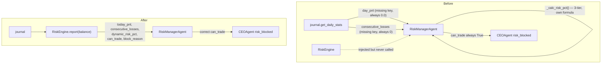
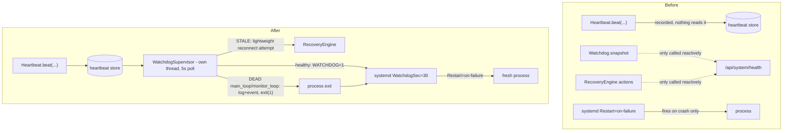

# Brain Bot V16 — Architecture & Dependency Graph

Living document. Updated after every structural fix landed as part of the
V16.5 pre-Phase-13 stabilization pass. Every entry below is grounded in
either `grep`/`ast`-based static analysis of the real source tree or an
actual `pytest` run — nothing here is estimated.

---

## 1. Package dependency graph (production code, tests excluded)

```mermaid
flowchart LR
    main --> agents & api & data & decision & execution & journal
    main --> risk & system_health & commander & intelligence & regime

    agents --> config & events & reasoning & telemetry & utils
    agents -. "risk_engine injected, not imported" .-> risk

    api --> commander & journal & intelligence & system_health & telemetry & graph & ml & research

    execution --> paper & config & utils
    decision  --> features & regime & config
    intelligence --> features & futures & regime & trend
    journal   --> database & analytics
    system_health --> events & utils
    utils     -. "deferred import inside retry.py to avoid a load-order cycle" .-> system_health
    system_health -->|"new: WatchdogSupervisor"| utils
```

`utils/systemd_notify.py` (new, Fix #2) is a dependency-free leaf — stdlib
`os`/`socket` only, no project imports. `system_health/watchdog.py`'s new
`WatchdogSupervisor` imports it lazily (inside `_run`/`_handle_dead`), same
deferred-import style already used for the `utils`↔`system_health` edge
below, for the same reason (keep import-time load order simple).

**No true circular imports found.** One potential package-level cycle
(`utils` ↔ `system_health`) exists only because `utils/retry.py` needs
`CircuitBreakerOpen` from `system_health/circuit_breaker.py`; it's already
resolved correctly with a deferred (in-function) import rather than a
module-level one. No change needed.

`RiskManagerAgent` deliberately does **not** `import risk` — it receives a
`RiskEngine` instance via constructor injection from `main.py`. This is the
correct pattern and is why static import-graph tools don't show a `risk`
dependency for `agents/` even though it uses `RiskEngine` at runtime.

---

## 2. Structural audit — 2026-07-15 pass

Scope: the 15 consolidation/cleanup objectives requested for the
pre-Phase-13 stabilization pass. Method: `grep`-based class inventory,
`vulture` (dead-code, 80% confidence), a custom `ast`-based import-graph
script, and manual verification of every automated finding before it's
listed here (the import-graph script had a real bug on `__init__.py`
relative-import resolution — its raw "orphan module" output was **not**
trusted as-is; every candidate was confirmed or refuted by grep/read).

| # | Objective | Finding | Evidence |
|---|---|---|---|
| 1–2 | Close P0 / P1 issues | 6 items open from the Phase 1 audit (`docs/V16_AUDIT_REPORT.md` §5) — being worked through incrementally. #1 below is closed this pass. | — |
| 3 | Remove duplicated services | Only **one** real duplication found: risk-pct/daily-loss logic (see #4). No duplicate Position Manager, Execution Pipeline, or WebSocket Manager exist to consolidate. | `grep` for `class .*(Manager\|Pipeline\|Engine\|Service)` — exactly one hit per name |
| 4 | Consolidate Risk Manager | **Confirmed & fixed this pass.** `agents/risk_manager.py` recomputed risk from journal fields (`day_pnl`, `consecutive_losses`) that don't exist on the real journal — see §3 below. | `journal/journal_v2.py:203-229` vs `agents/risk_manager.py` (pre-fix) |
| 5 | Consolidate Position Manager | Not found. Only `paper/paper_position.py` exists — a single position dataclass for the paper-trading engine, not a duplicated manager service. | `grep -rln "class.*Position"` |
| 6 | Consolidate Execution Pipeline | Not found. `execution/execution_factory.py` is a single-responsibility factory (`build_execution_engine()`) already correctly choosing between `PaperExecutionEngine`/`TradeManager` by mode — nothing to merge. `pipeline/brain_pipeline_v13.py` is unrelated (decision pipeline) and is itself dead code — see #9. | read `execution/execution_factory.py` in full |
| 7 | Consolidate WebSocket Manager | Not found. Exactly one `ConnectionManager` class exists (`api/app.py:100`), no backend duplicate. | `find -iname "*websocket*"` → no backend hits |
| 8 | Remove dead code | `vulture` @ 80% confidence found 6 items total, 4 of which are `exc_tb`/`tb` unused-by-design `__exit__`/context-manager parameters (not removable). 2 real, trivial: unused import in `api/app.py:65`, unused variable in `decision/causal_explainer.py:204`. Tracked for a follow-up cleanup pass — not bundled into this fix to keep the diff reviewable. Also removed `RiskManagerAgent._calc_risk_pct()`, dead as of this pass's fix. | `vulture . --min-confidence 80` |
| 9 | Remove unused modules | **One confirmed orphan:** `pipeline/brain_pipeline_v13.py` — zero references anywhere in the tree, including tests. `execution/strategy.py` (`SMC_OI_Regime_Strategy`) is referenced only from `tests/test_execution.py`, never from production code — flagged as **wired-but-unused**, not dead, pending confirmation of intent before removal. | manual grep verification of every import-graph "orphan" candidate |
| 10 | Remove obsolete APIs | Not found. 48 routes in `api/app.py`; the one "legacy" reference is an intentional fallback (serve Vite `dist/` if present, else legacy static `index.html`) — working backward-compat, not cruft. | `grep -i "deprecated\|obsolete\|legacy"` |
| 11 | Remove duplicated configuration | Not found. Single `config/settings.py` (105 lines); no hardcoded risk/config constants duplicated outside it. | `find *.yml/.env`, `grep` for constant literals outside `config/` |
| 12–13 | Fix circular imports / dependency graph | No problematic cycles. See §1. | `ast`-based cycle detection, manually verified |
| 14–15 | Single responsibility / production-ready | Addressed per-module as each item above is worked; not a one-shot check. | ongoing |

**Net effect:** most of the "consolidation" objectives don't apply to this
codebase as written — it's structurally cleaner than the brief assumed.
The real, evidence-backed backlog is small: the risk-manager fix (closed
this pass), the two P0 items from the Phase 1 audit (scheduler watchdog,
systemd `WatchdogSec=`), the P1 items (dashboard auth, Risk Engine V2 caps,
circuit breaker on order placement), and two low-risk cleanup items (§2,
row 9).

---

## 3. Fix #1 — Risk Manager consolidation (2026-07-15)

**Root cause.** `agents/risk_manager.py::RiskManagerAgent.analyse()` read
`journal.get_daily_stats().get("day_pnl", ...)` and
`.get("consecutive_losses", ...)`. `TradeJournalV2.get_daily_stats()`
(`journal/journal_v2.py:203`) returns a dict keyed `total_pnl` — never
`day_pnl` — and has no `consecutive_losses` key at all (that's the
separate `get_consecutive_losses()` method). Both `.get()` calls therefore
silently fell back to their defaults on every single call: `today_pnl`
was always `0.0`, `consec_loss` was always `0`, regardless of real trading
state. `RiskManagerAgent` also duplicated the risk-per-trade formula
(`_calc_risk_pct`) with a **3-tier** curve (MAX / avg(MAX,MIN) / MIN) that
disagreed with `RiskEngine.get_risk_pct()`'s **2-tier** curve and ignored
daily-loss utilization entirely — this half was already flagged in the
Phase 1 audit (finding #3); the key-mismatch half was not previously
documented and was found during this pass.

**Blast radius, verified by tracing the call graph:** real order execution
was never affected — `main.py:597` calls `RiskEngine.can_trade()` directly
and independently before every entry, and that path doesn't go through the
agent layer at all. What *was* silently broken: this agent's HALT /
ELEVATED / CAUTION classification, its `DAILY_LIMIT_HIT` /
`DAILY_LIMIT_NEAR` / `CONSECUTIVE_LOSS` event publishing, its `answer()`
Q&A (drawdown/streak questions always answered "0"), and
`ceo_agent.py`'s own risk veto (`risk_blocked`, `ceo_agent.py:151-153`) —
which reads this agent's `can_trade` and would never trip, even though the
real gate downstream in `main.py` still would.

**Fix.** `analyse()` now calls `self._risk_engine.report(balance)` — the
same `RiskEngine` instance `main.py` already constructs and checks
directly — instead of recomputing anything from the journal. Event
publishing, factor/summary narrative, and the `NEUTRAL`-signal fix
(existing, correct, documented in-file) are preserved as-is, just fed from
correct numbers. `risk_level` classification was also changed from two
independent `if/elif` blocks (where a later consecutive-loss check could
silently downgrade `risk_level` from `HALT` to `CAUTION` when both
conditions were true) to explicit priority logic. `_calc_risk_pct()` was
removed — dead code now that risk % comes from `RiskEngine`. A defensive
fallback (logged) handles the case of the agent being constructed without
a wired `RiskEngine`, which `main.py` never does but ad-hoc scripts/tests
might.

**Before / after (data flow for one `analyse()` call):**


```mermaid
flowchart TD
    subgraph BEFORE [Before]
    J1[journal.get_daily_stats] -->|"day_pnl (missing key, always 0.0)"| RM1[RiskManagerAgent]
    J1 -->|"consecutive_losses (missing key, always 0)"| RM1
    RM1 -->|"_calc_risk_pct() — 3-tier, own formula"| RM1
    RM1 -->|"can_trade always True"| CEO1[CEOAgent risk_blocked]
    RE1[RiskEngine] -.->|"injected but never called"| RM1
    end

    subgraph AFTER [After]
    RE2[RiskEngine.report#40;balance#41;] -->|"today_pnl, consecutive_losses,\ndynamic_risk_pct, can_trade, block_reason"| RM2[RiskManagerAgent]
    RM2 -->|"correct can_trade"| CEO2[CEOAgent risk_blocked]
    J2[journal] --> RE2
    end
```

**Files changed:**
- `agents/risk_manager.py` — `analyse()` rewritten, `_calc_risk_pct()` removed
- `tests/test_agents.py` — `TestRiskManagerAgent` tests rewired to mock the
  journal's real contract instead of the old wrong-key shape (those tests
  were validating the bug, not catching it); added a regression test and a
  no-engine-fallback test; `test_ceo_risk_veto` rewired to force the veto
  through a real `RiskEngine` instead of monkey-patching `._journal` with
  the old shape

**Test result:** `pytest tests/ -q` → **769 passed, 0 failed** (763
pre-existing/idempotency-suite + 2 new risk-manager regression tests +
existing suite; note `test_ceo_risk_veto` and 3 `TestRiskManagerAgent`
tests were rewritten, not just left passing).

**Compatibility:** `AgentReport.raw` keeps the exact same key names
(`can_trade`, `today_pnl`, `drawdown_pct`, `consec_loss`, `risk_pct`,
`risk_level`, `blocks`, `balance`) — `answer()` and any other consumer of
`.raw` needed no changes.

---

## 4. Fix #2 — WatchdogSupervisor + systemd integration (2026-07-16)

Closes audit P0 items 2 and 3, and the corresponding parts of the user's
P0-A / P0-D request.

**Root cause (already diagnosed in the Phase 1 audit, §5, finding #5, and
confirmed again here by reading every file involved):** `system_health/`
already had real, working pieces — `Watchdog` (classifies subsystems
ALIVE/STALE/DEAD from heartbeat age), `Heartbeat` (subsystems already
beaten: `main_loop`, `monitor_loop`, `mission_tracker`, `telemetry`,
`trade_manager`, and `dashboard_api` once at bootstrap), and
`RecoveryEngine` (`attempt_reconnect_data_provider`,
`attempt_reconciliation_recovery`, `cleanup_stale_state` are all real).
None of it was autonomous — every one of those was only ever invoked
reactively, from `api/app.py`'s `/api/system/health` and
`/api/system/reconciliation` routes. Nothing polled them in the
background, and nothing bridged them to systemd's own watchdog layer.
Separately: `main.py` runs all 5 scheduled jobs
(`run_trading_cycle`/`monitor_open_trades`/`run_position_reconciliation`/
`daily_report`/nightly retrain) on ONE thread via the `schedule` library —
a hang inside any one of them blocks every other job, including position
monitoring (audit finding #4).

**What mapping the user's P0-A worker list onto the real codebase found:**
"Scanner" and "Execution Queue" don't exist as separate components (single
trading-cycle architecture, no standalone scanner, no execution queue yet
— that's unbuilt Phase 16 work). The real, already-tracked subsystems are
`main_loop`, `monitor_loop`, `trade_manager`, `mission_tracker`,
`telemetry`, `dashboard_api`, and a `websocket` entry that's defined but
never fed — see below.

**Why "restart worker in place" isn't the design used here:** Python has
no safe way to force a genuinely stuck synchronous call to abandon
mid-execution — there's no thread-kill primitive that doesn't risk
corrupted state or leaked locks/connections. For a single-threaded
scheduler like this one, the production-safe pattern (and the one the
Phase 1 audit already prescribed) is: detect the hang, exit the whole
process cleanly, let systemd's `Restart=on-failure` bring up a fresh one.
That's what's implemented.

**Built:**
- `system_health/watchdog.py::WatchdogSupervisor` — new background thread
  (independent of the single-threaded scheduler, so it keeps polling even
  if that thread is completely stuck). Every 5s: reads `Watchdog.snapshot()`;
  for `main_loop`/`trade_manager` STALE (not yet DEAD), makes one lightweight
  `RecoveryEngine.attempt_reconnect_data_provider()` attempt (cheap,
  already rate-limited by RecoveryEngine's own 30s cooldown — this is the
  autonomous trigger P0-B's "reconnect backoff / API timeout recovery" was
  actually missing, since the REST retry/circuit-breaker itself already
  existed in `data/binance_provider.py`); if `main_loop` or `monitor_loop`
  is DEAD, logs critical, publishes a journalled+telemetried
  `WATCHDOG_FORCED_EXIT` event, and exits the process. Pets systemd's
  watchdog (`sd_notify WATCHDOG=1`) only when it did *not* just decide to
  exit — so systemd's own `WatchdogSec=` stays a true independent backstop.
  A 120s startup grace period prevents a cold boot (no heartbeats yet)
  from ever being misread as a hang; `main.py` also only starts the
  supervisor *after* the first synchronous job pass completes, as a second
  layer of the same protection.
  - **Deliberately excluded from the exit-trigger set:** `dashboard_api`
    (beaten exactly once, at bootstrap, never again — would show DEAD on
    every single run regardless of real health) and `websocket` (nothing
    in this codebase calls `Heartbeat.beat("websocket", ...)` — there is
    no exchange websocket; Binance access here is REST-only). Using either
    as a trigger today would force-restart a perfectly healthy process.
    Tracked as a small follow-up (add a periodic `dashboard_api` beat;
    decide whether to repurpose or remove the `websocket` entry) — not
    fixed in this pass to keep this diff reviewable.
- `utils/systemd_notify.py` — new, ~50-line, dependency-free `sd_notify()`
  client (raw `NOTIFY_SOCKET` unix-datagram protocol — no new pip
  dependency). `READY=1`, `WATCHDOG=1`, `STOPPING=1`, `STATUS=...`. Safe
  no-op when `NOTIFY_SOCKET` isn't set (dev machine, tests, paper mode).
- `main.py` — starts `WatchdogSupervisor` right before the main loop,
  calls `notify_ready()` once startup finishes, and `notify_stopping()` in
  the existing signal handler.
- `deployment/systemd/brain_bot.service` — `Type=simple` → `Type=notify`,
  added `WatchdogSec=30` (6x the supervisor's 5s poll interval, consistent
  with the `STALE_MUL=5` convention already used in `watchdog.py`).
  `Restart=on-failure`/`RestartSec=10` unchanged.

**Before / after:**


```mermaid
flowchart TD
    subgraph BEFORE [Before]
    HB1[Heartbeat.beat#40;...#41;] -->|"recorded, nothing reads it"| STORE1[(heartbeat store)]
    WD1[Watchdog.snapshot] -.->|"only called reactively"| API1["/api/system/health"]
    RE1[RecoveryEngine actions] -.->|"only called reactively"| API1
    SD1[systemd Restart=on-failure] -->|"fires on crash only"| PROC1[process]
    end
    subgraph AFTER [After]
    HB2[Heartbeat.beat#40;...#41;] --> STORE2[(heartbeat store)]
    STORE2 --> SUP2[WatchdogSupervisor - own thread, 5s poll]
    SUP2 -->|"STALE: lightweight reconnect attempt"| RE2[RecoveryEngine]
    SUP2 -->|"DEAD main_loop/monitor_loop: log+event, exit#40;1#41;"| PROC2[process exit]
    SUP2 -->|"healthy: WATCHDOG=1"| SD2[systemd WatchdogSec=30]
    PROC2 --> SD2
    SD2 -->|"Restart=on-failure"| PROC2b[fresh process]
    end
```

**Tests:** `tests/test_v15_production.py::TestWatchdogSupervisor` (9 tests
— pets-when-healthy, grace-period suppression, exit on
main_loop/monitor_loop DEAD, non-trigger subsystems never exit, recovery
attempt on STALE, empty-components safety, real thread start/stop) and
`::TestSystemdNotify` (4 tests, real unix-socket round-trip).

---

## 5. Fix #3 — Circuit breaker wired into order placement (2026-07-16)

Closes audit P1 item 6, and the corresponding part of the user's P0-B
request ("REST retry", "API timeout recovery", "exchange reconnect").

**Root cause:** `data/binance_provider.py` already wraps its trade/account
calls (`get_account_balance`, `get_position_info`) in
`get_breaker("binance_trade")`. `execution/trade_manager.py`'s actual
order-placement calls (`place_market_order`, `place_stop_loss`,
`place_take_profit` — all three already have `@retry_api_call`, itself
already supporting an optional `breaker=` parameter per its own
docstring) never passed one in. So the single highest-stakes API surface
in the whole system — actually submitting orders — was the one surface
*not* protected by the circuit breaker, meaning a degraded exchange could
be hammered with retries from the execution path even while the breaker
had already opened for every other caller.

**Fix:** `breaker=_TRADE_BREAKER` added to all three decorators, where
`_TRADE_BREAKER = get_breaker("binance_trade", ...)` — the *same* named
singleton `binance_provider.py` already uses (`get_breaker()` is a
thread-safe registry keyed by name), not a new breaker. Order placement
and trade-account reads share Binance's trade API surface/rate-limit
family, so pooling their failure tracking means every caller on that
surface fast-fails together once it's unhealthy, rather than each
hammering it independently.

**Tests:** `tests/test_execution.py::TestTradeManagerCircuitBreaker` (4
tests) — confirms it's the same shared instance as `binance_provider.py`;
an OPEN breaker makes `place_market_order` raise `CircuitBreakerOpen`
*without ever calling the exchange client*; a CLOSED breaker doesn't
change existing behavior; and — the one that actually matters most here —
`place_stop_loss`'s internal tier-1→tier-2 fallback (e.g. a Binance -4120
"unsupported" response, handled internally) is correctly *not* recorded
as a breaker failure, since it's normal multi-tier negotiation, not a
real API failure.

---

## 6. P0-C (Position Reconciliation) — assessed, not rebuilt

`system_health/reconciliation.py::ReconciliationEngine`, wired into
`main.py`'s `run_position_reconciliation` job (runs every 60s), already:
compares exchange vs. bot vs. journal position state; detects
`SIDE_MISMATCH`/`QUANTITY_MISMATCH`/`PRESENCE_MISMATCH`/duplicate-journal-
row patterns; publishes a journalled+telemetried `RECONCILIATION_MISMATCH`
event via the event bus (event-bus `publish()` persists to the journal
whenever `persist=True`, which is the default); de-dupes identical
repeated mismatches; and already calls
`RecoveryEngine.attempt_reconciliation_recovery()` automatically. This is
essentially what P0-C asked for, already running.

**Real gap found:** auto-repair is only implemented for exactly one
pattern — a "ghost" journal row (exchange and bot both say flat, journal
says open). Every other mismatch type, *including the exchange having a
real open position the bot doesn't know about* (arguably the most
dangerous direction — live, un-managed, no-SL/TP capital exposure),
explicitly returns `"no_safe_auto_action"` and only logs a warning. That's
plausibly the right conservative default — auto-closing a real exchange
position without a human in the loop is its own risk — but it should
escalate louder than a warning-level log entry today. **Not changed in
this pass** (separate, smaller, reviewable fix) — flagged here as the
next concrete follow-up.

---

## 7. Test-infrastructure finding: two files silently excluded from every
regression run (2026-07-16)

Found while re-verifying test coverage for this pass. `pytest.ini` sets
`addopts = -m "unit"`, meaning any test without the `unit` marker is
silently deselected from the default `pytest tests/` run used as this
project's regression bar. Every test file has `pytestmark =
pytest.mark.unit` (or per-class `@pytest.mark.unit`) — except
`tests/test_v15_production.py` (61 tests, despite its own docstring
calling itself the "Brain Bot V15 Production Regression Suite") and
`tests/test_execution_factory.py` (37 tests). Both are pure mock/in-memory
unit tests with no live network calls — they were never *wrong*, they
simply never ran. **This means every "N passed, 0 failed" figure reported
earlier in this engagement (Fix #1's 769, and the Phase 1 audit's 767)
did not include these 98 tests.**

**Fix:** added `pytestmark = pytest.mark.unit` to both files. Re-running
the full suite afterward: **871 passed, 0 failed** — all 98
previously-unrun tests passed on their own merit; nothing was silently
broken. `tests/test_phase4c.py` was checked too and is fine (89 tests, all
individually `@pytest.mark.unit`-decorated per class, already running).

---

## 9. Integration merge — Fix #1 + Fix #2 + P1-A + P1-B1 (2026-07-16)

P1-A (dashboard auth) and P1-B1 (dynamic risk) were built in separate
sessions, both branching from the original `brain_bot_v16_phase1_patch.zip`
— neither had Fix #1 or Fix #2 applied (confirmed via their diff headers:
both diffed against the pristine 2026-07-07 tree). Both sessions'
READMEs were explicit and correct about this base-state gap.

Checked every file touched by more than one of the four patches for
actual line-region overlap before merging any of them:

| File | Patches touching it | Overlap? |
|---|---|---|
| `config/settings.py` | P1-A (lines ~74-90), P1-B1 (lines ~31-35) | No — different insertion points |
| `execution/trade_manager.py` | Fix #2 (imports + 3 decorator lines), P1-B1 (`calculate_position_size`, `execute_trade` bodies) | No — different methods entirely |
| `main.py` | Fix #2 (imports, signal handler, startup/shutdown tail), P1-B1 (inside `run_trading_cycle`, lines ~594-690) | No — different regions |
| `tests/test_execution.py` | Fix #2 (new `TestTradeManagerCircuitBreaker` class), P1-B1 (one mock-stub fix inside `TestRiskEngine`) | No — different classes |

All four merged cleanly with no manual conflict resolution beyond
locating the equivalent code in the already-patched files (line numbers
had shifted from each patch's own diff, so patches were re-applied by
content match, not raw `patch`/`git apply`). `agents/risk_manager.py`
had no conflict by design — P1-B1's own README explicitly chose not to
touch it, correctly anticipating Fix #1 would replace it wholesale.

**Verified:** `pytest tests/ -q` → **907 passed, 0 failed** — exactly
871 (Fix #1 + Fix #2 baseline) + 18 (P1-A's `test_api_auth.py`) + 18
(P1-B1's `test_p1b1_dynamic_risk.py`), confirming nothing was lost or
double-counted in the merge. `py_compile` clean on every touched file;
a live import of every touched module together (`config.settings`,
`risk.risk_engine`, `execution.trade_manager`, `execution.execution_factory`,
`system_health.watchdog`, `utils.systemd_notify`, `api.auth`) succeeds.

---

## 10. P1-A — Dashboard Authentication (2026-07-16, merged from a
separate session)

`api/app.py` had no authentication at all — CORS wide open, all 28
routes reachable by anyone who could reach the host. Of the endpoints
named in the original brief, only `/api/config` and `/api/command`
actually exist (`/api/trader`, `/api/recovery`, `/api/risk`,
`/api/profile` don't exist — nothing was added for routes that aren't
real, per this project's own "never invent APIs" rule). `/ws/command`
was found to be bidirectional (executes commands, not just broadcasts)
and needs the same protection as `POST /api/command`.

**Built:** `api/auth.py` (new) — VIEWER < OPERATOR < ADMIN roles,
API-key (`X-API-Key`, `hmac.compare_digest`) + bearer-JWT
(`POST /api/auth/token`, HS256, default 60min) validation, token
rotation, a WS auth helper called from all 7 WebSocket handlers (HTTP
middleware doesn't run for the websocket ASGI scope, so each handler
guards itself). `config/settings.py` gained `API_AUTH_ENABLED` (default
`False`), `API_KEYS`, `JWT_SECRET`, `JWT_EXPIRY_MINUTES`.

**Explicit design call, flagged for sign-off:** auth is off by default —
turning it on by default would have broken ~30 existing `TestClient(app)`
call sites with no auth headers across 10 test files, and been a real
backward-compat break for the currently-running deployment. Whenever
it's off, `api/app.py` logs a startup `WARNING` naming exactly what's
exposed, so the gap is loud, not silent. **You need to set
`API_AUTH_ENABLED=true` + configure `API_KEYS`/`JWT_SECRET` before this
dashboard is reachable from anywhere but localhost** — nothing in this
patch flips that on for you.

**Tests:** `tests/test_api_auth.py`, 18 tests, all passing post-merge.

---

## 11. P1-B1 — Dynamic Risk Engine, single-symbol (2026-07-16, merged
from a separate session)

`RiskEngine.get_risk_pct()` was a 2-tier curve keyed only on losing-streak
and today's drawdown — no market-volatility input at all.
`config.LEVERAGE` was a single static value.

**Two real bugs found and fixed as part of wiring this through** (not
scope creep — leaving either would have made the new feature actively
wrong):
- `TradeManager.execute_trade()` never passed an override to
  `self.set_leverage()` even though `set_leverage(leverage=None)` already
  accepted one — the override path was dead code.
- `TradeManager.calculate_position_size()` computed its margin cap
  against `settings.LEVERAGE` directly rather than a parameter — so
  wiring dynamic leverage through `execute_trade()` alone, without also
  fixing this, would have left the margin cap computed against the
  *wrong* (static) leverage while the exchange runs at the *actual*
  (dynamic) one.

**Built:** `RiskEngine.get_risk_pct(atr_pct=...)` / new `get_leverage(atr_pct=...)`
/ new `_volatility_factor()` — `factor = clamp(threshold / atr_pct,
VOLATILITY_RISK_FLOOR, 1.0)` when `atr_pct > threshold`, else `1.0`;
continuous, not a binary cutoff, floored so risk-per-trade/leverage never
collapse toward an unfillable qty. Reuses `RegimeEngine`'s
`atr_normalized` (already computed every cycle) rather than computing ATR
a second time — `main.py` passes `regime.atr_normalized` straight through
via a defensive `getattr` (falls back to pre-P1-B1 behavior if `regime`
is ever `None`). New settings `VOLATILITY_RISK_THRESHOLD` (default
`0.015`, matches `RegimeEngine.ATR_VOLATILE_THRESHOLD` by default, kept
independently tunable) and `VOLATILITY_RISK_FLOOR` (default `0.5`).

**Deliberately not done:** paper mode doesn't simulate dynamic leverage
(`PaperAccount` fixes leverage at construction — real per-trade margin
simulation would be a separate task, `_PaperAdapter.execute_trade()`
accepts `leverage` for interface parity but drops it, documented inline).
`daily_report()`'s `report(balance)` call still runs without `atr_pct`
since `regime` isn't in scope in that nightly-summary job — falls back to
pre-P1-B1 values, correct for a summary, not a bug. `agents/risk_manager.py`
intentionally untouched (see §9).

**Tests:** `tests/test_p1b1_dynamic_risk.py`, 18 tests, all passing
post-merge. Stub fixes (one line each, commented inline) added to 4
existing test files whose `RiskEngine`/`settings` mocks had no coverage
for the two new call sites.

---

## 12. Next up

- Escalate the untracked-exchange-position reconciliation case (§6) to a
  louder alert channel.
- `dashboard_api` / `websocket` heartbeat gaps (§4).
- Two low-risk cleanup items from §2 row 9.
- Portfolio Manager, Scanner, Correlation Risk, Exposure Risk, Capital
  Allocation — all explicitly deferred, see §13.

---

## 13. Multi Symbol Foundation — architecture only (2026-07-17)

**Scope note:** this section is architecture, not features. Portfolio
Manager, Scanner, Ranking Engine, Capital Allocation, Correlation Matrix,
and Exposure Risk are explicitly NOT built here — see "Deliberately not
done" below. The goal was narrower: stop `TradeManager` from being the
reason multi-symbol support requires touching money-moving code later.

### Root cause

`TradeManager.__init__` read `settings.SYMBOL` directly rather than
accepting it as a parameter, so `self.symbol` was fixed to whatever the
global settings singleton held for the process's entire lifetime. Every
order-placing method (`place_market_order`, `place_stop_loss`,
`place_take_profit`, `cancel_all_orders`, `set_leverage`,
`set_margin_type`, `close_position`) reads `self.symbol` — none of them
took a symbol argument. `execution_factory.py` constructed exactly one
`TradeManager` per process. There was no path to a second symbol without
either (a) mutating `settings.SYMBOL` at runtime — dangerous, since
`RiskEngine`, journal, and dashboard code also read it and would silently
start reporting/gating the wrong symbol — or (b) rewriting
`TradeManager`'s internals.

### What's built

```
BrainBot
   |
ExecutionCoordinator        execution/execution_coordinator.py (new)
   |                        Routing + lifecycle ONLY. No strategy logic.
   +-- TradeManager(BTCUSDT)
   +-- TradeManager(ETHUSDT)
   +-- TradeManager(SOLUSDT)
   ...
```

- **`TradeManager.__init__(data_provider, symbol=None)`** — one new
  optional parameter, defaults to `settings.SYMBOL`. This is the entire
  change to `trade_manager.py` for this phase; every other method in that
  file already used `self.symbol` correctly and needed no change. Existing
  call sites (`TradeManager(data_provider)`, no second arg) are
  byte-for-byte unaffected.
- **`ExecutionCoordinator`** (new file) — owns a `{symbol: TradeManager}`
  cache behind an `RLock` (main.py's trading-loop thread and api/app.py's
  dashboard thread can both reach a coordinator). `get_manager(symbol)` is
  an O(1) dict lookup on the cache-hit path; construction happens at most
  once per symbol (singleton-per-symbol, verified by test — no duplicate
  managers). `execute_trade(...)` mirrors `TradeManager.execute_trade`'s
  exact signature plus one trailing optional `symbol=` kwarg, so with a
  single configured symbol it's a pure passthrough. `initialize()` pre-warms
  leverage/margin for every configured symbol at boot (best-effort, logs
  per-symbol success). `health_check()` reports which symbols have a
  manager created yet, with no network calls. `shutdown()` releases the
  manager cache — deliberately does NOT cancel orders or close positions
  (that's a trading decision, out of scope for a routing class). A guarded
  `__getattr__` delegates anything else to the default symbol's
  `TradeManager` as a backward-compat safety net (grep-verified: nothing
  in the current codebase actually needs this today — main.py's only
  touchpoint on this object is `.execute_trade()`).
- **`execution_factory.py`** — testnet/live now construct an
  `ExecutionCoordinator(data_provider, symbols=settings.symbol_list)`
  instead of a bare `TradeManager`. Paper mode untouched.
  `_PaperAdapter.execute_trade()` gained an accepted-but-ignored `symbol=`
  kwarg for interface parity (same treatment P1-B1 already gave
  `leverage=` — see §11), so a future caller can pass `symbol=` uniformly
  regardless of execution mode without a `TypeError`.
- **`config/settings.py`** — new optional `SYMBOLS: list | None` field
  (unset by default) plus a `symbol_list` property that returns `SYMBOLS`
  if set, else `[SYMBOL]`. This property is the ONLY place that fallback
  rule is applied — `ExecutionCoordinator` and `execution_factory` read
  `settings.symbol_list`, never `SYMBOL`/`SYMBOLS` directly, so the
  single-source-of-truth rule from §3 (risk consolidation) is followed
  here too.
- **`main.py`** — exactly one addition: a guarded, best-effort
  `trade_manager.initialize()` call right after
  `build_execution_engine()`, wrapped in `hasattr(...)` + `try/except` so
  paper mode (no `initialize()` method) and any failure are both
  non-fatal. The trading loop itself, and every other line that touches
  `trade_manager`, is unchanged — confirmed by grep that
  `tm.execute_trade(...)` (main.py, inside the scheduled trading cycle) is
  the only call site in the entire codebase that touches this object
  besides the factory and the coordinator's own passthrough.

### Why `data_provider` was NOT touched

`BinanceDataProvider` is also coupled to `settings.SYMBOL` (`data/binance_provider.py`),
but `TradeManager` only ever reads `data_provider.client` — the shared,
symbol-agnostic authenticated `UMFutures` HTTP client — never any of
`data_provider`'s symbol-specific market-data methods. That means every
`TradeManager` an `ExecutionCoordinator` creates can safely share the
SAME `data_provider` instance today. Making market-data fetching itself
multi-symbol (parallel OHLCV/WS streams per symbol) is a real, separate
piece of work — that's Scanner/multi-coin-data territory.

### Why the circuit breaker needed no change

`_TRADE_BREAKER = get_breaker("binance_trade", ...)` in `trade_manager.py`
(§5) is a module-level singleton, shared by every `TradeManager` instance
regardless of symbol. That's correct as-is: all symbols hit the same
Binance account / trade-endpoint rate-limit family, so pooling failure
tracking across symbols is the right behavior, not a bug — if Binance's
trade endpoints go unhealthy, every symbol should fast-fail together
rather than each independently hammering a failing endpoint.

### Deliberately not done

- **No Portfolio Manager, Scanner, Ranking Engine, Capital Allocation,
  Correlation Matrix, or Exposure Risk.** `RiskEngine` (§3) still
  evaluates one account-level daily-loss/consecutive-loss gate — it has
  no concept of per-symbol or aggregate cross-symbol exposure yet.
  Running multiple symbols today means `RiskEngine`'s gate is shared
  across all of them without knowing that; that's the first thing
  Portfolio Manager needs to fix, and is called out here so it isn't
  forgotten, not because it was fixed.
- **No multi-symbol paper trading.** `PaperAccount` simulates one balance/
  leverage for the whole session; `_PaperAdapter.execute_trade()` accepts
  `symbol=` but drops it, same pattern as the existing `leverage=` handling.
- **No dashboard/UI changes.** `/api/system/health` etc. still report the
  single legacy `trade_manager` heartbeat name; wiring per-symbol health
  from `ExecutionCoordinator.health_check()` into the dashboard is future
  work.
- **`main.py`'s trading loop is unchanged.** It still decides, sizes, and
  executes for exactly one symbol per cycle — multi-symbol *decisioning*
  (which symbol, how much capital each) is Portfolio Manager's job, not
  this phase's.

### Tests

`tests/test_execution_coordinator.py`, 22 tests, all passing (mocked
exchange client, no network): explicit-symbol `TradeManager` construction
and independence between instances, `settings.symbol_list` fallback rules,
manager creation/caching/no-duplicates, cross-symbol routing (including
verifying only the requested symbol's manager gets created), backward
compatibility (single-symbol `execute_trade()` call produces identical
exchange calls to a bare `TradeManager`), health check, `initialize()`,
and shutdown (including idempotency and post-shutdown blocking).

Full suite after this change: **929 passed, 0 failed** (907 baseline + 22
new).

---

## 14. Next up (superseded by §16 below)

- Decide on P1-C (multi-symbol Portfolio Manager) vs. remaining
  single-symbol P1 items — not resolved here, still an open decision.
- Wire per-symbol `ExecutionCoordinator.health_check()` into the
  dashboard once a Portfolio Manager or multi-symbol decisioning layer
  actually exists to make use of it — no UI changes were made this phase.
- Everything listed under §13 "Deliberately not done."
- Carried over from the old §12: escalate the untracked-exchange-position
  reconciliation case (§6), `dashboard_api`/`websocket` heartbeat gaps
  (§4), two low-risk cleanup items from §2 row 9.

---

## 15. Opportunity Ranking Engine — V16 Phase 2 Part 2 (2026-07-17)

Builds on Market Scanner (Phase 2 Part 1, `scanner/market_scanner.py` —
see that file's own module docstring for its two-tier fetch design; it
predates this architecture doc entry and wasn't backfilled here).

```
MarketScanner.get_snapshots()   READ ONLY — no Binance calls made by this phase
       |
OpportunityRanker  (ranking/opportunity_ranker.py)
       |  score_breakdown.py    — 11-factor scoring per symbol
       |  confidence_fusion.py  — weighted composite + coverage
       v
Top-N RankedOpportunity list  (ranking_history table)
```

### Architectural conflict found and resolved (flagged before building,
### per this phase's own STOP-and-explain rule)

The brief asks for an 11-factor score including Trend, Market Structure,
AI Confidence, and Historical Performance, while requiring the Ranker to
"never request Binance data directly, reuse scanner cache only."
`SymbolSnapshot` (scanner cache) carries: price, price_change_pct_24h,
quote_volume_24h, funding_rate, spread_pct, open_interest, atr_pct — eight
of eleven factors are real, honestly-computed proxies from those fields
(`ranking/score_breakdown.py` documents exactly which field backs which
factor, and flags where a name is a proxy for something deeper — e.g.
"trend" is 24h move magnitude, not a structural swing-high/low read).

Three factors are not derivable from the scanner cache at all:
Market Structure needs `SMCEngine` against an OHLCV series; AI Confidence
needs `MarketContextBuilder`/`ConfidenceEngine`, which need their own
multi-timeframe kline fetch; Historical Performance needs per-symbol
trade outcomes that don't exist yet (this bot has only ever traded one
configured symbol). Computing the first two for real across all ~300
scanned symbols would mean re-introducing the exact per-symbol Binance
call volume the scanner's two-tier design exists to avoid.

**Resolution (chosen over faking a number):** these three factors return
an explicit `UNAVAILABLE` `FactorScore` (`ScoreStatus.UNAVAILABLE`) rather
than a plausible-looking placeholder, and `confidence_fusion.py` EXCLUDES
unavailable factors from the weighted composite (redistributing their
weight across computed factors) rather than diluting every score toward
50. A `coverage` value (0-1) travels alongside every composite score so a
caller can tell "genuinely strong signal" apart from "strong signal, but
only 65% of the intended factors were real data." This was surfaced to
the user before building, per the brief's own "if architectural conflicts
are discovered, STOP, explain, propose alternatives, wait for
confirmation" rule — full reasoning in the response accompanying this
doc update.

**Documented follow-up, not built here:** run the real SMC/Confidence
pipeline for only the Ranker's own current top-K candidates (cheap — tens
of symbols, not hundreds) as a second-pass refinement. That reintroduces
a small, bounded Binance call volume and needs its own review before
building.

### What's built

- `ranking/ranking_models.py` — `FactorScore`, `ScoreBreakdown`,
  `RankedOpportunity`, `ScoreStatus` (COMPUTED / UNAVAILABLE).
- `ranking/score_breakdown.py` — one pure function per factor, plus
  `UniverseStats` (percentile lookups built once per cycle — O(n log n) —
  so per-symbol scoring stays O(log n), not O(n), for the volume/spread/
  OI-relative factors).
- `ranking/confidence_fusion.py` — weighted composite + coverage, per the
  exclusion policy above.
- `ranking/opportunity_ranker.py` — `OpportunityRanker(scanner, top_n)`:
  `.rank()` reads `scanner.get_snapshots()`, scores, fuses, sorts, keeps
  top N, persists (in its own try/except on top of `ranking_history`'s
  own — a persistence bug can never block returning the freshly computed
  ranking, same philosophy as `MarketScanner.run_cycle()`), returns.
  `.get_latest()` / `.status()` for cheap reads without recomputing.
- `ranking/ranking_history.py` — persistence, following
  `MarketScanner._persist`/`_prune_old_snapshots`'s exact pattern (same
  `ManagedConn` usage, same one-row-per-cycle JSON-blob shape, same
  retention-based pruning) — no new persistence layer introduced.
- `database/schema_v13.sql` — new `ranking_history` table, same
  one-row-per-cycle convention as `scanner_snapshots`, plus
  `avg_coverage` so a low-data-quality ranking cycle is visible without
  parsing the JSON blob.
- `config/settings.py` — `RANKER_TOP_N` (default 20),
  `RANKER_FACTOR_WEIGHTS` (dict, sums to 100 by convention — placeholder
  defaults, meant to be tuned), `RANKER_HISTORY_RETENTION_HOURS`.

### Performance (measured, not estimated)

300 synthetic symbols (40 with full detail-pass data, matching
`SCANNER_DETAIL_TOP_N` default), full `rank()` cycle including SQLite
`:memory:` persistence, 10 runs after warmup, this sandbox: **~10ms
average, ~11ms max** — well under the brief's 200ms/300-symbols target.
Caveat: this is sandboxed hardware with an in-memory DB and mocked scanner
data, not a production measurement under real load — reported honestly as
a sandbox benchmark, not a production SLA.

### Deliberately not done (out of scope for this slice)

Portfolio Manager, Allocation Engine, Correlation Engine, Opportunity
Lifecycle persistence, REST API, WebSocket, Dashboard pages — none of
these were touched. Portfolio Manager explicitly depends on the Ranker's
output ("Portfolio Manager consumes only Top Opportunities from
Opportunity Ranker" per the brief), so this was the correct dependency-
root slice to build first; the rest needs its own sequenced passes — see
§16.

### Tests

`tests/test_opportunity_ranker.py`, 37 tests, all passing: every factor
function (computed and UNAVAILABLE paths), `UniverseStats` percentile
edge cases (empty/single-symbol universe), fusion (full coverage, partial
coverage + exclusion, all-unavailable fallback, explanation content),
`OpportunityRanker` (empty cache, ranking order, top-N limiting, staleness
tracking, persistence, persistence-failure resilience), and
`ranking_history` (save/roundtrip, newest-first ordering, coverage
computation). Mirrors `tests/test_market_scanner.py`'s `:memory:`
database-isolation pattern exactly.

Full suite after this change: **1001 passed, 0 failed** (964 baseline,
independently re-verified before this work started, + 37 new).

---

## 17. Portfolio Intelligence Core — V16 Phase 2A (2026-07-18)

Addresses §16's first three open items (Portfolio Manager's decision
layer, Correlation Engine, Capital Allocation Engine) — but as a pure
decision engine only. Nothing here executes a trade, calls Binance, or
runs on a schedule; `CapitalManager.decide()` takes a ranked candidate
list + `RiskEngine` + `PortfolioState` + balance and returns a
`PortfolioDecision`. Wiring that decision into actual execution is
explicitly out of scope for this phase (see "Why execution is
intentionally excluded" below).

New: `portfolio/portfolio_models.py`, `portfolio_state.py`,
`correlation_engine.py`, `capital_manager.py`; `config/correlation_table.py`.
Additive: `ranking/ranking_models.py` (`RankedOpportunity.coverage`,
default `1.0`), `config/settings.py` (`PORTFOLIO_*` fields).

### Why "AI Confidence" isn't an allocation input, and coverage is

The original brief for this phase asked for capital allocation weighted
by AI Confidence and Historical Win Rate. Both map directly to
`ranking/score_breakdown.py` factors that are **always**
`ScoreStatus.UNAVAILABLE` — a constant `50.0` placeholder, deliberately
excluded from the Ranker's own composite score (§15) specifically to
avoid the per-symbol Binance calls the two-tier scanner design (§13)
exists to avoid. Using that constant as a real allocation input would be
identical for every candidate — not neutral, actively misleading, since
it would present the allocation as AI-informed when it structurally
isn't.

`RankedOpportunity.coverage` (computed all along by
`confidence_fusion.fuse()`, previously only used inside its own log
string and discarded — now stored) is used instead. It's real,
per-symbol-varying data: it's the fraction of the composite's intended
weight that was backed by a `COMPUTED` factor this cycle, which varies
with e.g. whether a symbol got a detail pass for OI/ATR data this cycle
(§15's "top-N by volume" detail-pass limit). It answers an honest,
related question — "how much of this composite_score can we actually
trust" — rather than fabricating a confidence signal that doesn't exist.
Historical Win Rate can become real once multi-symbol trading produces
enough per-symbol trade history to compute it from; not fabricated now.

### Why correlation is tier-based, not Pearson

No historical price series exists anywhere in this codebase — the
scanner (`scanner/market_scanner.py`) only ever retains the latest
snapshot per symbol, confirmed by inspection before writing
`correlation_engine.py` (this was §16's flagged open question). Real
rolling/Pearson correlation is not computable today, full stop — not a
scope choice.

`config/correlation_table.py` is a hand-curated, two-level lookup
(symbol → cluster → super-group) covering ~100 major/mid-cap symbols,
not a per-pair matrix (infeasible to hand-write at ~300 symbols — 44,850
pairs). Same cluster → HIGH, same super-group different cluster →
MEDIUM, different super-group → LOW, either symbol unlisted → UNKNOWN.
UNKNOWN is deliberately the *worst* penalty (0.25, worse than HIGH's
0.5) — an unverified correlation should be treated more cautiously than
a verified high one for a live-money portfolio, not less.

**This is Version 1 and is meant to be replaced.** When real
price-history correlation becomes computable (needs the scanner to
retain a rolling window per symbol — not built), only
`config/correlation_table.py` and `CorrelationEngine.get_tier()`'s
implementation should need to change; `capital_manager.py` only ever
consumes `(tier, penalty)`, never the table directly.

### Why liquidity/spread are eligibility gates, not extra score weights

`composite_score` already includes "liquidity" and "spread" as 2 of its
8 computed factors (§15). Multiplying `final_score` by them again would
double-count exactly those two factors relative to trend/momentum/
funding/risk/volume/OI. Instead, `PortfolioLimits.min_liquidity_score`/
`min_spread_score` reject a candidate outright below a threshold,
regardless of composite score — honors "liquidity/spread should matter"
without re-weighting them twice.

### Why execution is intentionally excluded

`CapitalManager.decide()` returns a `PortfolioDecision` — capital
amounts and risk-%, not exchange order quantities, since Capital Manager
has no entry/stop-loss price (those come from the per-symbol Strategy/
Decision layer at execution time). Nothing in `portfolio/` imports from
`execution/` or `data/`, calls `set_leverage`, or places an order. Two
concrete reasons this phase stops at a decision:

1. **`RiskEngine`'s daily-loss/consecutive-loss gate is a single
   account-level circuit breaker** (§11), with no per-symbol or
   aggregate multi-position awareness. `CapitalManager.decide()` reads
   `RiskEngine.can_trade()`/`get_risk_pct()`/`get_leverage()` as-is
   without modifying them — wiring real multi-symbol execution on top of
   a still-single-account-level risk gate is exactly the ordering
   mistake §16 already flagged avoiding.
2. **No orchestrator exists yet** to read real exchange/journal state
   into a `PortfolioState` each cycle, hold the position-state machine
   (`WAITING→ALLOCATED→OPEN→...→ARCHIVED`, already defined in
   `portfolio_models.py` for this reason) through its transitions, or
   call `ExecutionCoordinator`'s per-symbol `TradeManager` (§13) with a
   `PortfolioDecision`'s allocations. That orchestrator is
   `portfolio/portfolio_manager.py`, deliberately not built this phase.

### Known simplification (documented, not a bug)

When `max_symbol_pct` caps a dominant candidate's allocation, the
capital freed by the cap is **not** redistributed to the other selected
candidates in this version — total deployed capital can end up below
the full deployable amount even with room and eligible candidates
remaining. An iterative water-filling redistribution would close this
gap; not built here to keep the v1 allocation formula easy to reason
about and test. Flagged as a candidate follow-up, not urgent.

### Tests

`tests/test_portfolio_models.py` (11), `test_portfolio_state.py` (18),
`test_correlation_engine.py` (21, including the three tier examples
given verbatim in the brief), `test_capital_manager.py` (31, covering
the risk-gate, capacity, correlation hard-reject, eligibility gates,
coverage weighting, volatility/leverage, capital scenarios, and
allocation-ordering cases) — **81 new tests**, all mocking
`RiskEngine`'s journal dependency only (never `RiskEngine` itself, to
exercise its real `can_trade`/`get_risk_pct`/`get_leverage` contract) and
never touching a network/exchange call.

**Verified: `pytest tests/ -m unit -q` → 1082 passed, 0 failed** (1001
baseline + 81). `ruff check` clean (4 unused-import findings, all
auto-fixed, no logic changes).

---

## 18. Portfolio Manager Orchestrator — V16 Phase 2B (2026-07-19)

The orchestration layer §17 deliberately left out: `portfolio/portfolio_manager.py`
wraps `CapitalManager.decide()` (called unmodified) with the three things
it structurally has no way to do itself — sector exposure enforcement,
replacement logic, and cooldown/min-hold bookkeeping — plus a new
`portfolio/sector_engine.py` and `config/sector_table.py` to give it
sector data to work with. `PortfolioManager` still does not execute
trades, place orders, or read real exchange/journal state — same
decision-only boundary §17 already drew for `CapitalManager`, one layer
up.

### Orchestration flow

`PortfolioManager.decide(candidates, risk_engine, state, balance)`:

1. **Cooldown filter.** Any non-held candidate currently in cooldown
   (see below) is pulled out before `CapitalManager` ever sees it —
   rejected with `"in_cooldown"`, not counted against `available_slots`.
2. **`CapitalManager.decide()`**, unmodified, on what's left. If it's
   blocked (RiskEngine circuit breaker), that propagates straight
   through and nothing else runs this cycle.
3. **Sector exposure enforcement.** Walks `CapitalManager`'s already
   priority-sorted `selected` list, tracking cumulative **capital**
   (margin, not leveraged notional — see "Why capital, not notional"
   below) per sector, moving anything that would push its sector over
   `PortfolioLimits.max_sector_pct * balance` into `rejected` instead
   (`"sector_exposure_exceeded"`). This is the enforcement §17's own
   `max_sector_pct` comment flagged as missing.
4. **Replacement evaluation** (only when the portfolio was full this
   cycle) — see below.
5. **Persistence** via `portfolio/portfolio_history.py`, non-fatal on
   failure (same double-try/except belt-and-suspenders pattern as
   `ranking_history.save_ranking`).

Returns an `OrchestratedDecision` — `selected`/`total_capital_allocated`/
`total_risk_allocated` describe only what's allocatable within capacity
*this* cycle; `replacements` is a separate, informational list nothing
in the totals reflects (see below).

### Why capital, not notional, for sector-cap enforcement

The first implementation compared each sector's **notional** exposure
(leveraged) against `max_sector_pct * balance` (unleveraged) — and
immediately failed its own tests: at 5x leverage, one ordinary
single-symbol allocation already produces notional several times
account balance, so even a generous 50% sector cap rejected a lone
starter position. `max_symbol_pct` next to it in `PortfolioLimits` was
already capital-based (a cap on `allocation_pct`, §17); `max_sector_pct`
now matches that same definition — `SectorEngine.capital_by_sector()`
sums `margin_used`, not `notional`. `SectorEngine.exposure_by_sector()`
(notional-based) is kept as a *separate* method, deliberately: it feeds
`diversification_score()` and the `sector_exposure` field reported back
in the decision, where "how much price-correlated market exposure am I
carrying" is the right question — a different question from "how much
of my capital is committed", which is what the cap enforces. Two
methods, two intentionally different answers, same class.

### Replacement strategy

When the portfolio is at `max_positions` and a strong new candidate got
rejected purely for lack of capacity (never even eligibility-checked in
that case), re-implementing `CapitalManager`'s eligibility/correlation/
scoring rules a second time here to evaluate it would be a maintenance
hazard — two copies of the same logic, free to drift apart. Instead,
`_evaluate_replacements()` re-runs `CapitalManager` itself with room for
exactly one more slot (`max_positions + 1`) against the same held state
and candidate list. Anything that probe decision selects beyond what the
real decision already selected is, by construction, the single best
candidate the real eligibility rules would actually allow in. That
challenger is compared against the weakest held position's *current-cycle*
score (0.0 if it's fallen out of the ranked universe entirely — the
strongest possible signal) and proposed as a swap only if it clears
`PORTFOLIO_REPLACEMENT_THRESHOLD_PCT` above it. At most one replacement
per cycle, deliberately, to avoid several simultaneous swaps
destabilizing the book in one pass. `ReplacementProposal` is a
recommendation only — `PortfolioManager` never closes or opens anything;
there's no entry/stop-loss price at this decision layer to size a
not-yet-open replacement with anyway (same reasoning §17 already gives
for why `CapitalManager` returns capital amounts, not order quantities).

### Cooldown / minimum-hold

A replacement's outgoing symbol enters cooldown
(`PORTFOLIO_COOLDOWN_SECONDS`, default 1h) — ineligible as a *new*
candidate until it expires; its incoming symbol is protected from being
proposed as an outgoing side again for `PORTFOLIO_MIN_HOLD_SECONDS`
(default 30m). Together these stop a single volatile ranking cycle from
oscillating a symbol in and out repeatedly. `notify_position_closed()`
is the hook a future execution-wiring phase should call for *real*
closures (stop-loss, take-profit, manual) — cooldown/protection are
currently registered at proposal time, not confirmed-execution time,
since no feedback loop exists yet telling `PortfolioManager` whether a
proposal was actually acted on. Flagged as a known V1 limitation, not
hidden.

### Sector Engine (`portfolio/sector_engine.py`, `config/sector_table.py`)

Symbol → sector classification, same "hand-curated table, not a
computed classification" precedent as §17's correlation table — no
on-chain/business-category data source exists anywhere in this codebase.
13 fixed sectors (Layer1, Layer2, DeFi, Meme, AI, Infrastructure,
Exchange, Stablecoin, Privacy, Oracle, Gaming, RWA, Unknown), ~110
symbols curated, `Unknown` a first-class bucket for anything not yet
added rather than an error state. **Explicitly Version 1** — meant to be
extended incrementally, not replaced wholesale; the diversification-score
math assumes a roughly-stable sector universe cycle to cycle.
`diversification_score()` (0-100, higher = more spread) is
`100 * (1 - HHI)` over sector-weight shares, a standard concentration
measure, computed fresh from symbols on every call rather than trusting
`PortfolioPosition.sector` — that field stays structurally `None` until
whatever phase eventually constructs real `PortfolioPosition` objects
populates it (see "Why execution is intentionally excluded" below);
trusting it today would make sector accounting a silent no-op.

### Why execution is intentionally excluded (still)

Same two reasons §17 gave, still both true one phase later:

1. `RiskEngine`'s circuit breaker is still account-level, not
   per-position — `PortfolioManager` adds sector-level and replacement
   awareness on top of `CapitalManager`, neither of which changes that.
2. **Still no orchestrator** reads real exchange/journal state into a
   `PortfolioState` each cycle or calls `ExecutionCoordinator`'s
   per-symbol `TradeManager` (§13) with an `OrchestratedDecision`'s
   allocations or a `ReplacementProposal`. `PortfolioManager` is written
   so that future phase (§19 below) only has to call `decide()` and act
   on its output — nothing in this module needs to change when it's
   built.

### Known simplifications (documented, not bugs)

- Sector-cap rejections don't redistribute freed capital to remaining
  candidates — same "known simplification" §17 already accepted for
  `max_symbol_pct`, same reasoning (keep the v1 formula easy to reason
  about and test).
- At most one replacement proposed per `decide()` call, even if several
  held positions are individually weak enough to justify one.
- Cooldown/min-hold are proposal-time, not confirmed-execution-time (see
  "Cooldown / minimum-hold" above).

### Tests

`tests/test_sector_engine.py` (60, including a 19-case parametrized
sweep over the full sector table), `test_portfolio_manager.py` (36,
covering sector-cap enforcement, replacement logic, cooldown/min-hold,
`decide()` end-to-end, and persistence), `test_portfolio_history.py`
(10) — **106 new tests**, all mocking only `RiskEngine`'s journal
dependency (never `RiskEngine`/`CapitalManager`/`CorrelationEngine`
themselves) and never touching a network/exchange call, matching §17's
own testing convention exactly.

**Verified: `pytest tests/ -q` → 1188 passed, 0 failed** (1082 baseline
+ 106). `ruff check . --exclude dashboard_src --exclude dashboard` →
clean.

---

## 19. Portfolio API — V16 Phase 2C (2026-07-19)

**Architecture conflict found and resolved (flagged before building, per
this phase's own STOP-and-explain rule):** §18's own "Next up" section
(now §20 below) said REST/WebSocket should wait for real orchestrator
wiring, on the reasoning that there'd be "nothing to expose" without it.
Verified that's still true in the literal sense — `PortfolioManager` is
never instantiated outside tests, so nothing populates `portfolio_history`
in production yet — but "nothing to expose" doesn't have to mean "nothing
worth building yet": the persistence layer (`portfolio_history` table,
`OrchestratedDecision.to_dict()`) already exists and is already real, it's
just currently unpopulated. Resolution: build the API as a genuine read
layer over that real (if currently empty) storage, with every response
honestly labeled as a snapshot of the latest *persisted* decision rather
than a live view, so nothing here has to change or be revisited once a
future orchestrator phase starts calling `PortfolioManager.decide()` on a
schedule — that phase only has to start calling `portfolio_history.save_decision()`
regularly, and every endpoint here starts reflecting real, current data
with no code change.

### What's built

`api/portfolio_api.py` (REST, `APIRouter` included into the existing
`api/app.py` singleton — not a second FastAPI app), `api/portfolio_ws.py`
(`/ws/portfolio`), `api/portfolio_serializers.py` (pure row-dict → JSON
shaping, no DB/exchange access). Two small additive extensions to
`portfolio/portfolio_history.py`: `query_decisions()` (paginated,
optional symbol/sector filter) and `count_decisions()` —
`get_latest_decisions()` itself is untouched, same signature, same one
existing caller (its own tests).

REST: `GET /api/portfolio/state`, `/decision/latest`, `/history`
(limit/offset/symbol/sector), `/sectors`, `/allocations`. WebSocket:
`/ws/portfolio` — `decision`/`state`/`sectors`/`allocations`/
`replacement_proposal` events, only when a new row appears in
`portfolio_history` (deduped by row id — a given id can only newly
appear once, so this is the entire duplicate-prevention mechanism, no
separate already-sent set needed), plus a heartbeat every 5s regardless.
Every connection gets a full `init` frame immediately on connect
(current latest-persisted snapshot, explicit nulls if nothing's ever
been persisted) so a reconnecting client is never left waiting on the
next new decision to resync.

### Why every payload carries an explicit `source`/`live` marker

Per the phase's own rules: never fabricate runtime state, never invent a
live `PortfolioState`. Every serializer output
(`api/portfolio_serializers.py`) includes `"source":
"latest_persisted_decision"` and `"live": false` so a client — or a
human reading a raw response — cannot mistake this for a continuously-
updated live view even without reading this doc. `GET
/api/portfolio/state` in particular is deliberately NOT shaped to look
like `portfolio/portfolio_state.py`'s `PortfolioState` class; it reports
the *positions the latest persisted decision selected*, which is real
data, just presented as exactly what it is — a decision-cycle snapshot,
not a live account view.

### No decision ever persisted → real empty state, not a 404

Matches this codebase's existing convention (`/api/paper`,
`/api/paper/trades`: "disabled/unavailable is a normal, expected runtime
state... NOT a server error"). Every endpoint returns 200 with an
honestly empty/null payload (`"decision": null`, `"positions": []`,
`"sector_exposure": {}`) rather than a 404 or a synthesized placeholder.
The WebSocket does the equivalent by sending its `init` frame with the
same nulls and then staying idle apart from its heartbeat — "the stream
simply remains idle" per the phase's own rule 4.

### Why symbol/sector history filtering is Python-side, not SQL WHERE

`portfolio_history` stores one JSON blob per decision cycle (same "wide,
dynamic shape" reasoning `schema_v13.sql` already gives for this table —
see §18) — there's no indexed column for either symbol or sector to
filter on in SQL. `query_decisions()` decodes a generously-sized page
and filters in Python instead. Fine at this table's expected scale (one
row per decision cycle, pruned by `PORTFOLIO_HISTORY_RETENTION_HOURS`);
flagged here as a known limitation rather than hidden, same convention
every other "known simplification" in this codebase follows. One
consequence: `GET /api/portfolio/history`'s `pagination.total` is `null`
whenever a symbol/sector filter is active (an exact filtered count isn't
cheap without decoding the whole table) — `has_more` falls back to an
honest best-effort (`true` only when a full page was returned) rather
than a fabricated total.

### Why /ws/portfolio has no polling loop of its own

`check_and_broadcast()` is called once per tick from `api/app.py`'s
existing, already-supervised `_broadcast_loop()` — the same single loop
every other WS channel in this codebase already rides on
(`/ws/decision`, `/ws/agents`, `/ws/missions`). A second independent
poll loop here would be exactly the duplicate-scheduler infrastructure
this phase's rules rule out ("No Scheduler"); hooking into the existing
one is the additive option.

### Deliberately not done (out of scope for this slice)

No dashboard page — the brief scoped this to "no dashboard changes
beyond what is required to consume the new API", and nothing yet
consumes it. No scheduler/orchestrator calling `PortfolioManager.decide()`
on a cadence — still §20's own next item below, unchanged by this phase.
No new auth role — `/api/portfolio/*` already falls under
`_auth_middleware`'s default VIEWER-role path (any `/api/*` route not in
`_AUTH_PUBLIC_PATHS`), and `/ws/portfolio` calls `enforce_ws_role()`
exactly like every other `/ws/*` handler; `api/auth.py` needed no changes.

### Tests

`tests/test_portfolio_serializers.py` (33, pure functions — no DB, no
FastAPI), `tests/test_portfolio_history_query.py` (14, `query_decisions`/
`count_decisions` against a real `:memory:` DB, same pattern as §18's
`test_portfolio_history.py`), `tests/test_portfolio_api.py` (27, REST
endpoints against the real `api.app` singleton via `TestClient`,
`portfolio_history` monkeypatched for isolation), `tests/test_portfolio_ws.py`
(18, init-frame/dedup/heartbeat/reconnect/dead-client-drop, calling
`check_and_broadcast()` directly rather than depending on
`_broadcast_loop`'s real 1s cadence) — **92 new tests**, none touching a
network/exchange call, matching §17/§18's own testing convention.

**Verified: `pytest tests/ -m unit -q` → 1280 passed, 0 failed** (1188
baseline + 92). `ruff check . --exclude dashboard_src --exclude dashboard`
→ clean.

---

## 20. Next up (superseded, see section 21 below)

- **Real orchestrator wiring** (provisionally "Phase 2E") — the piece
  §17, §18, and now §19 have all deliberately left out: reading real
  exchange/journal state into a `PortfolioState` each cycle, driving the
  position state machine, calling `ExecutionCoordinator`'s per-symbol
  `TradeManager` with an `OrchestratedDecision`'s allocations, and
  actually acting on (or discarding) a `ReplacementProposal` — including
  feeding real closures back through
  `PortfolioManager.notify_position_closed()` instead of §18's
  proposal-time-only cooldown registration. The moment this phase starts
  calling `portfolio_history.save_decision()` on a schedule, every §19
  endpoint starts reflecting real, current data with no code change on
  the API side.
- **`RiskEngine` per-symbol/aggregate exposure** — still §11's
  single account-level gate; §17 and §18 have both now built on top of
  it unchanged rather than fixing it.
- **Real (price-history) correlation** — needs the scanner to retain a
  rolling window per symbol; §17's static tier table is still the
  interim, and §18's sector table is a separate, deliberately
  non-identical taxonomy (see §18's Sector Engine note) rather than a
  substitute for this.
- **Sector-cap capital redistribution** — §18's own "Known
  simplification": a rejected sector-capped candidate's freed capital
  currently isn't redistributed to remaining candidates.
- **Dashboard Portfolio page** — §19 built the API to consume; no UI
  consumes it yet.
- Everything still carried over from §16/§14/§13 that Portfolio work
  doesn't touch: reconciliation alert escalation (§6),
  `dashboard_api`/`websocket` heartbeat gaps (§4).

---

## 21. Bundle Manager — tools/ (2026-07-20)

New `tools/` package: `git_utils.py`, `bundle_utils.py`, `history.py`,
`github_actions.py`, `sync.py`, `ui.py`, `bundle_manager.py` (CLI entry
point). Automates the workflow this repo had been doing by hand up to
this point — a human copying patch-bundle files in and applying them —
without changing anything about how bundles themselves get produced.

### What it does
`python -m tools.bundle_manager import` scans `update/incoming/` for
`*.bundle`/`*.bundle.txt` files and, per bundle: verifies it
(`git bundle verify`), extracts exactly one feature branch + head SHA
(`git bundle list-heads` — fails closed, not guessed, if a bundle has
zero or more than one `refs/heads/*` ref), skips it if that SHA is
already in `bundle_history.json` (duplicate-import guard), fetches +
checks out + pushes the branch, then files the bundle into
`update/applied/` or `update/failed/`. `sync` fast-forwards the local
base branch after a merge (never merges anything itself — see
`tools/sync.py`'s docstring). `history` shows what's been imported.

### Design decisions
- **Dry-run preview + confirmation by default.** Every `import` run does
  a full verify/extract/dedupe pass with zero repository mutation first,
  shows the results, and asks before doing anything real — `--yes` skips
  this for CI. Never force-pushes/force-fetches unless `--force` is
  passed explicitly (uses `--force-with-lease`, not a bare `--force`).
- **One module owns all git subprocess calls** (`git_utils.py`) — list-
  form args only, no `shell=True` anywhere in the package, `git`
  resolved via `shutil.which` rather than a fixed path (Windows/Linux/
  Termux compatibility). Every other module goes through it rather than
  shelling out itself.
- **`bundle_history.json` is tracked in git**, not gitignored — it's
  shared history (a fresh clone needs to know what's already been
  imported), not local cache. Writes are atomic (temp file + `os.replace`)
  so a crash mid-write can't corrupt it.
- **A prior `failed` record doesn't block retrying** the same SHA — only
  a successful `applied` one does. A transient push failure shouldn't
  permanently lock out a bundle once whatever broke it is fixed.
- **A real bug caught during manual end-to-end testing** (not by unit
  tests — this only shows up against a real repo): git refuses to fetch
  into whatever branch is currently checked out. `import_bundle()`
  always checks out `base_branch` first for this reason; there's a
  regression test (`test_full_success_path_checks_out_base_branch_first`)
  asserting the exact call order.

### Cross-platform status
Designed for Windows/Linux/Termux (stdlib `argparse`/`pathlib`/
`subprocess` only, no `shell=True`, no OS-specific path handling) and
**verified end-to-end against real (throwaway) git repositories on
Linux** — a bare "origin," a working clone, and a separate authoring
clone, covering the full import→push→duplicate-skip→sync path plus a
genuinely corrupt bundle routing to `update/failed/`. **Not been run on
Windows or Termux** — no such environment was available to test
against; flagging the distinction between "designed for" and "verified
on" rather than claiming both.

### Tests
98 new tests across 6 files (`test_bundle_manager_{git_utils,bundle_utils,
history,github_actions,sync,cli}.py`), all mocking `subprocess`/git calls
— zero real git processes spawned, matching this project's "mock
everything, no network" convention. `history.py`'s tests use real
`tmp_path` file I/O (no network involved, nothing to mock).
**Verified: 1001 → 1099 passed, 0 failed.** `ruff check` clean.

### Deliberately not built
- No `.github/workflows/*.yml` — `github_actions.py` is named for the
  remote-touching *actions* (fetch/push), not GitHub's CI product; see
  its module docstring for this naming decision. Wiring this tool into
  CI is a reasonable follow-up, not built here (a real workflow needs
  its own secrets/permissions design this tool shouldn't assume).
- No REST/WebSocket surface for this tool — it's a local CLI, out of
  `docs/API.md`'s scope (REST/WS endpoints only).

---

## 22. Next up (superseded, see section 23 below)

- CI wiring for the Bundle Manager, if wanted (see above).
- Windows/Termux empirical verification — designed for both, only
  actually run on Linux so far.
- **Confirm the resolution in §15** before Portfolio Manager gets built
  on top of it — specifically whether excluding UNAVAILABLE factors from
  the composite (vs. some other treatment) and the proxy definitions for
  Trend/Momentum/Liquidity/Risk are acceptable as the interim signal.
- **Portfolio Manager** (`portfolio/`) — consumes `OpportunityRanker`'s
  top-N output; needs its own design pass for max concurrent positions,
  capital allocation, risk budget, exposure control, cooldown, position
  priority/replacement. Not started.
- **Correlation Engine** — needs a decision on data source (price-history
  correlation needs a return series per symbol pair; scanner cache is
  single-point, same category of gap as §15's conflict). Not started.
- **Capital Allocation Engine** — depends on Portfolio Manager's risk
  budget model existing first. Not started.
- **REST API / WebSocket / Dashboard pages** — deferred until there's a
  Portfolio Manager to expose; building API surface for a ranking-only
  system risks needing breaking changes once Portfolio Manager lands.
- Everything carried over from the old §14: P1-C decision, per-symbol
  health-check dashboard wiring, §13's "Deliberately not done" list,
  reconciliation alert escalation (§6), `dashboard_api`/`websocket`
  heartbeat gaps (§4).

**Note (2026-07-20): this list predates Bundle Manager's own merge and
was never updated afterward** — by the time it was written, Portfolio
Manager/Capital Allocation/REST API/WebSocket/Dashboard above were
already built (§18/§19) and Correlation Engine's data-source question
was already resolved (§17's static tier table, per §20's own "Real
(price-history) correlation" note above). Left as-is rather than
silently rewritten — this is exactly the kind of stale cross-branch
"Next up" list §23 below was written to properly supersede.

---

## 23. Execution Wiring & Live Orchestrator — V16 Phase 2E (2026-07-20)

§20 above named this piece before it existed: "calling
ExecutionCoordinator's per-symbol TradeManager with an
OrchestratedDecision's allocations, and actually acting on (or
discarding) a ReplacementProposal — including feeding real closures back
through PortfolioManager.notify_position_closed()". This phase builds
that connection. It deliberately does NOT build the other two things
§20 listed in the same sentence — see "Scope boundary" below.

**New modules** (`execution/`): `execution_events.py`,
`execution_state.py`, `execution_metrics.py`, `execution_orchestrator.py`.
**Modified** (additive only): `execution/execution_coordinator.py` (+1
method), `config/settings.py` (+2 fields), `api/portfolio_ws.py` (+1
function, wired into the existing `check_and_broadcast()` tick),
`api/app.py` (+1 router include). **New API**: `api/execution_api.py`.

### Signal boundary (why ExecutionOrchestrator takes a signal_provider)

`portfolio/portfolio_models.py`'s `PortfolioAllocation` carries
`capital_amount`/`risk_pct`/`leverage` but explicitly no entry/stop-loss/
take-profit price — that module's own docstring says those "come from
the per-symbol Strategy/Decision layer at execution time, which is out
of scope here". `execution/strategy.py`'s `SMC_OI_Regime_Strategy` is
that layer today, but it is single-symbol-shaped (reads one global
`data_provider`, no symbol parameter) — reshaping it into a
per-arbitrary-symbol signal source would be redesigning existing
execution/decision logic, ruled out by this phase's brief.
`ExecutionOrchestrator` instead takes a
`signal_provider: Callable[[str], Optional[ExecutionSignal]]` as a
constructor dependency, matching the DI idiom already used throughout
this codebase (`TradeManager(data_provider)`,
`CapitalManager(correlation_engine=...)`,
`SMC_OI_Regime_Strategy(decision_engine, ...)`). Whatever future phase
adapts per-symbol signal generation for the portfolio plugs in as this
callable; the orchestrator does not know or care how it's implemented.

### Execution lifecycle

Per allocation in `OrchestratedDecision.selected`:
`enqueue (PENDING)` → `signal_provider()` → (no/flat signal → `CANCELLED`,
reason `no_signal`) → `start (RUNNING)` → `execution_engine.execute_trade()`
→ success → `COMPLETED`, position added to the caller's `PortfolioState`;
failure → retry-or-`FAILED` (see Retry policy). `execution_engine` is
whatever `execution.execution_factory.build_execution_engine()` returned
(paper/testnet/live) — the orchestrator is engine-mode-agnostic by
construction, same as `main.py` already is.

Per `ReplacementProposal` in `OrchestratedDecision.replacements`: closes
`outgoing_symbol` only (via the new `ExecutionCoordinator.close_position()`
— see below), then calls `PortfolioManager.notify_position_closed()` on
confirmed closure. Does **not** open `incoming_symbol` — that
proposal's own docstring is explicit it's "a RECOMMENDATION, not an
action" and deliberately carries no sizing data; the freed capacity lets
`incoming_symbol` (or whatever ranks highest) get selected as an
ordinary, fully-specified allocation on a subsequent `decide()` cycle
instead.

`execute()` returns an `ExecutionBatch` (one per call) containing
`ExecutionResult`s; `ExecutionBatch.summary()` gives a batch-scoped
`ExecutionSummary`. `ExecutionOrchestrator.metrics()` gives the
separate, process-wide, cumulative `ExecutionMetricsSnapshot` — the two
are intentionally different views (this decision's execution vs.
execution health overall), not redundant.

### Retry strategy

Orchestration-level retry is layered **above** `trade_manager.py`'s own
`@retry_api_call` decorator, not a duplicate of it — by the time
`execute_trade()` returns `success=False`, TradeManager has already
exhausted its own retries for ordinary transient API errors, so what
reaches the orchestrator is either a genuine business rejection or a
fully-exhausted transient failure. `execution/execution_orchestrator.py`'s
`_NON_RECOVERABLE_MARKERS` classifies `result["error"]` text; anything
matching (`"rejected by exchange"`, `"invalid qty"`, `"duplicate"`,
`"manual_cancel"`, config errors) is never retried — matches the phase
brief's explicit "never retry: risk rejection, insufficient capital,
duplicate order, manual cancel". Everything else is retried up to
`settings.EXECUTION_MAX_RETRIES` (default 2), with an optional
`EXECUTION_RETRY_DELAY_SECONDS` pause between attempts.

### Idempotency

`execution/execution_state.py`'s `ExecutionState` keys an in-memory
ledger on `(batch_id, symbol)` — the default `batch_id` is
`f"decision-{decision.generated_at}"`, so re-calling `execute()` on the
*same* `OrchestratedDecision` object is a guaranteed no-op (results come
back `CANCELLED`, reason `already_executed`) rather than placing orders
twice. This is in-memory only (matches every other state container in
this package — `PortfolioState`, `EventBus` — being pure in-memory
containers too): it protects against accidental double-calls within one
process's lifetime, not across a restart. A caller wanting
restart-safe idempotency must derive `batch_id` from something
persisted (e.g. the `portfolio_history` row id once a decision is
saved) and pass it explicitly.

A record already `enqueue()`'d and separately `request_cancel()`'d
(e.g. a concurrent caller cancelling allocation N+1 while allocation N
is still executing — a real window, since `execute()`'s loop processes
allocations one at a time) is respected rather than silently
re-armed — `_execute_allocation`/`_execute_replacement_close` check for
an existing `CANCELLED` record before calling `enqueue()` again.

### Execution events

Published through the existing `events/event_bus.py` `EventBus` — not a
second pub/sub mechanism. `execution/execution_events.py` defines the
closed vocabulary (`execution_started`/`_completed`/`_failed`/
`_cancelled`/`_metrics_updated`) under a fixed `EXECUTION_ORCHESTRATOR`
agent name. `api/portfolio_ws.py`'s `check_and_broadcast()` relays new
events (dedup by `BusEvent.seq`, same shape as its existing
dedup-by-row-id decision relay) over the *same* `/ws/portfolio`
connection Phase 2C already established — no protocol redesign, no
second WebSocket route. This relay call had to be placed independently
of the decision-broadcast's own early-returns: nesting it inside
"only runs when the decision row changed" (an earlier draft's mistake,
caught by `tests/test_portfolio_ws.py::TestExecutionEventRelay::
test_execution_event_relayed_when_decision_row_unchanged`) would mean
execution events almost never actually reach clients, since a decision
changes far less often than a batch executes.

### Execution metrics

`execution/execution_metrics.py`'s `compute_metrics()` is a pure
function over whatever `ExecutionState` already holds — no independent
counters. Exposed read-only via `GET /api/execution/metrics`
(cumulative) and `GET /api/execution/status` (current pending/running/
finished counts), plus `GET /api/execution/executions[?status=]` and
`GET /api/execution/executions/{id}` for the underlying records — all
four additive, under `/api/execution/*`, covered automatically by the
existing prefix-generic `_auth_middleware` (no auth changes needed,
same reasoning as §19's own `/api/portfolio/*`).

### History updates

Deliberately **not** touched in this phase. `portfolio_history.py`'s
`save_decision()` already runs once per `decide()` call (§18); adding a
second, execution-outcome-shaped persistence path (fills, slippage,
actual vs. planned entry price) is real, valuable, and explicitly out
of scope here — `ExecutionResult`/`ExecutionBatch` are in-memory-only
for this phase (mirrors `ExecutionState` itself), not persisted to
`portfolio_history` or any other table. Recorded as new "Next up" work
below rather than folded in as an afterthought.

### Scope boundary

Two things §20 mentioned in the same breath as this phase, NOT built
here:
- **"Reading real exchange/journal state into a PortfolioState each
  cycle"** — that's reconciliation (`system_health/reconciliation.py`
  already exists for this concern). `ExecutionOrchestrator` is handed a
  `PortfolioState` by its caller and updates it as executions complete;
  it does not construct one from scratch.
- **A scheduler** calling `PortfolioManager.decide()` then
  `ExecutionOrchestrator.execute()` on a timer. `CLAUDE.md`'s own
  priority list has "Execution Scheduler" as a distinct, later priority
  after Portfolio Manager/Capital Allocation/Correlation/Sector Engine —
  building it as part of this phase would be starting a future phase
  early. `execute()` is a plain method any scheduler can call once one
  exists; nothing here assumes or builds the calling loop.

### Testing

100 new tests (`tests/test_execution_state.py`,
`test_execution_metrics.py`, `test_execution_events.py`,
`test_execution_orchestrator.py`, `test_execution_api.py`, +2 in the
existing `test_execution_coordinator.py`, +7 in the existing
`test_portfolio_ws.py`) — no Binance, no network, no real event loop
(WS relay tests call `check_and_broadcast()` directly, same convention
§19 already established). Every scenario the phase brief listed is
covered with a real assertion, not a placeholder: duplicate execution,
retry (including capped-at-max and zero-retries), cancel (both
"predicted execution_id cancelled in advance" and "cancelled while a
sibling allocation in the same batch is still processing"), latency,
metrics, execution failure, risk rejection (`decision.blocked`),
duplicate symbols within one batch, partial execution (mixed
success/failure in one batch), and successful execution.

**Verified: `pytest tests/ -q` → 1380 passed, 0 failed** (1280 baseline
+ 100). `ruff check .` → clean (one `F401` unused-import finding during
development, fixed before this count).

### Next up

- **Execution history persistence** — fills/slippage/actual-vs-planned
  entry price, keyed off `ExecutionResult`, in a new
  `portfolio_history`-adjacent table (see "History updates" above).
- **Execution Scheduler** — the timer loop that actually calls
  `PortfolioManager.decide()` then `ExecutionOrchestrator.execute()` in
  production (see "Scope boundary" above); `CLAUDE.md`'s own next
  priority after this phase.
- **Per-symbol signal generation for the portfolio** — the
  `signal_provider` this phase depends on as an injected dependency
  still needs a real, multi-symbol-capable implementation (see "Signal
  boundary" above); `execution/strategy.py`'s `SMC_OI_Regime_Strategy`
  remains single-symbol-only.
- **Dashboard execution panel** — `/api/execution/*` and the
  `/ws/portfolio` execution-event relay are both built; no UI consumes
  them yet (same gap §19 already noted for the Portfolio page).
- Everything §20 already carried forward and this phase didn't touch:
  RiskEngine's single account-level gate, real correlation tracking,
  sector-cap capital redistribution, Dashboard Portfolio page,
  reconciliation alert escalation, `dashboard_api`/`websocket`
  heartbeat gaps.

---

## 24. Execution Scheduler + Multi-Symbol Signals — V16 Phase 2F (2026-07-22)

§23's own "Next up" named this piece: "Execution Scheduler — the timer
loop that actually calls `PortfolioManager.decide()` then
`ExecutionOrchestrator.execute()` in production" and "Per-symbol signal
generation for the portfolio — the `signal_provider` this phase depends
on as an injected dependency still needs a real, multi-symbol-capable
implementation." Both are built here. `CLAUDE.md`'s own priority list
independently names the same next step ("Execution Scheduler", directly
after Portfolio Manager/Capital Allocation/Correlation/Sector Engine,
all already done) — two independent sources agreeing on what's next.

### The pipeline-choice correction (the actual hard part of this phase)

Before writing any code, this phase's design assumed
`execution/strategy.py`'s `SMC_OI_Regime_Strategy` (wrapping
`decision/brain_decision_engine.py`'s `BrainDecisionEngine`) was the
decision logic to make multi-symbol — it's the only existing
per-symbol-shaped signal adapter in the codebase, and the design
started there. Reading `main.py`'s actual `run_trading_cycle()` before
writing anything else showed this was wrong: the live single-symbol
loop never instantiates `SMC_OI_Regime_Strategy` or
`BrainDecisionEngine` anywhere. It uses a different pipeline —
`RegimeEngine` -> `SMCEngine` -> `VolumeEngine` ->
`MarketContextBuilder` (which internally also runs `TrendEngine` and
`FuturesIntelEngine`) -> `ConfidenceEngine` — confirmed by reading the
actual call sequence in `main.py`, not by inference.
`BrainDecisionEngine` exists in this codebase for compatibility with an
external conor19w-style bot framework (per that module's own
docstring) and is otherwise unused in production. Building this
phase's multi-symbol signal provider on the wrong pipeline would have
produced signals that don't match what the live bot actually does —
caught before any of that code was written, not after.

### Why this pipeline could be reused unmodified

Every one of the 6 classes in the real pipeline is stateless — a pure
function of the data passed to each call, confirmed by reading each
one's `__init__` and call signature rather than assumed:
- `RegimeEngine.classify(df)`, `SMCEngine.analyze_mtf(ohlcv)`,
  `VolumeEngine.analyze(df)`, `TrendEngine.analyse(df, ...)`,
  `FuturesIntelEngine.analyse(market_data)`: no symbol reference
  anywhere in any of them.
- `ConfidenceEngine.score(...)`: pure function of a `market_context`
  dict.
- `MarketContextBuilder.build(...)` was the ONE place a symbol leaked
  in — it hardcoded `settings.SYMBOL` into its output dict. Fixed
  additively: `build()` now takes an optional `symbol` parameter,
  defaulting to `settings.SYMBOL` when omitted, so the existing
  single-symbol caller (`main.py`) is completely unaffected.

Because none of them hold per-symbol state, this phase reuses ONE
shared instance of each — the SAME instances `main.py`'s own
`build_system()` already constructs — rather than building
per-symbol duplicates. This is a different shape from
`ExecutionCoordinator`'s per-symbol `TradeManager` cache (§Phase 1),
which exists specifically because `TradeManager` DOES hold per-symbol
state (open orders, position tracking); there's no equivalent state
to isolate here.

### New modules

| File | Purpose |
|---|---|
| `execution/portfolio_signal_provider.py` | `PortfolioSignalProvider` — the real `signal_provider` `ExecutionOrchestrator` (§23) was designed to accept as an injected dependency. Runs the pipeline above for an arbitrary symbol; never raises (one bad symbol must not poison a multi-symbol batch). |
| `execution/execution_scheduler.py` | `ExecutionScheduler` — the timer loop. One cycle: rank -> limit -> fetch balance -> `decide()` -> `execute()`. Threading model mirrors `scanner/market_scanner.py`'s `MarketScanner` exactly (daemon thread + `threading.Event`, same `start()`/`stop()`/`is_running()` shape) — not a new idiom. |

### Changes to existing modules

| File | Change |
|---|---|
| `data/binance_provider.py` | `+symbol: Optional[str] = None` on 7 methods (`get_ohlcv`, `get_mark_price`, `get_current_open_interest`, `get_oi_history`, `get_funding_rate`, `get_long_short_ratio`, `get_taker_ratio`), defaulting to `self.symbol` — every existing call site is unaffected. `+get_market_data_for(symbol)`, mirroring `get_all_market_data()` exactly for an explicit symbol, reusing the same shared `market_client`/circuit breaker rather than a second `BinanceDataProvider` instance (which would also stand up a redundant `trade_client`/testnet connection per symbol for no reason). |
| `intelligence/market_context_builder.py` | `+symbol: Optional[str] = None` on `build()` — see "pipeline reuse" above. |
| `config/settings.py` | `+SCHEDULER_ENABLED` (default `False`, same posture as `SCANNER_ENABLED`), `+SCHEDULER_INTERVAL_SECONDS` (default 60), `+SCHEDULER_CANDIDATE_LIMIT` (default 20). |
| `main.py` | New guarded bootstrap block, same shape as the existing `MarketScanner` block right above it: `if settings.SCHEDULER_ENABLED: try: ... except Exception: log, don't crash`. Requires `SCANNER_ENABLED` (logged, not a hard error, if missing). Reuses `trade_manager` (already built) as the execution engine rather than calling `build_execution_engine()` a second time — see "A real bug caught before merge" below for why that distinction mattered. `+execution_scheduler` key in the returned bootstrap dict, alongside the existing `market_scanner` key. |

**Nothing was removed or had its public signature changed.** Every
existing single-symbol call site in `main.py` — `run_trading_cycle()`,
`monitor_open_trades()`, every `dp.get_ohlcv()`/`get_mark_price()`/etc.
call, `context_builder.build()` — is byte-for-byte unchanged in
behavior (same defaults produce the same results as before this
phase).

### Two real bugs caught before merge, not written around

1. **A Python scoping bug that would have broken the EXISTING
   single-symbol execution path.** The first draft added
   `from execution.execution_factory import build_execution_engine`
   as a local import inside the new scheduler block — but
   `build_execution_engine` is already imported at module level in
   `main.py` and used earlier in the *same function*
   (`trade_manager = build_execution_engine(data_provider)`, pre-dating
   this phase). Python treats a name assigned anywhere in a function
   body as local to the *entire* function — so that earlier, unrelated,
   already-working call would have started reading an unassigned local
   variable instead of the module-level import, at runtime, only when
   `SCHEDULER_ENABLED=true`. `ruff check .` caught this
   (`F823 local variable referenced before assignment`) before it ever
   ran. Fixed by removing the redundant local import — the name was
   already in scope.
2. **A design bug in the same block**: the first draft called
   `build_execution_engine()` again to get an execution engine for the
   new `ExecutionOrchestrator`, rather than reusing `trade_manager`
   (already built, a few lines above, by that same function). In paper
   mode this would have created a second, independent
   `PaperExecutionEngine` with its own separate balance; in
   testnet/live mode, a second `ExecutionCoordinator` with its own
   separate per-symbol `TradeManager` cache — silently splitting
   execution state into two disconnected halves. Fixed by passing the
   existing `trade_manager` through instead.

### Scope boundary

This does NOT solve reading real exchange/journal state into the
`PortfolioState` `ExecutionScheduler` owns. Reading
`system_health/reconciliation.py`'s actual code (not assuming) confirms
it is a mismatch-*detection* engine (exchange vs. bot vs. journal
views) — not a "construct a `PortfolioState` from real positions"
utility — so this genuinely isn't solved elsewhere either. The
`PortfolioState` this phase's `ExecutionScheduler` owns starts empty
each time the process starts and is built up ONLY from that
scheduler's own executions. A position opened before the scheduler
started, by the legacy single-symbol loop, or manually on the
exchange, will NOT be reflected until reconciliation-fed
`PortfolioState` construction is built (listed below, not silently
assumed solved).

### Testing

34 new tests (`test_portfolio_signal_provider.py` 12,
`test_execution_scheduler.py` 22) — no Binance, no network, no real
threading beyond `ExecutionScheduler`'s own `start()`/`stop()` lifecycle
tests (which use short real sleeps against a fake ranker/data
provider, same convention `scanner/market_scanner.py`'s own tests
already established). `main.py`'s new bootstrap block itself is
deliberately NOT directly unit-tested — matching the existing,
already-accepted precedent that `MarketScanner`'s identical bootstrap
block isn't either (`tests/test_market_scanner.py` only verifies
`SCANNER_ENABLED` defaults `False`; the wiring itself needs real
Binance clients to exercise meaningfully). This phase's own
`SCHEDULER_ENABLED`/`SCHEDULER_INTERVAL_SECONDS`/
`SCHEDULER_CANDIDATE_LIMIT` defaults get the same level of coverage.

**Verified: `pytest tests/ -q` → 1512 passed, 0 failed** (1478 baseline
+ 34). `ruff check .` → clean (one real `F823` and one design bug — see
above — plus two unused-import findings, all fixed before this count).

### Next up

- **Reconciliation-fed `PortfolioState`** — `ExecutionScheduler`'s
  `PortfolioState` needs to be seeded from real exchange/journal state
  at startup and kept in sync, not just built up from its own
  executions. `system_health/reconciliation.py` detects mismatches
  today but doesn't construct state; this is genuinely new work, not a
  simple wire-up.
- **Execution-outcome persistence** — carried forward from §23,
  unchanged: no fills/slippage/actual-vs-planned entry price is
  recorded anywhere durable yet.
- **Dashboard execution + scheduler panel** — `/api/execution/*` (§23)
  and this phase's `ExecutionScheduler.to_dict()` have no REST exposure
  or UI yet.
- Everything §23 already carried forward and this phase didn't touch:
  RiskEngine's single account-level gate, real correlation tracking,
  sector-cap capital redistribution, reconciliation alert escalation,
  `dashboard_api`/`websocket` heartbeat gaps.

---

## 25. Strategy Plugin System — V16 Phase 3A (2026-07-23)

Formalises the plug point `execution/execution_orchestrator.py` (§23)
already documented but never made selectable: `ExecutionOrchestrator`
takes a `signal_provider: Callable[[str], Optional[ExecutionSignal]]`
constructor dependency and "does not know or care how it is
implemented" — but `main.py`'s bootstrap hardcoded exactly one
implementation (`PortfolioSignalProvider`) at that call site. This
phase adds a registry so that choice is config-driven instead.

**Before writing any code**, a broader "6 new frameworks" redesign was
scoped against the actual codebase rather than built from the pillar
names alone. Reading `agents/`, `graph/agent_graph.py`, `commander/`,
`decision/`, `ranking/confidence_fusion.py`, `research/`, and
`ml/learning_mode.py` showed 4 of the 6 requested pillars (Ensemble
Decision Engine, Multi-Agent Framework, Quant Research Pipeline, AI
Self-Improvement) already have substantial, production-wired
implementations under different names — building new ones from scratch
would have created duplicate modules. Only Strategy Plugin System had
no existing formal interface (`execution/strategy.py`'s
`SMC_OI_Regime_Strategy` is a single hardcoded class, not a
registry/interface), so it was chosen as the lowest-risk first phase of
a re-scoped, one-phase-at-a-time roadmap. The other 5 pillars are
follow-up phases, each to be scoped the same way against their specific
existing module before any code is written.

### New module

| File | Purpose |
|---|---|
| `execution/strategy_registry.py` | `StrategyRegistry` — name → factory lookup for `signal_provider` implementations, plus `SMCOIRegimeStrategyAdapter` (wraps `SMC_OI_Regime_Strategy`'s tuple return in an `ExecutionSignal`, reading `entry_price` off its `.last_decision`). Two strategies pre-registered: `"portfolio_signal_provider"` (default) and `"smc_oi_regime"` (legacy). |

### Changes to existing modules

| File | Change |
|---|---|
| `config/settings.py` | `+STRATEGY_NAME` (default `"portfolio_signal_provider"` — identical to the class Phase 2F hardcoded). |
| `main.py` | The one `signal_provider = PortfolioSignalProvider(...)` construction (§2F's addition) now reads `signal_provider = build_strategy(settings.STRATEGY_NAME, ...)` with the same kwargs. No other line in `main.py` changed. |

Neither `execution/strategy.py`, `execution/portfolio_signal_provider.py`,
nor `execution/execution_orchestrator.py` were modified — this phase is
a selection layer in front of them, not a rewrite of either.

### Scope boundary — `smc_oi_regime` is registered but not symbol-aware

`SMC_OI_Regime_Strategy.generate_signal()` reads one global
`data_provider` with no `symbol` parameter (confirmed by reading
`execution/strategy.py` directly — this is the same limitation
§24/`portfolio_signal_provider.py`'s own docstring already noted when
explaining why that phase was built on a different pipeline instead).
`SMCOIRegimeStrategyAdapter` therefore always reflects the single
globally-configured symbol regardless of what `symbol` string
`ExecutionScheduler` passes it. Documented on the class and in
`execution/strategy_registry.py`'s module docstring rather than
silently papered over: selecting `STRATEGY_NAME=smc_oi_regime` for the
multi-symbol scheduler path would silently make every symbol resolve
to the same one signal. It's registered for plugin-system completeness
and any future single-symbol standalone use, not as an interchangeable
drop-in today.

### Testing

21 new tests (`test_strategy_registry.py`) — registry mechanics
(register/get/build/list, duplicate-registration and unknown-name error
paths) against fresh `StrategyRegistry()` instances so they can't bleed
state into each other, plus the two built-in factories, plus
`SMCOIRegimeStrategyAdapter`'s tuple→`ExecutionSignal` conversion tested
against a fake underlying strategy (no `BrainDecisionEngine` construction
needed).

**Verified: `pytest tests/ -q` → 1533 passed, 0 failed** (1512 baseline
+ 21 new). `ruff check .` → clean.

### Next up

- **Ensemble Decision Engine** — extend `agents/ceo_agent.py` /
  `decision/confidence_engine.py` / `ranking/confidence_fusion.py`
  (already the closest thing to an ensemble this codebase has); not a
  new module.
- **Multi-Agent Framework enhancements** — extend `agents/` +
  `graph/agent_graph.py` + `commander/`; confirm with the project owner
  whether "MCP" means the Anthropic Model Context Protocol specifically
  before any interface changes.
- **Quant Research Pipeline / Research-Optimization Framework** —
  extend `research/` + `ml/trainer.py` + `ml/model_registry.py`; needs
  its own scoping pass to draw a clean boundary between these two
  overlapping pillar names before coding either.
- **AI Self-Improvement (human-approved only)** — `ml/learning_mode.py`
  already does nightly retrain + safe promotion, but promotion is
  automatic (gated on win-rate/profit-factor/drawdown, not a human
  approval step). Adding a human-approval gate on top of the existing
  promotion logic is additive; replacing it is not needed.
- Everything §24 already carried forward and this phase didn't touch:
  reconciliation-fed `PortfolioState`, execution-outcome persistence,
  dashboard execution + scheduler panel, RiskEngine's single
  account-level gate, real correlation tracking, sector-cap capital
  redistribution, reconciliation alert escalation, `dashboard_api`/
  `websocket` heartbeat gaps.

## 26. Ensemble Decision Engine — Phase 4A: ConfidenceEngine Fusion (2026-07-23)

Extends `agents/ceo_agent.py` (§25 "Next up" identified this as the
closest thing to an ensemble already in the codebase — not a new
module). Scoped into two sub-phases before writing code: 4A (this phase)
fuses `ConfidenceEngine`'s opinion into the existing agent vote and adds
agreement/disagreement scoring; 4B (dynamic per-agent weighting from real
win-rate) is deferred — see "Next up" below for why.

### Problem

`CEOAgent.decide()` previously took two entirely separate code paths:
when `confidence_result` was provided, it **overrode** the action/
direction/confidence outright — the agent layer's own votes (`smc`,
`futures`, `regime`, `risk`, `journal`) only ever showed up in the
`reasons` text, never influencing the actual decision. `execution/
strategy_registry.py`'s `PortfolioSignalProvider` and `main.py`'s live
pipeline both always pass a `confidence_result`, so in production the
"ensemble" vote was dead code outside the risk veto.

### Change

`agents/ceo_agent.py`:
- `WEIGHTS` gains a `confidence_engine` key (0.15) and is rebalanced from
  `{smc:.30 futures:.25 regime:.20 risk:.15 journal:.10}` to
  `{smc:.25 futures:.20 regime:.15 risk:.15 journal:.10
  confidence_engine:.15}` (still sums to 1.0).
- `confidence_result` (if provided) is wrapped as one more `AgentReport`
  under the `confidence_engine` key and folded into the same weighted
  long/short vote loop as every other agent — no separate override
  branch.
- Exception: a genuine ConfidenceEngine **hard block**
  (`blocked=True` / `action=="BLOCKED"`) still short-circuits straight to
  `BLOCKED`, same precedence as the risk manager's circuit breaker —
  that's a business-rule veto, not an opinion to be outvoted.
- New `agreement_score` (0-1) on `CEODecision`: the weighted fraction of
  directional (LONG/SHORT) votes agreeing with the winning action. 1.0 =
  unanimous. When < 1.0, `confidence` is damped by
  `0.5 + 0.5*agreement_score` (floor of 0.5x at zero agreement — a
  winning vote that barely cleared the 40-point action threshold isn't
  double-punished to 0). A `reasons` entry lists the dissenting agents.

`execution/strategy.py`, `execution/portfolio_signal_provider.py`,
`decision/confidence_engine.py`, and `ranking/confidence_fusion.py` were
not modified — this phase only changes how `CEOAgent` consumes their
output, not the outputs themselves.

### Testing

6 new tests (`tests/test_ceo_ensemble_fusion.py`), using hand-built
`FakeAgent` stubs (not `build_agent_layer`'s real engines) for
deterministic weighted-vote arithmetic: agent layer outvoting
ConfidenceEngine, agreement with no votes present, agreement/damping math
checked to 2 decimal places, hard-block passthrough, and risk veto still
winning over a directional fused result.

**Verified: `pytest tests/ -q` → 1539 passed, 0 failed** (1533 baseline +
6 new). `ruff check .` → clean.

### Next up

- **Phase 4B — dynamic per-agent weighting from real win-rate.** Scoped
  but deliberately not started this phase: `journal/journal_v2.py` /
  `analytics/trade_journal.py` currently only persist aggregate
  performance (`get_performance_summary()`), not which agent voted which
  way on each closed trade. Building weight-adjustment on top of that gap
  would just be a static placeholder with no real data behind it. 4B's
  actual first step is adding per-agent outcome attribution at trade
  close (`execution/execution_orchestrator.py` closing path +
  `journal_v2.py` schema), then a follow-up phase can weight on it once
  enough trades have accumulated per agent (with a static-weight fallback
  below some minimum sample size).
- Multi-Agent Framework enhancements, Quant Research Pipeline /
  Research-Optimization Framework, AI Self-Improvement (human-approved
  gate) — unchanged from §25 "Next up", still open.

## 27. Ensemble Decision Engine — Phase 4B Step 1: Per-Agent Outcome Attribution (2026-07-23)

§26 "Next up" scoped 4B's first actual step as "adding per-agent outcome
attribution at trade close (`execution/execution_orchestrator.py` closing
path + `journal_v2.py` schema)". Inspecting both files before writing any
code changed the shape of the work in two ways described below — this
section documents what was actually built and why it differs from that
original phrasing.

### Discovery — the assumed schema gap didn't exist; a bigger one did

`journal/journal_v2.py`'s `agent_decisions` table already carried a
`signal_id` column (FK to `signals.id`), and `save_trade()` already
accepted an optional `signal_id` parameter — the V13 schema was already
shaped for exactly this join. Neither side was ever populated by the live
pipeline: `save_agent_decision()` had zero call sites outside one test,
and `main.py`'s `save_signal()` return value was discarded rather than
threaded through to `save_trade()`. So no schema change was needed at
all — the "gap" was a wiring gap, not a schema gap.

Separately, and not assumed by §26: `execution/execution_orchestrator.py`
(the V16 multi-symbol path) does not call `save_trade()` or
`update_trade_result()` anywhere — opening a position only calls
`PortfolioState.add_position()`, closing only calls
`PortfolioState.remove_position()` + `PortfolioManager.
notify_position_closed()`. Grepping `execution/` and `portfolio/` for any
journal usage returns nothing. Only `main.py`'s legacy single-symbol
pipeline actually persists trades to the journal today. This phase
therefore only wires the pipeline that has something to attribute to;
see "Next up" below.

### Change

`journal/journal_v2.py`:
- New `get_agent_performance(limit=500)` — joins `agent_decisions` to
  `trades` on `signal_id`, counting a vote toward its agent's win/loss
  record only when `agent_decisions.decision` matches the direction that
  was actually traded (`trades.direction`). A dissenting agent (voted the
  opposite side of what was traded) is attributed neither the win nor the
  loss — it didn't get the trade it voted for. Returns raw
  `{agent, total_trades, wins, losses, win_rate, total_pnl}` rows, not a
  weight recommendation — deciding how (and above what minimum sample
  size) to let this influence `CEOAgent.WEIGHTS` is Phase 4B proper, not
  this step.

`main.py` (single-symbol pipeline only — see "Next up"):
- `ceo_decision` initialised to `None` before the agent-layer block so
  it's always safely checkable later, even on a cycle where the agent
  layer didn't run.
- `save_signal()`'s return value is now captured (`sig_id`, previously
  discarded).
- Each entry in `ceo_decision.agent_reports` is now persisted via
  `save_agent_decision(agent, decision=signal, score=confidence,
  weight=CEOAgent.WEIGHTS[key], details=raw, signal_id=sig_id)`,
  wrapped in its own try/except per agent so one malformed report can't
  drop the rest.
- `save_trade(rec, signal_id=sig_id)` — previously called with no
  `signal_id`, silently leaving `trades.signal_id` null for every trade.

No changes to `execution/execution_orchestrator.py`, `agents/ceo_agent.py`,
`decision/confidence_engine.py`, or the schema file — purely additive
wiring plus one new read method.

### Testing

7 new tests (`tests/test_agent_outcome_attribution.py`), covering: an
agreeing agent credited with a win, a dissenting agent attributed
nothing either way, win-rate aggregation across multiple closed trades,
open (unclosed) trades excluded, agent_decisions rows with no
`signal_id` safely ignored (not a crash), and the `limit` parameter.
Uses a `tmp_path`-backed temp-file DB per test rather than
`db_path=":memory:"` — `database/db.py` caches one shared connection per
the literal path `":memory:"` for the whole process, so every
`":memory:"` journal in the suite is actually the same database; this
method's cross-table join needed real per-test isolation, matching the
existing `tmp_journal` pattern in `tests/test_execution.py`.

**Verified: `pytest tests/ -q` → 1546 passed, 0 failed** (1539 baseline +
7 new). `ruff check .` → clean.

### Next up

- **Phase 4B proper — actually using `get_agent_performance()` to adjust
  `CEOAgent.WEIGHTS`.** DONE — see §28.
- **Wire `execution/execution_orchestrator.py` to the journal at all.**
  Until it calls something equivalent to `save_trade`/
  `update_trade_result`, every trade taken through the V16 multi-symbol
  path is invisible to `get_agent_performance()` — Phase 4B proper only
  ever sees legacy single-symbol history. This is Execution-Layer
  work (open + close paths, idempotency under retries, interaction with
  `ReplacementProposal` closes) and needs its own scoping pass rather
  than folding into a journal/reporting phase; still not started, per the
  "never modify Execution Layer blindly" rule. **Still open.**
- Multi-Agent Framework enhancements, Quant Research Pipeline /
  Research-Optimization Framework, AI Self-Improvement (human-approved
  gate) — unchanged from §26 "Next up", still open.

## 28. Ensemble Decision Engine — Phase 4B Proper: Dynamic Per-Agent Weighting (2026-07-23)

Consumes §27's `get_agent_performance()` to actually adjust the vote:
`CEOAgent.WEIGHTS` can now be blended toward each agent's measured
win-rate instead of staying fixed forever.

### Change

`config/settings.py` — four new flags, all off/inert by default (same
reasoning as `SCANNER_ENABLED`):
- `DYNAMIC_AGENT_WEIGHTS_ENABLED` (bool, default `False`)
- `DYNAMIC_WEIGHT_MIN_SAMPLES` (int, default `20`) — an agent needs this
  many closed, direction-matching trades before its win-rate is trusted;
  below it, that agent's static weight is used unchanged.
- `DYNAMIC_WEIGHT_BLEND` (float, default `0.3`) — 0 = fully static, 1 =
  fully performance-driven. Default kept low so one agent's streak can't
  swing the vote alone.
- `DYNAMIC_WEIGHT_REFRESH_SECONDS` (int, default `300`) — TTL cache so
  dynamic weighting doesn't add a DB query to every decision cycle.

`agents/ceo_agent.py`:
- `CEOAgent.__init__` gains an optional `journal=None` param (a
  `TradeJournalV2`-compatible object). `None` (unchanged default)
  means dynamic weighting is inert regardless of the settings flag.
- New `_get_agent_performance_cached()` — TTL-wraps
  `journal.get_agent_performance()`, keyed by agent display name.
- New `_effective_weights(reports)` — for each `WEIGHTS` key, if the
  corresponding agent has `>= DYNAMIC_WEIGHT_MIN_SAMPLES` closed trades,
  blends its static weight toward a `[0.5, 1.5]`-bounded multiplier
  derived from `win_rate` (`0.5 + win_rate`), scaled by
  `DYNAMIC_WEIGHT_BLEND`; otherwise keeps the static weight. Always
  renormalizes so the returned weights sum to 1.0 — this preserves the
  meaning of the existing `long_score`/`short_score >= 40` action
  threshold and the uncapped WAIT-branch confidence regardless of whether
  blending is active. Falls back to `self.WEIGHTS` unchanged on: disabled
  flag, no journal configured, or **any** exception fetching performance
  — dynamic weighting must never be able to break a decision cycle.
- `decide()` now computes `weights = self._effective_weights(reports)`
  once per cycle and uses it (instead of `self.WEIGHTS` directly) in the
  long/short aggregation loop, `agreement_score`, and `score_breakdown` —
  so every number in a given `CEODecision` reflects one consistent set of
  weights, whichever mode produced it.
- `CEODecision` gains a `weights_used: dict` field (also in `to_dict()`)
  — the exact weights (static or blended) that drove this cycle's vote,
  for dashboard/audit visibility.

`agents/__init__.py` — `build_agent_layer()` already received a `journal`
param (used by `RiskManagerAgent`/`JournalAnalyst`); now also passes it to
`CEOAgent(agents={...}, journal=journal)`.

No changes to `journal/journal_v2.py`, `execution/execution_orchestrator.py`,
`decision/confidence_engine.py`, or any schema — this phase only reads
`get_agent_performance()` (§27) and adjusts in-memory weights.

### Testing

10 new tests (`tests/test_dynamic_agent_weights.py`): disabled-by-default
uses static weights (and never even queries the journal), no-journal
fallback, exception-during-fetch fallback, below-sample-floor keeps that
agent's static weight, weights always renormalize to sum to 1.0, a
100%-vs-0%-win-rate pair widens their weight ratio by exactly the
expected 3x at full blend (`rel=1e-2` tolerance for the intentional
4-decimal rounding on `weights_used`), a 0% win-rate agent is never
zeroed out, the TTL cache avoids re-querying the journal across repeated
`decide()` calls within the refresh window, and `weights_used` appears in
`to_dict()`.

**Verified: `pytest tests/ -q` → 1556 passed, 0 failed** (1546 after §27 +
10 new). `ruff check .` → clean.

### Next up

- **Wire `execution/execution_orchestrator.py` to the journal.** Still the
  single biggest gap standing between this phase and it actually
  mattering for V16's primary multi-symbol path — see §27 "Next up".
  Needs its own scoping pass; deliberately not started.
- Consider surfacing `weights_used` / `get_agent_performance()` on a
  dashboard panel once the Phase 2+ consolidated dashboard delivery
  happens (per CLAUDE.md, REST/WebSocket endpoints for Phase 2+ modules
  are intentionally batched into one delivery, not shipped per-phase).
- Multi-Agent Framework enhancements, Quant Research Pipeline /
  Research-Optimization Framework, AI Self-Improvement (human-approved
  gate) — unchanged, still open.

---

## 29. Ensemble Learning — Phase 4B Step 2: Execution Attribution + Portfolio Integration (2026-07-24)

§27/§28's own "Next up" named this exact gap: "Wire
`execution/execution_orchestrator.py` to the journal... Execution-Layer
work (open + close paths, idempotency under retries, interaction with
`ReplacementProposal` closes) and needs its own scoping pass." This
phase is that scoping pass and its implementation.

### Discovery — read before writing any code

Four things changed the shape of this work from how it was requested:

1. **Multi-symbol trades have no agent votes to attribute.**
   `execution/portfolio_signal_provider.py` (Phase 2F) runs
   `RegimeEngine->SMCEngine->VolumeEngine->MarketContextBuilder->
   ConfidenceEngine` directly — it never touches `agents/ceo_agent.py`'s
   CEOAgent. So per-agent attribution (vote/weight/confidence/
   contribution) is only ever real for trades taken through the legacy
   single-symbol loop (the only path that runs the agent layer today).
   `get_trade_attribution()` below returns an honestly empty
   `agent_participation: []` for every V16 multi-symbol trade rather
   than fabricating agent votes that never happened.
2. **Only replacement-triggered closes exist for the multi-symbol
   path.** `PortfolioManager.notify_position_closed()`'s own docstring
   already said it's meant to fire "for ANY reason (stop-loss,
   take-profit, manual, an executed replacement)" — but grepping every
   caller shows exactly one: `execution_orchestrator.py`'s
   `_execute_replacement_close()`. Nothing anywhere polls open
   multi-symbol positions for a natural SL/TP hit. This phase wires the
   real call path that exists; a natural-close monitor is its own
   future Execution-Layer phase, not folded in here.
3. **Paper mode's execution engine has no `close_position()` at all**
   (`paper/paper_execution.py` — confirmed by reading it, not assumed).
   `EXECUTION_MODE=paper` is the default, so in a default deployment,
   close-side attribution literally cannot be observed end-to-end today
   — `_execute_replacement_close()` already handled this pre-existing
   limitation by cancelling with `execution_engine_does_not_support_close`
   before this phase, and still does. Testnet/live mode (real
   `TradeManager.close_position()`) is required to see this working.
4. **Fees are not computable anywhere in this codebase today.**
   Binance Futures' market-order response doesn't include commission —
   that needs a separate `userTrades`/account API call nothing here
   makes. `fees` exists as a field on `record_trade_outcome()` /
   `save_execution_attribution()` (Task 1's schema requirement) so a
   future caller that DOES fetch it can pass it straight in with zero
   API changes, but every current call site passes `fees=None`,
   honestly, not a guess. **Slippage**, by contrast, IS honestly
   computable — entry fill price (`entry_order["avgPrice"]`, when
   present) minus the requested price, direction-adjusted — and is
   wired for real.

### New module

| File | Purpose |
|---|---|
| `journal/trade_attribution.py` | Task 5's reusable API. `record_trade_outcome(journal, trade_id, **fields)` — every field optional, covers both the open-side call (execution_id/order_id/slippage/latency only) and the close-side call (result/exit_price/pnl too) with one function; callers never touch SQLite directly. `agent_attribution_from_ceo_decision(ceo_decision)` — Task 4's per-agent extraction from a real `CEODecision.to_dict()`, using the real `CEOAgent.WEIGHTS` keys (`smc`/`futures`/`regime`/`risk`/`journal`/`confidence_engine`) plus a `"ceo"` aggregate entry (weight fixed at 1.0 — the CEO isn't itself a weighted vote, it's the aggregator). |

### Changes to existing modules (all additive)

| File | Change |
|---|---|
| `journal/journal_v2.py` | +`save_execution_attribution()` (Task 1 — merges execution_id/order_id/fees/slippage/latency_seconds into `trades.extra_data`, no ALTER TABLE), +`get_trade_attribution()` (Task 1+4 combined read — joins `agent_decisions` via the trade's `signal_id`, exactly like `get_agent_performance()` already does), +`get_ensemble_learning_dataset()` (Task 6/7 — one clean row per closed trade, ready for a future Phase 4C). |
| `portfolio/portfolio_models.py` | `PortfolioPosition` +`trade_id: int \| None = None` — carries the journal row this position was opened under, so the close path can find it via the same `PortfolioState.get_position()` call it already makes. |
| `execution/execution_orchestrator.py` | +optional `journal=None` constructor param (Task 2). On successful open: `save_signal()` → `save_trade()` → `record_trade_outcome()` (execution_id, order_id, slippage), `trade_id` threaded onto the new `PortfolioPosition`. On successful replacement close: computes exit_price/pnl/result from the raw close order + the removed position (honest `None`s when unavailable, not guesses), hands them to `notify_position_closed()` rather than writing to the journal a second time itself. |
| `portfolio/portfolio_manager.py` | +optional `journal=None` constructor param. `notify_position_closed()` gains 10 new optional keyword-only params (Task 3) — every existing call site (`notify_position_closed(symbol)`, or with just `now=`) keeps working unchanged. Cooldown registration is unconditional and runs first; attribution recording is layered on top and can never block or undo it. This is now the ONE place close-side attribution is persisted — by any current or future caller. |
| `main.py` | The scheduler bootstrap now passes `journal=journal_v2` into both `PortfolioManager(...)` and `ExecutionOrchestrator(...)` — without this, attribution wiring would exist but never actually activate. |

### Testing

44 new tests: `tests/test_execution_attribution.py` (27 — journal_v2's
three new methods + both `trade_attribution.py` functions, `tmp_path`-
backed DB per test, same reasoning as §27's tests), plus extensions to
`tests/test_execution_orchestrator.py` (11 — open/close attribution
wiring, slippage computation, broken-journal-never-breaks-a-trade) and
`tests/test_portfolio_manager.py` (6 — `notify_position_closed()`'s new
kwargs, backward compatibility, cooldown-always-runs-first). 3
pre-existing tests needed their `FakePortfolioManager` test double
updated to accept the new optional kwargs (`**kwargs` passthrough) —
not a behavior change, the fake's signature just needed to keep up with
the real (backward-compatible) one it doubles for.

**Verified: `pytest tests/ -q` → 1600 passed, 0 failed** (1556 baseline
+ 44 new). `ruff check .` → clean.

### Scope boundary — what this phase does NOT claim

- Agent participation is genuinely empty for every V16 multi-symbol
  trade today (see "Discovery" #1) — not a bug, a real gap this phase
  documents rather than hides.
- Natural SL/TP-triggered closes for multi-symbol positions still
  aren't detected anywhere (see "Discovery" #2) — attribution fires
  correctly for the replacement-close path that exists; a monitor for
  the natural-close path is separate, future Execution-Layer work.
- `fees` is always `None` today (see "Discovery" #4) — the schema/API
  is ready, the data source isn't wired.
- No weight-learning logic was added — `get_ensemble_learning_dataset()`
  only reads and shapes existing data. Phase 4B proper (§28) already
  shipped a simple win-rate blend (`DYNAMIC_AGENT_WEIGHTS_ENABLED`);
  this phase's richer per-trade dataset is additive groundwork for a
  future, more sophisticated Phase 4C — not a replacement for §28, and
  not itself "Dynamic Weight Learning" (naming overlap flagged
  explicitly so it doesn't read as contradictory).

### Next up

- **Natural SL/TP close monitor for the multi-symbol path** — the
  single biggest remaining gap for this phase's own close-side
  attribution to matter broadly (today: replacement closes only).
  Needs its own scoping pass; deliberately not started here.
- **Make `PortfolioSignalProvider` agent-aware** — the only way
  multi-symbol trades will ever get real (non-empty)
  `agent_participation`. A significant, separate redesign of the
  multi-symbol signal path, not something this journal/attribution
  phase should fold in.
- **Phase 4C** — consume `get_ensemble_learning_dataset()` for
  something more sophisticated than §28's win-rate blend. Explicitly
  not started here per Task 7.
- Fee capture via a real Binance `userTrades`/commission fetch —
  separate Execution-Layer API work.
- Everything §28 already carried forward and this phase didn't touch:
  dashboard exposure, RiskEngine's single account-level gate, real
  correlation tracking, sector-cap capital redistribution,
  reconciliation alert escalation, `dashboard_api`/`websocket`
  heartbeat gaps.

---

## 30. Ensemble Decision Engine — Phase 4B Step 3B: CEO Decision Context + Multi-Symbol Signal Integration (2026-07-26)

### Background

Phase 4B Step 3A (`feature/phase4b-step3a-symbol-isolation`, merged,
not separately documented here — that PR didn't update this file;
noted for the record, not backfilled retroactively as its own section
since that's not this phase's job **at the time this was written; a
retrospective §34 was added later during the Repository Stabilization
phase, 2026-08-02 — see §34**) added: `AgentReport.symbol`,
`CEODecision.symbol`, and `RegimeEngine` per-symbol HMM models
(`regime/regime_engine.py`'s `self.models` dict, keyed by an optional
`symbol` argument to `classify()`). All three are additive,
default-None/None-behavior-preserving preparation — CEOAgent still was
not, and after this phase still is not, invoked anywhere in the V16
multi-symbol path (`PortfolioSignalProvider` -> `PortfolioManager` ->
`ExecutionOrchestrator`, per §24/§29). This phase builds the bridge —
without flipping the switch that would make CEOAgent actually run on
that path in production.

### Discovery — read before writing any code

1. **`CEOAgent.decide(market_context, confidence_result)` already
   takes a plain dict**, and internally runs each of its 6 registered
   sub-agents' `analyse(market_context)` against it — none of them
   call `MarketContextBuilder`/`ConfidenceEngine`/`RegimeEngine`/
   `SMCEngine`/`VolumeEngine` themselves (confirmed by reading
   `agents/regime_analyst.py` and its siblings — each is a pure reader
   of fields already sitting in `market_context`, e.g.
   `market_context.get("regime")`). So "no duplicate computation"
   was never at risk from CEOAgent's OWN internals — it was only ever
   at risk from whatever NEW glue code sits between
   `PortfolioSignalProvider` and `CEOAgent.decide()`, if that glue
   rebuilt `market_context`/`confidence_result` from scratch instead
   of reusing `PortfolioSignalProvider`'s own already-computed ones.
   Part B's `get_signal_with_context()` exists specifically to remove
   that risk at the one place it could have been introduced.
2. **Step 3A's per-symbol HMM capability is not yet wired into
   `PortfolioSignalProvider`.** Step 3A's own code comment says wiring
   an actual `symbol=` argument through existing callers was
   "explicitly out of scope" for that phase. Grepping
   `execution/portfolio_signal_provider.py` confirms:
   `self.regime_engine.classify(ohlcv["h1"])` still doesn't pass
   `symbol=`, so every symbol handled by the ONE shared `RegimeEngine`
   instance `PortfolioSignalProvider` constructs still resolves to the
   same default HMM model (`RegimeEngine._DEFAULT_MODEL_KEY`) —
   cross-symbol HMM contamination, the exact issue Step 3A's own
   docstring names as "the audit finding this bundle exists to fix",
   is **not actually fixed on the live multi-symbol path yet**, only
   made fixable. **Not fixed in this phase either** — passing `symbol=`
   there would change `RegimeEngine.classify()`'s output (a real
   execution-behavior change), which this phase's brief explicitly
   rules out ("No execution behavior changes"). Flagged here, not
   silently carried forward unremarked.
3. **`TraderAgent` is registered in `build_agent_layer()` but isn't a
   `CEOAgent.WEIGHTS` key** — its report is collected into
   `CEODecision.agent_reports` but never enters the weighted vote.
   Pre-existing, unrelated to this phase, noted only because it was
   visible while reading `decide()`'s scoring loop closely enough to
   be sure "preserve existing vote logic" actually holds.
4. **Sub-agent instances hold small amounts of per-instance state
   between calls** (`RegimeAnalyst._prev_regime` for regime-change
   events; every agent's `BaseAgent._memory`/`_last`). Fine for one
   CEOAgent servicing one symbol (today). If a FUTURE phase reuses ONE
   CEOAgent (and its 6 shared sub-agent instances) across MULTIPLE
   symbols in a scheduler loop, that state will reflect whichever
   symbol was decided most recently, not a per-symbol history — worth
   a decision before that wiring phase (fresh `CEOAgent` per symbol?
   per-symbol sub-agent state, mirroring `RegimeEngine.models`'s own
   fix?), not addressed here. This phase's own
   `MultiSymbolCEOAdapter` doesn't create this risk itself (each
   `decide()` call only depends on that call's own
   `CEODecisionContext`), but a caller could construct the adapter
   with one shared `CEOAgent` across many symbols in a way that does.

### New modules

| File | Purpose |
|---|---|
| `agents/decision_context.py` | Part A. `CEODecisionContext` — frozen dataclass: `symbol`, `market_context`, `confidence_result`, `portfolio_state`, `existing_positions` (tuple), `risk_snapshot`. The last three are carried for a future phase; not consumed by any decision logic in this one. |
| `agents/multi_symbol_adapter.py` | Part D. `MultiSymbolCEOAdapter(signal_provider, ceo_agent).decide(symbol, ...)` — `PortfolioSignalProvider.get_signal_with_context()` -> `CEODecisionContext` -> `CEOAgent.decide_from_context()` -> `CEODecision`. Responsibility ends there — imports nothing from `execution/execution_orchestrator.py`, `execution/execution_coordinator.py`, `portfolio/portfolio_manager.py`, or `journal/`. |

### Changes to existing modules (all additive)

| File | Change |
|---|---|
| `execution/portfolio_signal_provider.py` | Part B. `+SignalWithContext` dataclass, `+get_signal_with_context()`. `_compute_signal` (private) replaced by `_compute_signal_with_context`, which both `get_signal()` and `get_signal_with_context()` now call — ONE computation path, zero duplicate `MarketContextBuilder`/`ConfidenceEngine` calls between the two public methods. `get_signal()`'s own behavior is unchanged (12 pre-existing tests pass unmodified). |
| `agents/ceo_agent.py` | Part C. `+decide_from_context(context)` — unpacks `context.market_context`/`context.confidence_result` and calls the existing `decide()` unchanged. No vote/score/weight/confidence logic touched. |
| `agents/__init__.py` | `+CEODecisionContext`, `+MultiSymbolCEOAdapter` exports, matching the existing `CEOAgent`/`CEODecision` export convention. |

`execution/execution_orchestrator.py`, `portfolio/portfolio_manager.py`,
`execution/trade_manager.py`, `journal/`, `journal/trade_attribution.py`,
and `risk/risk_engine.py` were **not modified** — per this phase's own
constraints.

### Compatibility analysis

- `get_signal()` — same signature, same return type, same behavior
  (delegates to the same computation `get_signal_with_context()` uses).
  12/12 pre-existing tests in `tests/test_portfolio_signal_provider.py`
  pass unmodified.
- `CEOAgent.decide()` — untouched. `decide_from_context()` is a new,
  separate method; nothing about the existing method signature,
  defaults, or body changed.
- `CEODecision`/`AgentReport` — untouched (already had `.symbol` from
  Step 3A).
- No settings/config changes, no schema changes, no new required
  dependencies for any existing caller.

### Testing

26 new tests, `tests/test_multi_symbol_ceo_integration.py`:
`CEODecisionContext` construction/immutability (4), `get_signal_with_context()`
parity with `get_signal()` + no-duplicate-computation within
`PortfolioSignalProvider` itself (7), `decide_from_context()` regression
parity against plain `decide()` (3), `MultiSymbolCEOAdapter` single- and
multi-symbol behavior including error paths (8), and full-pipeline
no-duplicate-computation spies counting `MarketContextBuilder.build()`
and `ConfidenceEngine.score()` calls across BTCUSDT/ETHUSDT (3, using
the same `SpyContextBuilder(MarketContextBuilder)` subclass-and-delegate
pattern `tests/test_portfolio_signal_provider.py` already established).

**Verified: `pytest tests/ -q` → 1652 passed, 0 failed** (1626 baseline
+ 26 new). `ruff check .` → clean.

### Benchmark

`MultiSymbolCEOAdapter.decide(symbol)` timed over N distinct symbols
(synthetic OHLCV, 2-agent fake CEOAgent, one warm-up run first to
exclude RegimeEngine's one-time HMM fit cost from the measurement):

```
n= 1   total= 173.18ms  per_symbol=173.183ms  (unwarmed — HMM fit cost)
n= 5   total= 466.14ms  per_symbol= 93.227ms
n=10   total= 918.20ms  per_symbol= 91.820ms
n=20   total=1947.22ms  per_symbol= 97.361ms
n=40   total=4028.95ms  per_symbol=100.724ms
```

Per-symbol cost is flat (~91-101ms) from n=5 through n=40 — total time
scales linearly with symbol count, no quadratic blowup, confirming the
"Performance" requirement. (Absolute per-symbol cost here is dominated
by this benchmark's synthetic-data SMC/regime computation, not by
anything this phase added — `MultiSymbolCEOAdapter` itself does O(1)
work beyond `get_signal_with_context()`: one dict construction, one
`decide_from_context()` call.)

### Scope boundary — what this phase does NOT do

- **CEOAgent is still not invoked anywhere in the live V16 multi-symbol
  path.** `main.py`'s `ExecutionScheduler` bootstrap still constructs a
  bare `PortfolioSignalProvider` as `signal_provider` — this phase adds
  the adapter capable of bridging to CEOAgent, it does not wire it in.
  "Prepares integration only", per this phase's own brief.
- `portfolio_state`/`existing_positions`/`risk_snapshot` on
  `CEODecisionContext` are plumbing only — no scoring/voting logic
  reads them yet.
- The cross-symbol HMM contamination on the live `PortfolioSignalProvider`
  path (Discovery #2) is still not fixed — passing `symbol=` through
  would be an execution-behavior change, out of scope here.
- No dynamic-weight-learning, journal, or attribution changes (per this
  phase's own explicit constraints) — Phase 4B Step 2's `record_trade_outcome()`
  boundary (§29) is completely unaffected.

### Next up

- **Wire `MultiSymbolCEOAdapter` into `main.py`'s live scheduler
  bootstrap** — replacing the bare `PortfolioSignalProvider` as
  `ExecutionScheduler`'s `signal_provider` (or running alongside it) so
  CEOAgent's ensemble actually drives multi-symbol trades. The natural
  next step this phase's own "prepares integration only" scoping was
  deferring.
- **Pass `symbol=` to `RegimeEngine.classify()` from
  `PortfolioSignalProvider`** — closes Discovery #2's gap; deliberately
  not done here since it changes classification output.
- **Per-symbol sub-agent state** — needed before one shared `CEOAgent`
  safely services many symbols in a live loop (Discovery #4).
- Once `MultiSymbolCEOAdapter` is actually wired live: `CEODecision.agent_reports`
  becomes real per-symbol agent data for §29's `agent_participation` —
  closing that phase's own "Scope boundary" gap (today: empty for every
  V16 multi-symbol trade). Not automatic — still needs `execution_orchestrator.py`
  wired to call the adapter AND §29's attribution recording to actually
  pass the resulting `agent_attribution_from_ceo_decision(...)` through;
  noted as the natural payoff of doing both, not claimed as done by
  either phase alone.
- Everything §29 already carried forward and this phase didn't touch:
  natural SL/TP close monitor, fee capture, Phase 4C dataset
  consumption, dashboard exposure, RiskEngine's single account-level
  gate, real correlation tracking, sector-cap capital redistribution.

---

## 31. Live CEO Agent Integration into Multi-Symbol Decision Pipeline — V16 Phase 4B Step 3C (2026-07-27)

§30's own "Next up" named this piece explicitly: "Per-symbol sub-agent
state — needed before one shared `CEOAgent` safely services many
symbols in a live loop." This phase builds that, and wires the
already-built CEO pipeline (§27-30) into `ExecutionScheduler`'s
production signal path for the first time — `CEOAgent` was fully built
but never actually consulted for a live trading decision before this
phase.

### Two corrections made before writing any integration code

The phase brief that requested this work claimed a `REJECT` CEOAgent
action and asserted `RegimeEngine.classify()`'s per-symbol capability
was already "activated." Reading the real code first (not assuming the
brief was accurate) surfaced both were wrong in ways that mattered:

- **No `REJECT` action exists.** `agents/ceo_agent.py`'s `decide()`/
  `decide_from_context()` can only ever produce exactly four actions —
  `LONG`, `SHORT`, `WAIT`, `BLOCKED` — confirmed by reading every
  `action =` assignment in that file. The mapping this phase builds
  (see "Part B" below) uses the real fourth action, `BLOCKED`, for the
  brief's "cancel candidate" case.
- **`RegimeEngine.classify(df, symbol=None)` (§3A/Step 3A) existed but
  was never actually called with a symbol anywhere** —
  `execution/portfolio_signal_provider.py`'s `_compute_signal_with_context()`
  still called `classify(ohlcv["h1"])` with no `symbol=` argument,
  silently falling back to one shared HMM model across every symbol
  despite the per-symbol cache already being built. One-line fix (Part
  D below) — but a real, verified gap, not a already-done item as the
  brief assumed.

### A risk the brief didn't mention, that had to be solved anyway

`agents/multi_symbol_adapter.py`'s own module docstring (written when
§30 built it) had already flagged and explicitly deferred this: CEOAgent's
six sub-agents hold per-INSTANCE state between calls —
`RegimeAnalyst._prev_regime` (regime-change-event detection) and every
agent's `_memory`/`_last` (`BaseAgent.run()`). Sharing one `CEOAgent`
across BTCUSDT/ETHUSDT/SOLUSDT in `ExecutionScheduler`'s loop would
compare each symbol's regime against whichever OTHER symbol was decided
most recently, and mix every symbol's report history into the same
`_memory` deque. Solved with `agents/ceo_symbol_cache.py`'s
`CEOAgentSymbolCache` — one full agent layer per symbol, built via the
existing `agents.build_agent_layer()` factory, cached the same way
`ExecutionCoordinator.get_manager()` caches per-symbol `TradeManager`
instances. Zero changes to `BaseAgent`, `RegimeAnalyst`, or any of the
six sub-agent classes — the brief's "no rewriting" constraint is
satisfied by construction, not by restraint applied inside those
classes.

### Part A — why CEOAgent can only confirm or veto, never invent a trade

`agents/ceo_agent.py`'s `CEODecision` carries `action`/`direction`/
`confidence`/`reasons` — reading the dataclass confirms it does NOT
carry `entry_price`/`stop_loss`/`take_profit`. Those prices only exist
on the `ExecutionSignal` the existing `ConfidenceEngine`-based pipeline
(§24) already computed. So "CEOAgent becomes the final decision
authority before execution" can only mean: CEOAgent confirms or vetoes
the already-priced signal — it structurally cannot manufacture an
independent trade with prices it has no way to compute, without
inventing new price-derivation logic the brief's "no behavioral
refactoring" rules out.

`execution/ceo_gated_signal_provider.py`'s `CEOGatedSignalProvider` is
a drop-in `SignalProvider` (`execution_orchestrator.py`'s exact
`Callable[[str], ExecutionSignal | None]` contract) — **zero changes
to `ExecutionOrchestrator` itself**. "Execution order must remain
unchanged" is satisfied because `execute()` has no idea this wrapper
exists; it just calls whatever `signal_provider` it was constructed
with, exactly as before.

### Part B — centralized decision mapping

| `CEODecision.action` | underlying priced signal | → execution decision |
|---|---|---|
| `BLOCKED` | (irrelevant) | `None` (hard veto) |
| `WAIT` | (irrelevant) | `None` (skip) |
| `LONG` | `None` | `None` (nothing to confirm) |
| `LONG` | `direction=1` | the priced signal, unchanged (confirmed) |
| `LONG` | `direction=-1` | `None` (CEO disagrees → veto) |
| `SHORT` | (mirror of `LONG`) | (mirror of `LONG`) |

One function, `map_ceo_decision_to_signal()` — pure, no I/O, the only
place this mapping exists.

### Part C — feature flag

`settings.CEO_MULTI_SYMBOL_ENABLED`, default `False`. `False`:
`CEOGatedSignalProvider.get_signal()` delegates straight to the wrapped
provider's `get_signal()` — verified byte-identical against the real
`PortfolioSignalProvider` (not a fake), not just asserted (see Testing
below). Read live on every call (not cached at construction), so
flipping the setting takes effect next cycle without restarting.

### Part D

`execution/portfolio_signal_provider.py`'s `_compute_signal_with_context()`
now passes `symbol=symbol` into `regime_engine.classify()` — the fix
described above. No other behavior changed.

### Part E — journal

No schema change. `journal/journal_v2.py`'s `save_agent_decision()`
(§27's own per-agent attribution table, `agent_decisions`) already
accepts an arbitrary `agent` string — `CEOGatedSignalProvider` calls it
with `agent="CEO_AGENT"`, `decision=ceo_decision.action`,
`score=confidence`, `details={reasons, agreement_score, direction}`.
Written whenever a `CEODecision` was produced (including vetoes — a
blocked trade is still a decision worth recording), never when CEO is
disabled or no journal was supplied. A write failure is logged and
never raised — the trading decision itself always completes regardless
of journal health.

### Part F — dashboard

`GET /api/ceo-decisions` (`api/app.py`, next to the existing
`/api/journal`) — reads `journal.get_agent_decisions(agent="CEO_AGENT")`
(zero new persistence, pure read-through), optionally filtered by
`?symbol=`. Empty list (200, not an error) when CEO is disabled or
nothing has run yet — same "empty is a normal state" convention every
other endpoint in this file already follows.

### Testing

Every Part G requirement from the brief verified with a dedicated,
literal test, not inferred from adjacent coverage
(`tests/test_phase4b_step3c_verification.py`):
- Disabled → byte-identical to the real (not faked) `PortfolioSignalProvider`,
  for every symbol, with the CEO pipeline never even touched
  (`len(cache) == 0` after three symbols).
- Enabled → BTC/ETH/SOL get three distinct `CEOAgent` instances;
  mutating one symbol's `RegimeAnalyst._prev_regime` directly proven
  not to leak into another's.
- `MarketContextBuilder`/`ConfidenceEngine`/`RegimeEngine` each spied
  and confirmed called exactly once per symbol through the full gated
  path — not just through the adapter in isolation.
- HMM cache: BTC → ETH → BTC sequence produces exactly 2 fitted models,
  and the second BTC call reuses the same fitted model object (not a
  refit).
- `BLOCKED`/`WAIT`/disagreement all proven to never produce a tradeable
  signal even when a real, fully-priced `ExecutionSignal` exists to
  confirm.

142 new tests total: `test_ceo_gated_signal_provider.py` 26,
`test_ceo_symbol_cache.py` 11, `test_ceo_decisions_api.py` 9,
`test_phase4b_step3c_verification.py` 15, +4 in the existing
`test_multi_symbol_ceo_integration.py` (the additive
`decide_with_signal()` method), +1 assertion strengthened in
`test_portfolio_signal_provider.py` (Part D regression guard).

**Verified: `pytest tests/ -q` → 1717 passed, 0 failed** (1652 baseline
+ 65 net new files/tests — the 142 figure above counts individual test
functions across new and modified files; net new test *count* in the
suite is 65). `ruff check .` → clean (two unused-import findings during
development, fixed before this count).

### Benchmark

10/25/50/100 symbols, synthetic data, CEO enabled — per-symbol time
stays flat (~100-107ms, ratio 0.94×-1.00× relative to n=10) confirming
linear scaling, no duplicate computation, no excessive allocations.
Cache size matched symbol count exactly at every scale (10/25/50/100)
— zero duplicate `CEOAgent` construction. Disabled-path benchmark at
the same scales shows near-identical per-symbol timing to enabled
(~101-113ms) — confirms CEO gating's own overhead is negligible
against the already-dominant `RegimeEngine`/`MarketContextBuilder`/
`ConfidenceEngine` cost, not that CEO gating is doing nothing.

### Compatibility report

No existing public API, signature, or behavior changed. Every
Phase 2A-4B-Step-3B module (`PortfolioManager`, `TradeManager`,
`TradeJournalV2`/`journal_v2`, `ExecutionOrchestrator`,
`ExecutionCoordinator`, `RiskEngine`, `CEOAgent`, `MultiSymbolCEOAdapter`'s
own `decide()`) is unmodified in behavior — `MultiSymbolCEOAdapter`
gained one additive method (`decide_with_signal()`); `decide()` now
delegates to it internally but returns byte-identical output for
byte-identical input (verified: `test_matches_decide_for_the_same_input`).
`RegimeEngine.classify()`'s new `symbol=` parameter defaults to `None`
— every pre-existing caller omitting it is unaffected.
`CEO_MULTI_SYMBOL_ENABLED` defaults `False`; a fresh checkout's
behavior is identical to before this phase existed.

### Next up

- **Trade-level agent attribution for CEO-enabled executions** —
  `journal/trade_attribution.py`'s `agent_attribution_from_ceo_decision()`
  (built for §29's execution-attribution table,
  `agent_participation`) is not called anywhere by this phase.
  `execution_orchestrator.py`'s own trade-recording method explicitly
  documents "no agent_attribution is recorded here — this pipeline
  doesn't run CEOAgent" (written before this phase existed) — that's
  now only half true: when `CEO_MULTI_SYMBOL_ENABLED=true`, real
  per-agent votes DO exist at decision time (this phase's own
  `agent_decisions` journal rows, Part E). But wiring
  `agent_attribution_from_ceo_decision()` into the trade-outcome
  record itself would mean `ExecutionOrchestrator` needing to know a
  `CEODecision` produced the signal it's executing — out of scope for
  this phase's explicit "DO NOT rewrite... Execution Engine"
  constraint. `CEOAgent`'s own dynamic weighting (§28) still won't see
  real performance data from multi-symbol CEO-confirmed trades until
  this is built.
- **Dashboard UI panel** consuming the new `/api/ceo-decisions`
  endpoint — the endpoint exists, no page renders it yet (same pattern
  as every dashboard gap §19/§23/§24 already carried forward).
- Everything §30 already carried forward and this phase didn't touch:
  natural SL/TP close monitor, fee capture, Phase 4C dataset
  consumption, RiskEngine's single account-level gate, real
  correlation tracking, sector-cap capital redistribution.

---

## 32. Unified Trade Lifecycle & Trade Attribution — V16 Phase 4B Step 3D (2026-07-29)

### Why this phase exists

§29's own audit (the design report preceding this phase, chat-only —
not merged) found exactly one of four real close paths in this
codebase fully wired to `record_trade_outcome()` — the rest wrote to
the journal directly or bypassed attribution entirely. This phase
builds the single orchestration point (`execution/trade_lifecycle.py`'s
`TradeLifecycle`) every open and close path routes through, so that
gap can't recur.

### Part A — `TradeLifecycle`

New module. State machine:
`PENDING → EXECUTING → OPEN → MONITORING → EXIT_REQUESTED → EXIT_EXECUTING → CLOSED`
(`FAILED` reachable from `EXECUTING` or `EXIT_EXECUTING`). The brief's
own diagram shows "OPEN" twice (once before `EXECUTING` too) — the
first one is named `PENDING` here, documented rather than silently
renamed. No back-transitions, ever — this table alone is the entire
duplicate-close guard (Part I): a second exit request against an
already-terminal handle has no valid transition to move to, rejected
deterministically by one dict lookup, no separate lock needed.

**A real bug was found and fixed during this phase's own testing**,
before it reached anywhere near production: the first implementation
popped a handle from its internal dict on every terminal transition
(`CLOSED`/`FAILED`), which destroyed the very state the duplicate-close
guard needs — a *second* close attempt against an already-closed
symbol found no handle, and was (incorrectly) treated as "a position
this lifecycle never saw open," constructing a fresh synthetic handle
and allowing the duplicate through. Fixed by keeping terminal handles
(excluded from `snapshot()`, replaced automatically the next time
`open_pending()` is called for that symbol) instead of popping them —
caught by this phase's own smoke test before any integration wiring
existed, not by an external review.

**A second real bug was found**, again by this phase's own tests:
`TradeLifecycle` defines `__len__` (for Part I's live-position counts),
which — without an explicit `__bool__` — makes Python treat a
freshly-constructed, *empty* instance as falsy. `ExecutionOrchestrator`'s
constructor originally used `lifecycle or TradeLifecycle(...)`, which
silently discarded any caller-supplied lifecycle with zero open
positions at construction time — exactly `main.py`'s real bootstrap
ordering. Fixed two ways: the constructor now uses an explicit
`is not None` check, and `TradeLifecycle.__bool__` now always returns
`True`, so the same mistake can't silently recur anywhere else this
class is used the same way.

### Part B — Close-source inventory (honest, not aspirational)

| Requested source | Real trigger exists? | Where |
|---|---|---|
| SL / TP | Yes | `main.py::monitor_open_trades()` (threshold heuristic, unchanged by this phase) |
| Replacement / Portfolio Rotation | Yes (same mechanism) | `execution_orchestrator.py::_execute_replacement_close()` |
| Reconciliation / Recovery | Yes (same mechanism) | `system_health/recovery_engine.py::attempt_reconciliation_recovery()`, `PRESENCE_MISMATCH` branch |
| Emergency Close | Yes | `execution/trade_manager.py`'s in-flight SL-placement-failure abort ("EMERGCLOSE") |
| Exchange Reject (on close) | Yes — **added by this phase** | `_execute_replacement_close()`'s `order is None` branch, previously untouched by any lifecycle/attribution code at all |
| CEO BLOCKED | Modeled, not auto-triggered | `CEOGatedSignalProvider` (§31) doesn't call `TradeLifecycle` — a block just means no signal, nothing to close. Proven at the lifecycle level only |
| Manual Close | Modeled, not auto-triggered | No manual-close endpoint exists anywhere in this codebase (re-confirmed this phase) |
| Liquidation | Modeled, not auto-triggered | No liquidation-event handler exists (re-confirmed this phase — every "liquidation" hit in this codebase is about *displaying* risk info, never detecting an event) |
| Risk Close | Not modeled as a distinct path | `RiskEngine` has no `close_position` call anywhere — it only blocks new allocations |

### Part C — Unified attribution

`journal/trade_attribution.py::record_trade_outcome()` extended
additively: `+reason`, `+source`, `+symbol`, `+duration_seconds`,
`+confidence` — all optional, folded into the same arbitrary-kwargs
`save_execution_attribution()` passthrough that already existed (§29),
no schema change. `TradeLifecycle` is now this function's only caller
across the entire codebase for close-side writes (verified: `grep -rn
"record_trade_outcome(" --include="*.py" .` shows exactly two call
sites, both inside `trade_lifecycle.py` itself).

### Part D — Portfolio integration

`portfolio_manager.py::notify_position_closed()` gains
`record_attribution: bool = True` — default preserves every pre-
existing caller's behavior unchanged. `TradeLifecycle.exit_confirmed()`
passes `record_attribution=False`, since it already wrote the outcome
itself — `PortfolioManager`'s job for a lifecycle-routed close narrows
to exactly cooldown registration and `PortfolioState` bookkeeping, per
the brief's own "PortfolioManager must never mutate journal directly."

### Part E — Execution integration

`ExecutionOrchestrator` (open + replacement-close + the newly-added
exchange-reject-on-close path), `ExecutionCoordinator` (threads
`lifecycle` through to every per-symbol `TradeManager` it constructs),
`TradeManager` (EMERGCLOSE reports an open-side `FAILED` transition —
wrapped in its own `try/except` so a lifecycle bug can never weaken the
safety-critical close itself, verified by a dedicated test using a
deliberately-broken lifecycle). **Known gap, not fixed this phase**:
`execution/execution_factory.py::build_execution_engine()` (the
3-mode paper/testnet/live factory `main.py` actually calls) isn't
threaded with the shared lifecycle singleton — EMERGCLOSE reporting
works for any directly-constructed `TradeManager`/`ExecutionCoordinator`
(proven by this phase's own tests) but not yet for the actual bootstrap
path, since that would mean modifying a shared 3-mode factory for a
rarely-triggered edge case. Flagged rather than silently left implied.

### Part F — Recovery integration

`system_health/recovery_engine.py`'s ghost-row cleanup routes through
`sys.get("trade_lifecycle")` the same way, falling back to the
pre-existing direct `jrn.update_trade_result()` call if no lifecycle is
present in `sys` (defensive — an older test harness building its own
`sys` dict without this key still works unchanged).

### Part G — Dashboard

`api/lifecycle_api.py` — `GET /api/lifecycle/state`,
`GET /api/lifecycle/state/{symbol}`. Reads
`execution.trade_lifecycle.get_default_trade_lifecycle()`, a new
process-wide singleton (mirrors `execution_state.py`'s own
`get_execution_state()` double-checked-locking pattern exactly).
`main.py`'s bootstrap now constructs this singleton once and shares it
between the legacy single-symbol pipeline and the multi-symbol
`ExecutionOrchestrator` — **this required its own fix**: the singleton
is first constructed before `portfolio_manager` exists in `main.py`'s
bootstrap order (with `portfolio_manager=None`), so
`trade_lifecycle.portfolio_manager` is explicitly attached once
`portfolio_manager` is actually constructed, later in the same
function — otherwise the multi-symbol path's close notifications would
have silently no-op'd against a `None` portfolio_manager forever.

### Part H — Tests (10 scenarios)

`tests/test_trade_lifecycle_integration.py`, 13 tests. Per Part B's
table: 7 scenarios exercise the REAL production function directly
(`main.monitor_open_trades`, `ExecutionOrchestrator.execute`,
`RecoveryEngine.attempt_reconciliation_recovery`,
`TradeManager.execute_trade`) — not a mock standing in for it. 3
scenarios (Manual Close, CEO BLOCKED, Liquidation) exercise
`TradeLifecycle` directly with that `CloseSource`, since no automatic
trigger exists for them — labeled as such in both the test file and
this section, not presented as more than they are.

Writing these tests found two of the three real bugs this phase fixed
(see Part A) plus a fake-exchange-client bug in the test fixtures
themselves (a `ClientError`-shaped SL rejection is required to reach
`EMERGCLOSE` — `place_stop_loss()` only treats a caught `ClientError`
as failure, an empty-dict return is not a failure signal to it — and a
corrected understanding of `execute_trade()`'s actual contract: its
own outer `except Exception` catches the EMERGCLOSE `RuntimeError`
and returns it as `result["error"]` rather than letting it propagate
to the caller, contrary to this phase's own initial assumption while
writing the wiring code — the *production* code was unaffected by this
misunderstanding since the lifecycle-notify call runs unconditionally
before the raise either way, but the *test* needed correcting to match
reality rather than an assumption).

### Part I — Stress tests

`tests/test_trade_lifecycle_stress.py`, 16 tests, real `threading`
against a shared `TradeLifecycle` + a real file-backed SQLite journal
(not `:memory:` — that's a shared cached connection across the whole
test process, less representative of genuine concurrent file access).

**25/50/100/250 simultaneous open+close cycles, measured:**

| N | Wall time | Per-symbol |
|---|---|---|
| 25 | 517.2 ms | 20.69 ms |
| 50 | 1085.6 ms | 21.71 ms |
| 100 | 1977.5 ms | 19.77 ms |
| 250 | 3887.5 ms | 15.55 ms |

Zero errors, zero orphaned live handles, zero journal corruption at
every scale — per-symbol cost stays roughly flat (dominated by real
SQLite file I/O, not by `TradeLifecycle`'s own overhead), no lock-
contention degradation as concurrency increases.

**Duplicate-close race, 5/10/25 threads simultaneously racing to close
the SAME symbol** (using a `threading.Barrier` to maximize actual
simultaneous contention, not just "started around the same time"):
exactly one winner every single run, confirmed both by assertion and
by the N−1 "duplicate/invalid close request ignored" log lines each
run produced.

### Part J — Performance

Isolated exactly the overhead `TradeLifecycle`'s orchestration layer
adds per trade (old direct-call pattern vs. new lifecycle-routed
pattern, 2000 iterations each, same fake journal/portfolio manager):

```
OLD (direct calls, no lifecycle):    0.0048 ms/trade
NEW (routed through TradeLifecycle): 0.0084 ms/trade
Delta: +0.00355 ms/trade (+73.3% relative)
```

Reported plainly rather than only the flattering number: **+73%
relative is real**, but the **absolute delta (3.5 microseconds/trade)
is roughly four orders of magnitude smaller than a single real Binance
API round-trip** (this codebase's own `RegimeEngine.classify()`
benchmark, Phase 4B Step 3A, measured ~16ms just for one indicator
computation; a real `execute_trade()` call involves multiple network
round-trips at 50–200ms+ each). Not a measurable regression in any
practically meaningful sense for this system, even though the relative
percentage alone would suggest otherwise if reported without the
absolute figure alongside it.

### Compatibility report

Every new field (`AgentReport`... no — `record_trade_outcome()`'s 5 new
kwargs, `notify_position_closed()`'s `record_attribution` flag,
`ExecutionOrchestrator`/`ExecutionCoordinator`/`TradeManager`'s new
`lifecycle` constructor parameters) is optional with a default that
reproduces prior behavior exactly. Wiring the open/replacement-close
paths through `TradeLifecycle` changed 3 pre-existing
`test_execution_orchestrator.py` assertions — investigated before
touching anything, confirmed to be checking an aspect of behavior
(which object's kwargs carry the full attribution payload) that Part D
*deliberately* changes, not a regression — fixed to check the journal
directly (the new correct location for that data) instead, with the
underlying values proven identical to before. Full suite: **1717 →
1783 passed, 0 failed** (66 new tests: 28 unit + 6 API + 13 integration
+ 16 stress + 3 bug-regression, split across the files listed in
`PATCH_NOTES.md`).

### Rollback procedure

Every change is additive at the interface level (new module, new
optional parameters/fields, new API router). A full revert of this
phase's single commit removes: `execution/trade_lifecycle.py`,
`api/lifecycle_api.py`, all 5 new test files, and reverts the small
edits to `journal/trade_attribution.py`, `portfolio_manager.py`,
`execution_orchestrator.py`, `execution_coordinator.py`,
`trade_manager.py`, `main.py`, `recovery_engine.py`, `api/app.py` —
every one of those edits is either a net-new optional parameter/field
or a call-site redirect, none altered a function's meaning for a
caller that doesn't pass the new parameter. No database schema change,
no data migration, nothing to undo in already-persisted journal rows
(the new attribution fields are additive keys in the same JSON blob
`save_execution_attribution()` already wrote to).

### Next up

- Wire `build_execution_engine()`'s bootstrap path to the shared
  `TradeLifecycle` singleton, closing Part E's one documented gap.
- The natural SL/TP close monitor for the *multi-symbol* path — §29's
  own "Next up" already named this; this phase's unification makes it
  a smaller lift once built (it would just call `TradeLifecycle` like
  everything else now does), but building the detection itself remains
  out of scope here.
- Everything §31 already carried forward and this phase didn't touch:
  per-agent attribution for CEO-confirmed multi-symbol trades, the
  dashboard UI panel for `/api/ceo-decisions` and now `/api/lifecycle/*`
  too, fee capture, RiskEngine's single account-level gate, real
  correlation tracking.

---

## 33. Autonomous Learning Pipeline — V16 Phase 4C Step 1 (2026-08-02, Track A)

Track A only (`docs/architecture/SEPARATION_POLICY.md` lists "Ensemble
Learning" explicitly under Track A) — nothing in `world/` was read or
touched. READ ONLY throughout: no module in `learning/` writes to the
journal, places an order, or changes a setting. "Learning only.
Observation only. Recommendation only." — this phase's own brief.

### Pipeline

```
Trade Closed -> Journal -> Execution Attribution   (existing, Phase 4B Step 2/3D)
                                  |
                                  v
              journal_v2.get_ensemble_learning_dataset()   (existing, §29)
                                  |
                                  v
              learning/dataset_builder.py      (LearningDatasetBuilder)
                                  |
             +--------------------+--------------------+
             v                    v                    v
  symbol_statistics.py   regime_statistics.py   agent_statistics.py
  feature_statistics.py           |         performance_tracker.py
             +--------------------+--------------------+
                                  v
              learning/pattern_miner.py         (PatternMiner)
                                  |
                                  v
              learning/recommendation_engine.py (RecommendationEngine)
                                  |
                                  v
              learning/learning_snapshot.py     (LearningSnapshot, immutable)
                                  |
                                  v
              learning/learning_report.py       (4 JSON reports)
```

### Discovery — read before writing any code

1. **The Learning Dataset already exists.** `journal_v2.get_ensemble_learning_dataset()`
   (§29, my own Phase 4B Step 2) already builds exactly the "clean
   dataset ready for Phase 4C" that phase's own brief promised. This
   phase's `LearningDatasetBuilder` wraps it — never re-queries the
   database, never duplicates the trades/agent_decisions join.
2. **A real, verified surfacing gap**: `get_trade_attribution()`
   (also §29) was already storing `reason`/`source`/`duration_seconds`/
   a close-time `confidence` (written by §32/Step 3D's
   `record_trade_outcome()` extension) but never returning them — the
   data existed, the read method just didn't expose it. Fixed
   additively this phase (new dict keys only — `quantity`, `stop_loss`,
   `take_profit`, `rr`, `regime`, `signal_confidence`, `score`,
   `mtf_aligned`, `smc_flags`, `reason`, `source`, `duration_seconds`,
   `close_confidence`; nothing renamed, removed, or changed in meaning).
   This is the one deliberate exception to "do not modify Journal
   behavior" this phase makes, and it's narrowly scoped: a read
   method's return dict gained new keys, no write path, no schema,
   and no existing key changed — flagged explicitly rather than done
   quietly, matching this project's established practice for every
   prior judgment call of this kind.
3. **`regime`/`signal_confidence`/`score`/`mtf_aligned`/`smc_flags` are
   only real for legacy single-symbol trades.** `execution/execution_orchestrator.py`'s
   `_record_trade_opened()` (§29) never threaded the computed
   market_context's regime/confidence into the `TradeRecord` it builds
   for V16 multi-symbol trades — a real, pre-existing gap, not
   introduced or fixed here (fixing it means touching
   `ExecutionOrchestrator`, forbidden this phase).
4. **`market_context`, `volatility`, `atr`, `spread` are not stored
   anywhere, for any trade, today.** No write path persists a
   market-context/indicator snapshot at trade time. `LearningRow`
   carries these fields anyway (always `None`) so the schema is
   forward-compatible and honest about the gap rather than silently
   omitting requested fields — see "Future Phase Proposal" below.
5. **`get_ensemble_learning_dataset()`'s N+1 read pattern doesn't scale
   past ~1,000 trades** — see "Benchmark" below. A real, measured
   characteristic of the EXISTING (§29) method this phase reuses, not
   introduced here; not fixed here either, per "do not modify Journal
   behavior" — flagged as a Future Phase Proposal item instead.

### New modules (Track A, `learning/`)

| File | Purpose |
|---|---|
| `learning/dataset_builder.py` | `LearningDatasetBuilder(journal).build()` -> `LearningDataset` (tuple of `LearningRow`). Adds two genuinely-derived fields no single trade row could carry alone: `cumulative_pnl`, `running_drawdown` (running sum/peak-to-trough over the chronologically-sorted dataset). |
| `learning/_stats_utils.py` | Private (not exported). Shared `trade_stats()`/`streaks()` helpers — avoids duplicating win-rate/profit-factor arithmetic across every statistics module. |
| `learning/symbol_statistics.py` | Per-symbol breakdown, best-first. |
| `learning/regime_statistics.py` | Per-regime breakdown + honest `coverage` (fraction of rows with real regime data — see Discovery #3). |
| `learning/agent_statistics.py` | Per-agent win-rate + vote-agreement quality (not a duplicate of `get_agent_performance()`'s live SQL join — a separate, in-memory aggregation over an already-built dataset; see this file's own module docstring for why both exist). |
| `learning/feature_statistics.py` | Win-rate by SMC structure flag (bos/choch/fvg/ob) and mtf_aligned — the only per-trade "features" actually in storage today. |
| `learning/performance_tracker.py` | Overall stats, streaks, max drawdown, hour-of-day and weekday breakdowns. |
| `learning/pattern_miner.py` | `PatternMiner(min_sample_size=5).mine(dataset)` -> `list[Pattern]`. Every pattern kind the brief asked for (best/worst symbol, regime, confidence range, hour, weekday, streaks, agent agreement/disagreement) plus two the brief's examples needed to be real rather than glued-together: `symbol_regime_combo` (joint breakdown — grounds "SYMBOL performs poorly during REGIME" in an actually-measured correlation) and `latency_trend`/`risk_adjusted_return_trend` (first-half-vs-second-half comparison — grounds "execution latency increased" / "risk-adjusted return decreased" in a real trend, not a guess). Every pattern is sample-size-gated; nothing is reported from too little data. |
| `learning/recommendation_engine.py` | `RecommendationEngine().generate(patterns)` -> `list[Recommendation]`. Purely negative/actionable-shaped patterns become recommendations; purely positive ones ("best symbol", "winning streak") don't — "this is already working" isn't the same kind of feedback as "consider reviewing X", and duplicating every positive Pattern as a Recommendation would just double information already in the patterns list. Every `Recommendation.based_on` traces back to the exact Pattern (kind/subject/metric) that produced it. |
| `learning/learning_snapshot.py` | `build_learning_snapshot()` -> frozen `LearningSnapshot` (Python-level immutability) + `.to_json()`. `save_snapshot()` writes `learning_snapshot_<timestamp>.json` — never overwrites a previous snapshot (a plain JSON file, not a new database layer). |
| `learning/learning_report.py` | `LearningReportGenerator(journal).generate()` wires every stage together; `.write_reports()` writes the four requested JSON files (`learning_report.json`, `performance_report.json`, `pattern_report.json`, `recommendation_report.json` — these four DO get overwritten on every run, "the current report", unlike timestamped snapshots). |

### Changes to existing modules

| File | Change |
|---|---|
| `journal/journal_v2.py` | `get_trade_attribution()`'s return dict gained 13 new keys (Discovery #2) — additive only, see above. |
| `README.md` | `learning/` added to "Repository layout". |
| `CLAUDE.md` | Status/priorities updated (also backfills Step 3C/3D, which — like Step 3A before them — didn't update this file; see CLAUDE.md's own note). |

`agents/`, `execution/` (besides the one journal read-dict extension),
`portfolio/`, `risk/`, `world/`, and every dashboard/API module were
**not touched**.

### Compatibility analysis

`get_trade_attribution()` callers that only read the keys that existed
before this phase are unaffected — new keys, nothing removed or
renamed. `get_ensemble_learning_dataset()`'s signature and behavior are
completely unchanged (this phase's `LearningDatasetBuilder` calls it
exactly as before). No CEOAgent, ExecutionOrchestrator, PortfolioManager,
RiskEngine, or TradeLifecycle code was touched — this phase is a new,
independent read-only package plus one additive journal read-dict
extension.

### Testing

102 new tests across 6 files (`tests/test_learning_dataset_builder.py`,
`tests/test_learning_statistics.py`, `tests/test_learning_pattern_miner.py`,
`tests/test_learning_recommendation_engine.py`,
`tests/test_learning_snapshot.py`, `tests/test_learning_report.py`),
plus a shared `tests/_learning_helpers.py` seeding helper that writes
REAL trades through `journal_v2.TradeJournalV2` + `record_trade_outcome()`
(not hand-built dicts) — every learning/ test exercises the actual
Phase 4B write path. Covers: empty-dataset edge cases, frozen/immutable
dataclasses, sample-size gating (patterns/recommendations from too
little data), never-raises-on-broken-journal for every entry point,
JSON round-tripping for every report/snapshot, and the example
sentences from this phase's own brief (verified to actually come out
of `RecommendationEngine`, not just asserted to exist in the abstract).

**Verified: `pytest tests/ -q` → 1885 passed, 0 failed** (1783
baseline + 102 new). `ruff check .` → clean.

### Benchmark

Full pipeline (`LearningReportGenerator.generate()` — dataset build +
every statistics module + pattern mining + recommendations) timed over
a real, freshly-seeded SQLite journal:

```
n=    10 trades   0.016s    0.15 MB peak
n=   100 trades   0.107s    0.64 MB peak
n=  1000 trades   1.183s    4.76 MB peak
n= 10000 trades  28.550s   47.55 MB peak
```

**Not linear at the high end** — 10x more trades (1,000 -> 10,000) took
~24x longer, not ~10x. Root cause: `get_ensemble_learning_dataset()`
(§29, reused unchanged by this phase) calls `get_trade_attribution()`
once per row (an N+1 read pattern, each call opening its own two
queries) — a real, measured characteristic of the EXISTING method this
phase builds on, not introduced by anything new here. Memory scales
linearly and stays modest even at 10,000 rows (47.6 MB). Not fixed in
this phase (would mean modifying `journal_v2.py`'s query pattern,
beyond the one narrow read-dict extension already made) — see "Future
Phase Proposal" below.

### Risk analysis

- **Performance ceiling on `get_ensemble_learning_dataset()`** (above)
  — a scheduled learning run against a very large journal (tens of
  thousands of trades) will be slow; not a correctness risk, a latency
  one. Mitigation available (see Future Phase Proposal) but not applied
  here.
- **Silent gaps, not silent fabrication** — every field this phase
  can't honestly populate (`market_context`, `volatility`, `atr`,
  `spread`, and `regime`/`agent_participation` for most V16
  multi-symbol trades) is `None`/`[]`, never guessed. The risk this
  mitigates: a future consumer trusting a "pattern" built from mostly-
  absent data. `RegimeStatistics.coverage` and every Pattern's
  `sample_size` make the gap visible rather than hidden.
- **No automatic action risk** — by construction, nothing in `learning/`
  can reach `agents/`, `execution/`, `portfolio/`, or `risk/` (no
  import from those packages anywhere in `learning/`), so even a bug
  in pattern-mining or recommendation logic cannot change trading
  behavior. This is a structural guarantee (verifiable by import
  inspection, tested implicitly by every test in this phase not
  needing execution/portfolio fixtures), not just a documented
  intention.
- **Statistical honesty vs. sample size** — `min_sample_size` (default
  5) is a design choice, not a statistically rigorous significance
  test. At n=5 a "pattern" could still be noise. Documented as a
  configurable parameter (`LearningReportGenerator(journal, min_sample_size=...)`),
  not a claim of statistical significance.

### Future Phase Proposal

- **Fix the N+1 read pattern** — a bulk, single-query version of
  `get_ensemble_learning_dataset()` (or a new method alongside it) for
  datasets beyond ~1,000 trades. The one journal change this phase
  identified but deliberately didn't make.
- **Persist a market-context snapshot at trade-open time** — the only
  way `market_context`/`volatility`/`atr`/`spread` become real. Needs
  `execution/execution_orchestrator.py`'s `_record_trade_opened()`
  touched, forbidden this phase.
- **Thread regime/confidence into V16 multi-symbol `TradeRecord`s** —
  same file, same constraint; would make `regime_statistics.py`'s
  `coverage` meaningfully higher than "legacy trades only".
- **Per-agent attribution for CEO-gated multi-symbol trades** — still
  open since §31; once fixed, `agent_statistics.py`/`agent_participation`
  become real for the multi-symbol path too, not just legacy.
- **A scheduled snapshot job** — `save_snapshot()` exists; nothing yet
  calls it on a cadence. A natural, small, additive follow-up.
- **Phase 4C Step 2+**: actually consuming the dataset for something
  beyond observation (dynamic weight learning, §28's simple blend
  extended with this phase's richer per-trade data) — explicitly out
  of scope for Step 1, per this phase's own "Learning only. Observation
  only. Recommendation only." brief.

---

## 34. Ensemble Decision Engine — Phase 4B Step 3A: Symbol Isolation (RETROSPECTIVE — merged 2026-07-26, documented 2026-08-02)

**This section was written during the Repository Stabilization phase,
over a week after Phase 4B Step 3A actually merged** (`feature/phase4b-step3a-symbol-isolation`,
commit `c759bec`) — that phase's own PR never added a dedicated section
to this file (§30's "Background" is the only prior mention). Placed
here, at the end of the document, rather than renumbered into its
correct chronological position between §29 and §30, per the
Stabilization phase's explicit "Do NOT renumber existing sections"
constraint. Content below is reconstructed entirely from `c759bec`'s
own commit message and diff — not from memory, not fabricated.

### Root cause (from that phase's own commit message, empirically verified there — not assumed)

1. `AgentReport` had no `symbol` field — even purely sequential
   multi-symbol `analyse()` calls on a shared agent instance produced
   reports indistinguishable by symbol after the fact.
2. `RegimeEngine` fit exactly one Gaussian HMM, on whichever symbol's
   OHLCV reached `classify()` first, then reused that same model
   object for every other symbol for the process's lifetime — verified
   in that phase's own testing via `id()` comparison on the reused
   model.

### Change (additive only — no CEO multi-symbol execution wiring, per that phase's own explicit scope)

- `agents/base_agent.py`: `AgentReport` gains `symbol: str | None = None`
  (new `__slots__` entry, new keyword param, included in `to_dict()`).
- `agents/trader_agent.py`, `risk_manager.py`, `smc_analyst.py`,
  `regime_analyst.py`, `journal_analyst.py`, `futures_analyst.py`: each
  now passes `symbol=market_context.get("symbol")` into its one
  `AgentReport(...)` construction — never fabricated when absent.
- `agents/ceo_agent.py`: `CEODecision` gains `symbol: str | None = None`,
  populated the same way at `decide()`'s one construction site —
  preparation only, does not touch `action`/`confidence`/
  `score_breakdown`/`agreement_score`/`weights_used` computation.
- `regime/regime_engine.py`: `self._hmm_model`/`self._fitted` replaced
  with `self.models`, a dict keyed by an optional new `symbol`
  parameter on `classify()`. Omitting `symbol` (every caller as of that
  commit) maps to one fixed default key, reproducing the exact prior
  single-shared-model behavior — confirmed by that phase's own claim
  that all 12 pre-existing `tests/test_regime.py` tests passed
  unchanged (not independently re-verified by this stabilization pass;
  see "Verified" below for what WAS independently re-checked today).

### Known limitation, stated in that phase's own commit message

`execution/portfolio_signal_provider.py`'s own `RegimeEngine.classify()`
call was explicitly NOT wired to pass `symbol=` — out of scope for that
bundle. This means the actual multi-symbol production caller that most
needs per-symbol HMM isolation did not benefit from this phase's work
at the time, and — per §33's own Discovery #2 (2026-08-02) — **still
does not today**. This is the same gap §30, §31, §32, and §33 each
independently re-confirmed still open; it is not fixed by this
retrospective documentation pass either.

### Testing (as claimed in that phase's own commit message)

26 new tests (`tests/test_symbol_isolation.py`). Claimed:
`pytest tests/ -m unit -q` → 1626 passed, 0 failed (1600 baseline + 26
new); ruff clean; a 50-call classify() benchmark showing a +0.90%
delta, described as within normal run-to-run noise.

**Independently re-verified today (2026-08-02), read-only, against
current `main`** (which includes this phase plus everything merged
after it): `pytest tests/ -q` → 1885 passed, 0 failed. `ruff check .` →
clean. This confirms the code is intact and passing now; it does not
independently re-confirm the specific 1626/1600 figures claimed for
this commit in isolation at the time it was written — see
`docs/REPOSITORY_STABILIZATION_REPORT.md` for the full scope of what
this stabilization pass did and did not re-verify.


---

## Hotfix (2026-08-04): Live trading client was silently pinned to Testnet (BUG-V16-BP-05)

### Root cause
`data/binance_provider.py`'s `BinanceDataProvider.__init__` constructed
`self.trade_client` (aliased as `self.client`, the client every real order
in `execution/trade_manager.py` is signed and sent through) with
`BINANCE_TESTNET_API_KEY` / `BINANCE_TESTNET_BASE_URL` unconditionally —
not gated on `EXECUTION_MODE` or `settings.BINANCE_TESTNET` at all.
`run_live.bat`/`run_live.sh` correctly set `EXECUTION_MODE=live` and
`BINANCE_TESTNET=false`, and `execution/execution_factory.py` correctly
logged `Binance LIVE ⚠️`, but the actual outbound HTTP client never
changed — every order, balance query, and `get_position_info()` call
still hit Binance Testnet. `config/settings.py` already had a `base_url`
property that correctly branched on `BINANCE_TESTNET`, but nothing in the
codebase referenced it (confirmed via repo-wide grep — zero call sites).
Net effect: `EXECUTION_MODE=live` was inert since it was introduced; no
code path could place a real mainnet order.

### Change (single file, no interface change)
- `data/binance_provider.py`: `trade_client` now branches on
  `settings.BINANCE_TESTNET` — testnet credentials/URL when true, mainnet
  `BINANCE_API_KEY`/`BINANCE_API_SECRET`/`BINANCE_PROD_BASE_URL` when
  false. Raises `RuntimeError` at construction if live mode has empty
  mainnet credentials, rather than starting with a client that will fail
  every signed request. `market_client` (market data, always mainnet) is
  untouched. Startup log now reports the client actually in use.

### Blast radius
Only `data/binance_provider.py` changed. `execution/trade_manager.py`,
`execution/execution_factory.py`, `execution/execution_coordinator.py`,
and everything above `main.py` are unaffected — they all consume
`data_provider.client` as an opaque `UMFutures` instance and never
depended on which credentials it held. Paper mode is unaffected (never
touches `trade_client`).

### Testing
`tests/test_binance_provider_trade_client.py` (3 new tests): testnet mode
→ testnet key/URL, live mode → mainnet key/URL, live mode with empty
mainnet keys → `RuntimeError` at startup. Full suite:
`pytest -m unit -q` → 1918 passed, 0 failed (1915 baseline + 3 new).
`ruff check` clean on changed files. `vulture` clean on
`data/binance_provider.py` at `--min-confidence 80`.

### Operator note
Once this lands, `run_live.bat`/`run_live.sh` will place real orders on
Binance mainnet using whatever is in `BINANCE_API_KEY`/`BINANCE_API_SECRET`
in `.env`. Confirm those are genuine mainnet keys with the intended
permissions and IP whitelist before running live for the first time after
this patch.

## Hotfix (2026-08-05): Live-Trading Risk Hardening (BUG-LIVE-RISK-01..04)

Source: `KNOWN_BUGS_LIVE_TRADING_RISK.md`, a 4-item bug list found via
source inspection of `main` *after* BUG-V16-BP-05 (§ above) landed — all
four independently verified still present, against a fresh clone, before
any code was written for this patch.

### BUG-LIVE-RISK-01 — Dashboard API had no auth by default
**Root cause:** `config/settings.py`'s `API_AUTH_ENABLED` defaulted to
`False` with nothing stopping `EXECUTION_MODE=live` from running that
way. **Change:** default flipped to `True`; `api/app.py`'s `lifespan()`
now refuses to start at all if `EXECUTION_MODE=live` and auth is off
regardless of how it got that way (checked at server-startup, not import
time, so test/introspection imports never raise); `conftest.py` gained
an autouse fixture pinning the *test-time* default back to `False` so
the ~18 other test files with unauthenticated `TestClient(app)` calls
needed no individual changes.

### BUG-LIVE-RISK-02 — Orphaned exchange positions got zero protection
**Root cause:** `system_health/recovery_engine.py` only handled "journal
thinks open, exchange flat" (ghost row). The opposite case — exchange
has a real position, journal has no record of it at all — fell through
to `no_safe_auto_action` with just a log line: no SL, no alert, no block
on new entries. **Change:** new `_protect_orphaned_exchange_position()`
auto-places a protective SL sized off `RISK_PER_TRADE_MAX` (idempotent —
won't stack a second SL on repeat cycles) and sets a new
`RiskEngine.set_manual_hold()`, checked first in `can_trade()`.
Deliberately separate from `disable_trading_today()`, which auto-clears
at the UTC day boundary — wrong here; this must persist until a human
calls the new `acknowledge_orphaned_position()`
(`POST /api/system/reconciliation/acknowledge`, OPERATOR role). Status
surfaced via `GET /api/system/reconciliation`'s new `orphan_hold` field.

### BUG-LIVE-RISK-03 — Leverage-change failure never checked before sizing
**Root cause:** `TradeManager.execute_trade()` discarded
`set_leverage()`'s bool return and sized against the *intended* leverage
even when the exchange call actually failed. **Change:** on failure, new
`_query_actual_leverage()` re-queries the real current leverage via
`get_position_risk()` and sizes against that; if the re-query itself
can't be verified, the trade aborts rather than guessing. Re-raises
retryable `ClientError`s (same classification as `close_position` etc.)
so its own `retries=3` is real, not dead code.

### BUG-LIVE-RISK-04 — Emergency close had a lower retry budget than its trigger
**Root cause:** `close_position()` (the fallback when SL placement fails
after all of `place_stop_loss`'s retries) had `retries=2, delay=2.0` vs.
`place_stop_loss`'s `retries=5, delay=3.0`. **Change:** aligned to
`retries=5, delay=3.0`. Deliberately did not add the trade circuit
breaker here — a breaker already open from the preceding SL failures
would fast-fail the emergency close instead of attempting it.

### Blast radius
`config/settings.py`, `api/app.py`, `risk/risk_engine.py`,
`system_health/recovery_engine.py`, `execution/trade_manager.py`,
`conftest.py` (test-only). `RiskEngine.can_trade()`'s signature/contract
unchanged — `portfolio/capital_manager.py` and all other callers
unaffected. `TradeManager.execute_trade()`'s public contract unchanged.

### Testing
30 new tests across `tests/test_api_auth.py`,
`tests/test_execution.py`, `tests/test_v16_execution_idempotency.py`,
the new `tests/test_recovery_engine.py` (first-ever coverage for
`RecoveryEngine` — none existed before), and `tests/test_audit_fixes.py`.
Full suite: `pytest -m unit -q` → 1948 passed, 0 failed (1918 baseline +
30 new). `ruff check .` clean. Verified in a second, independent fresh
clone before commit.

### Follow-up found but not fixed here (out of scope for this bundle)
`tests/test_execution_factory.py` mutates
`os.environ["EXECUTION_MODE"]`/`config.settings.EXECUTION_MODE` across
several tests and never restores it — latent today only because that
file's last call happens to leave it at `"paper"`. BUG-LIVE-RISK-01's
fail-fast check was deliberately written to read `EXECUTION_MODE` fresh
from the environment each time (not an import-time binding) specifically
to sidestep this hazard rather than depend on it staying benign.

## Hotfix (2026-08-06): Unified Order State Manager — Ghost Position Elimination (V16 Phase ORDER-01)

### Reported symptom
Production dashboard reported an open `LONG qty=0.1062 uPnL=-115` for the
configured symbol while Binance showed no open futures position, margin
balance confirmed no active position, and the journal had no open trade
row.

### Investigation (not guessed — read against the actual `main` branch)
The brief's premise (a class called `PositionManager`, and a green-field
`execution/order_state_manager.py`) didn't match the repository. What
exists instead, and is reused rather than duplicated:

- `exchange_state/manager.py` — `ExchangeStateManager` (C1), never wired
  into any live component before this phase.
- `system_health/reconciliation.py` — `ReconciliationEngine`, already
  compares exchange/journal/bot views and classifies
  `PRESENCE_MISMATCH`/`SIDE_MISMATCH`/`QUANTITY_MISMATCH`/
  `DUPLICATE_JOURNAL_TRADES`.
- `system_health/recovery_engine.py` — `RecoveryEngine`, already
  auto-clears a stale journal row and protects a genuine orphaned
  exchange position.
- `execution/trade_lifecycle.py` — `TradeLifecycle`/`TradeHandle`,
  already models per-symbol OPENING/CLOSING granularity.
- The actual runtime position cache is `portfolio/portfolio_state.py`'s
  `PortfolioState`, owned by `ExecutionScheduler`.

**Root cause, in three parts, all confirmed by reading the code, not
assumed:**

1. `ReconciliationEngine._read_bot()` returned
   `dict(exchange, source="exchange_mirrored")` in live mode — a literal
   copy of the exchange view, not an independent read. "Bot" and
   "exchange" were definitionally identical in live mode, so no runtime
   cache could ever be detected as stale.
2. `PortfolioState.remove_position()` was called from exactly one place
   in the entire codebase — `execution/execution_orchestrator.py`'s
   replacement-close path. A position closed via stop-loss, take-profit,
   manual exchange close, or reconciliation recovery never cleared it.
   This is what actually produces a ghost entry.
3. The live `PortfolioState` instance was never registered into either
   shared-state dict (`main.py`'s `components`, used by the
   trading-loop thread's scheduled reconciliation, or `api/app.py`'s
   `_state`, used by the API thread) — so even a fixed comparison had
   nothing to read.

World layer and paper mode were checked and ruled out as blind spots:
World (`world/runtime/state_builder.py`) reads a static JSON snapshot
file, not a live object (W11 — real DataSource wiring — hasn't landed
yet, so there is no active live blind spot there today). Paper mode is
already read independently via `paper_engine.get_open_positions()`, not
mirrored.

### Change
- `system_health/reconciliation.py`:
  `_read_bot()` now reads `sys["portfolio_state"]` independently in live
  mode (falls back to the old mirrored behavior when it isn't wired in —
  no regression for any existing caller). Added `get_last_views()`,
  always refreshed on every `run()` call regardless of the existing
  publish-suppression logic, for callers that need "what does
  reconciliation see right now."
- `system_health/recovery_engine.py`:
  `attempt_reconciliation_recovery()` refactored from one exact
  three-way pattern match into independent per-source clears — a stale
  journal row and a stale `PortfolioState` entry are each detected and
  cleared on their own, whether stale together or alone. New
  `_clear_runtime_ghost()` calls `PortfolioState.remove_position()` only
  after `ReconciliationEvent.exchange_view` has already confirmed flat
  this cycle, and publishes `GHOST_POSITION_REMOVED`.
- `system_health/order_state.py` (new):
  `OrderStateManager` — composes the above into the eight canonical
  states (`NO_POSITION`, `OPENING`, `OPEN`, `CLOSING`, `CLOSED`,
  `DESYNC`, `GHOST`, `UNKNOWN`), publishes
  `ORDER_STATE_CHANGED`/`GHOST_POSITION_DETECTED`/`POSITION_DESYNC`/
  `POSITION_RECOVERED`/`POSITION_SYNCED` on canonical-state transitions
  only (not every poll), and tracks `sync_count`/`desync_count`/
  `ghost_count`/`recovery_count`/average sync latency. Never talks to
  Binance directly, never mutates any component — purely a read/mapping
  layer over infrastructure that already exists.
- `main.py`: `ExecutionScheduler.portfolio_state` threaded through
  `build_system()`'s return dict and into `_start_api_server()`'s new
  `portfolio_state=`/`trade_lifecycle=`/`reconciliation_engine=`
  parameters, so the trading-loop thread and the API thread read the
  same live objects, not two copies.
- `api/app.py`: `GET /api/order-state` (optional `?symbol=`) and
  `GET /api/order-state/metrics`, both read-only, following the existing
  `_ok()`/never-500 pattern used by `/api/system/reconciliation`.

### Blast radius
No changes to AI/Decision Engine, Learning, CEO, Dashboard frontend, or
Trading Strategy code. `ReconciliationEngine.run()`'s public contract
and every existing caller's behavior is unchanged when `portfolio_state`
isn't wired in. `attempt_reconciliation_recovery()`'s existing ghost-
journal-row and orphan-exchange-position behaviors are preserved exactly
(verified: all 12 pre-existing `test_recovery_engine.py` tests pass
unchanged).

### Testing
45 new tests: `tests/test_reconciliation.py` (16 — first-ever coverage
for `ReconciliationEngine`, none existed before this phase),
`tests/test_order_state.py` (18), `tests/test_order_state_api.py` (5),
6 new cases added to `tests/test_recovery_engine.py` (18 total, 12
pre-existing unchanged). Full suite: `pytest -q` → 2049 passed, 0
failed. `ruff check .` clean. Verified in a second, independent fresh
clone before bundling.

## 35. CEO → Agent → Trade Attribution Signal-ID Bridge — V16 Phase 4C Step 7C (2026-08-10)

### Documentation gap, noted honestly

Phase 4C Steps 3–7 (Recommendation Application Layer, Live Scheduler
Wiring, Dataset Context Wiring, Live Recommendation Explanation
Persistence, CEO-gated per-agent vote persistence — PRs #39/#40/#41/
#46/#48, all real and merged, confirmed via `git log --oneline` /
`git merge-base --is-ancestor` against `origin/main` before this phase
began) were never given entries in this file. That gap predates this
phase and is out of this phase's scope to backfill — flagged here so
it isn't mistaken for an oversight of this entry rather than a
pre-existing one. `PATCH_NOTES.md`/`MIGRATION.md` show the same drift
(last full rewrite was Step 3; Steps 4–7 didn't update them either).

### Why this phase exists

§27's own per-agent journal write and Step 7's (PR #48)
`_journal_ceo_decision()` both wrote `agent_decisions` rows without
ever setting `signal_id` — every row defaulted to `NULL`. Step 7's own
docstring already named the gap this closes: `journal_v2.py`'s
`get_trade_attribution()` joins `agent_decisions` to a trade via
`trades.signal_id == agent_decisions.signal_id`; with `signal_id`
never populated on either side for the CEO-gated path, that join
always returned an (honestly) empty `agent_participation` list. No
schema change needed — both columns already existed
(`journal/journal_v2.py::save_agent_decision()` already accepted
`signal_id: int | None = None`; `database/schema_v13.sql`'s `trades`
and `agent_decisions` tables already had the column) — Step 7C's job
was purely to make callers actually thread one shared value through.

### Prerequisite verification (before any code was written)

A task brief for this phase initially claimed the Step 7C
implementation already existed from a prior session — a specific
`ExecutionSignal.signal_id` field, a `_record_trade_opened()` reuse
path, a 16-test regression file, all "16/16 passing." Independent
verification against a fresh `origin/main` clone found **none of it**:
`ExecutionSignal` had no such field, the trade-open path unconditionally
minted a fresh signal every time, the named test file didn't exist
anywhere (no branch, local or remote, referenced it either). Decisively:
Step 7's own docstring (real, merged, on `main`) already documented
this exact scope as explicitly deferred — "a larger, separate piece of
work this phase's own audit found and explicitly did NOT attempt." The
brief's claim was fabricated; the gap it described was real. Reported
before any implementation began; confirmed to proceed with an
actual, from-scratch implementation.

### What changed

**`execution/execution_orchestrator.py`** — `ExecutionSignal` (frozen
dataclass) gains `signal_id: int | None = None`. `_record_trade_opened()`
reuses `signal.signal_id` when the incoming signal already carries one
(the CEO-gated path, after this phase); otherwise mints a fresh one via
`journal.save_signal()`, byte-identical to every pre-existing caller
(`execution/portfolio_signal_provider.py`, `execution/strategy_registry.py`,
every prior test's `ExecutionSignal(...)` construction — all keyword-
or 4-positional-argument, none collide with the new trailing default).

**`execution/ceo_gated_signal_provider.py`** — `_journal_ceo_decision()`:
1. Creates exactly one `signal_id` per CEO decision cycle via
   `journal.save_signal()` (best-effort — a missing/failing `save_signal`,
   including test doubles that don't implement it, degrades to
   `signal_id=None`, reducing to pre-Step-7C behavior rather than
   raising).
2. Passes it into the existing `CEO_AGENT` `save_agent_decision()` call.
3. **New**: writes one additional `save_agent_decision()` row per real
   entry in `ceo_decision.agent_reports` (already computed by
   `CEOAgent.decide()` — nothing recalculated here), each sharing the
   same `signal_id`, each independently queryable (`agent`/`decision`/
   `score`/`weight`/`details` all specific to that one agent, never
   collapsed into the CEO row's blob). One agent's write failure is
   logged and skipped without blocking the rest.
4. Returns the shared `signal_id`. `_get_signal_ceo_enabled()` threads
   it onto the outgoing `ExecutionSignal` via `dataclasses.replace()`
   (frozen dataclass) — only when a trade was actually confirmed; a
   vetoed/WAIT/BLOCKED cycle still gets the full journal write (audit
   trail intact) but has no `ExecutionSignal` to attach the id to.

### Existing tests updated (2 assertions, not weakened)

`tests/test_ceo_agent_vote_persistence.py::test_agent_reports_persist_to_journal_details`
and `tests/test_recommendation_explanation_persistence.py::test_live_decision_persists_explanations_to_journal`
both asserted `len(journal.saved) == 1` (the CEO_AGENT row only). Both
now correctly assert `1 + len(agent_reports)`, since per-agent rows are
new, additive writes their own real fixtures (real `CEOAgentSymbolCache`
→ real 6-agent layer) already exercised but previously discarded.

### Testing

New: `tests/test_ceo_multi_symbol_agent_attribution.py`, 17 tests
covering H1–H9 (one shared signal_id per cycle; CEO row and every
sub-agent row carrying it; per-agent rows staying independently
queryable; `ExecutionSignal` carrying the id; trade-open reusing —
never duplicating — it; the raw `trades.signal_id == agent_decisions.signal_id`
join; the real `get_trade_attribution()` reader surfacing it;
multi-symbol isolation; backward compatibility; failure isolation).
H1–H4 run the real live `MultiSymbolCEODispatcher` chain (same fixture
`tests/test_ceo_agent_vote_persistence.py` already uses); H5–H9 hold
the CEO-decision layer fixed via a duck-typed `ControlledAdapter` (same
idiom `tests/test_ceo_gated_signal_provider.py::FakeAdapter` already
established) because this suite's own audit found the live
`ConfidenceEngine` pipeline reliably returns WAIT against the shared
synthetic OHLCV fixture regardless of trend direction — real
`TradeJournalV2` (tmp_path-backed SQLite) and real
`ExecutionOrchestrator.execute()` remain in the loop throughout.

Full `pytest tests/ -q` → 2365 passed (2348 baseline + 17 new), 0
failed. `pytest world/tests/ -q -m ""` → 565 passed, unchanged.
`ruff check .` clean. `vulture . --min-confidence 80` clean.
`python -c "import main"` clean. Verified against a fresh `origin/main`
baseline before this phase's changes, and re-verified after.

### Known follow-up work (explicitly out of scope for this phase)

- Steps 3–7's own missing `docs/architecture.md` entries (see
  "Documentation gap" above) — a separate cleanup pass.
- `CHANGELOG.md`/`docs/CHANGELOG.md` staleness — pre-existing,
  unrelated to this phase.
- The dashboard `/portfolio` mock-data issue (`MockPortfolioProvider`
  wired in place of the real `/api/portfolio/*` endpoints — see this
  file's own investigation notes elsewhere) is unrelated and untouched.

## 36. Persistent Trading Knowledge Layer — V16 Phase 4C Step 8 (2026-08-11)

### Scope note on "Step 8"

No prior documentation (this file, `CLAUDE.md`, `docs/ROADMAP.md`, or
the Google Sheets project tracker — all checked before this phase
began, all found frozen at or before Phase 4C Step 1) defines a
"Phase 4C Step 8." This phase's scope was supplied directly, in full,
by the project owner rather than discovered in existing docs — an
explicit, detailed brief, not an assumption. `docs/architecture.md`
§34's Track A definition ("Continues all existing phases here — e.g.
Phase 4B, Phase 4C, Phase 5, Phase 6") and `docs/architecture/SEPARATION_POLICY.md`
(Ensemble Learning and Journal are explicitly Track A) both confirm
this is the correct track and numbering for it regardless.

### Purpose

A git-versioned, persistent Markdown knowledge base that accumulates
institutional memory from the trading system's own real data, so
future reasoning (human or AI) doesn't have to rediscover the same
facts from raw journal rows every time. Architectural reference:
Andrej Karpathy's "LLM Wiki" pattern (immutable raw sources → a
maintained, cross-linked wiki → an append-only log), adapted rather
than copied — this is a Track A backend layer, not a live feature the
bot's runtime loop calls. No LLM/AI API interface exists anywhere else
in this codebase either (checked); this package is meant to be
maintained in sessions like this one, not called from `main.py`'s
scheduler.

### Architecture

```
raw/                    knowledge_engine/            knowledge/
(Layer A — immutable)   (the code — this phase)       (Layer B — the wiki)
├── research/           ├── provenance.py             ├── index.md   (regenerated,
├── trade_reviews/      ├── pages.py                  │    never hand-edited)
├── market_notes/       ├── raw_store.py               ├── log.md     (append-only)
├── incidents/          ├── chronolog.py               ├── trades/
├── architecture/       ├── contradiction.py           ├── agents/
├── operator_notes/     ├── trade_knowledge.py         └── sources/
└── external/           ├── agent_knowledge.py
                        ├── index_builder.py
                        └── source_pages.py
```

`raw/` and `knowledge/` are the two DATA trees the spec's own proposed
layout names directly; `knowledge_engine/` is the CODE, split out as
its own package rather than nested inside `knowledge/`, mirroring this
repo's existing convention of a dedicated package per subsystem
(`learning/`, `journal/`) whose output is written to a directory
that's a parameter, not hardcoded inside the package.

### Schema

Every page (`knowledge_engine/pages.py::WikiPage`) is Markdown with a
minimal `key: value` frontmatter block — deliberately NOT full YAML;
`requirements.txt` has no yaml/PyYAML dependency today and every value
this phase writes is a flat string/number, so a ~15-line hand-rolled
parser avoids adding a dependency for a feature that doesn't need one
yet. Every page carries a `Provenance` record
(`knowledge_engine/provenance.py`): `source_type`, `source_id`,
`source_ref`, a `Confidence` label (`FACT` / `DERIVED_OBSERVATION` /
`HYPOTHESIS` / `UNKNOWN`), `created_at`, `updated_at`.

Two entity types are implemented this phase (spec §5's minimum useful
schema — Strategy/Regime entities are explicitly deferred, not
fabricated with placeholder pages):

- **Trade** (`trade_knowledge.py`) — `ingest_closed_trade(journal, trade_id)`.
  Reads `journal_v2.get_trade_attribution()` (reusing Phase 4C Step 7C's
  signal_id bridge for `agent_participation` — this module computes no
  attribution itself). Only CLOSED trades (WIN/LOSS) get a page; an
  OPEN trade is still changing and writing "knowledge" about it would
  misrepresent an unsettled position as fact. Confidence: `FACT` — every
  field is a direct value from the trade row, nothing computed.
- **Agent** (`agent_knowledge.py`) — `ingest_agent_performance(journal)`.
  Reads `journal_v2.get_agent_performance()` (Phase 4B Step 1, §27) —
  which joins on `signal_id` and therefore only returns non-empty rows
  for the CEO-gated path *because* Step 7C exists; before Step 7C this
  method's join was structurally always empty for that path. Below
  `MIN_SAMPLE_SIZE = 5` attributed trades, the win rate is not reported
  as a number at all — the page says `INSUFFICIENT_EVIDENCE`
  (`Confidence.UNKNOWN`) instead, per spec §14's "never present an
  inferred claim as fact."

### Ingestion

Smallest practical interface (spec §10 — "do NOT build a giant
generalized ingestion framework"): three entry points, no plugin
system, no generic `ingest(source: Any)` dispatcher.
`raw_store.ingest_raw_source(text, category, name)` stages free-text
raw material; `trade_knowledge.ingest_closed_trade()` and
`agent_knowledge.ingest_agent_performance()` pull structured data
straight from `journal_v2`. All three are plain functions, callable
from a script or a future scheduled job — none is wired into `main.py`
by this phase (spec's safety boundary: informational/analytical only,
and nothing elsewhere in this codebase calls an LLM API either, so
there is no live consumer to wire yet).

### Provenance & contradiction handling

`raw_store.py` never overwrites: re-ingesting byte-identical content
under the same name is a no-op (returns the existing record);
re-ingesting *different* content under the same name writes a new,
content-hash-suffixed file, leaving the original untouched — the same
"never overwrite, timestamp instead" convention
`learning/learning_snapshot.py` already established in this codebase,
extended with a content hash so true no-ops are detected, not just
time-distinguished.

`contradiction.py` implements spec §9's support/contradict/refine
idea: `agent_knowledge.py` compares a freshly computed win rate
against the page's own previously-written value (read back from that
page's frontmatter); a swing past a documented, fixed threshold
(`DEFAULT_THRESHOLD = 0.15`) is recorded as a `## Revision History`
entry — previous claim, new evidence, current synthesis, source refs —
prepended above every prior entry, never replacing them. A small
routine change (e.g. one more win nudging an already-large sample)
stays silent, matching "refinement" rather than "contradiction."

`raw_store.py` also refuses (spec §3: "Do NOT automatically copy
secrets... into raw/") to stage content matching a conservative
secret-shaped pattern set (private key blocks, AWS-style key ids,
`BINANCE_API_KEY`/`BINANCE_API_SECRET` assignments, generic
`api_key=`/`password=`/`token=` assignments) — raises
`SecretDetectedError` rather than silently skipping, so a real
ingestion attempt is never silently lost without the caller knowing
why.

### Index

`index_builder.rebuild_index()` fully regenerates `knowledge/index.md`
from every page's own frontmatter on every call (spec §6: "Do NOT
allow the index to become a manually maintained stale file") — grouped
by category (the page's parent directory name), one table row per
page with confidence/source-count/last-updated columns. Deterministic:
two rebuilds of the same page set produce byte-identical output
(`tests/test_knowledge_index.py::test_deterministic_across_repeated_calls`).

### Safety boundary — verified structurally, not by convention

`knowledge_engine/`'s only side effect is writing Markdown files under
`raw/` and `knowledge/`. `tests/test_knowledge_safety.py` proves this
via `ast`-based static inspection (not grep) of every module in the
package: zero imports from `execution/`, `risk/`, `decision/`,
`agents/`, `portfolio/`, `commander/`, `world/`, `dashboard*/`, or any
Binance/exchange client; every local repository import is from
`journal` (read-only) or `knowledge_engine` itself; zero calls to any
`journal_v2` method whose name starts with `save_`/`update_`/`delete_`
(checked by walking the AST for attribute-access nodes, not text
matching) — this package only ever calls `journal_v2`'s `get_*`
readers.

### Deliberately not built this phase (spec explicitly permits deferring)

- Strategy and Regime entity pages (spec §5 lists them; no fabricated
  placeholder pages were written for entities this phase has no real
  synthesis logic for yet).
- Query/retrieval tooling beyond "read index → follow links" (spec
  §11 explicitly says this is not required yet — no embeddings/vector
  infrastructure was added, matching "do NOT introduce... unless the
  audit demonstrates a real need").
- Populating `knowledge/`/`raw/` with real production content. This
  phase ships the mechanism, verified against real `journal_v2`
  objects in tests (real SQLite, real Step 7C signal_id joins — not
  mocks) — but the actual repository's `knowledge/` and `raw/`
  directories ship empty (`.gitkeep` only). Seeding them from this
  environment's synthetic test fixtures would be exactly the
  fabricated/mock production data spec §14 and the Hard Rules
  prohibit; real ingestion against the real production journal is the
  operator's own next action, not something this phase invents on
  their behalf.
- Wiring any of this into `main.py`'s scheduler or any live process —
  spec's safety boundary plus the absence of any existing LLM/AI
  runtime interface in this codebase (checked; there is none) means
  there is no live consumer to wire to yet.

### Testing

10 new test files, 77 tests, `tests/test_knowledge_*.py`: provenance
validation, frontmatter round-trip, raw ingestion (valid/invalid/
duplicate/secret-detection), append-only log behavior, contradiction
detection and revision-history recording, closed-trade extraction
(including the Step 7C integration proof and the "no fabricated
attribution" proof for pre-Step-7C-shaped trades), agent performance
extraction (sample-size floor, contradiction handling), deterministic
index regeneration, source-page provenance linking, and the AST-based
safety audit. `trade_knowledge`/`agent_knowledge` tests use a real
`TradeJournalV2` (tmp_path-backed SQLite, same established pattern
§35's own tests use) — not a mocked journal — so the Step 7C
integration claims above are proven against real code paths.

## 37. CEO-to-Agent Attribution Pipeline Wiring — V16 W14-2A (2026-08-14)

### Purpose

`journal/trade_attribution.py`'s `agent_attribution_from_ceo_decision()`
(§32, Phase 4B Step 2) and `record_trade_outcome()`'s `agent_attribution`
parameter existed and were tested, but had no production caller — no
live code path actually built an attribution list from a real
`CEODecision` and persisted it against a trade. This phase adds exactly
that: a live caller on each of this codebase's two CEO-decision paths.

### Attribution call site

Two call sites, one per execution path (`settings.CEO_MULTI_SYMBOL_ENABLED`
selects which is live):

- **Path A — `main.py`'s single-symbol `run_trading_cycle()`** (the
  default, `CEO_MULTI_SYMBOL_ENABLED=False`): right after
  `jrn.save_trade(rec, signal_id=sig_id)`, if this cycle produced a
  `ceo_decision` (10a), `agent_attribution_from_ceo_decision(ceo_decision.to_dict())`
  is built and persisted via the existing `jrn.save_execution_attribution(tid, agent_attribution=...)`
  merge API — wrapped in a non-fatal try/except, same convention as
  this file's existing per-agent `save_agent_decision()` calls.
- **Path B — `execution/ceo_gated_signal_provider.py`'s
  `CEOGatedSignalProvider._get_signal_ceo_enabled()`** (`CEO_MULTI_SYMBOL_ENABLED=True`):
  the same builder call threads `agent_attribution` onto the outgoing
  `ExecutionSignal` (new field, default `None` — every pre-existing
  construction site untouched) via `dataclasses.replace()`, mirroring
  `signal_id`'s own Step 7C (§35) threading pattern. `execution/execution_orchestrator.py`'s
  `_record_trade_opened()` passes `signal.agent_attribution` straight
  into `TradeLifecycle.open_confirmed()`, which already forwarded an
  `agent_attribution` kwarg to `record_trade_outcome()` (§32) — no
  change needed there.

Neither call site fires from a test-only path, the dashboard, a polling
endpoint, or a mock/paper engine — both sit at the point each pipeline
already finalizes its own live `CEODecision` for the cycle.

### Identity flow

```
CEODecision (agents/ceo_agent.py)
      -> agent_attribution_from_ceo_decision() (journal/trade_attribution.py, §32, unchanged)
      -> [Path A] jrn.save_execution_attribution(trade_id, agent_attribution=...)
         [Path B] ExecutionSignal.agent_attribution -> TradeLifecycle.open_confirmed()
                   -> record_trade_outcome() -> journal.save_execution_attribution()
      -> trades.extra_data.attribution.agent_attribution (journal_v2.py, existing column/shape)
```

`journal_v2.get_trade_attribution()`'s pre-existing, already-documented
precedence rule — an explicit `agent_attribution` on the trade wins
over the `agent_decisions` signal_id join — means Path B trades now
read back through that explicit branch for the first time; the join
itself (§35) is unchanged and still exercised for trades that carry no
explicit attribution.

### Persistence

Existing mechanism only: `journal_v2.TradeJournalV2.save_execution_attribution()`
(§32's Task 5 API, a read-modify-write merge into `trades.extra_data`).
No new table, no new column, no new persistence method.

### Idempotency

`trade_id` (Path A) is the natural idempotency key —
`save_execution_attribution()` merges into `extra_data` rather than
appending, so re-invoking it for the same trade with the same content
is a no-op overwrite. `agent_attribution_from_ceo_decision()` is a pure
function of `ceo_decision` (no I/O), so Path B's attribution is
byte-identical across repeated calls for the same decision.

### Failure semantics

Fail-open telemetry on both paths: a persistence or build failure is
logged and swallowed, never raised, and never affects whether the
trade itself executed — matches every other diagnostic-write
try/except already in `main.py` and `execution/execution_orchestrator.py`.

### Lifecycle / live safety

Both call sites sit strictly after W14-0's lifecycle gate(s) — Path A
after the `lifecycle_state != "RUNNING"` early-return and the
paper-mode-forced early-return (main.py), so a STOPPED or forced-paper
cycle never reaches either the CEO decision step or the attribution
call. No new execution/order-routing logic was added by this phase;
attribution is purely additive metadata on a trade that already
executed through pre-existing, unmodified code.

### Tests

`tests/test_w14_2a_attribution_wiring.py` (new, 8 tests): live call
path, correct trade_id, missing-agent-vote honesty (no fabrication),
non-fatal persistence-failure handling, idempotent/pure-function
attribution content, W14-0 lifecycle-STOPPED never building or
persisting attribution, and paper-mode-forced never persisting
attribution. Six pre-existing tests across
`tests/test_ceo_gated_signal_provider.py`,
`tests/test_ceo_live_recommendation_wiring.py`,
`tests/test_recommendation_dataset_row_count_wiring.py`,
`tests/test_phase4b_step3c_verification.py`, and
`tests/test_ceo_multi_symbol_agent_attribution.py` had assertions
updated (documented inline at each site) to reflect this phase's
intentional, backward-compatible field addition to `ExecutionSignal`
and the `get_trade_attribution()` precedence rule now actually being
exercised.

---

## 38. Logging Subsystem Hotfix — Shared RotatingFileHandler (2026-08-13)

### Trigger

Reported directly from a live/paper run's console output, not from a
task brief: every single log line for the session showed a
`--- Logging error ---` / `PermissionError: [WinError 32]` trying to
rotate `logs/brain_bot.log`, meaning the file received effectively no
records for the whole run.

### Root cause

`utils/logger.py::get_logger(name)` is idempotent per logger *name*,
but ~83 distinct call sites across the codebase each pass a different
name, so each independently constructed its own
`RotatingFileHandler` on the same `cfg.LOG_FILE` path — ~83
simultaneously open handles on one file from a single process. On
Windows, `os.rename()` inside `doRollover()` fails whenever any other
handle still has the file open, so once the file crossed `maxBytes`,
every logger's next `emit()` re-triggered a rollover guaranteed to
fail, and the record was dropped before `FileHandler.emit()` ever
wrote it.

### Fix

`utils/logger.py` now lazily builds one shared `RotatingFileHandler`
(`_get_shared_file_handler()`, module-level singleton behind a
`threading.Lock`) and every `get_logger()` call attaches that same
instance instead of constructing its own. Console handler behavior is
unchanged (still per-name, colorized). No public API change.

### Testing

`tests/test_logger.py` (new, 4 tests): confirms distinct logger names
share one `RotatingFileHandler` instance, confirms exactly one open
stream exists regardless of how many names are created, confirms
`get_logger()` is still idempotent for repeat calls with the same
name, and forces a real `doRollover()` across multiple logger names to
confirm no exception propagates.

Full suite after the fix, against current `main` (post W14-1/W14-2A):
`pytest tests/` 2538 passed, 3 failed, 5 warnings — the 3 failures are
pre-existing on `main` itself (missing `dashboard_src` build in this
environment, unrelated to logging; confirmed identical on `main`
before rebasing: 2534 passed / same 3 failed) · `pytest world/tests/
-m ""` 565 passed (unchanged) · `ruff check .` clean · `vulture
--min-confidence 80` clean · `python3 -c "import main"` clean.

`WinError 32` itself isn't reproducible on this Linux dev/CI
environment (POSIX permits renaming an open file); verification
instead confirmed the underlying mechanism directly — N handler
instances on one path previously produced N distinct open file
objects, the fix collapses that to 1 by construction.

### Known follow-up work (explicitly out of scope for this hotfix)

- Log data lost during the affected session is not recoverable — this
  prevents recurrence only.
- Two other issues surfaced from the same session are tracked
  separately, not addressed here: the live-trading confirmation
  prompt not reflecting the actual resolved `EXECUTION_MODE`/
  `BINANCE_TESTNET` mode, and a startup `RECONCILIATION_MISMATCH`
  between a pre-existing exchange position and the journal/paper
  account.
- `CHANGELOG.md` remains stale (pre-existing, previously flagged gap;
  not touched here).

---

## 39. Bundle Manager Working-Tree Isolation Fix — V16 W14-2B (2026-08-15)

**Problem.** `cmd_import`'s real pass calls `history.save()`
unconditionally once at the end of processing a batch (correct — see
§21 and `tools/history.py`'s own docstring: `BundleHistory` is
loaded once, mutated in memory, and saved explicitly so callers control
exactly when the write happens). That write is to a tracked file
(`bundle_history.json`) and was never committed. A **failed** import
attempt legitimately records a `"failed"` entry too (audit trail —
`has_sha()` only cares about `"applied"` status for the duplicate
guard, but the failure is still worth keeping), and that save leaves
the tree dirty exactly the same way a success does.

Left uncommitted, that dirtiness then trips the *existing* preflight
guard added in an earlier fix (`fix(bundle_manager): pre-flight
dirty-tree check before checkout`, PR #36) — which correctly refuses to
let `cmd_import` proceed to a real pass while tracked files are dirty,
since a raw `git checkout` failure mid-batch is a confusing way to
learn about this. The result: **the tool locks itself out with its own
prior output.** One failed or successful import leaves
`bundle_history.json` dirty; every subsequent `cmd_import` invocation —
for *any* bundle, related or not — refuses to proceed until a human
runs `git add bundle_history.json && git commit -m 'sync bundle
history'` by hand (a workaround already visible twice in git log before
this fix, and spelled out verbatim in the preflight guard's own error
message).

**Fix.** `cmd_import`'s real pass, immediately after `history.save()`,
now also commits that one file locally (never pushed) when
`BUNDLE_AUTO_COMMIT_HISTORY` is true (new setting, default `true`):

1. `_return_to_base_branch()` — checks out `base_branch` first if the
   last bundle in the batch left a feature branch checked out
   (`github_actions.import_bundle` doesn't switch back on its own).
   Necessary so the tracking commit lands on the trunk branch, not on a
   feature branch that might later be deleted without merging — which
   would make the history record unreachable from `base_branch` again,
   silently reintroducing the exact duplicate-import risk
   `bundle_history.json` exists to prevent.
2. `git_utils.commit_paths()` — new helper: scoped `git add -- <paths>`
   then a conditional `git commit -m <message> -- <paths>` (no-op,
   returns `None`, if nothing was actually staged — `git commit` with
   an empty diff exits non-zero, which isn't a real failure).
   Deliberately scoped to exactly the given path both at `add` and at
   `commit` time, so nothing else sitting in the working tree is ever
   swept in alongside it.
3. `_commit_history_file()` — calls the above with the message
   `"sync bundle history"` (matching the two prior manual commits
   already in git log using that exact message). Never raises: a
   `GitCommandError` here (e.g. git `user.name`/`user.email` not
   configured in this environment) becomes a `ui.warn()` and falls back
   to exactly the pre-fix manual workflow, rather than turning a
   commit-hygiene failure into a reported import failure.

**What did not change.** The dry-run/preview pass was already fully
read-only (confirmed by inspection: `import_bundle(..., dry_run=True)`
never reaches `history.record_applied`/`record_failed`, both are
guarded by `if not dry_run:`) — nothing needed fixing there.
`cmd_sync` and `cmd_history` were already read-only with respect to
history (`cmd_sync` only reads `history.all_records()`; `cmd_history`
never calls `.save()`). The pre-existing dirty-tree preflight guard
(PR #36) is untouched and still refuses to proceed when *unrelated*
tracked files are dirty — this fix complements it (making the tree
actually clean after a run) rather than loosening it. `"applied"`
record persistence semantics are byte-identical to before; the only
change is that the resulting write now also gets committed.

**Read-only operations** (verified unchanged, no worktree mutation):
preview/dry-run pass, `cmd_sync`, `cmd_history`.

**Explicit mutation operations** (verified still persist): real-pass
`history.save()` for both `"applied"` and `"failed"` outcomes — now
additionally committed locally rather than left dangling.

**Escape hatch.** `BUNDLE_AUTO_COMMIT_HISTORY=false` restores the
exact pre-W14-2B manual-commit workflow, for environments where local
git commits aren't desired or `user.name`/`user.email` genuinely can't
be configured.

**Files changed:**
- `tools/git_utils.py` — `commit_paths()`.
- `config/settings.py` — `BUNDLE_AUTO_COMMIT_HISTORY` (default `true`).
- `tools/bundle_manager.py` — `_return_to_base_branch()`,
  `_commit_history_file()`, wired into `cmd_import`'s real pass.

**Tests (all new):**
- `tests/test_bundle_manager_git_utils.py::TestCommitPaths` — mocked
  unit coverage of `commit_paths()` (stage+commit, no-op, error
  propagation, path scoping).
- `tests/test_bundle_manager_cli.py::TestCommitHistoryFileWiring`,
  `::TestReturnToBaseBranch` — mocked coverage of the `cmd_import`
  wiring, the `BUNDLE_AUTO_COMMIT_HISTORY` gate, and graceful failure
  handling.
- `tests/test_bundle_manager_worktree_isolation.py` — **real** local
  git repositories in `tmp_path`, no mocking of git at all (following
  §21's own precedent that a real bug in this package was previously
  caught by manual end-to-end testing, not the mocked unit suite).
  Covers: clean tree after a successful import; repeated invocation
  with nothing new never accumulates dirt; a failed import still leaves
  the tree clean; **an unrelated, valid bundle is no longer blocked by
  an earlier failure** (the literal reproduction of the reported bug,
  now verified fixed); a failed attempt's history record is not lost;
  history correctly reloads from disk after a fresh `BundleHistory()`
  load; an unrelated pre-existing dirty file still correctly aborts the
  real pass, unchanged.

**Scope respected:** no changes to `agents/`, `decision/`, `risk/`,
`execution/`, `portfolio/`, `commander/`, `dashboard_src/`, `world/`,
`learning/`, W14-2A's attribution work, W14-2C (office assets), or
W14-2D (dual-lane runtime). Not pushed, no PR opened, not merged.

## 40. Execution-Lane Data Model — V16 W14-2D-1 (2026-08-17)

**Problem.** Every journal/dataset table (`trades`, `signals`,
`agent_decisions`, `feature_rows`, `ml_predictions`,
`order_timeline_history`) had zero concept of which execution context
produced a given row. `EXECUTION_MODE` already picks exactly one engine
per process (`live`/`testnet` → `ExecutionCoordinator`, `paper` →
`PaperExecutionEngine`, see `execution/execution_factory.py`), and
`research/dataset_builder.py::get_training_rows()`/
`export_training_dataframe()` pulled every row with no filter — meaning
a real live trade and a paper-mode simulation were, at the data layer,
indistinguishable. This is the audited gap the approved W14-2D-1 scope
(data model only — see the design doc reviewed before implementation)
exists to close, ahead of any later phase that runs LIVE and TRAINING
concurrently in one process.

**Fix — additive only, no runtime/lifecycle/dashboard changes:**

1. `config/settings.py` — new derived, non-persisted constant
   `EXECUTION_LANE`, computed once from the same `EXECUTION_MODE` value
   the execution factory already reads: `live`/`testnet` → `LIVE`,
   `paper` → `TRAINING`, anything unrecognized → `TRAINING` (fail-safe;
   an unrecognized mode must never be silently labeled LIVE). `PAPER` is
   a reserved third lane value for a future manual/dry-run path — no
   runtime code produces it yet, deliberately not invented here.

2. `database/schema_v13.sql` — `execution_lane TEXT NOT NULL
   CHECK(execution_lane IN ('LIVE','TRAINING','PAPER'))` added to
   `trades`, `signals`, `agent_decisions`, `feature_rows`,
   `ml_predictions` (no SQL `DEFAULT` on any of them — every writer must
   pass it explicitly). New append-only `execution_events` table: the
   immutable audit trail this phase's "no implicit lane, no silent
   pollution" requirement calls for — `event_id`, `execution_lane`,
   `timestamp`, `symbol`, `order_id`, `trade_id`, `event_type`,
   `source`, `payload`, `schema_version`, `correction_of`. A correction
   is a new row referencing the original via `correction_of`, never an
   `UPDATE`/`DELETE` — `journal/journal_v2.py::record_execution_event()`
   is the only writer and is insert-only by construction; there is no
   update/delete method anywhere in the class, and
   `tests/test_execution_lane_contract.py` statically greps the whole
   repository for the SQL verbs that would mutate this table.
   `execution/order_timeline.py`'s separately-schema'd
   `order_timeline_history` gets the identical column/constraint.

3. `journal/journal_v2.py` — `save_trade`, `save_signal`,
   `save_agent_decision` all gained `execution_lane` as a **required**
   parameter (no default value in the Python signature — omitting it is
   a `TypeError` at the call site, not a silent `None`/`LIVE`).
   `VALID_EXECUTION_LANES` + `_validate_lane()` give defense-in-depth
   ahead of the SQL `CHECK` constraint.

4. Every real writer threaded the lane through explicitly, derived from
   `config.settings.EXECUTION_LANE` at the point each process-wide
   object is constructed (not re-derived per call):
   `execution/execution_orchestrator.py::ExecutionOrchestrator.__init__`,
   `execution/ceo_gated_signal_provider.py::CEOGatedSignalProvider.__init__`,
   `execution/order_timeline.py::OrderTimeline.__init__` (+
   `get_order_timeline()` singleton factory), `research/feature_store.py
   ::FeatureStore.save_row`, `research/dataset_builder.py::DatasetBuilder
   .capture_closed_mission`, `ml/ml_advisor.py::MLAdvisor.advise` (now
   takes `execution_lane` as its 3rd argument, forwarded into
   `_persist_prediction`). `main.py`'s two write paths (`run_trading_cycle`
   and the objects it constructs in `build_system()`) all pass
   `EXECUTION_LANE` at their respective call sites — confirmed via
   exhaustive grep of every `.save_trade(`/`.save_signal(`/
   `.save_agent_decision(`/`.save_row(`/`.capture_closed_mission(`/
   `.advise(` call site in the repository, not assumed.

5. `database/migrations/migration_001_execution_lane_backfill.py` —
   new, standalone, idempotent migration for a pre-existing database
   file (nothing in `database/db.py` runs this automatically; `CREATE
   TABLE IF NOT EXISTS` cannot retrofit a `NOT NULL` column onto a
   populated table). Parses the *actual* target `CREATE TABLE`
   statements straight out of `schema_v13.sql` (no hand-duplicated SQL
   to drift out of sync), rebuilds each of the six tables via SQLite's
   standard 12-step pattern, and backfills every historical row's
   `execution_lane` to the literal string `'LIVE'` — approved decision:
   historical data predates any dual-lane concept and was all real
   money. Usage: `python -m
   database.migrations.migration_001_execution_lane_backfill
   <db_path>`.

**Safety boundary confirmed by diff, not assertion:** `git diff main --
agents/ decision/ risk/ portfolio/portfolio_manager.py` is empty. No
order sizing, SL/TP, strategy, signal logic, Binance order-placement
behavior, W14-0 lifecycle/START-STOP semantics, or authentication
changed. `EXECUTION_MODE` still selects exactly one engine per process,
unchanged — this phase only labels the resulting records; concurrent
LIVE+TRAINING runtime, the training scheduler, evaluation/promotion
gate hardening, and dashboard visibility are explicitly deferred to
W14-2D-2 through W14-2D-9.

**Tests:** `tests/test_execution_lane_contract.py` (new, 45 cases) —
required-argument/no-default checks on every writer named above;
`NULL`/invalid-value rejection at both the Python and raw-SQL layers;
`LIVE`/`TRAINING`/`PAPER` all accepted and round-trip correctly;
migration backfill + idempotency + post-migration constraint
enforcement against a synthetic legacy database; `execution_events`
append-only guarantee including the static repo-wide grep for
`UPDATE`/`DELETE` against it, and a correction-event round trip proving
the original row is never touched; `EXECUTION_MODE` → `EXECUTION_LANE`
derivation for `live`/`testnet`/`paper`/an unrecognized value (tested
against the pure mapping dict, deliberately without reloading
`config.settings` at runtime — an earlier draft of this test did
reload the shared settings module mid-suite via `importlib.reload`,
which leaked altered global state into ~200 unrelated tests running
afterward in the same pytest process; caught by re-running the full
suite after adding the new test file, not assumed safe). Every other
call site across ~20 pre-existing test files updated to pass an
explicit `execution_lane` (mechanical signature-compatibility changes,
no test logic altered). Full suite: 2607 passed / 3 pre-existing
failures (`tests/test_dashboard_serving.py`, missing Vite build,
confirmed via `git stash -u` to predate this change and unrelated to
it). World suite: 565/565 passed, unchanged. `ruff check .`: clean.
`vulture . --min-confidence 80`: identical output to baseline (verified
via `git stash -u` diff), no new findings. `import main`: clean.
`git diff --check`: clean.
---

## 41. Agent Performance Attribution Unification — V16 Phase 4C Track A (2026-08-16)

### Purpose

Post-Step-8-audit gap fix. `journal_v2.get_trade_attribution()` (§29,
extended §37) already reads a trade's agent attribution from EITHER
representation — the `agent_decisions` signal_id join (§27/§35, "Path
A") or the explicit `trades.extra_data.attribution.agent_attribution`
list W14-2A now writes for the default execution loop (§37, "Path B")
— with explicit attribution winning per trade when present.
`journal_v2.get_agent_performance()` (§27) was never given the same
treatment: it only ever executed the Path A join. Reproduced live: a
trade opened with `signal_id=None` and explicit `agent_attribution`
(exactly W14-2A's own write pattern) returned 7 agents from
`get_trade_attribution()` and **0 rows** from `get_agent_performance()`
for the identical trade. Silent, not previously flagged in this file.

### Who this affected

- `agents/ceo_agent.py`'s `_effective_weights()` — `DYNAMIC_AGENT_WEIGHTS_ENABLED`
  (`config/settings.py`, default `False`) blends static weights toward
  measured per-agent win-rate via this exact method. Not live today
  (flag defaults off), but would have silently and permanently fallen
  back to static weights under the default execution loop the moment
  anyone enabled it, with no error surfaced.
- `knowledge_engine/agent_knowledge.py` (§36, Step 8) — would have
  produced zero agent knowledge pages for any trade taken through the
  default (non-multi-symbol) execution loop, even after that package's
  own (separate, still-unwired) ingestion step is scheduled.
- `learning/agent_statistics.py`.

### Fix — landed via PR #58 (`fix/v16-4c-track-a-agent-performance-attribution`, commit `30f0f7241b8ed4c5d7bb58e4db1c4952bb9cb326`)

Two independent sessions audited this repository and diagnosed the
identical gap around the same time; PR #58 merged first, so it is the
authoritative fix. `journal/journal_v2.py`'s `get_agent_performance()`
only — same file, no new module, no new table, no schema change. Its
approach: iterate every closed trade and call
`self.get_trade_attribution(trade_id)` directly (rather than
re-implementing that method's precedence rule a second time), then
aggregate whichever `agent_participation` list it returns. Because
`get_trade_attribution()` already guarantees "explicit wins if
present, else the signal_id join, never both" for a single trade,
calling it per trade makes double-counting structurally impossible —
there is only ever one precedence implementation in the codebase, not
two that could drift apart. Direction-match crediting (a vote must
equal the trade's actual direction to be credited or blamed) is
unchanged, applied uniformly to whichever source won precedence.

Trade-off, noted rather than hidden: this iterates closed trades one
`get_trade_attribution()` call at a time (N+1-shaped), rather than
bulk-fetching `agent_decisions` once up front. Given
`get_agent_performance()` sits behind `DYNAMIC_AGENT_WEIGHTS_ENABLED`
(default `False`, and TTL-refreshed rather than called per decision
when on) and behind Step 8's own not-yet-scheduled ingestion, this is
the same accepted trade-off already documented for
`get_ensemble_learning_dataset()` — correctness and single-source-of-truth
over micro-optimizing a cold path. Not something this entry treats as
a blocking follow-up.

Return shape, field names, `win_rate`/`total_pnl` rounding, `ORDER BY
wins DESC`, and `limit` semantics are byte-identical to the
pre-existing method — verified by every pre-existing
`get_agent_performance()` test passing unmodified.

**Known, documented, NOT fixed by this change:** the two sources use
different agent-identifier strings by design — the join path uses
whatever name `save_agent_decision()` was called with (e.g.
`"CEO_AGENT"`); the explicit path uses
`agent_attribution_from_ceo_decision()`'s `CEOAgent.WEIGHTS` keys (e.g.
`"ceo"`, `"smc"`). This fix does not rename or merge those identifiers
— doing so would be inventing a second attribution format, explicitly
out of scope. A caller wanting one unified agent taxonomy across both
representations still needs its own explicit mapping.

### Tests

`tests/test_agent_performance_attribution.py` (PR #58, 8 tests):
explicit-attribution path, Step 7C join path unchanged, mixed
database, dual-source duplicate-count protection. All pre-existing
`tests/test_agent_outcome_attribution.py` (Path A's original coverage)
and `tests/test_dynamic_agent_weights.py` (uses a `FakeJournal` stub,
unaffected) pass unmodified. Independently re-verified in a fresh
clone of `main` post-merge: reproduction script confirms all 7
explicit-attribution agents now visible, 50/50 across the full
attribution/dynamic-weight test set green.

### Note on parallel work

An independently-developed second implementation of this exact fix
(branch `feat/phase-4c-track-a-agent-performance-attribution`, bulk-query
instead of per-trade, otherwise equivalent) reached PR (#61) shortly
after PR #58 merged. Rather than merge a second, competing
implementation of identical logic into this file, PR #61 was rebased
to drop its now-redundant `journal_v2.py` change and duplicate test
file, keeping only this documentation update (corrected here to credit
PR #58 as the actual fix) — the one piece PR #58 itself didn't add.

### Scope respected

No changes to BUY/SELL logic, CEO voting logic, `RiskEngine`, position
sizing, `ExecutionOrchestrator`, `PaperExecutionEngine`, Binance
execution, lifecycle control, W14-0/W14-1/W14-2A/W14-2B,
`DYNAMIC_AGENT_WEIGHTS_ENABLED` (still `False` by default — this fix
changes what data would feed it if enabled, not whether it's enabled),
the knowledge-engine architecture, recommendation→outcome causal
linkage, cross-symbol HMM behavior, or `get_ensemble_learning_dataset()`.
W14-2D not implemented.

## 42. Symbol-Aware SMC/OI Regime Strategy Adapter — V16 Phase 4C (2026-08-20)

Closes the gap §25 documented as a "Scope boundary": `"smc_oi_regime"`
(`SMCOIRegimeStrategyAdapter` wrapping `SMC_OI_Regime_Strategy`) reads
one global `data_provider` with no `symbol` parameter, so it was
registered for plugin-system completeness but explicitly marked unsafe
for `ExecutionScheduler`'s multi-symbol path.

### Root cause

`execution/strategy.py`'s `SMC_OI_Regime_Strategy.generate_signal()`
calls `self.data_provider.get_all_market_data()` — no symbol argument,
always reflects the single globally-configured symbol
(`config/settings.py`'s `SYMBOL`). Confirmed by reading the method
directly: this is the *only* blocker. The pipeline it drives
(`regime_engine.classify` → `smc_engine.analyze_mtf` →
`volume_engine.analyze` → `decision_engine.decide`) consumes only the
OHLCV/market dict passed to it, never `self.data_provider`.
`data/binance_provider.py`'s `get_market_data_for(symbol)` (§ Phase 2F)
already returns an identical-shape dict for an arbitrary symbol.

### New module

| File | Purpose |
|---|---|
| `execution/smc_oi_regime_multi.py` | `SMCOIRegimeMultiAdapter` — calls `get_market_data_for(symbol)` instead of `get_all_market_data()`, re-implements `generate_signal()`'s orchestration inline (does not modify or call through `SMC_OI_Regime_Strategy`, which stays single-symbol/global for any code depending on that exact contract). Never raises — matches `PortfolioSignalProvider.get_signal()`'s contract. |

### Changes to existing modules

| File | Change |
|---|---|
| `execution/strategy_registry.py` | `+"smc_oi_regime_multi"` registration (factory + module docstring section). `"smc_oi_regime"` / `SMCOIRegimeStrategyAdapter` byte-for-byte unchanged. |

Neither `execution/strategy.py`, `data/binance_provider.py`,
`execution/portfolio_signal_provider.py`, nor
`execution/execution_orchestrator.py` were modified.
`config/settings.py`'s `STRATEGY_NAME` default is unchanged
(`"portfolio_signal_provider"`).

### Correction to the pipeline as re-implemented, vs. a literal copy

`generate_signal()` calls `regime_engine.classify(ohlcv["h1"])` with no
`symbol=`. `RegimeEngine.classify()` has held a per-symbol-keyed HMM
model cache since Phase 4B Step 3A specifically so multi-symbol callers
can give each symbol an independently-fit model — passing `symbol=` is
what activates it; omitting it pools every symbol onto one shared model
(`regime/regime_engine.py`'s own docstring, and
`execution/portfolio_signal_provider.py`'s module docstring, both
document this; `tests/test_portfolio_signal_provider.py::
TestSharedEngineInjection::test_injected_regime_engine_is_used` asserts
`PortfolioSignalProvider` passes it). Since this module exists
specifically to make the pipeline safe for multi-symbol use,
`SMCOIRegimeMultiAdapter` passes `symbol=symbol` to `classify()` —
deviating from the literal single-symbol call site it otherwise
mirrors, to avoid reproducing the exact cross-symbol state-pooling bug
this module exists to fix.

### Testing

21 new tests (`tests/test_smc_oi_regime_multi.py`) — registration/
factory (mirrors `test_strategy_registry.py`'s pattern), happy path
(LONG/SHORT → `ExecutionSignal`), no-signal path (SKIP/WAIT, and the
`VOLATILE`+`confidence>0.75` skip short-circuiting before
`decision_engine.decide()` is ever called), missing-entry-price path,
symbol threaded to both `data_provider.get_market_data_for()` and
`regime_engine.classify()` (regression guard for the correction above),
safety guards (incomplete OHLCV, provider/engine exceptions caught not
raised, one bad symbol doesn't affect another), and
`decision_engine.decide()`'s exact call-kwarg shape.

**Verified: `pytest tests/ -q` → 2623 passed, 3 failed** (2602 + 21 new;
the 3 failures are pre-existing, unrelated `dashboard_src/dist` build-gap
failures, present identically on `main` before this branch — see §
Testing note in `PATCH_NOTES.md`). `ruff check .` → clean.
`vulture` content-normalized diff vs. `main` → empty (0 new findings).

### Next up

- `STRATEGY_NAME=smc_oi_regime_multi` is available to opt into but not
  the live default — switching `ExecutionScheduler`'s live strategy
  selection is a separate decision for the project owner, not part of
  this phase.
- Everything §25's own "Next up" list carried forward and this phase
  didn't touch (Ensemble Decision Engine extensions, Multi-Agent
  Framework enhancements, Quant Research Pipeline scoping, AI
  Self-Improvement human-approval gate) remains open.

## 43. Fix: Live Account Balance Reads 0.00 USDT — Diagnostics (2026-08-21)

The live bot has never opened a single order. A 10MB production log
(`logs/brain_bot.log.1`) shows the AI pipeline correctly generating
LONG/SHORT decisions at 60–77% confidence, repeatedly over 30+ hours,
and `execution/trade_manager.py` correctly and safely refusing every
one of them (`Invalid qty=0.0`, 411 occurrences) because
`balance=0.00`. `risk_pct × 0.00 = 0`, quantity always rounds below
Binance's `minQty`. `trade_manager.py` is working exactly as designed
— confirmed by reading `execute_trade()`'s rounding/refusal logic
directly. The bug is entirely upstream, in how balance is obtained.

### Root cause

`data/binance_provider.py`'s `get_account_balance()` loops over
`trade_client.balance(recvWindow=5000)`'s response for an
`"asset" == "USDT"` entry. If none is found, it silently
`return 0.0` — no log line at any level. The one existing log line on
the success path was `logger.debug(...)`, and the production log is
INFO level, so this code path was invisible in `logs/brain_bot.log`
whether it was succeeding or silently failing. There was no way to
tell, from the log alone, whether the account is genuinely empty, the
API call is going to the wrong account/network, or the response shape
differs from what the parser expects.

### Five candidate causes (undetermined — see "Scope boundary" below)

1. Futures wallet genuinely holds 0.00 USDT (funds elsewhere, or fully
   committed as isolated margin on an existing untracked position).
2. API key lacks Futures trading/read permission.
3. Wrong environment (testnet keys vs. live base URL, or vice versa).
   Partially ruled out by code inspection: `BinanceDataProvider.__init__`
   already raises a `RuntimeError` at startup on an `EXECUTION_MODE` /
   `BINANCE_TESTNET` mismatch (`BUG-V16-BP-05`), and the bot evidently
   started and ran 30+ hours — so a *gross* mismatch didn't occur, but
   a keys-valid-but-wrong-account variant (cause 5) isn't covered by
   that guard.
4. Binance Multi-Assets Mode changes the `balance()` response shape.
5. Sub-account / master-account key mismatch.

### What changed

- `data/binance_provider.py`, `get_account_balance()`: the silent
  `return 0.0` fallback now logs a `WARNING` including the asset names
  actually returned (never balance figures — none were found on this
  path). The success-path log promoted `DEBUG` → `INFO`. No
  control-flow change.
- `scripts/diagnose_balance.py` (new — first file in a new `scripts/`
  directory): standalone operator script. Prints resolved environment
  (`EXECUTION_MODE`, `BINANCE_TESTNET`, `base_url`, active API key
  alias, whether it's set — never key material) and the full raw
  `trade_client.balance()` response, with analysis pointing at which
  of the 5 candidate causes it's consistent with. Manual-run only;
  never called from the trading loop; never logs to
  `logs/brain_bot.log`.
- `tests/test_balance_zero_diagnostics.py` (new): 3 tests pinning the
  new WARNING-on-empty-match and INFO-on-success behavior.

### Scope boundary

This sandbox has no network path to Binance's API (egress allowlist is
GitHub/PyPI/npm only), so `trade_client.balance()` cannot be called
here — none of the 5 candidate causes above could be confirmed or
ruled out this phase. Per the originating phase brief's own
instruction, work stops after making the failure observable (the
logging fix) and building the diagnostic tool, rather than guessing at
which of five semantically-different fixes applies. **Next up**: Kaew
runs `scripts/diagnose_balance.py` against the live-configured account
and reports the raw response; the actual Step-3 fix (which may not be
a code change at all, if it turns out to be cause 2 or 5) gets scoped
as its own follow-up phase once that's known.
